# 基于机器学习算法的寿险风险预测——第一部分:数据预处理和降维

> 原文：<https://towardsdatascience.com/life-insurance-risk-prediction-using-machine-learning-algorithms-part-i-data-pre-processing-and-6ca17509c1ef?source=collection_archive---------7----------------------->

## *通过监督学习算法对人寿保险应用进行算法风险预测——巴拉特、迪伦、列昂尼和明道(杰克)*

在这个由两部分组成的系列中，我们将描述我们在[保诚人寿保险数据集](https://www.kaggle.com/c/prudential-life-insurance-assessment)上使用监督学习算法预测人寿保险申请风险的经验。我们在滑铁卢大学修读的统计学习研究生课程中，将这个数据集作为期末小组项目的一部分，在这个项目中，我们复制了一篇论文的结果，并对作者的工作进行了改进。

GitHub 项目资源库的链接是[这里](https://github.com/xuechunlu7/STAT841-project)，你可以找到我们 YouTube 视频的链接[这里](https://youtu.be/uggaqCo2tek)

**业务背景**

承保人寿保险的公司必须仔细评估申请。相对于公司从个人客户那里收取的保险费，人寿保险索赔的支出非常高。例如，一个人每年购买 500 美元，100 万美元的 40 年期保险计划，将在 40 年内支付 20，000 美元，但如果发生索赔，保险公司将不得不向此人的家属支付 100 万美元。因此，该公司必须对选择投保的人进行选择，以保持其业务的财务可行性。

传统上，公司使用精算表，包括应用详细的基于规则的程序来验证人寿保险申请。这些规则中有些是基于公式的，有些是经验法则。这些规则确实包含了精算师在评估申请时积累的丰富经验，因此通常是准确的。然而，另一方面，它们涉及大量的手动任务，如信息收集和对应用程序各个方面的主观评估。人寿保险申请从申请签发之日起超过一个月的情况并不少见。

> 研究人员已经应用机器学习技术来执行预测分析，并自动化人寿保险申请评估流程。这里的基本思想是，评估人寿保险申请是一个监督学习问题。在这里，申请被视为一个数据点，申请人提供的数据列是该数据点的特征，申请人的风险评级是我们试图预测的输出。

因此，这一数据科学问题的业务背景是，我们寻求通过更高的自动化程度来显著减少人寿保险申请签发中涉及的处理时间，并为公司节省成本，同时确保风险评估的准确性不受影响。

**数据集的描述**

保诚人寿保险数据集包含来自 59，381 份人寿保险申请的信息以及公司为这些申请分配的风险评级。每个应用程序包含 126 个连续、离散或分类的特征。下表显示了这些功能的名称，并简要描述了它们所代表的含义:

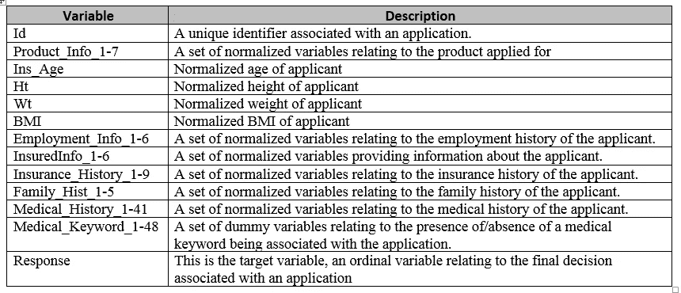

数据集特征的简要描述

在数据集链接[这里](https://www.kaggle.com/c/prudential-life-insurance-assessment/data)中已经提到了分类、连续和离散的特征。在这个上下文中，我们互换使用特征和变量这两个词。

这些功能可以大致分为以下几类:

1.  医疗信息——包括病史、身高、年龄、体重、身体质量指数和任何医疗状况
2.  家族史——虽然没有提到这个术语的含义，但它可以包括表明婚姻状况、子女数量等变量
3.  保险历史——同样，这并没有明确说明这组特征意味着什么，但它可能意味着该人以前是否投保过，过去是否错过支付保费，保险覆盖水平等
4.  个人信息:这一类别可能包括就业状况、职业类型、工资级别、资历，以及诸如住所 PIN 码的安全级别、汽车所有权、驾驶员等级等信息，这些信息可能与做出人寿保险相关决策相关。
5.  产品信息:这是特定于产品的信息。因此，这可能意味着诸如保险金额、计划长度、付款是一次付清还是分期付款等等。产品特性如何影响申请人的风险评级可能不会立即显现出来。或许选择 10 年短期计划(在人寿保险中被视为短期计划)的申请人可能会被公司视为高风险，并被归类为高风险。

有 60 个分类特征、48 个虚拟特征、13 个连续特征和 5 个离散特征，总共构成 126 个变量。响应或输出变量是风险评级，它有 8 个级别— 1 到 8，其中 1 是最低风险评级，8 是最高风险评级。

**处理缺失值**

有 9 个特性丢失了超过 30%的数据。下表显示了这些功能:

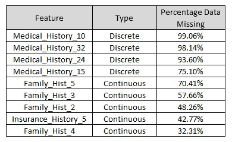

缺失值百分比较高的要素(图片由作者提供)

我们从数据集中删除了这些要素。

有 4 个特性的缺失值在 0.03%到 18.28%之间。这些显示在下表中。

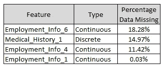

缺失值百分比相对较低的要素(图片由作者提供)

并非所有缺失值都是相同的。数据丢失的原因有很多，根据数据丢失的原因，丢失的数据可以分为三类:

**完全随机缺失(MCAR)** :当数据完全随机缺失时，每个数据点从数据集中缺失的可能性是相等的。假设我们在上午 8 点到中午 12 点之间每 15 分钟测量一次环境空气温度。因此，如果一切顺利，我们将在 8 点、8 点 15 分、8 点 30 分进行 17 次测量…..以此类推，直到 11:45 和 12。现在，让我们假设在 8:55 到 9:35 之间有一个小时的断电，因此，我们没有 9:15 和 9:30 的测量值。电力可能随时会消失，因此，17 个数据点中的任何一个都同样可能丢失。没有具体的理由假设这些时间点的测量值比其他时间点更有可能丢失。因此，这种缺失值被称为完全随机缺失。

**随机失踪(3 月):**假设正在进行测量的区域正在进行电气维修工作。技术人员通常在上午 8 点到 10 点之间进行维修工作，维修工作将需要一周的时间。预计每天在这两个小时的时间里，会有 30 分钟左右的停电。在这种情况下，我们会发现有两类测量—在上午 8-10 点时间间隔内进行的测量和在上午 10 点-中午 12 点时间间隔内进行的测量。前一个类中丢失的数据将比后一个类中多。然而，在该类中，任何数据点都同样可能丢失。换句话说，虽然我们在上午 8 点至 10 点之间看到的测量值少于上午 10 点至中午 12 点，但在上午 8 点至 10 点的时间间隔内，8 点 15 分、8 点 45 分、9 点 15 分和 9 点 45 分同样可能会丢失，因为停电的半小时时间间隔在上午 8 点至 10 点的时间间隔内是随机的。这种缺失值被称为完全随机缺失。

**非随机遗漏(MNAR)** :假设该区域没有停电，并且测量时间为 5 年。设备的工作寿命为 5 年。随着设备老化，越来越多的设备开始丢失记录值，尤其是在 3 年后。假设研究人员没有意识到设备的这个问题。他会观察到 3 年后比之前丢失了更多的值。同时，假设环境随着时间变暖。因此，在未来 3 年甚至更长的时间里，天气会变得更热。现在，研究人员将不会知道设备是否因为温度较高而没有记录这些值，或者这些值是否因为设备老化而丢失。这种丢失的值很难处理，被称为非随机丢失。

为了检查数据是否是 MCAR，有一个测试叫做[利特尔测试](https://www.tandfonline.com/doi/abs/10.1080/01621459.1988.10478722)，可以在 r 中实现。下面是执行测试的代码:

在 R 中执行利特尔 MCAR 测试的代码(图片由作者提供)

我们得到了小于 0.05 的 p 值，表明数据不是 MCAR 的。替代机制可以是 MAR 或 MNAR。

具有缺失值的前三个变量的图如下所示:

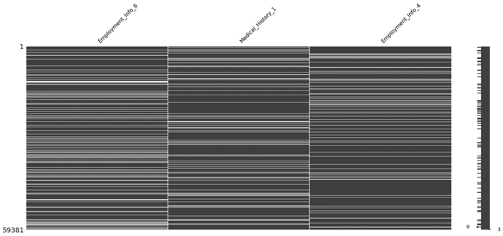

具有缺失值的前三个变量的图表(图片由作者提供)

在这一点上，我们基于上图中缺失变量看似随机的分布，假设缺失数据为 MAR。

下一个合乎逻辑的步骤是估算我们使用 MICE 方法得到的缺失值。MICE 方法的工作原理是将未知值视为因变量，然后使用监督算法对数据集中已知的数据进行估算，如多元线性回归。这是一种迭代方法，可以设置为在固定的迭代次数后收敛，或者当误差值低于阈值时收敛。这里有一个很好的视频解释了鼠标方法是如何工作的:[鼠标方法直觉](https://www.youtube.com/results?search_query=mice+imputation+explained)

r 有一个执行鼠标的包，代码如下:

代码执行鼠标在 R(图片由作者)

在执行 MICE 之后，我们有了一个完整的数据集，可以在其上执行探索性数据分析(EDA)来查看数据的初步趋势。

**EDA**

我们进行了两种类型的 EDA —单变量和双变量。

**单变量 EDA** :对于身高、体重、身体质量指数和年龄等连续变量，单变量 EDA 图显示了这些变量在数据集中的概率分布。这些图如下图所示:

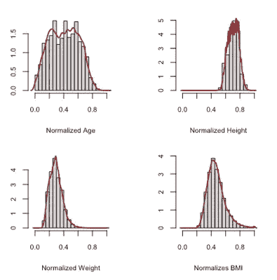

连续变量的分布(图片由作者提供)

我们观察到身高是左偏的，而体重和身体质量指数是右偏的。年龄在中间有一个宽广的最高平台期。这是意料之中的，因为 30-50 岁年龄段的人最有可能购买人寿保险。

这 4 个变量的平均值、中值、标准差和四分位间距如下图所示:

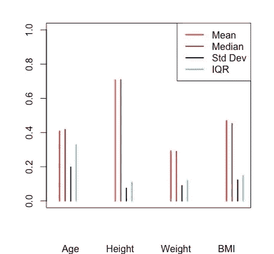

单变量分析—连续变量(图片由作者提供)

除了年龄(正如我们所讨论的，它有一个宽阔的中间平台)之外，所有变量的标准偏差都很小，表明这些变量分布很窄。

数据集中的大多数变量都是分类变量。以下是这些变量的一些图表:

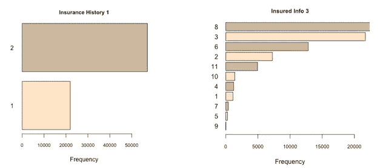

保险历史记录 1 和投保信息 3 的频率图(图片由作者提供)

关于分类变量的几点观察:

*   大多数分类变量有 2 或 3 个级别，如保险历史 1
*   一些类别有更多的级别:保险信息 3 有 11 个级别，就业信息 2 有 38 个级别，病史 2 有 648 个级别。

当分类变量具有不一定是有序的几个级别时，必须使用像一键编码这样的方法来转换它们，以便将它们用作监督学习算法的输入。

响应变量(风险水平)的频率图如下所示:

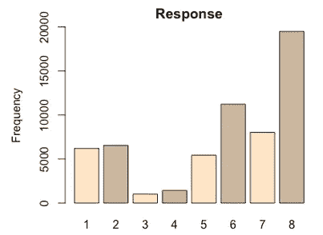

反应变量(风险水平)的频率图(图片由作者提供)

第 8 级的百分比非常高(~33.3%)。当响应变量计数在各水平之间分布不均匀时，这种情况称为**不平衡数据**。并不是每个分类算法都非常适合处理不平衡数据，我们必须使用那些可以处理这种情况的算法。

**二元 EDA:** 在二元 EDA 中，我们检查两个因素/变量对数据分布的影响。

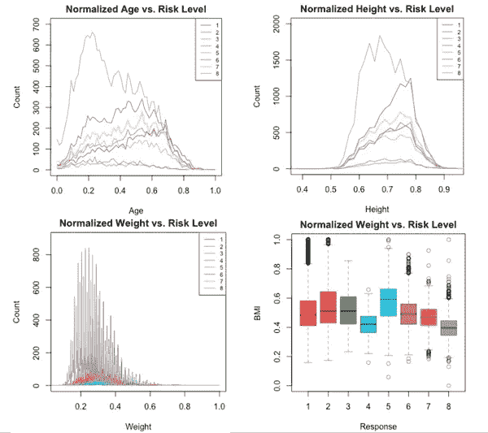

二元分析图(图片由作者提供)

从双变量分析中，我们可以得出以下结论:

1.  年龄对风险等级有显著影响，特别是对于最高风险等级 8。与属于最高风险级别的老年人相比，年轻人要多得多。
2.  不同风险水平的身高分布似乎遵循相同的模式，最大值出现在 0.7 和 0.8 之间，这与我们在单变量分析中观察到的总体身高分布一致。因此，身高似乎对风险水平没有显著影响。
3.  最高风险等级人群的体重分布与总体体重分布相同，其值紧密分布在 0.2 和 0.3 之间的峰值周围。
4.  所有风险水平的身体质量指数似乎都集中在 0.4-0.6 左右作为中位数。在风险等级 6、7、8 和 1 中有更多的异常值。看起来，虽然高身体质量指数可能意味着高风险或低风险，但低身体质量指数似乎表明高风险。

我们用于执行 EDA 的代码可以在[这里](https://github.com/xuechunlu7/STAT841-project/blob/master/EDA/Code_File_EDA_Dylan.R)找到

**降维**

即使删除了丢失 30%以上数据的列，我们还剩下 121 个属性。除了是计算上的挑战之外，可能的情况是这些属性中的许多属性可能不包含对于预测风险水平而言重要的信息。

因此，我们使用两种降维技术来减少维数，同时不丢失数据集中的大量有用信息。我们现在将描述这两种技术——CFS 和 PCA

**基于相关性的特征选择**

CFS 根据以下原则从原始特征集中选择特征:所选子集中的特征应该与输出很好地相关，但彼此之间不应该很好地相关。CFS 算法从原始特征集中选择 k 个特征，然后根据下面所示的公式计算优值分数:

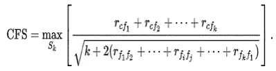

CFS 公式

分子由特征集中的特征与输出变量的相关性之和组成，这里用“c”表示。因此，该总和越高，该组特征的优值分数就越高。在分母中，我们看到一个项，它是一次取两个相关值的乘积之和。因此，该组特征之间的相关性越高，价值分数就越低。CFS 方法的目标是对所选特征集进行排序，然后选择排序最高的特征集。

Waikato 知识分析环境，也称为 WEKA，是一个在 GNU 通用公共许可证下许可的免费数据挖掘软件。它可以用于执行数据简化技术，如 PCA 和 CFS。为了进行 CFS，我们选择最佳优先方法和 CFSSubsetEval 评估器。CFS 自己选择属性的数量。

下图显示了 CFS WEKA 运行的结果:

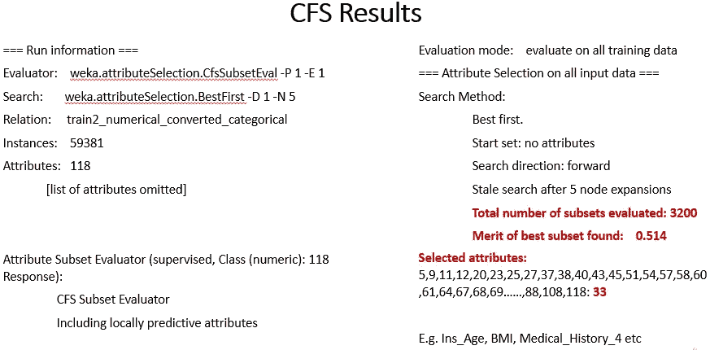

WEKA 中的 CFS 分析结果(图片由作者提供)

这里要注意的关键事情是，最佳子集的价值被发现为 0.514，并且该算法已经选择了 33 个属性。这些属性在 WEKA 输出窗口中列出，其中一些是年龄、身体质量指数、病史 _4 等。

**主成分分析**

PCA 是一种众所周知的降维算法，PCA 背后的直觉和理论在这篇[文章](/a-step-by-step-introduction-to-pca-c0d78e26a0dd)中有很好的解释

我们将原始数据集上传到 WEKA，并使用 PCA 特征选择的默认设置。主成分分析变量捕捉到的变化度量由标准差表示，如下图右侧的小圆圈所示:

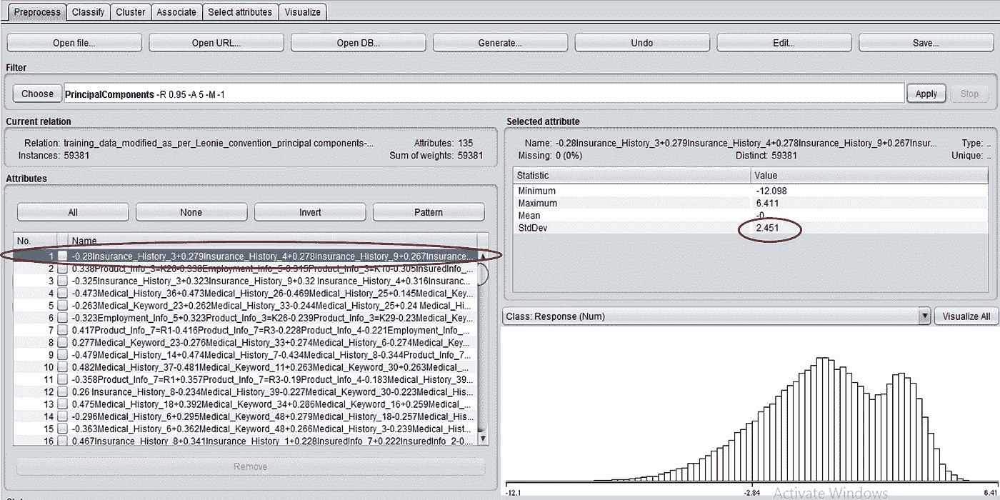

五氯苯甲醚导致 WEKA(图片由作者提供)

StDev 值越高，该变量捕获的变化就越大。WEKA 排名 1 的 PCA 特征具有 2.451 的标准偏差。我们选择了至少捕获了该最大标准偏差值的 50%的所有特征，该最大标准偏差值是标准偏差为 1.247 的第 20 个特征。

我们使用两种降维方法来比较机器学习算法在这两种方法上的表现，并选择降维方法和为我们的数据集提供最佳结果的算法的组合。

在[第 2 部分](https://medium.com/p/9b63532867e0/edit)中，我们将描述我们在降维后的结果数据集上应用的学习算法，并总结结果和进一步工作的范围。

[1]: Boodhun，n .，Jayabalan，m .使用监督学习算法进行寿险行业的风险预测。*复杂智力。系统。* **4、**145–154(2018)。[https://doi.org/10.1007/s40747-018-0072-1](https://doi.org/10.1007/s40747-018-0072-1)