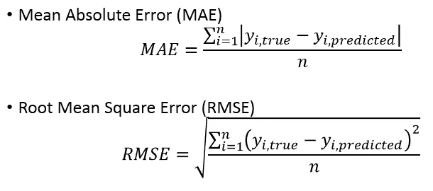
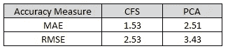
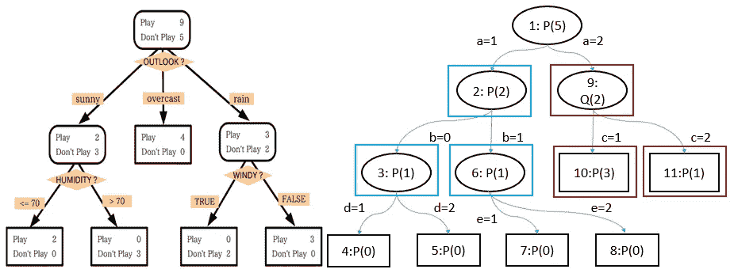
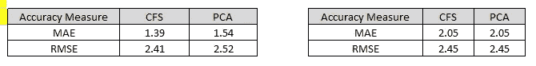
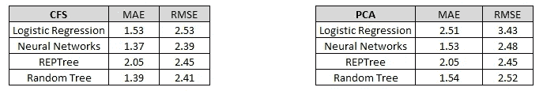

# 使用机器学习算法的人寿保险风险预测-第二部分:算法和结果

> 原文：<https://towardsdatascience.com/life-insurance-risk-prediction-using-machine-learning-algorithms-part-ii-algorithms-and-results-9b63532867e0?source=collection_archive---------28----------------------->

*通过监督学习算法对人寿保险应用进行算法风险预测——巴拉特、迪伦、列昂尼和明道(杰克)*

在[第 1 部分](https://bharatss.medium.com/life-insurance-risk-prediction-using-machine-learning-algorithms-part-i-data-pre-processing-and-6ca17509c1ef?source=your_stories_page-------------------------------------)中，我们描述了[保诚人寿保险数据集](https://www.kaggle.com/c/prudential-life-insurance-assessment)的数据预处理和降维。在这一部分中，我们将描述应用于转换数据集的学习算法以及我们获得的结果。

到项目 GitHub 库的链接是这里的

**算法**

我们在数据集上使用了四种监督学习算法:逻辑回归、神经网络、随机树和 RepTree。当然，还有许多其他算法可以使用，包括 XGB、SVM，人们还可以尝试在该数据集上应用无监督学习算法，如聚类，以查看特征中是否存在任何隐藏模式。然而，对于这个项目，我们使用了这四种算法。

在我们讨论算法的结果之前，下面是我们用来评估算法性能的两种方法:

比较算法性能的性能指标

MAE 和 RMSE 都是预测值与实际值相差多少的度量。虽然这是一个分类问题，严格的分类误差可能是一个更好的衡量标准，但在理论上，如果我们假设风险水平是有序的，那么 MAE 和 RMSE 也是该数据集可接受的衡量标准。

**逻辑回归**

对于像这样的多类分类问题，逻辑回归是一种自然的选择。我们使用 Gridsearch 调整了逻辑回归的超参数。我们考虑的超参数是 C 值，它是正则化因子λ的倒数，为此，我们使用了范围从 100 到 0.01 的对数标度中的 5 个值，以及解算器 newton-cg、lbfgs 和 liblinear。Gridsearch 得出 C 的最优值为 100，求解器为 newton-cg。超参数调整的代码片段如下所示:

逻辑回归的完整代码显示在[这里](https://github.com/xuechunlu7/STAT841-project/blob/master/model/Logistic_Regression.py)

对于测试数据，我们得到了下表中所示的 MAE 和 RMSE 值。*CFS 数据集比 PCA 数据集具有更低的 MAE 和 RMSE 分数。*

逻辑回归的结果

MAE 为 1.5 意味着平均而言，逻辑回归的预测值与实际值相差 1.5 级。因此，如果实际风险评级为 5，该算法将产生介于 3.5 和 6.5 之间的评级，即 4、5 或 6。

**神经网络**

我们选择了单隐层神经网络，其架构如下图所示:

单隐层神经网络的结构

神经网络的完整代码可以在[这里](https://github.com/xuechunlu7/STAT841-project/blob/master/model/ANN.R)找到。

我们用于神经网络的超参数显示在下面的代码片段中:

对于测试数据，我们得到了下表中所示的 MAE 和 RMSE 值。CFS 数据集再次比 PCA 数据集具有更低的 MAE 和 RMSE 分数。

神经网络的结果(图片由作者提供)

**随机树和 REPTree**

随机树和 Reptree 都是决策树，但工作方式不同。所以对它们的作用机制有一些直觉会有帮助。下面的图表说明了这些概念:

随机树(左)和 RepTree(右)的插图(图片由作者提供)

在左边，我们可以看到一个决策树。在标准树中，使用所有变量中的最佳分割特征来分割每个节点。在随机树中，使用在该节点随机选择的预测子集中的最佳特征来分割每个节点。所以从本质上来说，随机树是一个决策树，它随机选择特征来分割节点上的数据。在右边，我们可以看到一个 REPTree 或减少错误修剪树。这是一种通过修剪来创建树的算法。最初，通过标准的决策树构造方法来构造完整的树。此后，该算法使用排除数据集从自下而上的方向比较每个父节点和子节点对，以查看是否存在子节点的误差高于父节点的误差的任何子树。例如，红色方框中的一个子节点的误差高于父节点的误差。在这种情况下，REPTree 将删除子节点，并使父节点成为叶节点。

我们通过使用 rpart 包在 R 中实现了 REPTree 算法，其中函数 rpart 用于构建单个树模型，函数 prune.rpart 用于修剪树以避免过度拟合。我们通过使用 ranger 包在 R 中实现了 RandomTree 算法，其中函数 ranger 创建了一个随机森林，但只使用了数据集中的一些属性。随机树和 REPTree 的结果如下表所示:

随机树(左)和 REPTree(右)的结果

随机树和 REPTree 的完整代码可从[这里](https://github.com/xuechunlu7/STAT841-project/blob/master/model/Tree.Rmd)获得。

**算法对比及结论**

下表比较了 CFS 和 PCA 的四种算法的结果:

CFS 和 PCA 算法结果的比较

**对于这个数据集，CFS 是比 PCA** 更好的降维方法，因为它在所有学习算法中导致更低的 MAE 和 RMSE。对于两种方法，REPTree 产生相同的 MAE 和 RMSE 值，但是对于其他算法，CFS 比 PCA 更好。

在 CFS 中，神经网络产生最低的 MAE 和 RMSE，在 PCA 中，再次是神经网络。**因此，总体而言，神经网络是该数据集的最佳监督学习算法。**

作为下一步，可以研究以下问题:

1.  导致高风险分类的特征或特征组合是什么？
2.  有没有彼此相似的客户？如果是这样的话，我们能在像这样的多变量环境中量化相似性吗？
3.  如果我们将这些学习算法的结果应用于其他地理位置和时期的风险评级数据，我们会得到类似的结果吗？

如果您对我们的研究有任何疑问/意见，请随时发表。希望你能从我们的帖子中学到一些你可以申请工作/项目的东西！

[1]https://creativecommons.org/licenses/by/1.0 1.0 版<[大可、Mysid、CC](https://creativecommons.org/licenses/by/1.0)转自维基共享

[2] [T-kita 在英文维基百科，公共领域，通过维基共享资源](https://upload.wikimedia.org/wikipedia/commons/f/ff/Decision_tree_model.png)