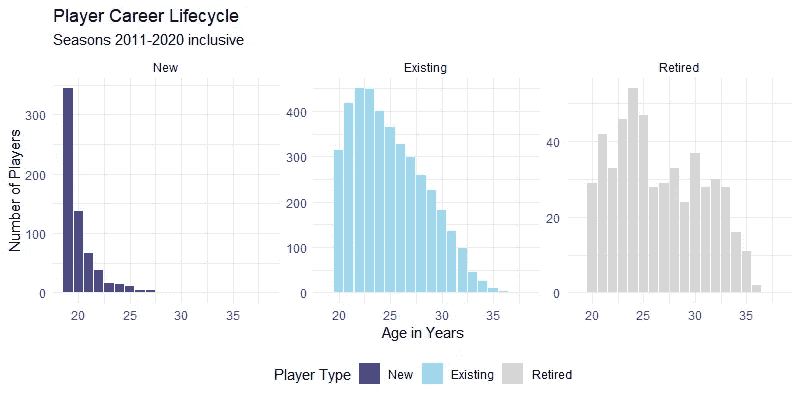
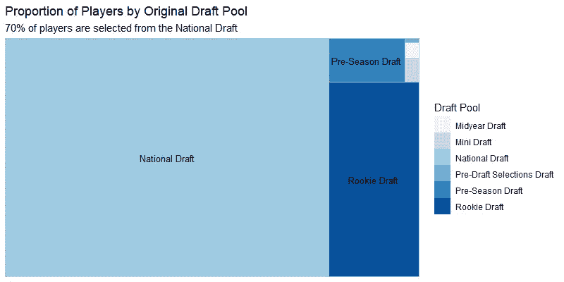
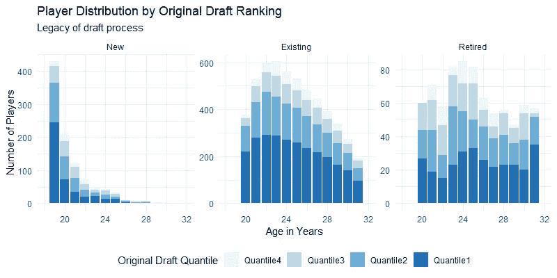
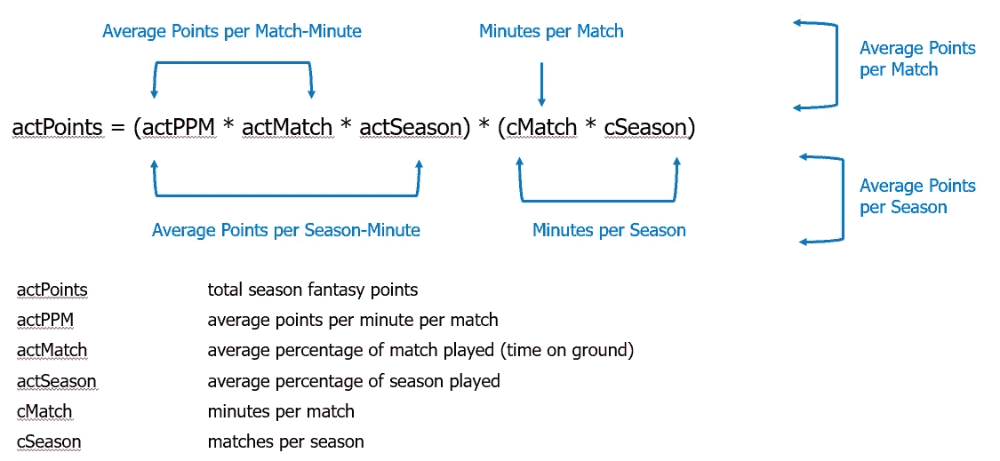
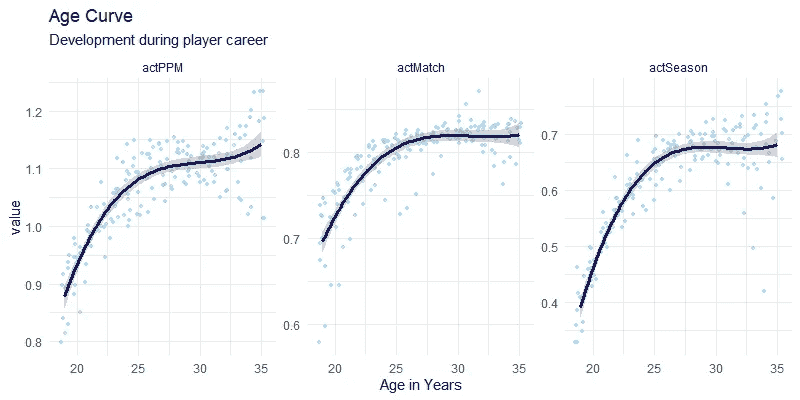
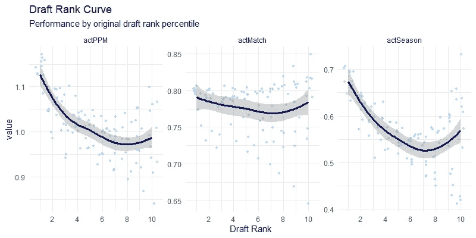
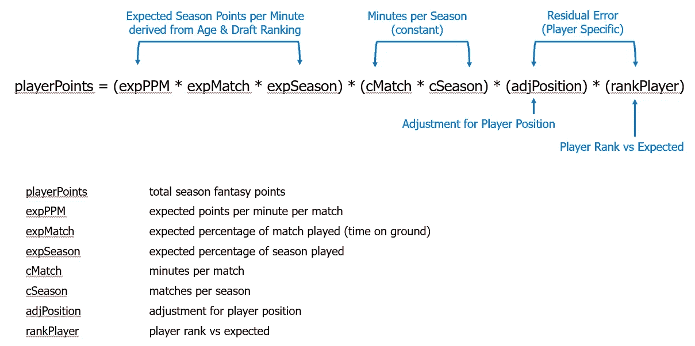
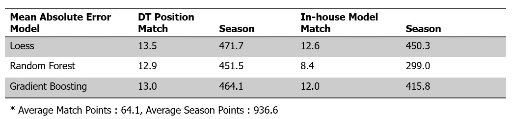
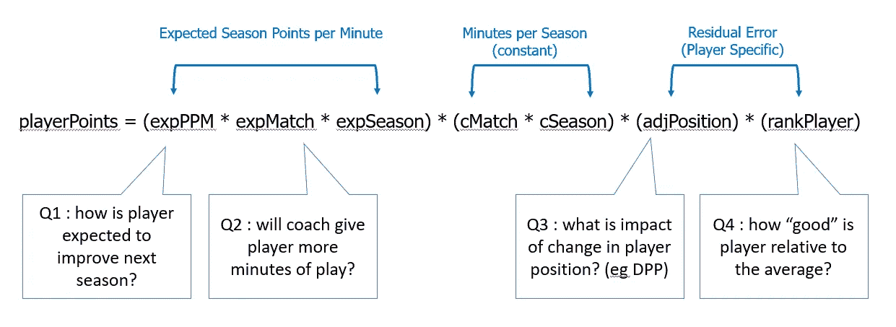

# AFL 球员职业生涯的生命周期

> 原文：<https://towardsdatascience.com/lifecycle-of-an-afl-players-career-31713df30f62?source=collection_archive---------21----------------------->

## AFL 球员职业生涯的阶段和跨多个赛季评估球员效力的第一个模型

[♻](https://www.flickr.com/photos/11845250@N00)的《吉朗猫 2009 年 AFL 首演》由 2.0 的 [CC 授权](https://creativecommons.org/licenses/by/2.0/?ref=ccsearch&atype=rich)

在本文中，我们探索了 AFL 球员职业生涯的生命周期，并尝试使用基于预期的框架来理解位置、天赋和经验的相互作用，并提出了我们的第一个球员价值评估模型。

鉴于最终目的是从幻想角度选出最有价值的玩家，我们已经用幻想点数作为我们的价值衡量标准；然而，这个框架可以应用于球员价值的替代措施。

2010-2020 赛季的球员数据是从 [Footywire](https://www.footywire.com/) 中收集的，其中包括总共 91，000 个球员比赛组合。

## **球员生命周期:年龄和经验**

在我们深入研究球员价值之前，我们首先要理解球员职业生涯的生命周期。我们可以确定三个发展阶段-

*   选秀时期:大多数球员在 19-20 岁之间被选中。
*   早期发展期:发生在选秀后的几年，在 22-24 岁达到顶峰，这是球员数量最多的年龄组。
*   后期发展期:在这几年里球员不断向巅峰发展。生存偏差明显；由于受伤或相对于同龄人表现不佳，球员退出率很高。

*   退役:每个赛季大约有 10-15%的球员退役。按年龄细分这一类别表明，渴望更长职业生涯的球员需要在 25 岁前“成功”。现有玩家的剩余群体可能具有更高的质量。

## **球员天赋:以及选秀流程**

我们认识到，教练、经理和球探可以识别出*一些*天赋和技能的比例，正如旨在选拔精英中的精英的选拔过程所代表的那样。

鉴于国家选秀池中的球员占主导地位，我们将把其他选秀池中的球员排名映射到国家选秀中的同等价值。

选秀过程的遗产似乎贯穿了球员的整个职业生涯。在边际上，早轮选秀球员(分位数 1)更有可能被球队选中，也比那些晚轮选秀的球员退休更晚。

## **玩家价值的组成**

我们评估一个给定球员赛季的价值的出发点是评估年龄和选秀排名与球员幻想得分之间的关系。将这些组成部分分开，可以在不均衡的赛季和比赛期间进行比较，例如在 2020 年。

从教练的角度来看，每个赛季和每场比赛的百分比是衡量球员效率的另一种方法。也就是说，如果一个教练很看重一个球员，那么他在那个赛季的上场时间就会更多。当然，有可能是教练错误地评估了一名球员，或者是球队的深度有问题。

尽管如此，仅仅通过观察上场时间，球员年龄/经验和选秀排名与上场时间和产出之间存在压倒性的正相关关系。

## 年龄曲线

要考虑的一个重要因素是球员随着年龄增长而提高的机会。为了正确分析玩家的成长，我们创建了一条年龄曲线，考察平均游戏量和输出。

*   玩家的年龄/经验影响着每一个独立的变量，同样产生了乘数效应。也就是说，年龄大的球员每个赛季会打更多的比赛，每场比赛在球场上的时间比例更高，得分也更高。球员巅峰出现在 27 岁左右。
*   灰色带代表跨季节的每个测量的标准误差；年轻球员的波动区间更窄，年长球员的波动区间更宽——这是多个赛季平均水平的信心指标。就是年轻选手比较相似，老选手样本比较少。

## **草拟等级曲线**

为了继续最初基于球员的平均上场次数和输出来分析球员的概念，我们考虑球员被选中时的原始选秀值。为了简化选秀分析，我们根据球员在国家选秀中最初的选秀权号码，从 1 到 10 对他们进行排名。

*   虽然结果没有年龄曲线那么明显，但我们可以观察到早期选秀权有更高产出的证据。选秀排名似乎是第 7 组(直到选秀第 70 名)的重要驱动因素，然后在边际影响方面逐渐减弱。
*   原始选秀排名是赛季比赛百分比的更重要的驱动因素，而不是比赛百分比(上场时间)。这可能是因为年龄较大的球员更有可能来自早期的选秀轮。

结论是选秀排名是一个相关的因素，尽管在评估平均数量和比赛质量方面仅次于年龄。

## **出场位置**

我们之前的研究已经强调了 AFL 梦幻得分偏向于奖励中场球员而不是其他位置。

 [## AFL 玩家在这里赚取他们的梦幻积分

### 利用主成分分析探讨玩家位置与幻想分数之间的关系

medium.com](https://medium.com/analytics-vidhya/where-afl-players-earn-their-fantasy-points-f587d259877f) 

基于这项研究，我们建立了一个模型，根据球场上特定位置的统计数据来推断比赛位置。

 [## 使用位置统计来识别 AFL 球员位置

### 沃利在哪里…讲述玩家角色故事的统计数据

medium.com](https://medium.com/analytics-vidhya/using-location-statistics-to-identify-afl-player-positions-cf6d50572c96) 

我们将把玩家位置添加到我们的预期价值模型中。此外，为了测试本文的有效性，我们比较了使用 DT 头寸和我们内部模型生成的头寸的模型结果。

## **玩家型号 v1**

综合我们所有的初步观察，我们提出以下基线模型-

*   我们首先使用年龄和选秀排名曲线来解决每分钟预期赛季点数的组成部分(expPPM、expMatch 和 expSeason)。
*   我们将残差视为特定于球员赛季的结构，并在调整比赛位置后，将此作为球员表现落后或不如“平均”球员的一种排名方式。
*   为了确保没有数据泄漏，我们将使用长度为 3 个季度的滚动数据窗口来估计下一个季度的值。这确保了球员可以与同类球员进行比较，并允许在多个赛季中改变比赛风格。

基于上述框架，我们使用 3 个统计非线性模型——[黄土](https://en.wikipedia.org/wiki/Local_regression)、[随机森林](https://en.wikipedia.org/wiki/Random_forest)和[梯度推进](https://en.wikipedia.org/wiki/Gradient_boosting)对数据进行训练和测试。对于位置数据，我们比较了使用原始 DT 球员位置数据和我们内部球员位置模型的模型性能。

随机森林模型是在使用[平均绝对误差](https://medium.com/human-in-a-machine-world/mae-and-rmse-which-metric-is-better-e60ac3bde13d) (MAE)作为我们衡量最佳表现的统计模型中选择的。

*   值得注意的是，我们的内部头寸模型优于原始 DT 头寸数据。
*   作为平均值的百分比，该模型在比赛水平上比在赛季基础上更准确。我们目前的论点是，有赛季内的因素尚未被考虑，这可能会提高赛季比赛比例的预测。

## **模型应用**

考虑到这篇文章已经很长了，我们将只对结果的潜在应用做一个大概的概述。在给定当前配置的情况下，模型可能回答的问题包括-

我们希望该模型能够在幻想比赛的背景下提供指导的其他问题是
(1)哪些球员在下个赛季处于“爆发”的边缘？
(2)为什么值得为排名更高的新秀买单？
(3)我们应该为我们的“核心”团队挑选哪些球员？
(4)我们如何套利 DT 职位和他们在球场上的实际角色之间的差异？

## **反思与未来研究方向**

基线模型虽然在现阶段不是最准确也不是最全面的，但它提供了一些见解，这些见解将被纳入模型的未来迭代中。最初的收获是-

*   该模型是不完整的，因为它只考虑了占球员队列 70%的国家选秀中的球员。在未来的迭代中，我们希望使用聚类方法将其他选秀类型的球员(例如年中选秀)映射到等效的国家选秀排名。
*   该模型高估了每分钟的赛季积分，这可能是由于赛季的*预期*分钟的总和大于*实际*值的问题。这可能需要在解释模型结果的最后一步进行某种形式的缩放，或者进一步研究季节内因素。
*   所提出的方法的优点之一是，我们可以为每个感兴趣的变量导出玩家排名曲线。通过一点点巧妙的对数数学，我们可以使用下面的关系来评估每个球员赛季与平均水平的比较: *log(a*b) = log(a) + log(b)* 。我们将在未来的模型中探索这个想法。
*   进一步调查单个玩家和团队的结果，以评估它是否符合我们对特定玩家的直觉。
*   寻找方法，以一种易于理解并对幻想玩家选择有用的格式全面呈现模型结果。

在我们的下一篇研究文章中，我们将探索最近(2020)赛季球员的个人表现，并详细描述我们对 2021 赛季的预测。

 [## AFL 球员职业生涯的生命周期(第二部分)

towardsdatascience.com](/lifecycle-of-an-afl-players-career-part-2-a4bf9bdb01a8) 

## **参考文献**

1.  美国足球分析——对美国职业足球大联盟超级选秀效率的一种审视([链接](https://www.americansocceranalysis.com/home/2020/10/25/super-or-just-draft)
2.  堆栈溢出—通过 R ( [链接](https://stackoverflow.com/questions/61096540/train-and-test-splits-by-unique-dates-not-observations-in-r))中的唯一日期分割训练测试
3.  UC 业务分析 R 编程指南—随机森林([链接](https://uc-r.github.io/random_forests))
4.  R 中的非线性回归要点:多项式和样条回归模型([链接](http://www.sthda.com/english/articles/40-regression-analysis/162-nonlinear-regression-essentials-in-r-polynomial-and-spline-regression-models/))
5.  梅和 RMSE——哪个指标更好？([链接](https://medium.com/human-in-a-machine-world/mae-and-rmse-which-metric-is-better-e60ac3bde13d)