# AFL 球员职业生涯的生命周期(第二部分)

> 原文：<https://towardsdatascience.com/lifecycle-of-an-afl-players-career-part-2-a4bf9bdb01a8?source=collection_archive---------29----------------------->

## 一个跟踪和归因于球员效力组成部分的框架

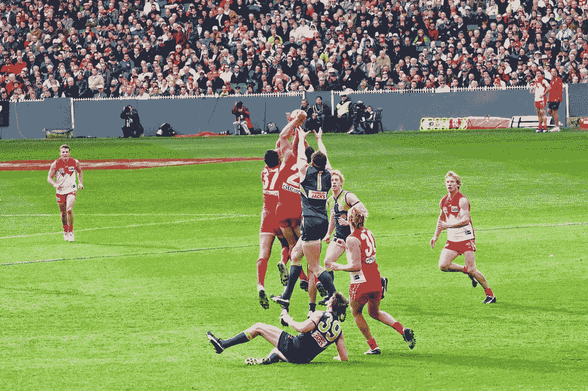

[Jimmy Harris](https://www.flickr.com/photos/50216172@N00)的《老鹰队 50 分钟内的争议标记》由 [CC 授权 2.0](https://creativecommons.org/licenses/by/2.0/?ref=ccsearch&atype=rich)

在我们的[原始论文](/lifecycle-of-an-afl-players-career-31713df30f62)中，我们证明了使用球员年龄、选秀和位置的基线模型可以用来解释 AFL 球员队列中以下每个组成部分的大部分——每分钟得分、上场时间和赛季百分比。

 [## AFL 球员职业生涯的生命周期

### AFL 球员职业生涯的阶段和跨多个赛季评估球员效力的第一个模型

towardsdatascience.com](/lifecycle-of-an-afl-players-career-31713df30f62) 

在这篇后续文章中，我们通过将个人表现分为两个部分来研究个人表现的组成部分:

*球员表现=基线特征+球员特定特征*

根据上面的定义，我们可以开始使用基线模型量化关于普通玩家的问题的答案，以及使用玩家归因模型比较个体玩家的特征。

*   **基线模型**——(1)我们可以期待新秀 vs 经验丰富的球员在赛季中的比赛比例是多少？(2)玩家输出如何随着玩家角色的改变而改变——相对于球门方块向上移动或移动场地？(3)早期与晚期选秀的预期差异是什么？
*   **球员归因模型**——(1)在调整位置后，我们如何衡量给定球员的技能相对于他们的年龄组？(2)从一个赛季到下一个赛季，球员的进步有多少来自技能、角色/体能和耐久性？

我们希望理解这些预测者的直觉能让我们为下赛季的 AFL 梦幻队的核心和非核心球员做出更好的选择。

## **探索数据集**

2015-2021 赛季的球员数据是从 [Footywire](https://www.footywire.com/) 中收集的，该数据包括总共 39，000 个球员比赛组合，这些组合汇总成 3，000 个球员赛季组合。

为了更好地校准模型，我们首先在游戏层面考虑数据集中普通玩家的特征。

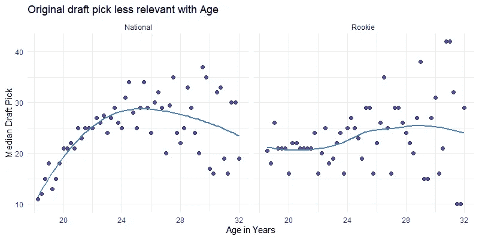

基准选秀权每场比赛的选秀权中位数从新秀的 10 个左右增加到球员成熟的 30 个。成熟发生在 24 岁左右，或者在比赛的第 5-6 个赛季。

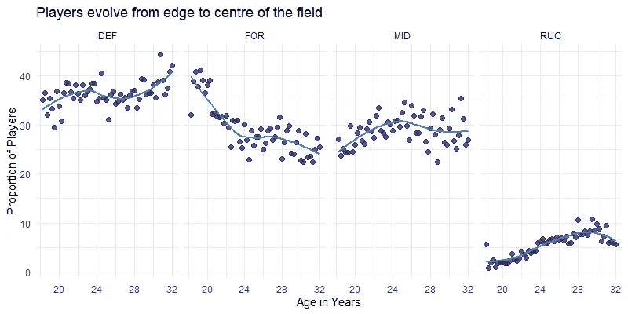

**基线位置**球员通常从后卫或前锋开始，随着年龄和经验的增长，逐渐成为中场和前锋。

## **玩家基线模型 v2**

该模型的第一次迭代使用*球员-赛季*总量来证明球员年龄和选秀次数可以用来创建预期球员产量的基线的概念。

更新后的模型在模型训练过程中利用了匹配级别的*数据集的丰富性和可变性，以实现我们在赛季级别最大化预测准确性的目标。*

为了弥合比赛和赛季水平数据之间的差距，我们添加了一个额外的变量——逝去的赛季——以反映赛季中每场比赛观察的时间点。

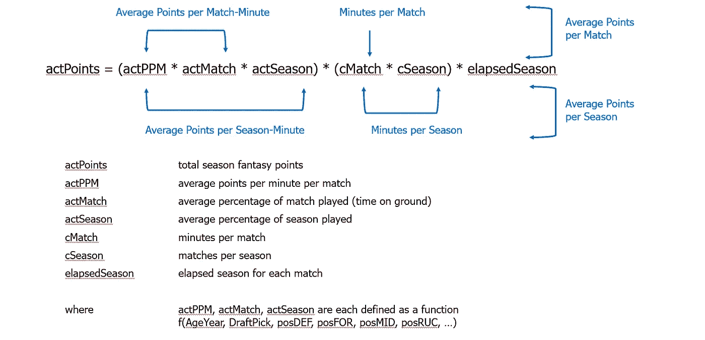

基线模型的组成部分

在我们选择的预测因素方面有一个很好的平衡——我们想要一个基线模型，它很好地利用年龄和选秀选择以及一些特征进行概括，以及第二个球员模型，其中球员技能、风格和经验的具体特征允许我们识别持续表现优异的球员。

*   我们还检验了在模型中增加潜在预测因子对准确性的影响。
*   此外，由于我们的内部职位模型具有更高的准确性，我们删除了 2015 年之前的数据点，因为职位模型所需的数据粒度不可用。

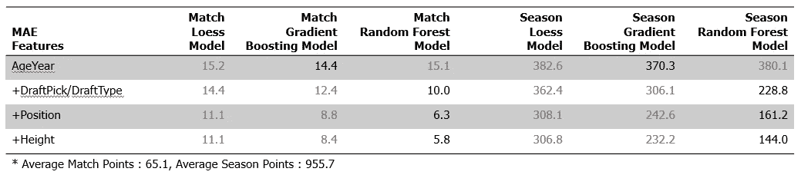

通过添加新变量提高模型精度

与前面的分析类似，我们研究了三个基本模型-黄土、梯度增强和随机森林-我们发现随机森林是向前发展的最佳模型，因为其结果具有最低的平均绝对误差(MAE)。

## **典型玩家的综合表现**

基线模型概括了 AFL 队列中的典型球员。我们利用问答形式来解释模型可以回答的问题类型。

**问:哪些特征解释了普通玩家表现的各个组成部分？**可变重要性图表显示了每个特征对模型最终输出的相对重要性——每分钟点数(xPPM)、上场时间(xMatch)和赛季百分比(xSeason)。

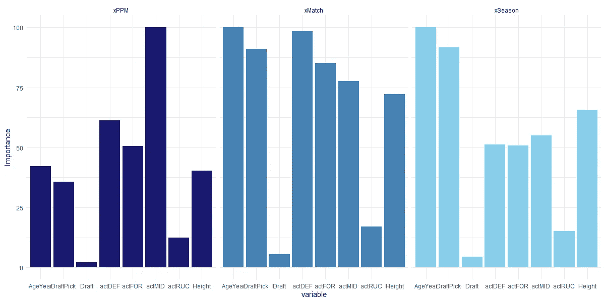

运动员表现的每个组成部分的不同重要性

*   中场和防守时间的百分比是每分钟得分的最重要贡献者。
*   年龄和选秀选择是赛季持久性(xSeason)最相关的贡献者——反映出“金钱球”理论适用于 AFL。
*   对于所有组件，玩 ruck 位置所花费的时间百分比与基线模型的最终输出最不相关。我们注意到球员身高或垂直距离是一个更相关的衡量标准，并将重新考虑我们对球员位置的[原始建模，以将其作为输入。](https://medium.com/analytics-vidhya/using-location-statistics-to-identify-afl-player-positions-cf6d50572c96)
*   令人惊讶的是，选秀类型(即全国选秀或新秀选秀)没有实际的选秀排名重要。

**问:每分钟期望点数(xPPM)如何随着球员的位置、年龄和选秀排名而变化？**根据可变重要性图表，我们观察到位置是每分钟点数的最重要决定因素。在所有年龄组和职位中，首轮选秀权通常比后轮选秀权表现更好。

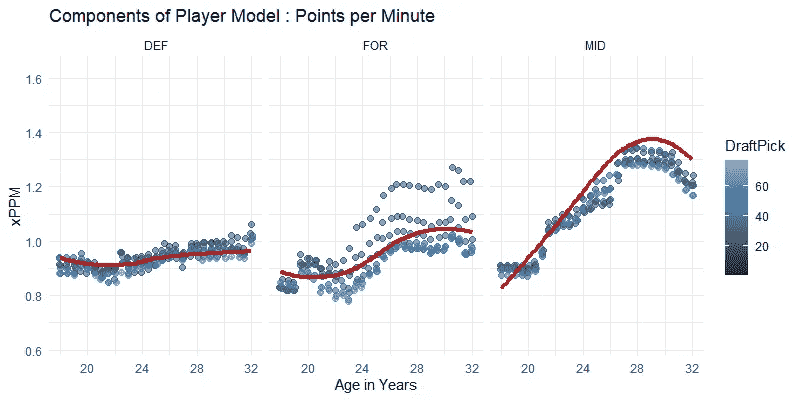

*   **中场**单位时间产量高于其他位置；他们通往顶峰的道路要陡峭得多。对于防守球员来说，在他们的职业生涯中，球员之间的选秀差异并不明显。
*   根据位置的不同，球员表现出显著进步的年龄开始于 21 岁左右，这在中场球员中最为明显，这可能是自我实现的，因为“高触球”球员更有可能被派往中场。

问:出场时间(xMatch)如何随着玩家的位置、年龄和选秀排名而变化？我们可以看到，60%是地面时间的下限，任何低于 60%的时间都可能表明比赛中途受伤或替补。一般来说，对于后卫来说，年龄不是一个因素，而在其他两个位置上，在球场上的最佳时间——也许是健康的一个功能——是在 24 岁左右。

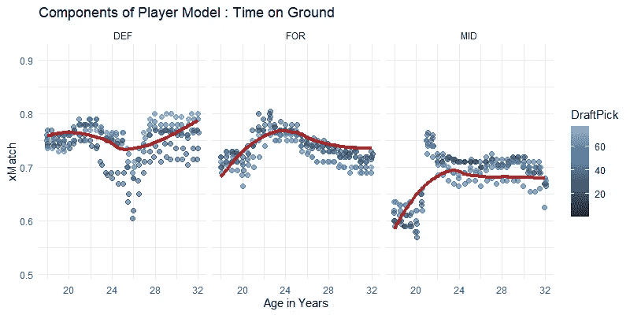

**问:球员的位置、年龄和选秀排名如何影响赛季百分比？**一般来说，随着年龄的增长，球员在赛季中的上场时间越来越长，与后卫和中场相比，前锋的曲线最为平缓。

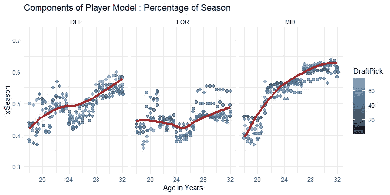

## 探索 2016 届选秀班

结合解释一般球员行为的基线模型，我们提出了一系列允许我们比较单个球员职业发展的指数。

我们演示了如何应用该模型来跟踪 2016 届选秀学员的职业生涯。从球探和球员估价/工资的角度来看，提供的例子也有实际用途。

## 应用#1:球员职业指数

基线指数是通过模拟一个“中值”选秀，保持仓位不变而创建的。球员指数由每场比赛的基线进行调整，即在调整位置后，特定球员的技能相对于其年龄组的指数。

“一般”球员大致相当于第二轮选秀权。我们可以用基线模型来欣赏一个球员职业生涯的演变。在 2020 年底，2016 年的前 6 名选秀球员在整个赛季中比他们的年龄组多赚了大约 75%的幻想分。个人职业生涯各不相同，伤病、休息、停赛和团队表现充斥着赛季的最后几轮。

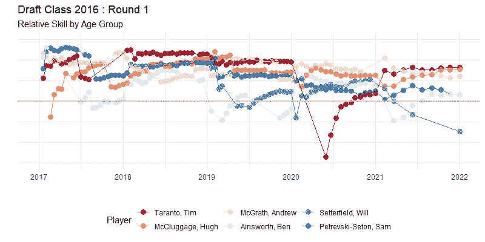

*   麦克卢格、麦克格拉斯和彼得雷夫斯基-塞顿自从被选中以来几乎打满了整个赛季，而其他球员都有一些板凳/伤病期。
*   由于肩伤，塔兰托的 2020 赛季开始得较晚，在非比赛期间输给了他的同龄人——并在 2021 年赶上了。

## **应用#2:绩效归因**

我们可以通过相对于基线的跨赛季表现成分来扩展球员分析，以确定球员相对于他们的队列如何以及在哪里达标。我们还将基本度量转换为 KPI 描述符。

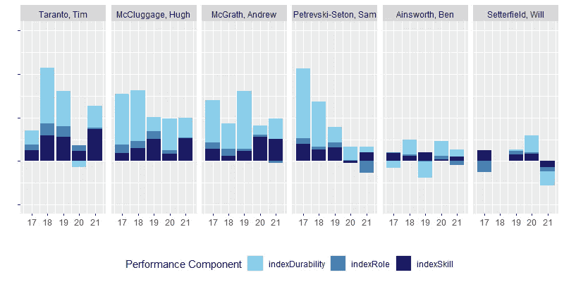

*   **风格/技能** —球员在球场上比其他球员每分钟有更多触球或得分的东西。
*   **角色/重要性/一致性**——教练决定每场比赛分配给球员更多的上场时间。
*   耐久性——每个赛季比同龄人打更多比赛的能力(包括能够不受伤害)。

我们还发现，当我们考虑技能是角色和持久性的主要指标时，该模型对于识别处于“爆发”边缘的球员非常方便。

## 探索团队绩效:里士满

该模型的另一个实际应用是按职位查看团队绩效。我们考虑类似的里士满中场图表。

在下图中，我们可以看到 2015-2018 年的里士满中场由一群远高于平均水平的球员组成。从 2018 年开始，麦金托什的表现开始变得更加平均，而格雷厄姆和博尔顿的表现在同一时期有所发展。

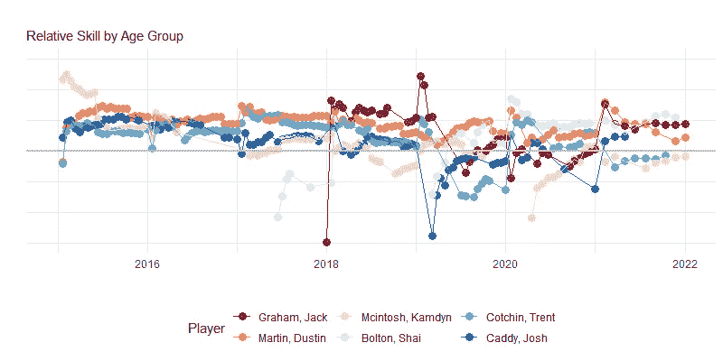

博尔顿在 2019 年的突围之年，从下图来看更加明显。相比之下，我们看到 2021 年整体球队的技术仍然很高，但随着球员年龄的增长，已经开始向平均水平靠拢。

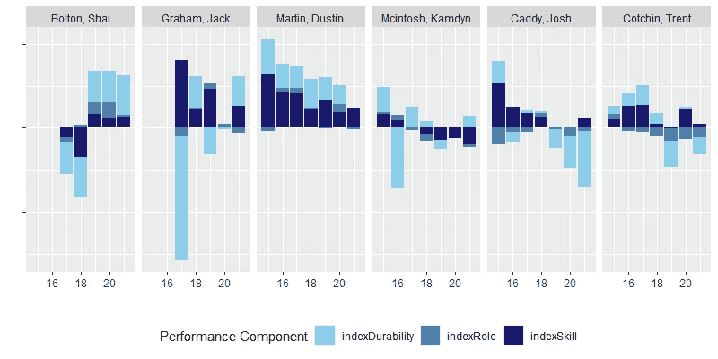

## 反思与未来研究方向

在这篇文章中，我们仅仅粗略地介绍了基线/归因模型的潜在用途。这些模型中的每一个本身都具有进一步发展的潜力，以扩展其在预测和诊断分析方面的实际可用性。

*   分析中使用的性能指标是 AFL fantasy points，它更具体地说是对**球员球触**的一种衡量，可以作为球员韧性的指标。嵌入非公开可用的球员统计数据的超级侵占分数被认为是**球员球使用**的指标，这可以是球员技能的更好指标。这两种方法的结合将丰富我们描述球场上个人球员的方式。
*   基线模型还允许我们开发一个草稿挑选指数。对于给定的球员，在每个年龄组，我们可以预测未来一生的比赛、要赢得的分钟数或点数，这反过来可以用作球员价值/价值的衡量标准，并转化为预期的球员工资(同样，不公开提供，但肯定会引起教练、经纪人、经理和球队所有者的兴趣)——向“Moneyball AFL”的方向迈进了一步。
*   到目前为止，由玩游戏的次数定义的经验还没有被包括在模型中。经验是自我充实的，因为反馈循环意味着一个已经玩过很多游戏的玩家会继续玩更多的游戏。进一步探索这一概念将是有趣的，特别是在确定个人何时或是否在其职业生涯中达到巅峰表现方面。
*   到目前为止，模型结果已汇总呈现。我们将通过在更精细的水平上评估误差的相对大小，即按年龄组或职位，来进一步细化和理解其预测值的界限。
*   虽然使用的数据集仅跨越到 2015 年，这使得模型拟合变得棘手，但总体结论直观上与我们可能预期的一致——访问更长期的数据集将增强模型输出和可用性。

总的来说，能够将 AFL fantasy 积分的使用扩展到 AFL fantasy 竞赛之外的更实际的应用中，例如了解球员职业发展以及个人球员和球队的怪癖，这是非常令人高兴的。

展望未来，我们还希望建立一个应用程序，允许用户探索和比较各组球员的表现。

## 参考

1.  AFL 草案索引([链接](https://s.afl.com.au/staticfile/AFL%20Tenant/AFL/Files/biddingsystemfeedback.pdf))
2.  论 AFL 球员选秀的价值
3.  选秀大师([链接](https://www.draftguru.com.au/analysis/pick-value-comparison))