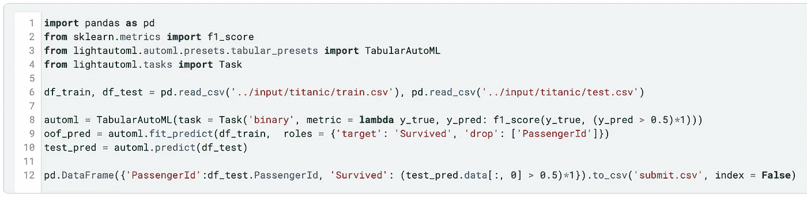
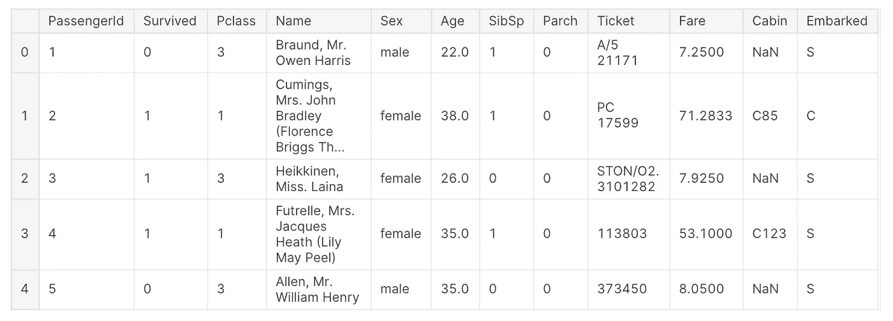
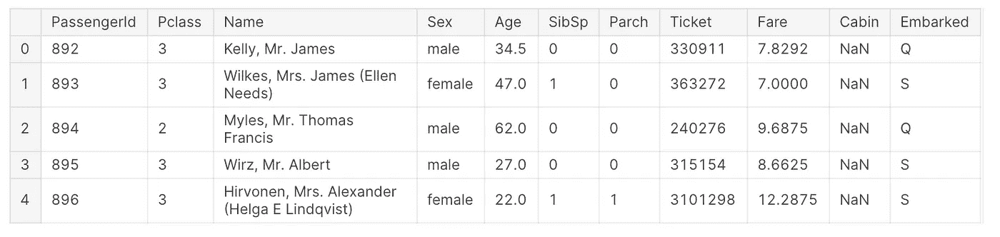
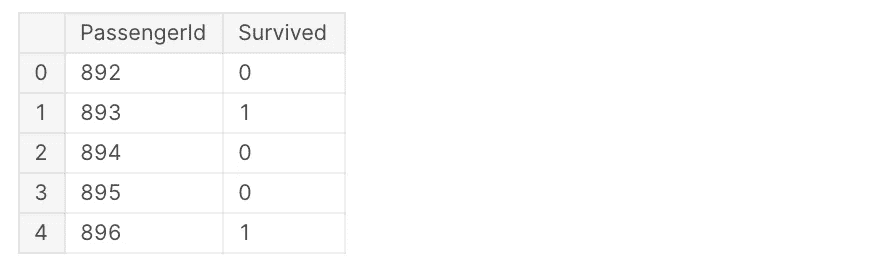
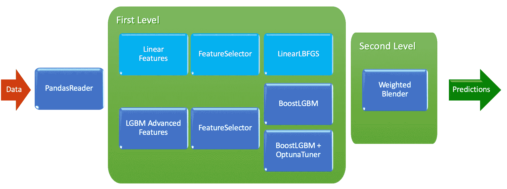

# LightAutoML vs Titanic:几行代码 80%的准确率

> 原文：<https://towardsdatascience.com/lightautoml-preset-usage-tutorial-2cce7da6f936?source=collection_archive---------15----------------------->

在本教程中，我们将讨论如何使用开源框架 LightAutoML 在 Kaggle 上为泰坦尼克号生存竞赛自动创建几行代码的 ML 模型。


照片由[克拉克·蒂布斯](https://unsplash.com/@clarktibbs?utm_source=medium&utm_medium=referral)在 [Unsplash](https://unsplash.com?utm_source=medium&utm_medium=referral) 上拍摄

2020 年底，开源 python 库 [LightAutoML](https://github.com/sberbank-ai-lab/LightAutoML) 由 Sber AI 实验室的 AutoML 团队发布，作为自动化机器学习(AutoML)框架。它被设计成轻量级的，高效的，用于表格数据集中的各种任务(二进制/多类分类和回归)，表格数据集中包含不同类型的特征:数字、分类、日期、文本等。

LightAutoML 安装非常简单— `pip install -U lightautoml`
[官方 LightAutoML 文档](https://lightautoml.readthedocs.io/)

LightAutoML 不仅提供了端到端 ML 任务解决的预设，还提供了易于使用的 ML 管道创建构造器，包括数据预处理元素、高级特征生成、CV 方案(包括嵌套 CV)、超参数调整、不同的模型和组合构建方法。它还为用户提供了一个选项来生成模型训练和分析报告，以检查模型结果，并找到从初始数据集不明显的见解。

下面我们将展示如何使用 LightAutoML 解决[Titanic-机器从灾难中学习](https://www.kaggle.com/c/titanic)竞赛-从 python 库导入到保存最终提交文件。

# 0.0 步。基于 LightAutoML 的超短钛解决方案



基于 LightAutoML 的超短钛解决方案

上面的代码作为内核[在这里](https://www.kaggle.com/alexryzhkov/lightautoml-extreme-short-titanic-solution)可用，在 Kaggle 公共排行榜上仅用 7 分 12 行就获得了 **0.77990** 的分数。主要的 LightAutoML 部分只有 3 行—从第 8 行到第 10 行。

下面我们将讨论[另一个得分为 **0.79665 的内核**](https://www.kaggle.com/alexryzhkov/lightautoml-titanic-love)，它的结构更像一个真正的商业 ML 解决方案，可以用作自己项目的模板。

# 步骤 0.1。导入必要的库

在这一步，我们导入 3 个标准 python 库，几个来自常用数据科学家集的库，包括 *numpy* 、 *pandas、*和 *sklearn* 以及来自 LightAutoML 的 2 个预置— *TabularAutoML* 和 *TabularUtilizedAutoML* 。我们将在后面讨论它们能做什么以及它们之间的区别。

```
*# Standard python libraries*
import os
import time
import re

*# Installed libraries*
import numpy as np
import pandas as pd
from sklearn.metrics import accuracy_score, f1_score
from sklearn.model_selection import train_test_split

*# Imports from LightAutoML package*
from lightautoml.automl.presets.tabular_presets import TabularAutoML, TabularUtilizedAutoML
from lightautoml.tasks import Task
```

# 第 0.2 步。数据集加载

现在我们需要加载训练和测试数据集以及提交文件，我们应该用预测的类来填充它:

```
%%time

train_data = pd.read_csv('../input/titanic/train.csv')
train_data.head()
```



训练数据集

```
test_data = pd.read_csv('../input/titanic/test.csv')
test_data.head()
```



测试数据集

```
submission = pd.read_csv('../input/titanic/gender_submission.csv')
submission.head()
```



提交文件模板

# 步骤 0.3。附加专家功能创建模块

下面的单元格显示了一些用户特性准备，这有助于 LightAutoML 区分正负类对象。这些特征背后的逻辑是用于票列的票类型提取、家庭大小计算、名字特征清理等。：

```
def get_title(name):
    title_search = re.search(' ([A-Za-z]+)\.', name)
    *# If the title exists, extract and return it.*
    if title_search:
        return title_search.group(1)
    return ""

def create_extra_features(data):
    data['Ticket_type'] = data['Ticket'].map(lambda x: x[0:3])
    data['Name_Words_Count'] = data['Name'].map(lambda x: len(x.split()))
    data['Has_Cabin'] = data["Cabin"].map(lambda x: 1 - int(type(x) == float))
    data['FamilySize'] = data['SibSp'] + data['Parch'] + 1

    data['CategoricalFare'] = pd.qcut(data['Fare'], 5).astype(str)
    data['CategoricalAge'] = pd.cut(data['Age'], 5).astype(str)

    data['Title'] = data['Name'].apply(get_title).replace(['Lady', 'Countess','Capt', 'Col','Don', 'Dr', 'Major', 'Rev', 'Sir', 'Jonkheer', 'Dona'], 'Rare')
    data['Title'] = data['Title'].replace('Mlle', 'Miss')
    data['Title'] = data['Title'].replace('Ms', 'Miss')
    data['Title'] = data['Title'].replace('Mme', 'Mrs')
    data['Title'] = data['Title'].map({"Mr": 1, "Miss": 2, "Mrs": 3, "Master": 4, "Rare": 5}).fillna(0)
    return data

train_data = create_extra_features(train_data)
test_data = create_extra_features(test_data)
```

# 步骤 0.4。用于列车验证的数据分割

为了验证我们将要构建的模型，我们需要将数据集分成训练和验证部分:

```
%%time

tr_data, valid_data = train_test_split(train_data, 
                                       test_size=0.2, 
                                       stratify=data[‘Survived’], 
                                       random_state=42)
logging.info(‘Parts sizes: tr_data = {}, valid_data = {}’
              .format(tr_data.shape, valid_data.shape))
```

# = LightAutoML 预设用法=

# 第一步。创建任务对象

在这条线以下，我们准备建立幸存目标变量预测的模型。首先，我们使用 LightAutoML 任务类对象设置我们需要的模型类型，有效值可以是:

*   “二进制”用于二进制分类
*   reg '用于回归和
*   多类分类的“多类”

由于我们有二进制分类竞赛，我们用 F1 度量设置具有“二进制”值的任务对象，以更加关注模型预测精度-召回平衡:

```
def f1_metric(y_true, y_pred):
    return f1_score(y_true, (y_pred > 0.5).astype(int))

task = Task('binary', metric = f1_metric)
```

# 第二步。设置列角色

这里的角色设置是将名为*的目标列 survivors*和 drop 列 *PassengerId* 从已经用于专家特征 *Name* 和 *Ticket* 列的数据集中删除；

```
%%time

roles = {'target': 'Survived',
         'drop': ['PassengerId', 'Name', 'Ticket']}
```

# 第三步。从预设创建自动模型



我们的第一个模型的结构-线性模型，具有专家参数的 LightGBM 和具有 Optuna 优化参数的 LightGBM 被加权平均以创建最终预测

为了开发具有上述结构的第一个 LightAutoML 模型，我们使用了`TabularAutoML`预置。在代码中，它看起来像这样:

```
automl = TabularAutoML(task = task, 
                       timeout = 600, # 600 seconds = 10 minutes
                       cpu_limit = 4, # Optimal for Kaggle kernels
                       general_params = {'use_algos': [['linear_l2', 
                                         'lgb', 'lgb_tuned']]})
```

基本算法，目前可用于`general_params use_algos`:

*   线性模型(称为`'linear_l2'`)
*   基于数据集的具有专家参数的 LightGBM 模型(`'lgb'`
*   使用 Optuna ( `'lgb_tuned'`)调整参数的 LightGBM
*   带专家参数(`'cb'`)的 CatBoost 模型和
*   带有 Optuna 参数的 CatBoost(`'cb_tuned'`)

如您所见，`use_algos`是列表中的列表——这是创建 ML 管道的符号，可以根据您的需要创建任意多级算法。例如，`[['linear_l2', 'lgb', 'cb'], ['lgb_tuned', 'cb']]`代表第一层 3 个算法，第二层 2 个算法。在第二层被完全训练后，来自 2 个算法的预测被加权平均以构建最终的预测。在`TabularAutoML`的 [YAML 配置](https://github.com/sberbank-ai-lab/LightAutoML/blob/master/lightautoml/automl/presets/tabular_config.yml)中可以找到为【】定制提供的全套参数(不仅仅是通用参数)。

为了使我们的`TabularAutoML`预设模型适合数据集的 train 部分，我们使用下面的代码:

```
oof_pred = automl.fit_predict(tr_data, roles = roles)
```

作为`fit_predict`函数的结果，我们得到了折叠外(简称 OOF)预测。它们基于 LightAutoML 的内部 CV，可用于计算训练数据的模型性能指标。

# 第四步。预测验证数据并检查分数

现在我们有了一个经过训练的模型，我们希望接收验证数据的预测:

```
valid_pred = automl.predict(valid_data)
```

既然我们有了这个对象的基本事实标签，让我们检查一下我们有多好:

```
def acc_score(y_true, y_pred):
    return accuracy_score(y_true, (y_pred > 0.5).astype(int))print('OOF acc: **{}**'.format(acc_score(tr_data['Survived'].values,      oof_pred.data[:, 0])))
print('VAL acc: **{}**'.format(acc_score(valid_data['Survived'].values, valid_pred.data[:, 0])))
```

结果非常好且稳定，在 2.5 分钟内，OOF 的准确率为 84.4%，验证数据的准确率为 83.2%。但是我们想要更多:)

# 第五步。创建具有时间利用率的 LightAutoML 模型

下面我们将为超时利用率创建特定的 AutoML 预设(尽量在超时界限内使用):

```
automl = TabularUtilizedAutoML(task = task, 
                       timeout = 600, # 600 seconds = 10 minutes
                       cpu_limit = 4, # Optimal for Kaggle kernels
                       general_params = {'use_algos': [['linear_l2', 
                                         'lgb', 'lgb_tuned']]})
```

是时候适应并获得更好的结果了:

```
oof_pred = automl.fit_predict(tr_data, roles = roles)
```

正如您所看到的，两个预置的 API 是相同的，所以您可以轻松地检查它们，而无需太多的编码。

# 第六步。预测验证数据并检查所用模型的分数

`TabularUtilizedAutoML`的预测 API 也是一样的:

```
valid_pred = automl.predict(valid_data)
```

现在我们检查分数:

```
print('OOF acc: **{}**'.format(acc_score(tr_data['Survived'].values,      oof_pred.data[:, 0])))
print('VAL acc: **{}**'.format(acc_score(valid_data['Survived'].values, valid_pred.data[:, 0])))
```

哇！**在不到 9 分钟的时间内，OOF 的准确率为 85.5%，验证数据的准确率为 82.7%。**这里的验证分数稍低，但我们只有 179 名乘客。OOF 分数增加在这里更有价值，因为在它的计算中我们有 712 名乘客。

# 第七步。在完整数据集上重新训练所选模型，并为真实测试进行预测

现在我们知道使用什么模型在 Titanic 数据集上获得好的结果，所以是时候在整个数据集上重新训练它了:

```
automl = TabularUtilizedAutoML(task = task, 
                       timeout = 600, # 600 seconds = 10 minutes
                       cpu_limit = 4, # Optimal for Kaggle kernels
                       general_params = {'use_algos': [['linear_l2', 
                                         'lgb', 'lgb_tuned']]})
oof_pred = automl.fit_predict(train_data, roles = roles)
test_pred = automl.predict(test_data)
```

# 第八步。准备提交给 Kaggle

因为我们已经加载了样本提交文件，所以我们唯一需要做的就是将我们的预测插入其中并保存文件:

```
submission['Survived'] = (test_pred.data[:, 0] > 0.5).astype(int)
submission.to_csv('automl_utilized_600_f1_score.csv', index = False)
```

# 第九步。臣服于 Kaggle！！！

我们准备的提交分数 **0.79665** 在 Kaggle 公共排行榜上。

# 结论

在本教程中，我们使用 [LightAutoML](https://github.com/sberbank-ai-lab/LightAutoML) 为泰坦尼克号生存竞赛创建了一个分步解决方案，LightAutoML 是一个用于快速、自动创建 ML 模型的开源框架。

完整的教程代码可以在 Kaggle 内核[这里](https://www.kaggle.com/alexryzhkov/lightautoml-titanic-love)(和[这里](https://www.kaggle.com/alexryzhkov/lightautoml-extreme-short-titanic-solution)超短版本的解决方案)——只要在这个数据集或任何其他数据集上试一试。能让你大吃一惊:)

请继续关注更多示例！