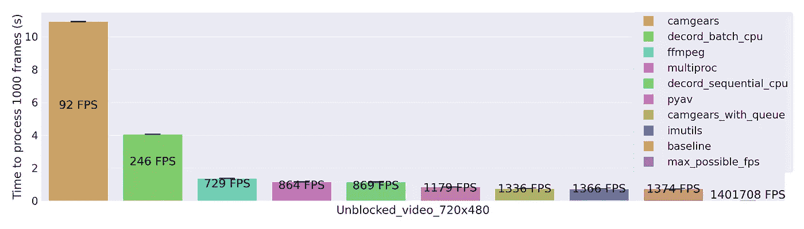
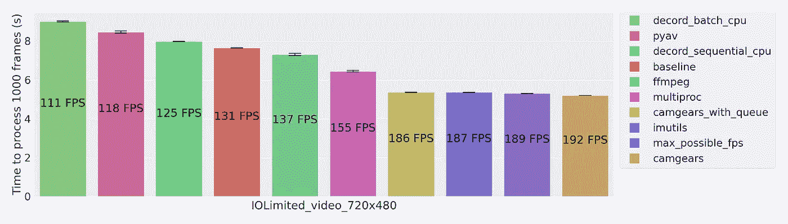
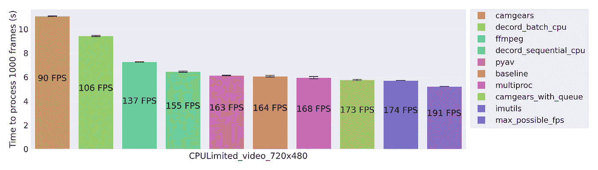

# Python 中的闪电般快速视频阅读

> 原文：<https://towardsdatascience.com/lightning-fast-video-reading-in-python-c1438771c4e6?source=collection_archive---------3----------------------->

## 让你的视频阅读代码更快

## 如果您在计算机视觉中处理视频，这些库可能会帮助您只用几行代码就使代码更高效。

费利克斯·米特迈尔在 Unsplash[拍摄的照片](https://unsplash.com?utm_source=medium&utm_medium=referral)

# 用 Python 阅读视频的典型方式

用 Python 阅读视频的典型模式是使用 OpenCV:

这种方法有什么问题吗？它完全是功能性的，但是有一些限制:

*   它没有针对速度进行优化
*   OpenCV 不是作为媒体库设计的。这一个可能会让你吃惊(它确实让我吃惊！)但开发者最初只是出于“演示目的”增加了阅读此类视频的能力

> OpenCV 库的主要目的与媒体 I/O 库的目标并不高度相关。视频 I/O 和图像 I/O 最初是为了演示的目的加入 OpenCV 的。来源:OpenCV 项目[的](https://github.com/opencv/opencv/issues/9053#issuecomment-346439490)[管理员](https://sourceforge.net/p/opencvlibrary/wiki/Home/)亚历山大·阿莱克辛

由于不是为视频操作而设计的，它不具备，也许永远也不会具备精确查找精确帧的能力(即，如果您认为`cap.set()`方法可以安全地用于设置帧数，请注意*不能*，请参见此[公开错误通知](https://github.com/opencv/opencv/issues/9053#))。

# 拯救视频阅读图书馆

好消息是有大量的开源库可以解决这些问题。如果你需要精确的帧搜索，那么像 [Decord](https://github.com/dmlc/decord) 这样的库会非常有用。对于以效率为中心设计的全功能视频处理框架，您可以查看 [VidGears](https://pypi.org/project/vidgear/) (它有一个名为 CamGears 的库，用于视频阅读)。

OpenCV 读取视频本质上是作为`ffmpeg`的包装器，但是如果你想控制用来读取视频的底层`ffmpeg`命令，那么你可以使用像 [PyAV](https://pyav.org/docs/stable/) 或 [ffmpeg-python](https://github.com/kkroening/ffmpeg-python) 这样的库。`[imutils](https://github.com/jrosebr1/imutils)`是 OpenCV 视频阅读器类上的一个轻量级包装器，它是多线程的。

但是哪个最快呢？我做了一些实验来寻找答案，你可以在这里找到完整的源代码和图表[。事实证明，答案在很大程度上取决于很多因素。例如:](https://github.com/bml1g12/benchmarking_video_reading_python)

*   您的视频有多大——原因在于，它会影响解码压缩视频所需的 CPU 使用量，还会影响需要从磁盘读取的数据量。
*   你的软件是否能在阅读视频的同时做有用的工作——然后是 CPU 繁重的工作还是仅仅需要时间(I/O 受限)。这很重要，因为一个高效的视频阅读库将开始在后台准备下一帧，所以你的软件正在做的事情会对这个后台过程产生很大的影响。

我将其分为三个使用案例:

1.  "**解除阻止** " —这意味着您的软件可以将其所有资源用于读取视频，而不会同时尝试做任何事情。
2.  " **IO 受限** " —这对应于当你想让你的软件做些别的事情，但不是 CPU 繁重的时候，我通过添加一个简单的`time.sleep()`阻塞调用来模拟这种情况
3.  “ **CPU 受限**”—这对应于计算机视觉、图像处理和机器学习管道中的一个非常典型的用例，其中您的软件在读取每一帧之间使用 CPU—我对此进行了模拟，我添加了一个阻塞调用，在每次视频读取之间执行固定次数的乘法。

对于每个使用案例，我对低分辨率(480x270)视频、中分辨率(720x480)视频和高分辨率(1920x1080)视频的速度进行了基准测试。由于结果因情况而异，我鼓励您查看报告中的[图表，找出最符合您的使用案例的图表。](https://github.com/bml1g12/benchmarking_video_reading_python)

对于本文，我只展示中等质量的视频(720x480)。在这些基准测试中，我包括了`max_possible_fps`，这是一个不读取视频的控制基准测试——只做计时和添加任何阻塞调用。我还添加了`baseline`，这是一个使用简单的基于 OpenCV 的库的控制基准，所以我们希望比基线更快地得到结果。

首先，让我们来看看“**未阻塞**”的情况，这是一种可能有点不寻常的情况，只是阅读一个视频，并不实际在你的软件中做任何其他事情。`max_possible_fps`太高了，在这里毫无意义，因为它所做的只是初始化定时器，也就是说，没有视频读取，也没有阻塞呼叫。我们发现基线 OpenCV 实际上优于所有这些媒体库，几乎以与`imutils`和`camgears_with_queue`相同的速度出现，但随着我们转向更常见的软件用例，这种情况将会改变，实际上除了阅读视频之外，你的软件还会做其他事情。

“**未阻止**”用例，即您的软件除了视频阅读之外什么也不做。([来源](https://github.com/bml1g12/benchmarking_video_reading_python)，作者创作)

下图所示的“ **IO 受限**”情况完全不同；我们现在看到，通过使用一个可以在后台准备帧的库，我们可以从基线 OpenCV 实现中获得 30%的加速。`camgears`和`imutils` 显然是这里的赢家。

" **IO 受限**"用例，即您的软件在读取帧之间做一些非 CPU 密集型的事情。([来源](https://github.com/bml1g12/benchmarking_video_reading_python)，作者创作)

最后，“ **CPU 有限**案例如下图所示。我们看到两个库之间的差异较小，但是`imutils`再次胜出，速度与`camgears_with_queue`基本相同，都比 OpenCV 快 6%。

您可能会注意到`camgears_with_queue`明显优于`camgears`——实际上，作为撰写本文的一部分，我为`camgears` repo 做出了贡献，以优化队列实现[ [1](https://github.com/abhiTronix/vidgear/pull/196/commits/3f7a6fd9efc456fbdbbb3a9394c816641701e8cf) ][ [2](https://github.com/abhiTronix/vidgear/pull/192) ]，但在撰写本文时它还没有发布；`camgears`是在撰写本文时的正式实现，`camgears_with_queue`是将在未来发布的优化实现——如果你想看看区别，在这个回购中代码是[。](https://github.com/bml1g12/benchmarking_video_reading_python/tree/main/video_reading_benchmarks/camgear)

“ **CPU 受限**”用例，即您的软件在读取帧之间执行一些 CPU 密集型操作。([来源](https://github.com/bml1g12/benchmarking_video_reading_python)，作者创作)

如果您正在处理高分辨率视频，加速会变得更加极端，在 IO 受限的情况下速度几乎翻倍。如果你正在处理许多视频文件，你应该[看看我的文章](https://medium.com/me/stories/public)来优化它。

# 带回家的点数

*   OpenCV 视频阅读器并不适合所有情况；选择合适的视频阅读库以获得最佳性能和效果
*   如果你想要精确的帧搜索，不要尝试在 OpenCV 中这样做，使用像 [decord](https://github.com/dmlc/decord) 这样的库。
*   如果你想用 Python 高效地阅读视频，使用像[vigears](https://pypi.org/project/vidgear/)/CamGears 或者 i [mutils](https://github.com/jrosebr1/imutils) 这样的库。