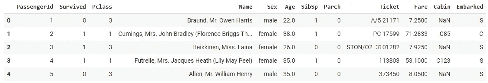
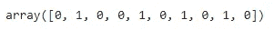

# Python 中的轻量级流水线技术

> 原文：<https://towardsdatascience.com/lightweight-pipelining-in-python-1c7a874794f4?source=collection_archive---------35----------------------->

## 使用 Joblib 将机器学习管道存储到文件中


保罗·泰森在 [Unsplash](https://unsplash.com?utm_source=medium&utm_medium=referral) 上的照片

流水线过程有助于提供按需下载和使用机器学习模型的简单方法。它有助于并行化，这意味着不同的作业可以并行运行，还可以减少冗余，并有助于检查和调试模型中的数据流。

管道提供的一些功能包括按需计算、数据和计算跟踪、检查数据流等。尽管具有所有这些特征，但是创建和使用这些管道是困难的。如果我告诉你，你可以轻松地创建这些管道，没有任何麻烦，会怎么样？

Joblib 是一个开源 Python 库，有助于将管道保存到文件中，并在需要时使用它。它很容易实现，并且运行良好。

在本文中，我们将探索 Joblib 提供的一些功能。

让我们开始吧…

# 安装所需的库

我们将从使用 pip 安装 Joblib 库开始。下面给出的命令可以做到这一点。

```
!pip install joblib
```

# 导入所需的库

在这一步中，我们将导入加载数据集、创建模型和创建管道所需的库。

```
import pandas as pd
from sklearn.preprocessing import OneHotEncoder
from sklearn.linear_model import LogisticRegression
from sklearn.pipeline import make_pipeline
import joblib
```

# 正在加载数据集

在本文中，我们将使用从 Kaggle 获取的著名的泰坦尼克号数据集。

```
cols = ['Embarked', 'Sex']
df = pd.read_csv('http://bit.ly/kaggletrain', nrows=10)
X = df[cols]
y = df['Survived']
df_new = pd.read_csv('http://bit.ly/kaggletest', nrows=10)
X_new = df_new[cols]
df.head()
```



数据集(来源:作者)

# 建模

在这一步中，我们将从创建一个模型开始，我们将为其执行一些预处理。之后，我们将创建管道，对其进行拟合，并将其用于预测。

```
ohe = OneHotEncoder()
logreg = LogisticRegression(solver='liblinear', random_state=1)
pipe = make_pipeline(ohe, logreg)
pipe.fit(X, y)
pipe.predict(X_new)
```



预测(来源:作者)

创建管道后，我们现在将它转储到一个文件中，并在需要时使用它。

```
# save the pipeline to a file
joblib.dump(pipe, 'pipe.joblib')
```

最后，我们将加载该管道，并使用它进行预测。

```
# load the pipeline from a file
same_pipe = joblib.load('pipe.joblib')
# use it to make the same predictions
same_pipe.predict(X_new)
```


预测(来源:作者)

在本文中，我们发现使用 Joblib 创建管道并将其用于预测是多么容易。

继续尝试使用不同的数据集，存储模型管道并使用 Joblib 加载它。如果您发现任何困难，请在回复部分告诉我。

本文是与[皮尤什·英格尔](https://medium.com/u/40808d551f5a?source=post_page-----1c7a874794f4--------------------------------)合作完成的。

# 在你走之前

***感谢*** *的阅读！如果你想与我取得联系，请随时通过 hmix13@gmail.com 联系我或我的* [***LinkedIn 个人资料***](http://www.linkedin.com/in/himanshusharmads) *。可以查看我的*[***Github***](https://github.com/hmix13)**简介针对不同的数据科学项目和包教程。还有，随意探索* [***我的简介***](https://medium.com/@hmix13) *，阅读我写过的与数据科学相关的不同文章。**