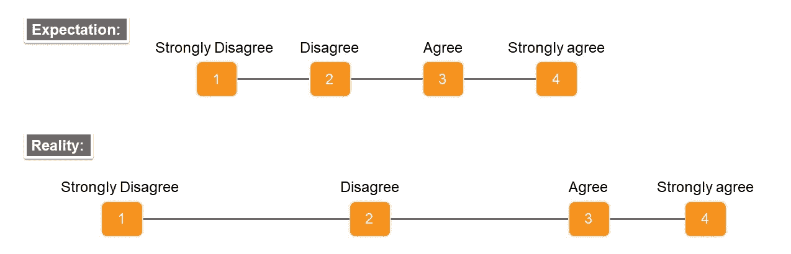

# 李克特量表:朋友还是敌人？

> 原文：<https://towardsdatascience.com/likert-scales-friend-or-foe-76f865786fb7?source=collection_archive---------13----------------------->

## [思想和理论](https://towardsdatascience.com/tagged/thoughts-and-theory)

## 调查研究人员应该知道的陷阱和警告

来源:Storyset 的营销插图(【https://storyset.com/marketing】T2)

我相信你们都看过或回答过以下(或至少是类似的)回答选项的调查问题:

*   [1]强烈反对
*   [2]不同意
*   [3]既不反对也不同意
*   [4]同意
*   [5]非常同意

要回答这个问题，受访者将选择一个特定的回答选项，反映他们对某项陈述的同意(或不同意)程度。这是一个众所周知的 5 分制**李克特**量表的例子【1】，它是以它的发明者[伦西斯·利克特](https://en.wikipedia.org/wiki/Rensis_Likert)命名的。李克特量表被许多学科(如心理学、教育、公共卫生、商业和营销)的调查研究人员广泛使用，以了解人们对不同现象的态度(样本调查问题见 [SurveyMonkey](https://www.surveymonkey.com/mp/likert-scale/) )。用李克特量表表示的调查问题可以帮助调查人员找到更多感兴趣的主题(例如，客户满意度)。

尽管在调查研究中广泛使用李克特量表，但研究人员往往没有意识到可能会严重影响调查数据分析和解释方式的陷阱和警告。在这篇文章中，我将总结在分析通过李克特量表收集的调查数据时需要考虑的要点。

# 序数还是区间？

李克特量表问题中的回答选项应根据被测现象进行排序，因此它们按**顺序排列**。

现在让我们假设我们正在回答一个酒店满意度调查中的问题:“我的房间很干净”。如果调查使用 4 点李克特量表，回答选项将是:

(1)强烈不同意— (2)不同意— (3)同意— (4)强烈同意

如果我们选择*完全同意*，那么我们的回答将表明我们的同意程度高于其他可能选择*同意*、*不同意*或*完全不同意*的受访者。

我们也可能会根据分配给每个回答选项的数值来解释我们同意的程度。然而，这些数值通常由调查研究人员任意确定为整数序列(例如，1 到 4)。这些值仅仅表示响应选项的“顺序”，而不是一致的强度。因此，基于分配给响应选项的值，不能假定响应选项**之间的距离**相等。

例如，受访者可能认为(4) *非常同意*和(3) *同意*非常相似，因此这两个选项之间的差异可能比(3) *同意*和(2) *不同意*、之间的差异小得多，尽管它们具有相同的距离。

来源:作者图片

接受李克特量表的顺序性质的主要含义是，分配给响应选项**的数值不能**被视为区间数据，因此参数统计(例如，平均值、标准偏差)和参数统计方法(例如，将单个问题相加得出总调查分数，用调查分数进行回归)不会产生有效的结果。用于分析来自李克特量表的有序数据的一些选项包括汇总统计(如中位数和众数)、统计方法(如[有序回归](https://en.wikipedia.org/wiki/Ordinal_regression)、[独立性卡方检验](https://libguides.library.kent.edu/spss/chisquare)和[项目反应理论(IRT)建模](https://select-statistics.co.uk/blog/measuring-behaviours-and-latent-traits-with-item-response-theory/)，以及图形工具(如[条形图和相关矩阵图](/5-ways-to-effectively-visualize-survey-data-using-r-89928bf08cb2))。

如果你对调查数据的分析和可视化感兴趣，可以看看我最近在 Pluralsight 上的课程[用 R](https://www.pluralsight.com/courses/analyzing-survey-data-r) 分析调查数据。

# 中性期权

有时李克特量表包括一个“中等”反应类别，表明一个中性选项。中间的回答选项通常包括“中立”、“既不同意也不反对”或“无意见”等短语。包括中性选项可以增加调查数据的准确性，因为没有强烈偏好的回答者可能更喜欢选择中性回答选项，而不是随机选择回答选项或跳过问题。

然而，包含一个中性选项是有代价的。李克特量表假设目标现象是在线性连续体上测量的，通常从负面(例如，强烈不同意)到正面(例如，强烈同意)[2]。因此，中性期权在这个连续统上的位置导致了一个缩放问题。

研究表明，回答者通常将量表的视觉中点视为代表中间反应选项[3]。因此，中性选项经常被放在响应选项的中间，例如:

*   强烈反对
*   不同意
*   **既不同意也不反对**
*   同意
*   非常同意

或者，中性选项可以在结尾单独呈现(例如，在“非常同意”之后)，以将其与其他响应选项相区分。为了避免这一问题，调查研究人员应该使用由偶数个回答选项组成的李克特量表，而不使用中性选项，或者选择受访者不太容易选择中性选项的调查问题。

# 响应选项的数量

调查研究人员通常认为，李克特量表包含的回答选项越多，他们获得的测量结果就越精确。但是，对于李克特量表来说，最佳的反应选项数量是多少呢？

虽然 5 点李克特量表在调查研究中广泛使用，但一些研究人员更喜欢在他们的调查中使用 6 个或更多的回答选项。例如，7 点协议量表如下所示(参见[vag IAS【2006】](https://mwcc.edu/wp-content/uploads/2020/09/Likert-Scale-Response-Options_MWCC.pdf)关于李克特量表的更多示例):

*   (1)强烈反对
*   (2)不同意
*   (3)有点不同意
*   (4)既不同意也不反对
*   (5)有点同意
*   (6)同意
*   (7)非常同意

在李克特量表上，受访者理解和区分回答选项的精确程度是有限的。因此，调查研究人员必须考虑受访者是否能清楚地理解所有的回答选项。研究表明，具有 2 到 5 个回答选项的李克特量表通常会产生精确的结果，尽管回答选项数量较少可能会降低调查的测量精度。此外，研究人员发现，在李克特量表上使用超过 6 个响应选项没有明显的优势[4]。

# 消极还是积极的措辞？

调查问题可以用否定或肯定的措辞。否定问题与调查中的大多数其他问题方向不同。否定的措辞通常是通过使用否定的词语或用“不是”来否定一个问题。例如，下面是两个带有肯定和否定措辞的调查问题:

**正面**:我的房间很干净。

我的房间很脏。(或者，“我的房间不干净。”)

对于认为自己房间干净的受访者，预计他们会选择“同意”或“非常同意”正面问题，选择“不同意”或“非常不同意”负面问题。

有时，调查研究人员在同一个调查中使用积极和消极措辞的问题，以防止回答偏差。然而，同时使用积极和消极措辞的问题有一些陷阱。首先，积极和消极措辞的问题不一定是彼此的镜像[5]。因此，在分析调查数据时，对负面措辞的问题使用李克特量表进行反向编码(例如，1-非常同意；2-同意；3-不同意；4-强烈不同意)不一定会将这些问题与措辞积极的问题放在同一个方向。第二，研究表明，负面措辞可能会让受访者困惑，导致对调查问题的回答不准确[6，7]。也就是说，它可能会污染调查数据，而不是防止回答偏差。

最后，以前的研究表明，受访者更有可能不同意消极措辞的问题，而不是同意积极的问题[8]。例如，选择*同意*表示“我的房间很干净”的受访者可能更喜欢选择*强烈不同意*表示“我的房间很脏”。因此，建议调查人员尽量减少负面问题的数量，同时考虑负面问题对回答的影响。

# 结论

在这篇简短的文章中，我想总结一些使用李克特量表进行调查时常见的陷阱和注意事项。除了这篇文章中强调的要点之外，调查研究人员还需要考虑其他问题，例如用数字和/或文本对比图像来标记回答选项(例如，[表情符号](https://livecusurvey.com/emoji-likert-scale/))，使用[滑动比例](https://www.checkmarket.com/blog/likert-scales-slider-scales/)而不是李克特比例，以及问题和回答选项之间的潜在不匹配【9】。

# 参考

[1] 5 点李克特量表。载于:Preedy V.R .，Watson R.R. (eds)的《疾病负担和生活质量衡量手册》。纽约州纽约市斯普林格。[https://doi.org/10.1007/978-0-387-78665-0_6363](https://doi.org/10.1007/978-0-387-78665-0_6363)

[https://www.simplypsychology.org/likert-scale.html](https://www.simplypsychology.org/likert-scale.html)

[3] Roger Tourangeau，Mick P. Couper，Frederick Conrad，间距、位置和顺序:调查问题视觉特征的解释性启发法，*舆论季刊*，第 68 卷，第 3 期，2004 年 9 月，第 368-393 页，【https://doi.org/10.1093/poq/nfh035】T2

[4]西姆斯，L. J .，泽拉兹尼，k .，威廉姆斯，T. F .，&伯恩斯坦，L. (2019)。回应选项的数量重要吗？使用人格问卷数据的心理测量观点。*心理评估，31* (4)，557–566。[https://doi.org/10.1037/pas0000648](https://doi.apa.org/doi/10.1037/pas0000648)

[5] Spector，P. E .，Van Katwyk，P. T .，Brannick，M. T .，& Chen，P. Y. (1997 年)。当两个因素不能反映两个结构时:项目特征如何产生人为因素。*管理杂志*， *23* (5)，659–677。[https://doi . org/10.1016/s 0149-2063(97)90020-9](https://doi.org/10.1016/S0149-2063(97)90020-9)

[6]科罗西河(2005 年)。措辞消极的问题会引起回答者的困惑。*美国统计协会调查研究方法部分会议录(2005)* ，2896–2903。从[https://citeseerx.ist.psu.edu/viewdoc/download?取回 doi = 10 . 1 . 1 . 556 . 243&rep = re P1&type = pdf](https://citeseerx.ist.psu.edu/viewdoc/download?doi=10.1.1.556.243&rep=rep1&type=pdf)

[7]范·桑德伦、桑德曼和科因(2013 年)。问卷项目反向措辞的无效性:让我们向雨中的牛学习。 *PloS one* ， *8* (7)，e68967。[https://doi.org/10.1371/journal.pone.0068967](https://doi.org/10.1371/journal.pone.0068967)

[8] Naomi Kamoen，Bregje Holleman，Pim Mak，Ted Sanders，Huub Van Den Bergh，为什么负面问题很难回答？关于调查中语言对比的处理，*民意季刊*，第 81 卷第 3 期，2017 年秋季，第 613–635 页，[https://doi.org/10.1093/poq/nfx010](https://doi.org/10.1093/poq/nfx010)

[9]Jolene D . s myth，Kristen Olson，调查问题词干和回答选项不匹配对数据质量和回答的影响，*调查统计和方法学杂志*，第 7 卷，第 1 期，2019 年 3 月，第 34-65 页，[https://doi.org/10.1093/jssam/smy005](https://doi.org/10.1093/jssam/smy005)