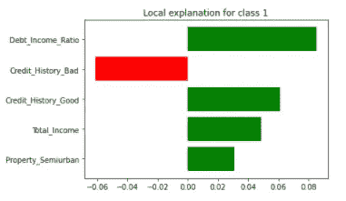

# 审计黑盒模型的时间

> 原文：<https://towardsdatascience.com/lime-for-auditing-black-box-models-b97d6d2580b4?source=collection_archive---------35----------------------->

## 使用石灰(**本地可解释的解释**)来忠实于你的模型和预测

作者创建的图像

我们愿意相信这是一个人工智能和人工智能的时代，但我们忘记了，这也是一个黑箱模型的时代，它不提供关于分类器及其决策的公正和解释。

做出改变的一个方法是审计黑箱模型。等等…什么是黑盒模型？

***黑箱模型*** 指的是完全黑暗的东西，因此，人们只能观察到输入和输出变量，而不能看到里面发生的事情。当我们生活在这个监督学习的世界中时，了解预测背后的原因也同样重要。

## 为什么可解释性很重要？

我能想到的有数百种应用，它可以派上用场。然而，可解释性之所以重要的主要原因是因为它往往会影响特定的人群，我们希望不惜任何代价避免这种情况。仅仅因为你属于某个种族或地区，你的贷款申请就不被接受，这是没有道理的。我们需要透明的系统，能够向我们解释为什么分类器预测某个类作为输出。

在这么多不合理的实践之后，机器学习模型出现的主要问题是:**我为什么要相信你？**

虽然预测模型应该会产生错误和错误分类，但如果错误变得非常特定于某个特定群体，那么这肯定应该被称为数据中的偏差或模型中的偏差。在许多领域，这些错误分类的后果可能是灾难性的。

## **石灰—当地可解释的说明**

LIME 帮助你发现和理解个人预测。LIME 提供了对预测值和目标变量之间关系的定性理解。它可以帮助你分析一个样本，以及为什么它会被这样分类。

为了向用户解释预测，它必须是**可解释的**、**忠实的**和**模型不可知的**；模型不可知论意味着它应该在任何模型上工作，而忠实意味着它应该保持其完整性。LIME 主要依赖于特征和可解释数据表示之间的区别。例如:在文本分类中，特征是单词嵌入；可解释的表示是指示单词存在或不存在的向量。

当你训练完你的模型后，石灰可以很容易地用在 jupyter 笔记本上。LIME 的输出显示了每个特征对特定数据样本预测的贡献。这类似于要素重要性，但它只对一个特定的数据集更明显。这有助于我们处理各种亚人群，并检测我们的数据集或模型中的偏差(如果有的话！)

预测为 1 的随机样本的可解释性(图片由作者提供)

有时，一个特征可能会在这里结束，虽然与特定结果没有直接关系，但它可能与一个或多个其他选定的特征有相关性或功能依赖性，因此，可能间接依赖于一些人口统计变量并导致数据偏差。将它与整个模型的特征重要性数据进行比较是一个很好的实践。

虽然 LIME 有助于提高可解释性，但我认为在公共或私营部门部署模型时，询问一些关于模型的问题也很重要:

*   精确度是如何衡量的？
*   各个亚人群之间的准确率是一样的吗？
*   为什么会出现错误？

## TL；博士；医生

*   让你的模型具有可解释性和可读性，让你的客户信任你。
*   石灰是分类器解释其预测的方法。