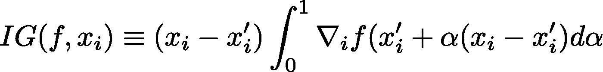
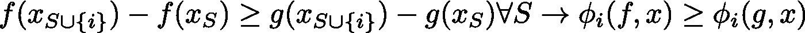
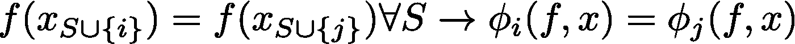
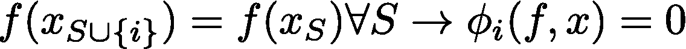
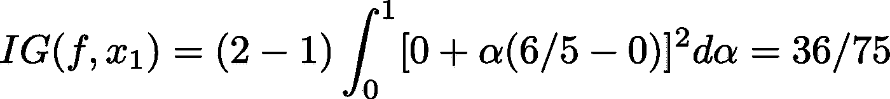
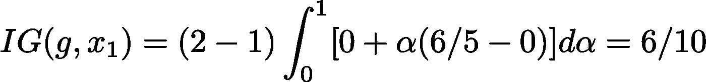
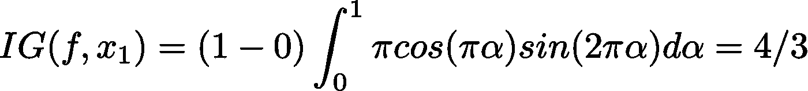
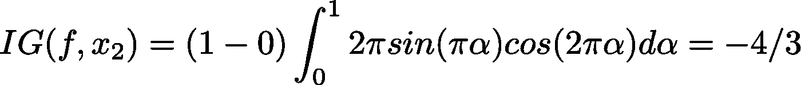
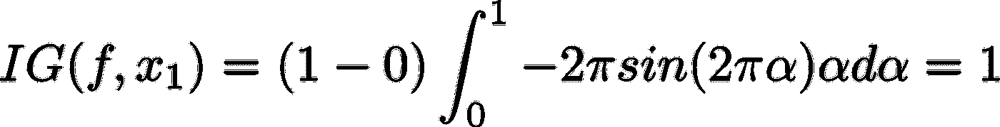

# 特征属性综合梯度的局限性

> 原文：<https://towardsdatascience.com/limitations-of-integrated-gradients-for-feature-attribution-ca2a50e7d269?source=collection_archive---------17----------------------->

## 可解释人工智能中流行的方法有严重的缺陷

[集成梯度](http://proceedings.mlr.press/v70/sundararajan17a/sundararajan17a.pdf)是一种特征属性方法，具有几个吸引人的特性，非常适合神经网络。然而，它可能具有不广为人知的非直觉行为。使用具体的例子，我在这里证明，综合梯度并不具有我们希望一个理想的特征属性方法拥有的所有特征。理解这个工具的优点和缺点将有助于用户解释他们的结果，并且可能在将来构思更高性能的工具。

由[史蒂夫·道格拉斯](https://unsplash.com/@sldoug?utm_source=unsplash&utm_medium=referral&utm_content=creditCopyText)在 [Unsplash](https://unsplash.com/s/photos/rice-paddy?utm_source=unsplash&utm_medium=referral&utm_content=creditCopyText) 上拍摄的照片

## 背景

特征归因起源于博弈论。假设我们有一群玩家合作来获得一些奖励。假设每个玩家对团队的贡献不同，那么奖励应该如何在玩家之间分配呢？在机器学习的背景下，“奖励”类似于模型输出的分数，“玩家”类似于输入特征。也就是说，我们想知道每个特性占最终得分的多少。

Shapley 提供了任何这样的系统都应该满足的一组公理，并表明只有一个可能的解决方案，现在被称为 Shapley 值，满足他的每个公理。他的解决方案依赖于这样的观察，即每个玩家的贡献取决于在场的其他玩家，因此当游戏由可能的玩家的不同子集进行时，他会考虑游戏的结果。回到机器学习中的特征属性问题，我们将不得不定义模型对特征子集而不是全部输入进行预测意味着什么。对于像神经网络这样的模型，如何做到这一点并不明显。由于这种概念上的限制，以及 Shapley 值的高计算成本，在实践中需要其他方法，而积分梯度是一种令人信服的替代解决方案。

在下一节中，我将解释集成渐变，并讨论它所引入的“基线”输入的概念是如何与合作游戏联系在一起的。这样做，我们将能够评估积分梯度如何符合 Shapley 公理，并揭示一些奇怪的行为。

## 集成渐变

比方说，要将 Shapley 值应用于图像分类问题，我们必须定义神经网络对缺失像素的图像进行预测意味着什么(如果我们回想合作游戏，这类似于缺失玩家)。作者认为，我们可以将这些“缺失”的特征视为其值已被某种无信息基线所取代。在图像的上下文中，这可能意味着例如用灰色基线替换真实像素值。

在这一点上，积分梯度与 Shapley 方法大相径庭。它提供的解决方案有着完全不同的优点和缺点，了解全貌超出了本文的范围。出于我们的目的，我只想在这里简单描述一下什么是积分梯度，以及它是否以我们想要和期望的方式运行。

设*f(****x****)*代表我们的机器学习模型为输入向量 ***x*** 。然后对于基线，无信息输入***x’***(想想全灰图像)，集成梯度提出以下特征属性:

其中左手边代表赋予向量 ***x*** 的第 *i* 个特征的特征属性。注意，在上面的等式中，可以理解的是，在沿着路径对其进行评估之前，先获取 *f* 的梯度。利用微积分的基本定理，所有特征的属性之和等于*f(****x****)*和*f(****x’****)*之差。这是该方法背后的关键直觉，但它还有其他几个卖点。我鼓励读者查看原文以了解更多细节。

## Shapley 公理和积分梯度

为了评估集成梯度满足 Shapley 的哪个公理，我们将从输入中删除要素解释为等同于用它们的基线值替换它们。为了简洁起见，我在这里只描述积分梯度满足的相关公理*而不是*；它还满足其他一些公理。

**一致性**

在上面的等式中， *S* 表示特征的子集， *S* 联合 *i* 表示相同的子集，但是现在包括了特征 *i* ，并且 phi 表示任何特征属性。这个公理说的是，如果对于每一个子集 *S，*特征 *i* 对模型 *f* 的影响*大于模型 *g，*那么 *i* 在 *f* 下应该比在 *g.* 下得到更高的本质上，更大的奖励应该意味着更大的属性。我个人并不认为这个公理的重要性非常直观*，*，但是它暗示了下面给出的另外两个公理，它们对于合理的特征归属是必不可少的。*

**对称性**

这个公理强加了一个非常合理的条件，如果两个特征或玩家对每个可能的特征/玩家子集做出相同的贡献，他们必须得到相同的属性。如果一个玩家的贡献与另一个玩家相同，那么给他们更多的奖励是不公平的。正如我们将在后面看到的，事实上积分梯度不满足这个公理！

**无效效果**

该公理表示，如果特征/玩家 *i* 的存在对特征/玩家*、*的所有子集 S 的 *f* 没有影响*、*，则该玩家的属性应该为零*。没有任何贡献的玩家不应该得到奖励*。**

在下一节中，我提供了反例，表明积分梯度不符合这些公理。

## 反例

**一致性**

设 *f(x1，x2) = (x1)(x2)，g(x1，x2) = (x1)(x2)，*设基线****x '****=(1，0)，*设输入为****x****=(2，6/5)。*那么与模型 *f* 的 *x1=2* 相关联的特征属性是:**

****

**与模型 *g* 的 *x1=2* 相关的特征属性为**

****

**如果我们采用输入特征和基线特征的所有组合，我们需要考虑的值是**

***f(1，0) = 0***

***g(1，0) = 0***

***f(2，0) = 0***

**g(2，0) = 0**

**f(1，6/5) = 36/25**

**g(1，6/5) = 6/5**

**f(2，6/5) = 72/25**

**g(2，6/5) = 12/5**

**对于 *(x1，x2)* 的每个组合，我们有 f *(x1，x2) ≥ g(x1，x2)。*然而根据积分梯度，f 下输入 *(2，6/5)* 的 *x1=2* 的特征属性为 *36/75，*而 g 下为 *6/10。*因此 *x1=2* 在 *f* 下得到比*g*更小的特征属性，违反了一致性公理*。***

****对称****

**设 *f(x1，x2) = sin(pi*x1)sin(2*pi*x2)* ，基线为 ***x'*** *= (0，0)* ，输入为 ***x*** *= (1，1)* 。那么 *x1=1* 的特征属性为**

****

**并且 *x2=1* 的特征属性为**

****

**要评估的输入有**

**f(0，0) = 0**

**f(1，0) = 0**

**f(0，1) = 0**

**f(1，1) = 0**

**因为 f 的值总是相同的，不管我们提供什么输入组合，根据对称公理 *x1=1* 和 *x2=1* 对于基线**=(0，0)* 必须得到相同的属性。然而 *IG(x1) = 4/3* 和 *IG(x2) = -4/3* ，违反了公理。***

****无效效果****

**设 *f(x1，x2) = cos(2*pi*x1)(* x2)，再次设基线为***【x’****=(0，0)* 输入为 ***x*** *= (1，1)* 。 *x1=1* 的特征属性为**

****

**注意，这实际上等于在输入端评估的 *f* 。这意味着(并且可以通过计算来确认)，所有的属性都给了 *x1* ，没有一个属性给了 *x2。*然而将 *x1* 从基线 *x1' = 0* 切换到输入 *x1 = 1* 对功能*没有影响！*这揭示了积分梯度不满足无效效应公理，这尤其令人不安。**

****讨论****

**我们研究了整合梯度在 Shapley 公理下的表现，将丢失的特征解释为基线值的替换。通过这样做，我们发现积分梯度违反了 Shapley 的一些公理，正因为如此，它有时给出与合理的特征归属方法不相称的答案。特别地，集成梯度可以将不同的属性分配给总是对模型具有完全相同影响的两个特征(违反对称性)，并且可以将正属性分配给对模型没有影响的特征(违反无效影响)。在试图解释他们的模型做出的决定之前，用户理解这些警告是很重要的。**