# 线性回归中的最佳拟合线

> 原文：<https://towardsdatascience.com/line-of-best-fit-in-linear-regression-13658266fbc8?source=collection_archive---------1----------------------->

## 相关系数、决定系数、模型系数


劳拉·詹姆士的照片来自[佩克斯](https://www.pexels.com/photo/paper-snowflake-bell-and-tree-for-handmade-garland-6102186/?utm_content=attributionCopyText&utm_medium=referral&utm_source=pexels)

# 线性回归

线性回归是机器学习中最重要的算法之一。它是测量一个或多个自变量与一个因变量之间关系的统计方法。

线性回归模型试图通过找到最佳拟合线来找到变量之间的关系。
让我们在本文中详细了解模型如何找到最佳拟合线以及如何度量拟合优度

# 目录

1.  相关系数 **r**
2.  可视化系数相关性
3.  模型系数→ m 和 c
    *斜率
    *截距
4.  最佳拟合线
5.  价值函数
6.  决定系数→R → R 的平方
7.  相关系数与决定系数

# 简单线性回归

简单线性回归是一个自变量和一个因变量的线性回归模型。

例子:年资对比工资，面积对比房价

在建立简单的线性回归模型之前，我们必须检查两个变量之间的线性关系。

我们可以通过使用相关系数来衡量线性关系的强度。

# 相关系数

它是两个变量之间线性关联的度量。它决定了线性关联的强度和方向。

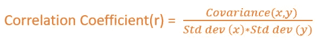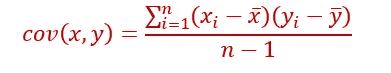

协方差检查两个变量如何一起变化。

协方差取决于 x 和 y 的单位。协方差的范围从-∞到+ ∞。
但是相关系数是无单位的。它只是一个数字。

> 系数相关性 **r** 的范围从 **-1 到+1**

*   如果 r=0 →表示没有线性关系。不代表没有关系
*   如果一个变量增加，另一个变量减少，r 将为负。
*   r 将为正，如果一个变量增加，另一个变量也增加。

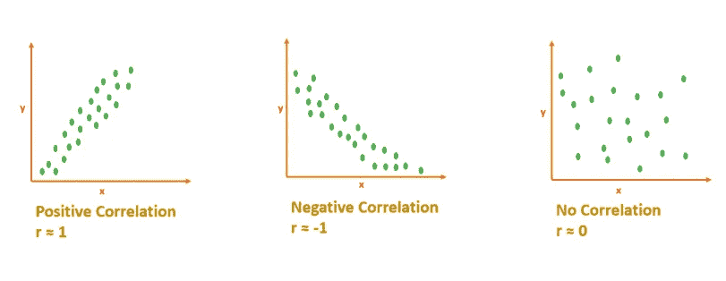

相关性[图片由作者提供]

## 解释相关系数

如果 r 接近 1 或-1 意味着，x 和 y 强相关。
如果 r 接近 0 表示 x 和 y 不相关。[没有线性关系]

# 可视化相关性

举例:“工作经验年限”Vs“工资”。这里我们想预测给定“经验年”的工资。

薪资→因变量
工作年限→自变量。

1.  **散点图，显示相关性**

```
df=pd.read_csv(**'salary.csv'**)
sns.scatterplot(x=**'Years_Of_Exp'**,y=**'Salary'**,data=df,color=**'darkorange'**)
```

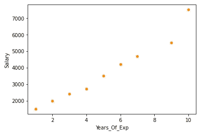

2.精确的 r 值-热图

```
sns.heatmap(df.corr(),annot=**True**)
```

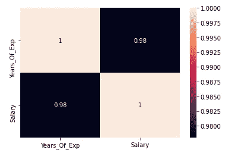

r 为 0.98 →表明两个变量强相关。

# 最佳拟合线

找到变量[自变量和目标变量]之间的相关性后，如果变量是线性相关的，就可以进行线性回归模型了。

线性回归模型将找出散点图中数据点的最佳拟合线。

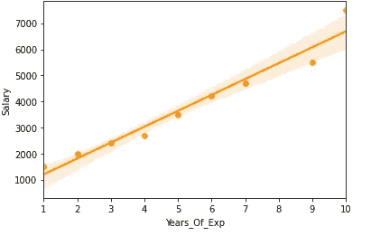

让我们学习如何找到最佳拟合线。

# 直线方程

```
y=mx+c
```

m→斜率
c→截距

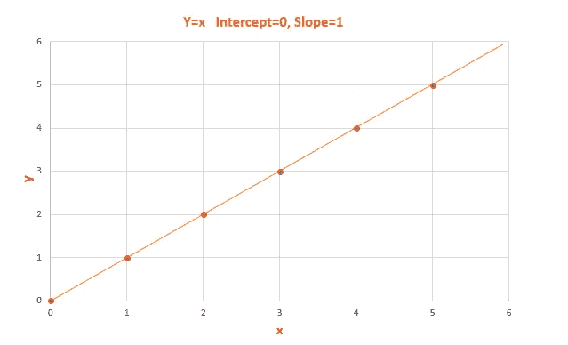

y = x[斜率=1，截距= 0]-图片作者

# 模型系数

斜率 **m** 和截距 **c** 为模型系数/模型参数/回归系数。

## 斜率→m

斜率基本上表示直线有多陡。斜率的计算方法是 y 的变化除以 x 的变化

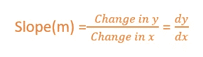

如果一个增加，另一个减少，斜率将为负。
如果 x 增加，y 增加，斜率为正。

> 斜率值的范围从-∞到+ ∞。

[因为我们没有对值进行归一化，所以斜率将取决于单位。因此，它可以取从-∞到+ ∞]的任何值

## 截距→ c

x 为 0 时 y 的值。
直线通过原点时截距为 0。


计算斜率和截距[图片由作者提供]

直线的斜率将保持不变。我们可以用公式 dy/dx 计算直线上任意两点的斜率。

# 最佳拟合线

线性回归模型必须找到最佳拟合线。

我们知道一条线的方程是 y=mx+c，m 和 c 有无限种可能，选哪个？

在所有可能的线中，如何找到最合适的线？

最佳拟合线通过使用成本函数(误差平方和最小)来计算。

最佳拟合线将具有最小的平方和误差。

# 价值函数

误差的最小平方和被用作线性回归的成本函数。

对于所有可能的线，计算误差的平方和。误差平方和最小的线是最佳拟合线。

## 误差/残差

误差是 y 的实际值和 y 的预测值之差。

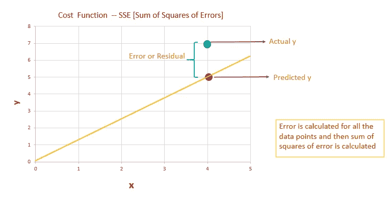

误差或残留[图片由作者提供]

1.  我们必须计算所有数据点的误差/残差
2.  对误差/残差求平方。
3.  然后我们要计算所有误差的平方和。
4.  在所有可能的线中，误差平方和最小的线是最佳拟合线。

## 平方误差/残差背后的原因

1.  如果我们不平方误差，负号和正号就会抵消。我们将以错误=0 结束
2.  所以我们只对误差的大小感兴趣。实际值偏离预测值的程度。
3.  那么，为什么我们没有考虑误差的绝对值。我们的目的是找到最小的误差。如果误差是平方的，与取误差的绝对值相比，区分误差将是容易的。
4.  越容易区分误差，就越容易确定误差的最小平方和。

在所有可能的直线中，线性回归模型得出误差平方和最小的最佳拟合直线。最佳拟合线的斜率和截距是模型系数。

现在我们必须衡量我们的最佳拟合线有多好？

# 决定系数 R → R 的平方

R-squared 是模型良好性的度量之一。(最佳拟合线)

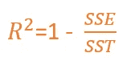

SSE→误差平方和
SST→平方和合计

**总误差是多少？**

在建立线性回归模型之前，我们可以说 y 的期望值就是 y 的均值/平均值，y 的均值与 y 的实际值之差就是**总误差。
总误差就是总方差。**总差异是数据中存在的差异量。

建立线性回归模型后，我们的模型预测 y 值。y 的平均值和预测的 y 值之间的差值就是回归误差。
回归误差是**解释的方差**。解释差异是指模型捕获的差异量。

残差/误差是实际 y 值和预测 y 值之间的差值。
残差/误差是**未解释的方差**。

总误差=残差+回归误差

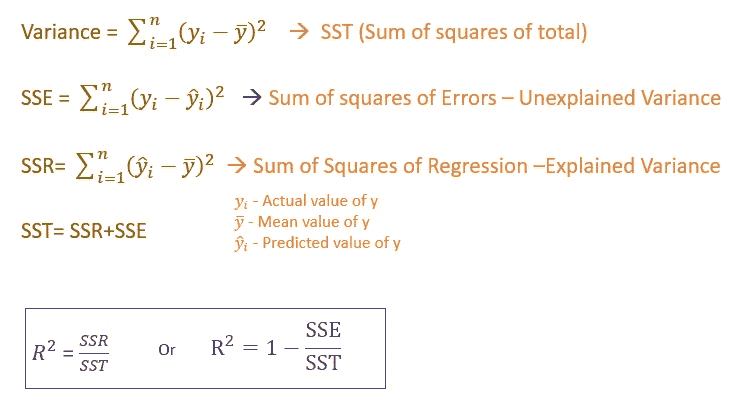

作者图片

决定系数或 R 平方衡量模型解释了 y 中的多少方差。

R 平方值介于 0 和 1 之间

0 →是坏模型，1 是好模型。

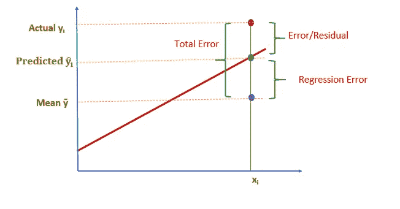

作者图片

# 关键要点

*   相关系数- r 的范围从-1 到+1
*   决定系数 R 的范围是从 0 到 1
*   斜率和截距是模型系数或模型参数。

感谢您阅读我的文章，希望对您有所帮助！

[](/the-concepts-behind-logistic-regression-6316fd7c8031) [## 逻辑回归背后的概念

### Sigmoid 函数、对数损失、优势比、模型系数、指标

towardsdatascience.com](/the-concepts-behind-logistic-regression-6316fd7c8031) 

*关注此空间，了解更多关于 Python 和数据科学的文章。如果你喜欢看我的更多教程，就关注我的* [***中***](https://medium.com/@IndhumathyChelliah)[***LinkedIn***](https://www.linkedin.com/in/indhumathy-chelliah/)*[***推特***](https://twitter.com/IndhuChelliah) ***。****

**点击这里成为中等会员:*【https://indhumathychelliah.medium.com/membership】*