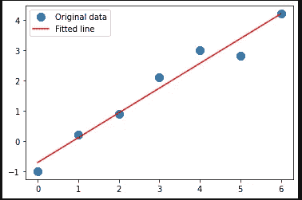

# python 中的线性代数与曲线拟合

> 原文：<https://towardsdatascience.com/linear-algebra-and-curve-fitting-in-python-7c6492f75587?source=collection_archive---------17----------------------->

## 带有示例和代码的 numpy/scipy 代数入门


克里斯·利维拉尼在 [Unsplash](https://unsplash.com?utm_source=medium&utm_medium=referral) 上的照片

在本教程中，我想修改一些线性代数的基本概念，最小二乘最小化和曲线拟合，这些对于任何一个用 python 进行数据分析的科学家来说都是有用的工具。这些工具可以应用于各种各样的问题，从线性回归到常微分方程。

我们将从基础开始，使用由 [numpy](https://numpy.org/) 和 [scipy](https://www.scipy.org/) (构建在 numpy 之上)提供的工具来处理更复杂的情况:这是两个流行的 python 科学计算包。在本文中，我使用的是这些版本:
numpy ' 1 . 20 . 0 '
scipy ' 1 . 6 . 0 '
但是我们将使用的例程不是新的，所以使用旧版本应该没有问题。

到本文结束时，您将能够实现您的代码来解决矩阵和数组上的常见代数计算，用自定义方程拟合您的数据，并将最小二乘回归应用于您的问题。

我在其他一些文章中使用了这些技术，如[多元线性回归](/multiple-linear-regression-with-interactions-unveiled-by-genetic-programming-4cc325ac1b65)、[线性回归](https://medium.com/analytics-vidhya/linear-regression-in-python-from-scratch-with-scipy-statsmodels-sklearn-da8e373cc89b)，以及一些高级的最小二乘最小化——曲线拟合和带有 SIR 模型的 covid 案例的基本分析[。](https://medium.com/analytics-vidhya/second-wave-of-covid-19-in-italy-cd0a9daab052)

# 1.线性代数:线性标量方程组

从高中或大学开始，我们都有机会处理线性方程组。他们看起来漂亮或肮脏，但基本上是这样的:


这个问题的任务是找出满足关系的 x 和 y。我们可以通过从第二个方程写出 *x = 1-y* 来手动解决这个问题，并将其代入第一个方程，变成:(1-y) + (2y) = 0。
解决方法是 *y = -1* 和 *x = 2* 。

随着我们研究的进展，这些方程最终变成了矩阵。上述等式可以写成:


其中 **A** 是一个 2×2 矩阵，称为系数矩阵，而 **b** 是一个列向量，或 2×1 矩阵，代表纵坐标或“因变量”值。x 是我们要求解这个系统的向量(或矩阵)。注意，在这个表示中，所有类似于 *x，y，t，…* 的术语都浓缩在 **x** 中。

从矩阵乘法法则我们知道，如果 **A** 有 m 行 n 列(*mxn*)**x**有 n 行 p 列( *nxp* )，那么它的乘积 **Ax** 就会有 m 行 p 列( *mxp* )。做一个线性系统， **A** 是一个方阵，它将是 *mxm* ，所以 **x** 必须是 *mxp* 并且 **b** 具有相同的维数 *mxp* 。

在 python 中，这变成了:

输出将类似于:


矩阵 **a** 和向量 **b** 输出。

现在我们可以简单地用 *np.linalg.solve* 来求解我们的系统:

并且 x 将是:


该系统的解决方案 **x**

这正是我们手工找到的解决方案！
当然我们可以在这里做一点实验。我们会发现，随着我们的系统越来越复杂，我们能够用这种方式轻松地解决它们。通过使用 np.dot(a，x)取 **A** 和 **x 的点积，我们可以检查我们的解决方案是否匹配我们的 **b** 向量。根据 [np.dot 文档](https://numpy.org/doc/stable/reference/generated/numpy.dot.html?highlight=dot#numpy.dot):**

*   如果 *a* 和 *b* 都是一维数组，则是向量的内积(没有复共轭)。
*   如果 *a* 和 *b* 都是二维数组，则是矩阵乘法，但最好使用`[**matmul**](https://numpy.org/doc/stable/reference/generated/numpy.matmul.html#numpy.matmul)`或`a @ b`。

在这种情况下，A 是一个矩阵，x 是一个向量，我们可以测试所有三种方法提供相同的结果:

```
# different way to apply inner product or matrix multiplication
>> np.dot(a,x), a@x, np.matmul(a,x)
array([0., 1.]), array([0., 1.]), array([0., 1.]))
```


```
a = np.array([[1,2,1,1],[1,1,3,4],[3,4,1,3],[5,6,1,0]])
b = np.array([0,1,2,1])
x = np.linalg.solve(a, b)
xarray([ 0.8, -0.4, -0.6,  0.6])
```

不幸的是，如果我们稍微研究一下，我们很快就会发现这种方法只适用于方阵。但是现实生活中的数据通常不是这种格式。在下一节课中，我们将看到如何应对这种情况。

# 2.最小平方

我们看到 linalg.solve(a，b)可以给出我们系统的解。然而，有时不可能找到精确的解决方案，我们对最佳近似解决方案感到满意。最小二乘法来了。

[numpy.linalg.lstsq](https://numpy.org/doc/stable/reference/generated/numpy.linalg.lstsq.html?highlight=linalg%20lstsq#numpy.linalg.lstsq) 返回线性矩阵方程的最小二乘解。

何必呢？当我们像以前一样用代数方法求解一个系统时，我们需要 A 矩阵是一个方阵。有时候我们没那么幸运！因此，linalg.solve 所做的是计算向量 x，近似求解方程`a @ x = b`。该等式可以是欠定的、良好的或过定的(即， *a* 的线性无关行的数量可以小于、等于或大于其线性无关列的数量)。如果 *a* 是平方 a，那么 *x* (除了舍入误差)就是方程的“精确”解。否则， *x* 最小化欧几里德 2 范数||b-ax||。

让我们看看上一个系统的第一个示例:

```
x,res,rank,s = np.linalg.lstsq(a, b, rcond=None)
**x**
array([ 0.8, -0.4, -0.6,  0.6])
**res**
array([], dtype=float64
**rank** 4
**s** array([3.35227247, 0.96338284, 0.47702795, 0.26750408, 0.07920752]))
```

耶！输出与 np.linalg.solve()相同。其他值有:
res:残差平方和，
rank:矩阵 **a** 的秩，
s:a**a**的奇异值。

如果我们试图解决这样一个系统:我们创建一个由 6 行 5 列的随机数组成的矩阵，我们通过从 1 到 4 中选择一个形状为 6 的随机数来创建 be 向量。

```
A = np.random.rand(6,5)
bb = np.random.choice([1,2,3,4],6)
np.linalg.solve(A, bb)
```

我们得到这个错误:矩阵不是正方形的。


linalg.solve 只处理方阵。

但是，我们可以使用 leastsqr:

```
x,res,rank,s = np.linalg.lstsq(A, bb, rcond=None)

**x** = array([ 2.386104  , -2.1627241 ,  0.04946452,  2.01325397,  1.04230874]),
**res** =  array([2.9453122]),
**rank** =  5,
**s** = array([3.21281719, 0.99382227, 0.56108033, 0.27539112, 0.02256652])
```

在这里我们看到，resitual 现在不是 0，但我们解决了我们的系统！由于上一步生成的随机数不同，结果可能会有所不同。

我们如何使用这样的工具？例如拟合一条线:假设我们有一个因变量 x，它可能是某个过程的时间，y 是我们系统的响应。我们有兴趣找到这种关系的最佳契合点:

```
#Fit a line, y = mx + c, 
x = np.array([0, 1, 2, 3, 4, 5, 6])
y = np.array([-1, 0.2, 0.9, 2.1, 3, 2.8, 4.2])
```

我们的矩阵 A 现在是 x 数组，我们向它添加一列

```
# we create an array with the same shape of x, filled with 1
ones = np.ones(len(x))
# we then concatenate the two arrays, and transpose them
A = np.vstack([x, ones]).T
A
```


线性回归矩阵。

通过使用前面的代码行:

```
q,res,rank,s=np.linalg.lstsq(A, y, rcond=None)**q** = array([ 0.81785714, -0.71071429]),
**res** = array([0.74821429])
**rank** = 2
**s** = array([9.79578621, 1.42918595])
```

我们的解是 *q* 线，我们可以用和之前一样的命名法来表示:
# *y = mx + c* ，

```
# notice we are taking the first (0) argument from the function
m, c = np.linalg.lstsq(A, y, rcond=None)[0]
m = 0.81785714
c = -0.71071429
```

所以斜率为正，截距为负。实际绘制数据总是一种好的做法。

```
import matplotlib.pyplot as plt
_ = plt.plot(x, y, 'o', label='Original data', markersize=10)
_ = plt.plot(x, m*x + c, 'r', label='Fitted line')
_ = plt.legend()
plt.show()
```



拟合线是 linalg.lstsq 解决方案的结果。

我们也可以很容易地研究残差:

```
# remember to use parenthesis to correctly calculate residuals
_ = plt.plot(y, y-(m*x + c), 'ro',label='Residuals', markersize=10)
_ = plt.legend()
plt.axhline(0,c='k')
plt.show()
```


如果我们取它们的平方和，我们最终会得到来自 linalg.lstsq 的残差结果。

```
np.sum((y-(m*x + c))**2)0.7482142857142864
```

# 3.非线性拟合和曲线拟合

有时我们对非线性关系感兴趣，在这种情况下，我们想知道如何近似我们的数据。让我们用 numpy linspace 函数生成从 0 到 20 的 200 个数据点。然后我们用一个*偏移*，一个*乘法*因子和一些*噪声*创建一个正弦信号。

```
n = 200
t = np.linspace(0,20,n)
y = 3.0 + 2.0 * np.sin(t) + np.random.randn(n)
plt.plot(t, y, 'o')
```


我们应用与上面看到的 linalg.lstsq 相同的过程:

```
# Notice the use of np.c_ which translates slice objects
# to concatenation along the second axis
# equivalent to np.vstack([x, ones]).Ta = np.c_[np.ones(n),np.sin(t)]
x,res,rank,s = np.linalg.lstsq(a, y, rcond=None)
```

请注意，我们知道我们的函数是正弦的，我们不是随机猜测这个数据的函数形式。找到的解是:
x =数组([3.05179667，1.97737329])。
如果我们将它的值与我们手动定义的值进行比较，我们会发现它非常接近。
*y = 3.0+2.0 * NP . sin(t)+NP . random . randn(n)*

我们可以通过绘图来检查解决方案有多好:

```
plt.plot(t, y, 'o')
plt.plot(t, np.dot(a,x))
```


我的情况是残差在 200 左右。我们可以从 sklearn 计算 sklearn.metrics:

```
from sklearn.metrics import r2_scorer2_score(y,np.dot(a,x))
>> 0.658482073384907
```

0.65 还不错。然而，假设我们知道我们的函数是周期的。只是我们不知道是*罪*还是 *cos* 。如果我们用后者运行代码，结果并不令人满意:

```
a = np.c_[np.ones(n),np.cos(t)]
x,res,rank,s = np.linalg.lstsq(a, y, rcond=None)
plt.plot(t, y, 'o')
plt.plot(t, np.dot(a,x))
```


现在结果并不那么令人满意:残差跃升至 600，R 基本为 0。

```
res, r2_score(y,np.dot(a,x))
(array([615.9314504]), 0.001246313173887681)
```

在这种情况下，我们可以利用来自 **scipy.optimize** 的名为 **curve_fit** 的便利函数。我们所要做的就是导入这个包，定义我们想要优化参数的函数，让这个包变魔术。
Curve_fit 使用非线性最小二乘法将函数 f 拟合到数据。假设`ydata = f(xdata, *params) + eps`。其中 eps 为残值。

因此，下面我们用 3 个参数定义我们的函数:偏移量 *a* ，乘法因子 *b* 和正弦函数的额外自变量*ω*。标准代码如下:

**popt** 将存储参数的最佳值，使`f(xdata, *popt) - ydata`的残差平方和最小。 **pcov** 存储 popt 的估计协方差。对角线提供了参数估计的方差。使用`perr = np.sqrt(np.diag(pcov))`计算参数的一个标准差误差。：

```
array([2.98659897, 2.03908412, 0.9977973 ])plt.plot(t, y, 'o')
plt.plot(t, funfit(t, *popt), 'r-',
         label='fit: a=%5.3f, b=%5.3f, omega=%5.3f' % tuple(popt))
plt.legend()
plt.show()
```


sin 函数的实验数据和最佳参数的最佳拟合。

所以 a 接近 3，b 接近 2，乘法因子ω接近 1。我们可以检查 pcov 矩阵，计算最佳值的误差:

```
perr = np.sqrt(np.diag(pcov))
array([0.06914534, 0.09840551, 0.00423498])
```

我们看到，a 的误差约为 2%，b 约为 5%，ω约为 0.4%。然而，他们很少告诉我们与我们的数据有多吻合。r 为 0.664，与之前使用 np.linalg.lstsq 计算的值接近。如果我们尝试使用余弦值会怎样？

```
def fun2fit(t, a, b, omega):
    return a + b*np.cos(omega*t)
popt, pcov = curve_fit(fun2fit, t, y)
plt.plot(t, y, 'o')
plt.plot(t, fun2fit(t, *popt), 'r-',
         label='fit: a=%5.3f, omega=%5.3f, q=%5.3f' % tuple(popt))
plt.legend()
plt.show()
```


余弦函数的实验数据与最佳参数的最佳拟合。

```
perr = array([0.09319211, 0.13281591, 0.00744385])
```

现在 a 的误差在 3%左右，b 的误差在 8%左右，omega 的误差在 0.7%左右。这种情况下 R = 0.387。与我们之前使用简单的鞋带相比，现在的贴合度更好。但还可以更好。我们可以通过增加另一个参数，即余弦的偏移量来推广我们的方程。

```
def fun3fit(t, a, b, omega,q):
    return a + b*np.cos(omega*t+q)popt, pcov = curve_fit(fun3fit, t, y)plt.plot(t, y, 'o')
plt.plot(t, fun3fit(t, *popt), 'r-',
         label='fit: a=%5.3f, b=%5.3f, omega=%5.3f, q=%5.3f' % tuple(popt))
plt.legend()
plt.show()
```


实验数据以及余弦函数的最佳参数和额外拟合参数的最佳拟合。

合身多了。R = 0.664。
如果我们运行完全相同的代码，但将 cos 与 sin 交换，我们会得到 q 的另一个最佳参数:

```
def fun3fit(t, a, b, omega,q):
    return a + b*np.sin(omega*t+q)popt, pcov = curve_fit(fun3fit, t, y)plt.plot(t, y, 'o')
plt.plot(t, fun3fit(t, *popt), 'r-',
         label='fit: a=%5.3f, b=%5.3f, omega=%5.3f, q=%5.3f' % tuple(popt))
plt.legend()
plt.show()
```


sin 函数的最佳参数和额外拟合参数的最佳拟合。

我们再次看到拟合参数接近我们的方程:
*y = 3.0 + 2.0 * np.sin(t)* 其中 q 是 *0。*


保罗·花冈在 [Unsplash](https://unsplash.com?utm_source=medium&utm_medium=referral) 上拍摄的照片

# 结论

我们从用**numpy***linalg . solve*解代数系统的一些基本概念开始本教程。
然后我们看到了如何用**numpy**linalg . lstsq 解决矩阵不是正方形的系统(我们有比解决精确问题所需的更多或更少的方程)。我们首先将这种方法应用于简单的线性回归，然后应用于具有周期函数的非线性回归。我们看到了如何计算残差并使用 linal.lstsq 的输出检查结果。

最后，在我们需要更多自由度的情况下，我们看到了如何使用**scipy**optimize . curve _ fit。在这里，我们可以建立我们的函数，并评估最佳参数和残差。

完整代码可在 [github](https://github.com/AndC314/Matrices_and_fit/blob/main/Matrices-bestfit.ipynb) 上获得。