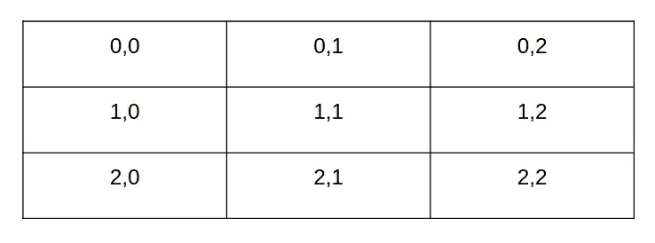
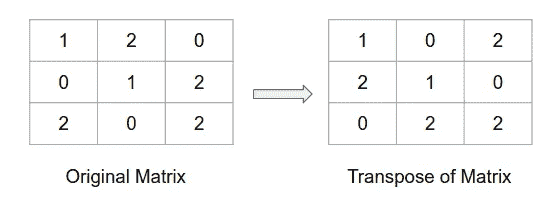
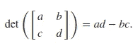
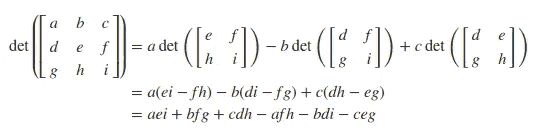
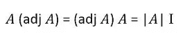
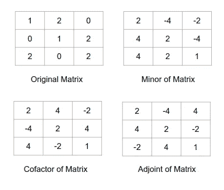
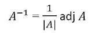
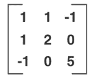
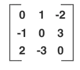

# 数据科学家线性代数基础及其实现

> 原文：<https://towardsdatascience.com/linear-algebra-essentials-for-data-scientist-along-with-implementation-5cfbece6d7ca?source=collection_archive---------27----------------------->

## 想学习线性代数吗？

## 了解数据科学家应该知道的线性代数概念及其实现


瑞安·斯通在 [Unsplash](https://unsplash.com?utm_source=medium&utm_medium=referral) 上的照片

我只想说，在任何技术领域，我们都可以采纳阿尔伯特·爱因斯坦的建议

> 如果不能简单的解释，说明你理解的不够好。

我认为，作为数据科学家，要达到那个水平，我们需要对数学有一个像样的理解，这导致了我们用来理解数据的所有模型和方法。虽然我们已经在[的这个](/5-probability-distribution-you-should-know-as-a-data-scientist-f8abc9522af0)博客中讨论了数据科学中涉及的概率概念，但我想把重点放在第二个支柱上，即线性代数。

如你所知，不管你用的是 pandas，NumPy，还是别的什么，我们的大部分数据都是以数据库的形式存在的，从这些数据中得出的统计推断都是以矩阵或数组(向量)的形式存储的。作为一种常见的做法，我们可能会从数据中计算出许多参数，但重要的是要了解背后的数学知识，以更好地理解其意义。所以让我们从线性代数的基础知识及其在 NumPy 中的实现开始。

# 矢量

用编程术语来说，向量就是简单的一维数组。所以大小为 n 的向量是同一时间的 n 个分量的列表。因为通常，我们在其中存储数字，我们可以将它们定义为一维数组以便于计算，也可以使用列表。

注意:对于所有进一步的代码片段，我们假设 NumPy 已经作为 np 导入(命令: *import numpy as np* )

```
***When we want to convert a defined list to an array
Syntax :*** *np.array(list)* ***Argument :*** *list : It takes 1-D list* **When we want to define an array with all elements as zero** **Syntax** : numpy.zeros(*shape*, *dtype=float*, *order='C'*)
**Arguments** : 
   shape : *int or tuple of ints* dtype : *data-type, optional* order : *{‘C’, ‘F’}, optional, default: ‘C’(row-major)***When we want to define an array with all elements as fill_value**
**Syntax** : numpy.full(*shape*, *fill_value*, *dtype=None*, *order='C'*)
**Arguments** : 
   shape : *int or tuple of ints
   fill_value : scalar or array_like* dtype : *data-type, optional* order : *{‘C’, ‘F’}, optional, default: ‘C’(row-major)***When we want to define an array with all elements as one** **Syntax** : numpy.ones(*shape*, *dtype=None*, *order='C'*)
**Arguments** : 
   shape : *int or tuple of ints* dtype : *data-type, optional* order : *{‘C’, ‘F’}, optional, default: ‘C’(row-major)*
```

这些是在 NumPy 中定义向量的基本方法，还有很多，但这些是最常用的。

按照惯例，我们将 vector 表示为一个列矩阵，因此它的维数为 *1* x *n.* (我们将在下一节中详细讨论这一点)

**向量的线性相关性**

这个概念会在很多地方派上用场，所以学习它对我们有好处。让我们取 *n* 个向量， *a₁，a₂，* …， *aₙ.*如果有 *n* 个标量 *b₁、b₂、…、bₙ* 使得其中一个标量不等于零而*b₁a₁*+*b₂a₂*+…+*bₙaₙ= 0，我们可以称这些 *n* 个向量线性相关。*如果只有当所有 bᵢ为零时才满足该等式，那么这些 *n* 向量是线性独立的。

# [数]矩阵

如果我说，蛇和梯子的董事会实际上只是一个有趣的矩阵，所以如果一个孩子可以玩那些，让我们不要害怕他们！矩阵是指数字的有序矩形排列，简单来说，它是一个充满数字的网格，或者是网格中每个单元中存在的相似实体。所以我们可以说向量只是维数为 *1* x *n* 或 *n* x *1* 的矩阵。一般来说，一个 *n* x *m* 矩阵是一个具有 *n* 行和 *m* 列的二维数组。所以我们可以像定义向量一样定义它，但是让我们用一个例子来看看两者的区别。

```
#vector of size 5, filled with zeros
>>> np.zeros(5)
array([ 0.,  0.,  0.,  0.,  0.])#matrix with dimension (2,3) filled with zeros
>>>np.zeros((2, 3))
array([[ 0.,  0.,  0.],
       [ 0.,  0.,  0.]])
```

更多了解 NumPy，查看[这里](https://numpy.org/doc/stable/reference/generated/numpy.zeros.html)。

为了访问矩阵的任何元素，我们使用唯一的索引来表示它们。nᵗʰ行和 mᵗʰ列交叉处的元素将有一个索引(n-1，m-1)。在一些文献中，索引也可以是(n，m)，但是我们将使用前一个，因为这是 Numpy 访问数组的方式。



3x3 矩阵的索引(图片由作者提供)

不同类型的矩阵:

*   方阵:具有相同的行数和列数，任何维数为 *n* x *n* 的矩阵
*   对角矩阵:它具有所有等于 0 的非对角元素，即，具有索引(I，j)使得 I 不等于 j 的所有元素具有零值。

> 注:索引为(I，I)形式的矩阵的所有元素都是该矩阵的对角元素

*   上三角矩阵:对角线以下所有元素都等于 0 的方阵。
*   下三角矩阵:对角线以上所有元素都等于 0 的方阵。
*   标量矩阵:所有对角元素等于一个标量 k 的正方形矩阵。
*   单位矩阵:所有对角元素等于 1，所有非对角元素等于 0 的方阵。这个矩阵通常表示为 *I.*
*   列矩阵:只有一列的矩阵。
*   行矩阵—只有一行的矩阵。

让我们深入一些关于矩阵的基本术语，我将在必要的地方使用它们的代码片段。

*   矩阵的阶=矩阵的行*列。尺寸为 *n* x *m* 的矩阵的阶数为 *mn* 。
*   矩阵的迹=方阵的所有对角元素之和。

```
>>>np.trace(np.ones(3,3))
3.0
```

*   矩阵的转置:将给定矩阵的所有行变成列，反之亦然。更简单地说，它是一个矩阵的翻转版本。



作者图片

```
>>> x = np.arange(4).reshape((2,2))
>>> x
array([[0, 1],
       [2, 3]])
>>> np.transpose(x)
array([[0, 2],
       [1, 3]])
```

*   方阵的行列式:它是一个标量值，依赖于那个方阵的元素。它是根据那个方阵的大小用不同的公式计算出来的。它被表示为|A|。



2x2 矩阵的行列式。作者图片



3x3 矩阵的行列式。作者图片

```
>>> a = np.array([[1, 2], [3, 4]])
>>> np.linalg.det(a)
-2.0 
Explanation: det = (4x1) - (3x2)
```

*   矩阵的标量乘法:当我们把一个标量乘到一个矩阵上时，每个矩阵元素都要乘以这个标量。

```
>>> np.array([1, 2, 3]) * 2
array([2, 4, 6])
```

*   矩阵相加:当我们将两个矩阵 *A* 和 *B、*相加时，所得矩阵的索引(I，j)上的元素的值等于 *A* 和 *B* 、 *Cᵢⱼ = Aᵢⱼ + Bᵢⱼ.中(I，j)处的元素的和*假设两个数组的维数相等，可以使用'+'运算符将它们相加。
*   矩阵乘法:矩阵乘法是以两个矩阵为输入，通过将第一个矩阵的行与第二个矩阵的列相乘，生成单个矩阵的运算。两个矩阵相乘的一个必要条件是第一个矩阵的列数应该等于第二个矩阵的行数。对于矩阵 *A，B，*和 *C:* ，需要记住一些事情

1.  这里，如果 A 的维数为(n，m)，那么 B 的维数为(m，p)
2.  如果 D = A×B，那么 D 的维数为(n，p)。d 的每个元素的公式是*dᵢⱼ*=*aᵢ₁**b₁ⱼ*+*aᵢ₂**b₂ⱼ*+…+*aᵢₘ**bₘⱼ*
3.  A x B ≠B x A(矩阵乘法本质上不是可计算的)
4.  如果 A x B 是可能的，并不意味着 B x A 是可能的。
5.  A x (B x C) = (A x B) x C(矩阵乘法本质上是结合律)
6.  A x (B +C) = (A x B) + (A x C)(矩阵乘法本质上是分配的)
7.  A x I = A 且 I x A = A(其中 I 是维数适当的单位矩阵)

```
**>>>** a = np.array([[1, 0],
**... **              [0, 1]])
**>>>** b = np.array([[4, 1],
**... **              [2, 2]])
**>>>** np.matmul(a, b)
array([[4, 1],
       [2, 2]])
```

*   minor:minor 是从某个较大的方阵中删除一行一列而形成的方阵的行列式。对应于索引(I，j)的 Minor 将是我们删除 iₜₕ行和 jₜₕ列后得到的矩阵的行列式。
*   余因子:余因子可以通过将次因子乘以位置的符号来导出。所以对于指数(I，j)，Cᵢⱼ = (−1)ⁱ⁺ʲ Mᵢⱼ
*   伴随:伴随只是余因子矩阵的转置。我们把它表示为。 *adj A* 的一个重要性质是



作者图片

让我们看一个最后三个属性的例子



上述计算的例子。作者图片

*   一个矩阵的逆:设矩阵 *A* 的逆是矩阵 *B.* 这暗示着 *A* x *B = I.* 我们也可以把这个表示为*a*x*A⁻=a⁻*x*a = I，*其中 a⁻是 a 的逆

```
>>> a = np.array([[1, 2], [3, 4]])
>>> np.linalg.inv(a)
array([[-2\.   1\. ]                                                                  
       [ 1.5 -0.5]])
```

下面是一个公式，通过它我们可以计算矩阵的逆矩阵，它来自于我们在上面看到的 *adj A.* 的属性



作者图片

注意:因为这里|A|在分母中，它告诉我们矩阵的逆矩阵要存在，那个矩阵的行列式不能等于零。

# 特征值和特征向量

这个概念为 ML 的许多算法提供了许多直觉，所以我请求你深入理解它。矩阵 A 对应的特征值是满足矩阵特征方程的标量值。

1.  **Ax = λx，** x 是矢量
2.  **| A — λI | = 0，** I 为单位矩阵。

求解方程 2 给出了 A 的特征值，当我们替换方程 1 中的每一个值时，我们得到了向量 x 的不同值，这就是所谓的特征向量。

```
import numpy as np
from numpy import linalg input = np.array([[1,0,0],[0,2,0],[0,0,3]])x, y= linalg.eig(input)
print(x) #eigenvalues
#array([1., 2., 3.])print(y) #eigenvectors
#array([[1., 0., 0.],
#       [0., 1., 0.],
#       [0., 0., 1.]])
```

有许多与特征向量和特征值相对应的复杂概念，尤其涉及每个值和向量是否是唯一的和线性相关的。我们在这里不一一介绍，但让我们来看一个重要的概念。

# 可诊断性

一个 n×n 矩阵 A 可以对角化，如果它可以写成

P⁻

这里 D 是一个对角的 n×n 矩阵，A 的特征值作为它的元素，P 是一个非奇异的 n×n 矩阵，由对应于 D 中特征值的特征向量组成。

对角化定理表明一个 n×n 矩阵 A 是可对角化的当且仅当 A 有 n 个线性无关的特征向量。使用 numpy，我们可以找到特征向量，并检查它们是否线性无关。在上一节中，我已经提到了这些概念何时在 ML 中发挥作用。

# **一些特殊类型的矩阵**

让我们看看线性代数中常见的一些特殊类型的矩阵

**奇异矩阵**

矩阵 *A* 是奇异矩阵，如果它的行列式等于零。

**|A| = 0**

如前所述，奇异矩阵的逆矩阵是不存在的。

**对称矩阵**

如果 ***A = Aᵗ*** ，则矩阵 a 对称。这意味着对于每个 I，j，aᵢⱼ = aⱼᵢ，其中 aᵢⱼ是矩阵 a 在索引(I，j)处的元素。



作者图片

**反对称矩阵**

如果 ***A = -Aᵗ*** ，则矩阵 a 是反对称的。这意味着对于每个 I，j，aᵢⱼ = -aⱼᵢ，其中 aᵢⱼ是矩阵 a 在索引(I，j)处的元素。这意味着对角线元素都是零。



作者图片

**正交矩阵**

矩阵 *A* 是正交矩阵如果**t29】aaᵗ= I .**正交矩阵的行列式不是+1 就是-1。正交矩阵的所有特征值不是+1 就是-1。

**幂等矩阵**

若 ***A = A，则称矩阵 A 为幂等矩阵。幂等矩阵的行列式不是 0 就是 1。一个幂等矩阵的所有特征值不是 0 就是 1。***

**幂零矩阵**

若 ***Aᵐ = 0*** ，则称矩阵 a 为幂零矩阵，其中 m 为正整数。

**对合矩阵**

如果 ***A = I.*** ，则称矩阵 A 为对合矩阵

# 机器学习中的线性代数

前面我提到过线性代数有助于你更好地理解机器学习和深度学习的概念。由于我们已经讨论了许多概念，我想指出几个概念/主题，在这些概念/主题中，您会看到线性代数的直接应用。

*   数据集—数据借助于矩阵来表示
*   线性回归-这个问题使用矩阵分解方法解决。
*   主成分分析——这个问题也使用了矩阵分解法和特征向量概念。
*   反向传播——这是基于矩阵乘法

以上列表并不详尽。我有很多其他的话题可以添加到这个列表中。但是，这是向你展示线性代数的重要性。

# 结论

现在，请花一点时间祝贺自己坚持到了最后。我希望这篇文章能为你提供足够的线性代数信息。要了解有关数据科学不同主题的更多信息，请关注我们的 [medium](https://medium.com/@AnveeNaik) 。

*成为* [*介质会员*](https://medium.com/@AnveeNaik/membership) *解锁并阅读介质上的许多其他故事。*