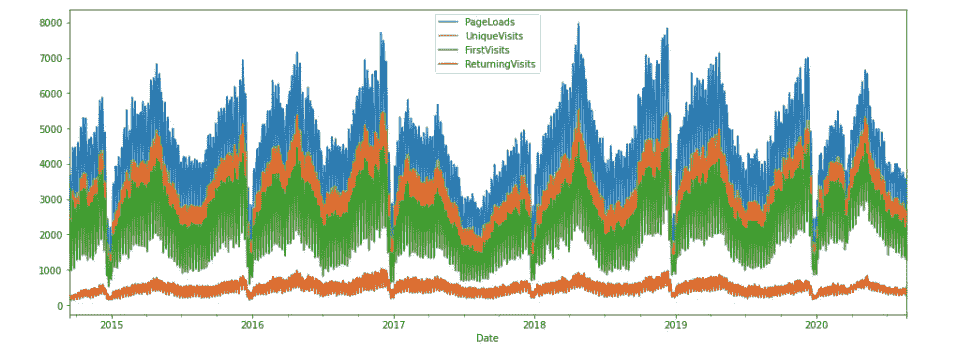
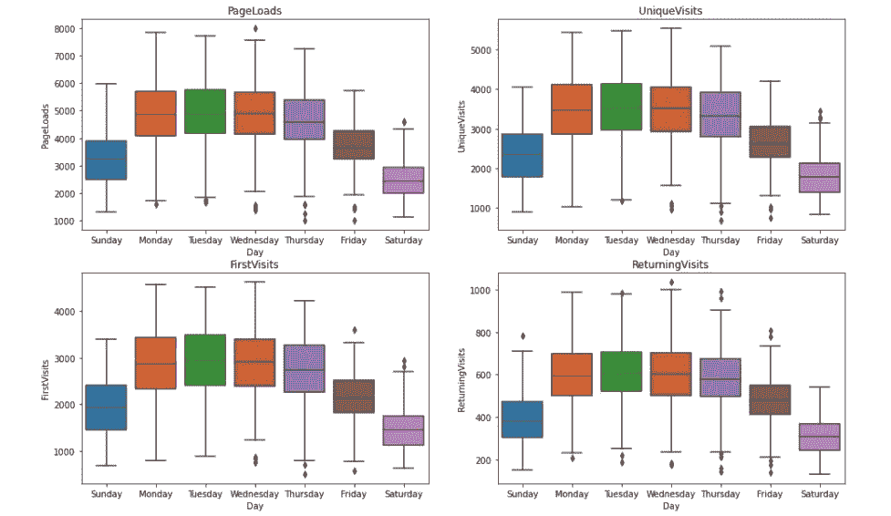
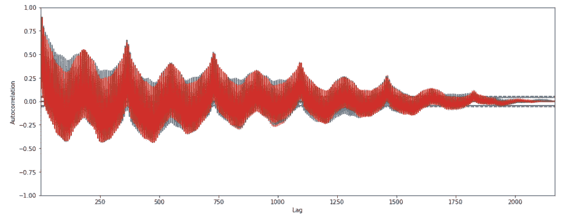
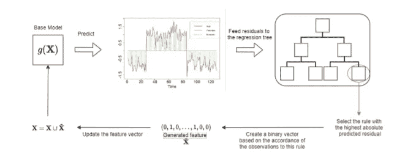
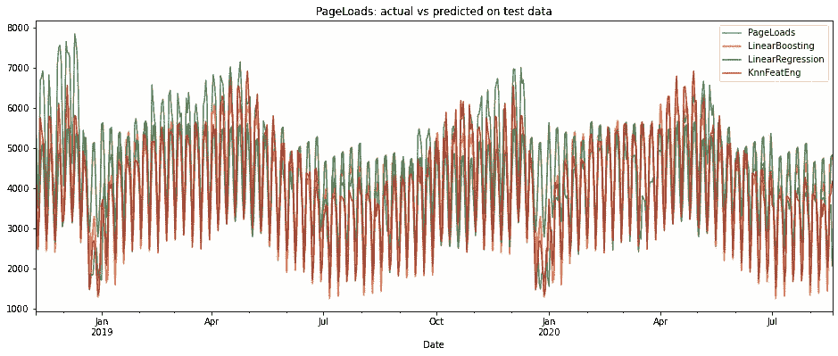
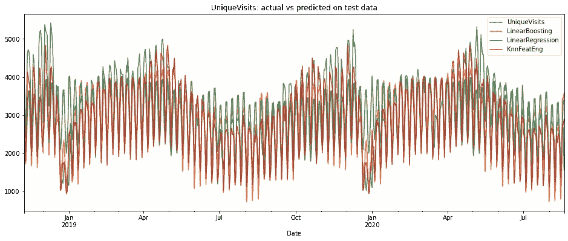
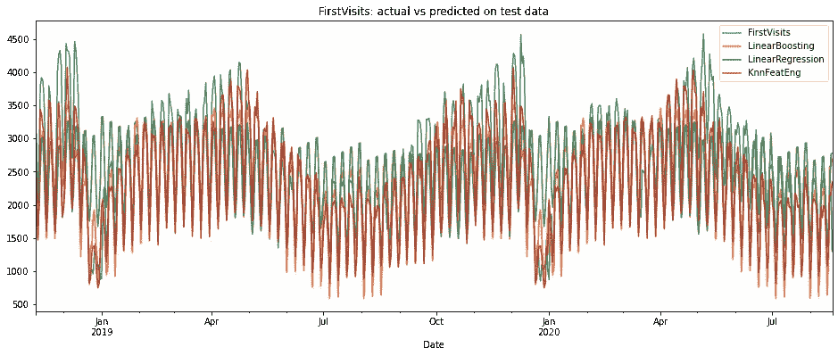
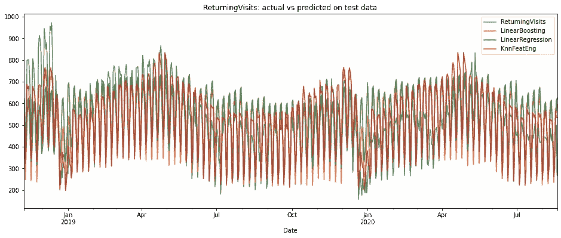
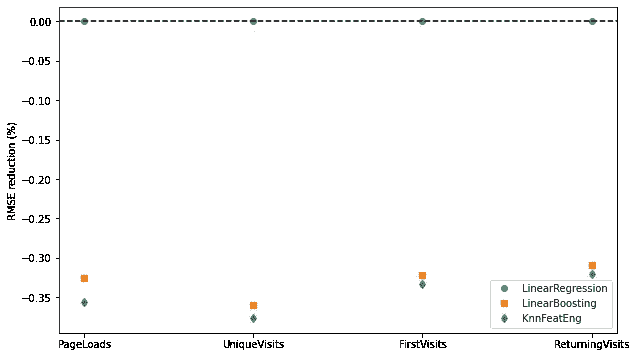

# 具有自动化特征工程的线性升压

> 原文：<https://towardsdatascience.com/linear-boosting-with-automated-features-engineering-894962c3ba84?source=collection_archive---------26----------------------->

## 建立线性模型不仅学习线性关系

弗兰基·洛佩兹在 [Unsplash](https://unsplash.com?utm_source=medium&utm_medium=referral) 上的照片

特征工程是每个机器学习管道的一个非常迷人的活动。**与其他任务相比，比如特征选择和参数调整，特征工程需要简单的领域知识和真正的创造力。**创建新的预测器时没有固定的规则。我们只需注意不引入泄漏，即纳入未来行为或不可访问的目标信息，以不扭曲结果。

最好的特性通常是在数据探索之后手工生成的，随后是业务理解。这些特性使得特征工程过程难以完全自动化。**在人工智能行业，实际趋势是自动构建机器学习管道，自动特征工程有适得其反的风险。**自动化可能会产生冗余，在建模的第一阶段产生无用的默认特征。这可能导致流水线执行时间的增加和次优性能。**最好是以自动化的方式，只生成对模型有用的特征，并帮助提供最佳结果。**

在这篇文章中，我们在自动化特征工程过程的顶部用一个简单的线性模型进行预测。整个程序基于[这部作品](https://arxiv.org/pdf/2009.09110.pdf)，它介绍了一个简单的 boosting 算法，该算法基于线性模型残差的递归特征生成。我们将这种算法称为**线性提升**，因为它具有迭代性质，并且使用线性模型作为基础学习器。该实现可以在 [**线性树**](https://github.com/cerlymarco/linear-tree) 包中以 sklearn 基本估计器的形式访问。 **linear-tree** 是一个 python 库，它提供了适应线性模型的估计器，以学习更复杂的数据关系，而不是简单的线性关系。

# 数据

我们从 T21 收集了一些数据。该数据集包含五年来各种类型的每日网站访问者:页面加载、独特访问、首次访问、回访。

网站日访问量(图片由作者提供)

除了我们可以使用时间戳信息构建的预测器之外，没有其他预测器可用。我们必须预测未来的访问 KPI，而不是使用自回归方法。我们所掌握的时间序列具有复杂的季节性模式。从每天开始:

网站每日访客模式(图片由作者提供)

长期复杂的模式被证实绘制自相关。

目标的自相关性(图片由作者提供)

# 建模

线性推进是一种两阶段学习算法。由于其提升方法，它与众所周知的基于树的梯度提升有相似之处。残差有助于构建在下一次迭代中使用的新要素，而不是反复对残差建模来改进模型预测。

更详细地说，作为第一步，线性模型适用于所有待处理的数据。下一步是拟合一个简单的决策树，使用相同的特征对前一阶段的残差进行建模。该树识别导致最高误差的路径(即最差的叶子)。对误差贡献最大的叶子被用于生成将在第一步中使用的新的二元特征。迭代继续进行，直到满足某个停止标准，即计算出预定义的迭代次数。

提出的线性推进算法的可视化表示(来源:[https://arxiv.org/pdf/2009.09110.pdf](https://arxiv.org/pdf/2009.09110.pdf)

对于我们的预测任务，我们对不同的方法进行了基准测试。我们比较了简单线性回归、线性增强、仅用于特征提取的由线性增强形成的流水线以及 k-最近邻回归量的性能。所有分析过的建模策略都使用训练集上的交叉验证进行了适当的调整。

对比测试预测(图片由作者提供)

对比测试预测(图片由作者提供)

对比测试预测(图片由作者提供)

对比测试预测(图片由作者提供)

线性提升和 k 近邻的组合似乎是有益的。简单的线性模型不适合考虑数据中复杂的季节模式。单独使用线性增强就能取得很好的效果，但最好的效果来自于我们将线性增强与外部预测模型一起用于特征生成。这证明了这种推进过程学习比简单线性关系更复杂的关系的能力。

以线性回归测试误差的百分比偏差表示的性能改进。最低最好(图片由作者提供)

# 摘要

在这篇文章中，我们执行了一项预测任务，利用自动化的方法来创建特征。所提出的程序允许利用所选择的预测模型的优点来实现特征工程的自动化。它还能够学习复杂的数据模式，超越简单的线性关系，没有特别的限制。它还使用不同于线性模型的最终预测模型，在每个管道中提供了很大的适应性。

[**查看我的 GITHUB 回购**](https://github.com/cerlymarco/MEDIUM_NoteBook)

保持联系: [Linkedin](https://www.linkedin.com/in/marco-cerliani-b0bba714b/)