# 线性判别分析

> 原文：<https://towardsdatascience.com/linear-discriminant-analysis-1894bbf04359?source=collection_archive---------21----------------------->

## 线性鉴别分析(LDA)理论和 Python 实现简介

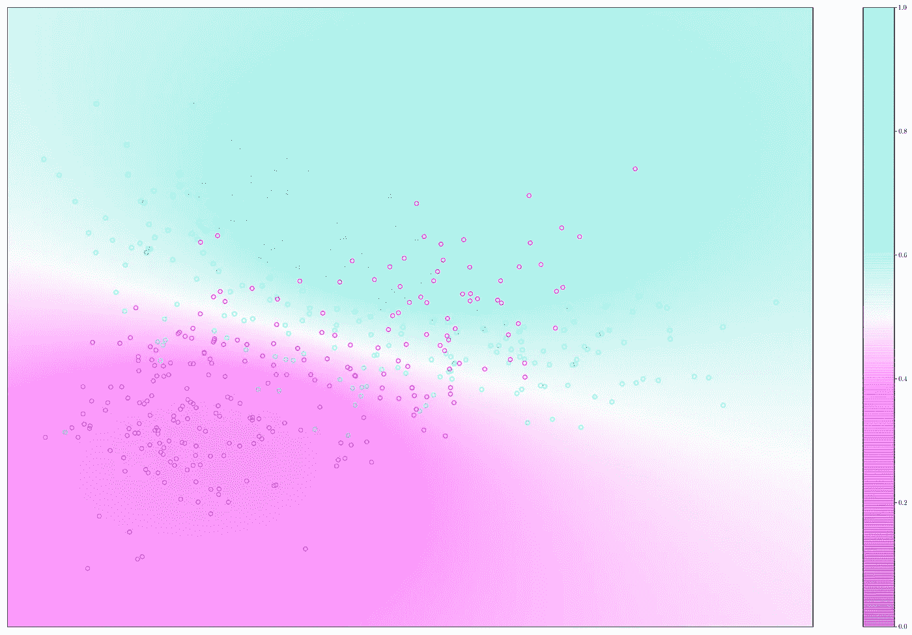

线性判别分析模型中决策边界的图示。图片作者。

# 内容

这篇文章是我将要发表的一系列文章的一部分。你可以通过点击[这里](https://cookieblues.github.io/guides/2021/04/01/bsmalea-notes-3b/)在我的个人博客上阅读这篇文章的更详细版本。下面你可以看到该系列的概述。

## 1.机器学习导论

*   [(一)什么是机器学习？](/what-is-machine-learning-91040db474f9)
*   [(b)机器学习中的模型选择](/model-selection-in-machine-learning-813fe2e63ec6)
*   [(c)维度的诅咒](/the-curse-of-dimensionality-5673118fe6d2)
*   [(d)什么是贝叶斯推理？](/what-is-bayesian-inference-4eda9f9e20a6)

## 2.回归

*   [(a)线性回归的实际工作原理](/how-linear-regression-actually-works-theory-and-implementation-8d8dcae3222c)
*   [(b)如何使用基函数和正则化改进您的线性回归](/how-to-improve-your-linear-regression-with-basis-functions-and-regularization-8a6fcebdc11c)

## 3.分类

*   [(a)分类器概述](/overview-of-classifiers-d0a0d3eecfd1)
*   [(b)二次判别分析(QDA)](/quadratic-discriminant-analysis-ae55d8a8148a)
*   **(c)线性判别分析**
*   [(d)(高斯)朴素贝叶斯](/gaussian-naive-bayes-4d2895d139a)

# 设置和目标

在[之前的帖子](/quadratic-discriminant-analysis-ae55d8a8148a)中，我们复习了二次判别分析(QDA)。对于线性判别分析(LDA)来说，很多理论是相同的，我们将在这篇文章中讨论。

线性鉴别分析(LDA)和二次鉴别分析(QDA)之间的唯一区别在于 **LDA 没有特定于类别的协方差矩阵，而是在类别之间有一个共享的协方差矩阵**。

再次强调，需要注意的是，LDA 属于一类叫做**高斯判别分析(GDA)** 模型的模型。这些是*生成型*模型(不是*区别型*模型),尽管它们的名字如此。

给定 N 个输入变量 **x** 以及相应目标变量 *t* 的训练数据集，LDA 假设**类条件密度**是正态分布的

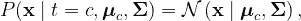

其中 ***μ*** 是**类特定均值向量**，而**σ**是**共享协方差矩阵**。利用贝叶斯定理，我们现在可以计算后验概率

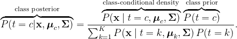

然后我们将把 **x** 分类

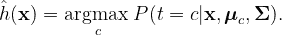

# 衍生和培训

我们用与 QDA 相同的方法导出对数似然。可以在[上一篇](/quadratic-discriminant-analysis-ae55d8a8148a)中找到推导。我们得到的对数可能性是

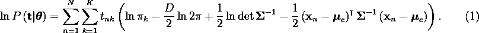

查看(9)，我们可以看到，QDA 和 LDA 之间的类特定先验和均值没有差异。我们在上一篇文章中推导出了它们

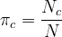

和

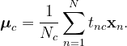

然而，共享协方差矩阵明显不同——对共享协方差矩阵求(1)的导数，并将其设置为 0，得到

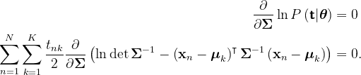

使用与上一篇文章相同的矩阵微积分性质，我们可以计算导数。你可以在我的个人博客[这里](https://cookieblues.github.io/guides/2021/04/01/bsmalea-notes-3b/)找到我更详细的帖子。我们得到了

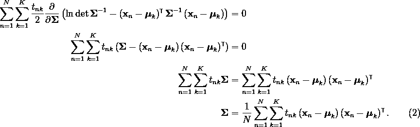

我们发现**共享协方差矩阵就是所有输入变量的协方差**。因此，我们可以使用以下内容进行分类

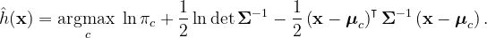

# Python 实现

下面的代码是我们刚刚讨论过的 LDA 的简单实现。

下面是一个图表，其中包含数据点(颜色编码以匹配其各自的类别)、我们的 LDA 模型找到的类别分布，以及由各自的类别分布生成的决策边界。

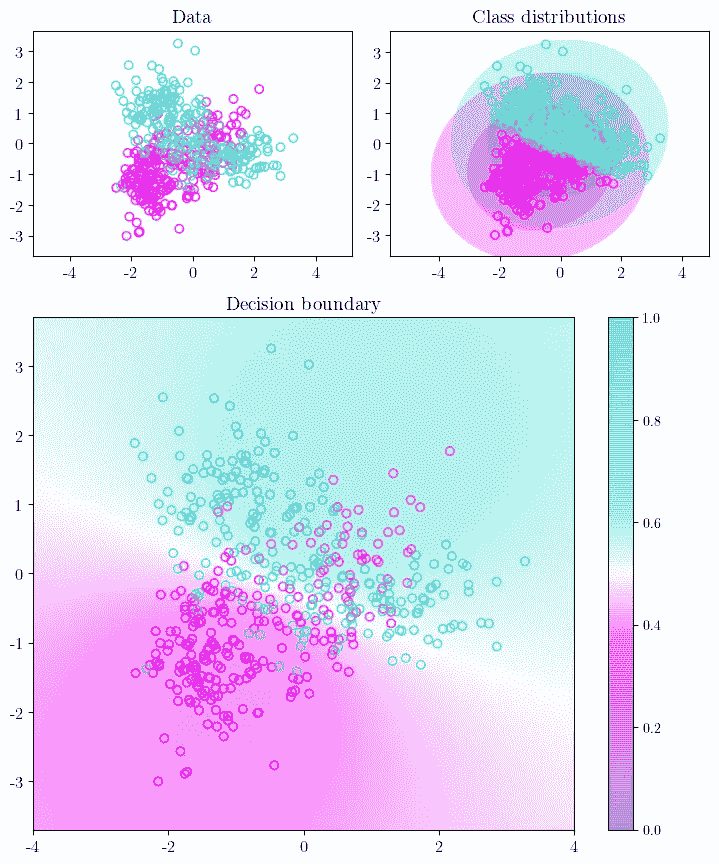

数据点的图表，其各自的类别用颜色编码，由我们的 LDA 模型发现的类别分布，以及从类别分布得到的决策边界。图片作者。

正如我们所看到的，LDA 具有更严格的决策边界，因为它要求类分布具有相同的协方差矩阵。

# 摘要

*   线性**判别**分析(LDA)是一个**生成式**模型。
*   LDA 假设**每个类都遵循高斯分布**。
*   QDA 和 LDA 之间的唯一区别是 **LDA 为类假设一个共享协方差矩阵，而不是特定于类的协方差矩阵**。
*   **共享协方差矩阵**就是所有输入变量的**协方差。**