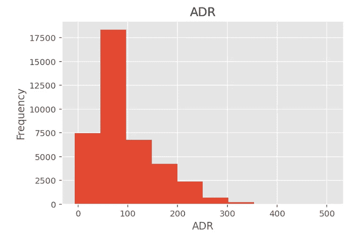
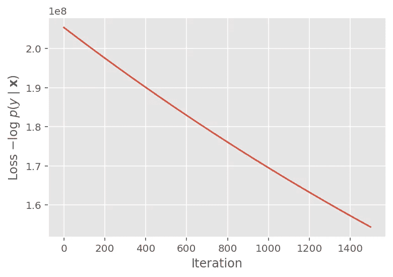
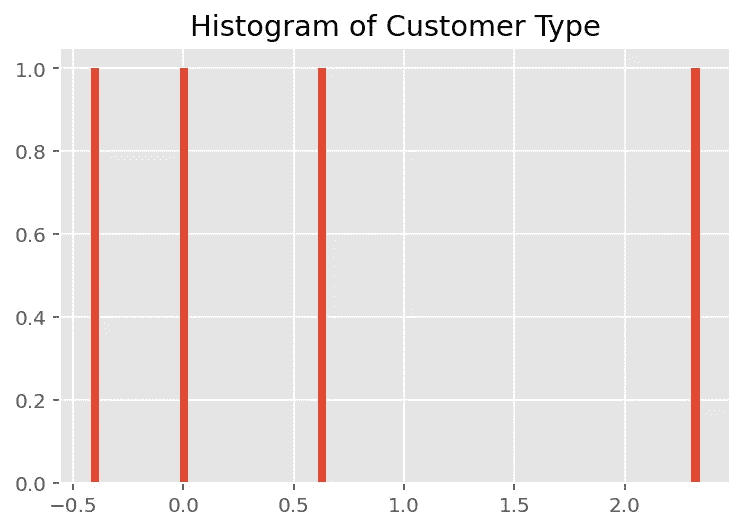
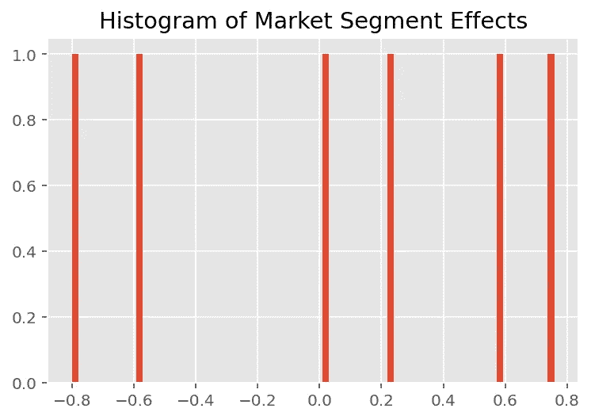
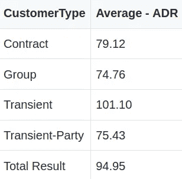
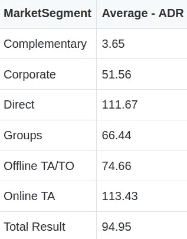

# 具有张量流概率的线性混合效应模拟

> 原文：<https://towardsdatascience.com/linear-mixed-effect-modelling-with-tensorflow-probability-d7e084d947aa?source=collection_archive---------32----------------------->

## 用张量流概率分析酒店顾客群


来源:图片来自 [Pixabay](https://pixabay.com/photos/reception-woman-secretary-2507752/)

对任何企业来说，客户细分都是一个重要的考虑因素。

虽然孤立地看待销售数据可能很诱人，但这样做可能会忽略一个事实，即不同的客户群有不同的消费模式，这意味着不同群体的销售数据可能会有很大差异。

在这方面，使用标准线性回归来量化不同功能对销售的影响可能会产生误导，因为不同的群体可以**存在于以不同方式影响销售的每个功能**中。因此，需要一种机制来以适当的方式对结构化的线性关系进行建模。

为此，将采用张量流概率，使用**联合分布协同程序**和**马尔可夫链蒙特卡罗**模块。以下分析摘自线性混合效应模型模板，可从[张量流概率指南](https://www.tensorflow.org/probability/examples/Linear_Mixed_Effects_Models)获得。

Antonio 等人的原始酒店预订数据集和研究可以在这里找到:[酒店预订需求数据集(2019)](https://www.sciencedirect.com/science/article/pii/S2352340918315191) 。

# 我们的例子

在本例中，线性混合效应模型用于分析不同客户群对酒店销售数据的影响(通过 ADR 或客户的平均日消费率衡量)。

在考虑对 ADR 的影响时，**客户类型**和**分销渠道**被视为分析中的两个独立特征。数据集内有更多的分类变量可以考虑，但为了简单起见，只考虑这两个。

*   客户类型表示客户是**合同**、**集团**还是**临时**。
*   分销渠道由不同的客户来源组成，包括**公司**、**直接**、 **TA/TO** 等。

与任何贝叶斯模型一样，假设是关于先验的。在这种情况下，我们将假设 ADR 是正态分布的。

当查看数据时(如果我们之前的假设是正态的，我们就不会这样做)，我们可以看到数据是正偏的，夏皮罗-维尔克检验的 p 值小于 0.05，这意味着正态性的零假设在 5%的水平被拒绝。



来源:Jupyter 笔记本输出

```
>>> from scipy import stats # positively skewed
>>> shapiro_test = stats.shapiro(data['ADR'])
>>> shapiro_testShapiroResult(statistic=0.8921953439712524, pvalue=0.0)
```

尽管如此，仍维持正常假设，期望后验分布将根据似然函数(或观察数据)调整到正确的形状。

# 线性混合效应建模

使用*类别代码*重新映射适当的类别，如下所示:

```
data['CustomerType'] = data['CustomerType'].astype('category').cat.codesdata['MarketSegment'] = data['MarketSegment'].astype('category').cat.codes
```

该模型总结如下:

```
adr ~ IsCanceled + (1|CustomerType) + (1|MarketSegment) + 1
```

其中`x`代表固定效应，`(1|x)`代表`x`的随机效应，`1`代表截距项。

请注意，IsCanceled(客户是否取消他们的酒店预订)是固定的，因为该特性只能取 0 到 1 之间的值。

使用 LinearMixedEffectModel 类，可以优化固定和随机效果。例如，使用 tfd 来模拟随机效应。JointDistributionSequential，每个要素都被建模为多元正态分布:

```
def __call__(self, features):
    model = tfd.JointDistributionSequential([
      # Set up random effects.
      tfd.MultivariateNormalDiag(
          loc=tf.zeros(cus_type),
          scale_identity_multiplier=self._stddev_CustomerType),
      tfd.MultivariateNormalDiag(
          loc=tf.zeros(mrkt_sgmt),
          scale_identity_multiplier=self._stddev_MarketSegment),
```

然后，观察数据的可能性可以建模如下:

```
lambda effect_CustomerType, effect_MarketSegment: tfd.Independent(
          tfd.Normal(
              loc=(self._effect_IsCanceled * features["IsCanceled"] +
                  tf.gather(effect_CustomerType, features["CustomerType"], axis=-1) +
                  tf.gather(effect_MarketSegment, features["MarketSegment"], axis=-1) +
                  self._intercept),
              scale=1.),
              reinterpreted_batch_ndims=1)lmm_jointdist = LinearMixedEffectModel()
# Conditioned on feature/predictors from the training data
lmm_train = lmm_jointdist(features_train)
```

运行线性混合效应模型的目的是单独评估每个随机效应对 ADR 的影响，特别是隔离固定效应对 ADR 的影响。

为此，蒙特卡洛 EM 用于最大化**边际密度**，其中[边际概率](https://machinelearningmastery.com/joint-marginal-and-conditional-probability-for-machine-learning/)意味着计算一个事件的概率时不考虑其他变量。这将允许我们量化**客户类型**对 ADR 的影响，同时丢弃其他变量的影响，例如**细分市场**。

按照蒙特卡洛 EM 的名称，这是通过首先初始化 E 步骤，然后初始化 M 步骤来完成的。

**E-Step** 指的是汉密尔顿蒙特卡罗，它采用细分市场和客户类型影响的当前状态，并计算新状态。对于新状态，我们基本上是指可用于预测未来值的更新后验样本，即使用似然函数更新后验分布，以更好地预测 ADR。

**M-Step** 然后使用更新后的后验样本计算边际可能性的更新无偏估计值——同样，边际是指一个变量的影响，而不考虑其他变量的影响。

使用 TensorFlow Probability 提供的代码模板，调用如下:

```
# Set up E-step (MCMC).
hmc = tfp.mcmc.HamiltonianMonteCarlo(
    target_log_prob_fn=target_log_prob_fn,
    step_size=0.015,
    num_leapfrog_steps=3)
kernel_results = hmc.bootstrap_results(current_state)[@tf](http://twitter.com/tf).function(autograph=False, experimental_compile=True)
def one_e_step(current_state, kernel_results):
  next_state, next_kernel_results = hmc.one_step(
      current_state=current_state,
      previous_kernel_results=kernel_results)
  return next_state, next_kernel_resultsoptimizer = tf.optimizers.Adam(learning_rate=.01)# Set up M-step (gradient descent).
[@tf](http://twitter.com/tf).function(autograph=False, experimental_compile=True)
def one_m_step(current_state):
  with tf.GradientTape() as tape:
    loss = -target_log_prob_fn(*current_state)
  grads = tape.gradient(loss, trainable_variables)
  optimizer.apply_gradients(zip(grads, trainable_variables))
  return loss
```

对于本例，生成的损失曲线如下:



来源:Jupyter 笔记本输出

生成损失曲线后，更新后的后验预测分布可计算如下:

```
(*posterior_conditionals, ratings_posterior), _ = lmm_test.sample_distributions(
    value=(
        effect_cus_type_mean,
        effect_mrkt_sgmt_mean,
))ratings_prediction = ratings_posterior.mean()
```

# 分析和解释

既然后验预测分布已经计算出来，现在就有可能分析每个特征对因变量的个别影响。

以下是为客户类型和市场细分生成的直方图:

## **客户类型**



来源:Jupyter 笔记本输出

## **细分市场**



来源:Jupyter 笔记本输出

从上面的直方图中，我们可以看到，客户类型比细分市场更偏向于正态分布。

在分析数据时，这与我们的预期相符。

我们先简化一下这个分析，看看一些老式的数据透视表。



来源:GitHub Gist

当查看不同客户类型的平均 ADR 时，我们发现 Transient 明显高于其他组。

诚然，总体而言，数据集中的短期客户数量高于其他细分市场——[短期](https://www.xotels.com/en/glossary/transient/)指需要短期停留的客户，这些客户通常包括最后一刻预订和未经预约的客人。

因此，酒店可能希望决定是否将更多精力放在这个细分市场上，或者其他细分市场的较低收入是否被这些客户相对较长的停留时间所抵消，从而导致更高的总体 ADR。

与细分市场形成对比。



来源:GitHub Gist

当分析不同细分市场的平均 ADR 时，直接预订的客户和通过在线旅行社预订的客户之间的 ADR 几乎没有区别。

在这方面，很少有证据表明重新聚焦酒店的目标市场一定会导致更高的总体 ADR。

# 结论

在本文中，您已经看到:

*   为什么线性混合效应建模在分析客户细分数据时很重要
*   张量流概率如何用于建立线性混合效应模型
*   使用蒙特卡罗 EM 生成后验预测分布
*   结果的解释和不同特征对因变量影响的隔离

非常感谢您的宝贵时间，非常感谢您的任何问题或反馈。你可以在[michael-grogan.com](https://www.michael-grogan.com/)找到更多我的数据科学内容。

*免责声明:本文是在“原样”的基础上编写的，没有任何担保。它旨在提供数据科学概念的概述，不应被解释为专业建议。本文中的发现和解释仅是作者的，不支持或隶属于本文中提到的任何第三方。*

# 参考

*   [安东尼奥等人。al (2019):酒店预订需求数据集](https://www.sciencedirect.com/science/article/pii/S2352340918315191)
*   [GitHub 资源库:MGCodesandStats/hotel-modeling](https://github.com/MGCodesandStats/hotel-modelling)
*   [机器学习掌握:联合概率、边际概率和条件概率的温和介绍](https://machinelearningmastery.com/joint-marginal-and-conditional-probability-for-machine-learning/)
*   [张量流概率:线性混合效应模型](https://www.tensorflow.org/probability/examples/Linear_Mixed_Effects_Models)
*   [xotels.com:瞬态](https://www.xotels.com/en/glossary/transient/)