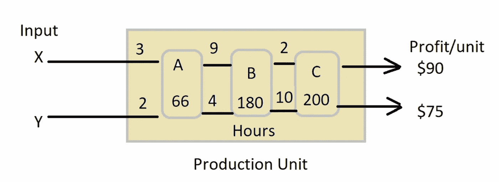
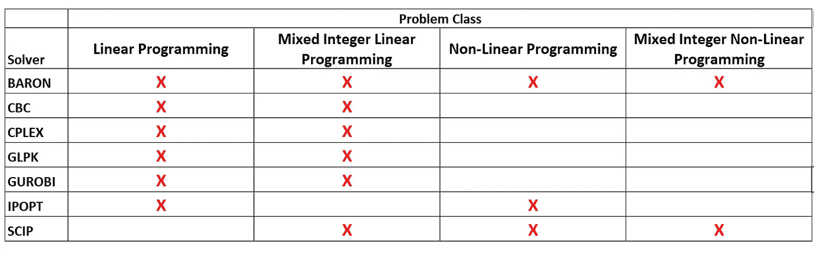
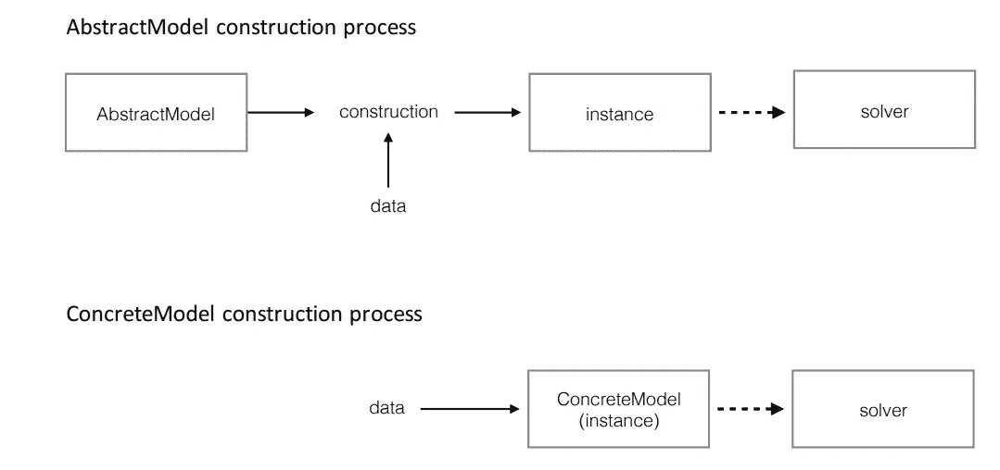
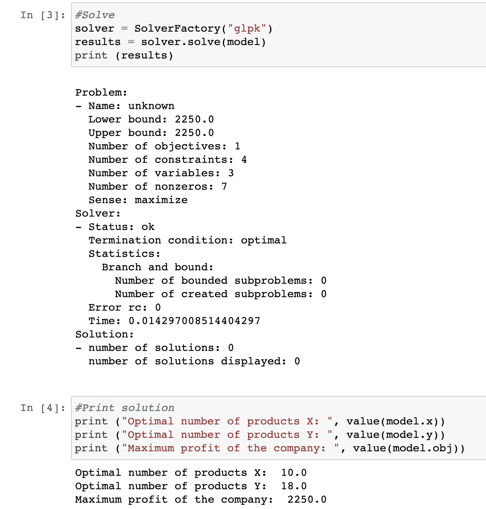
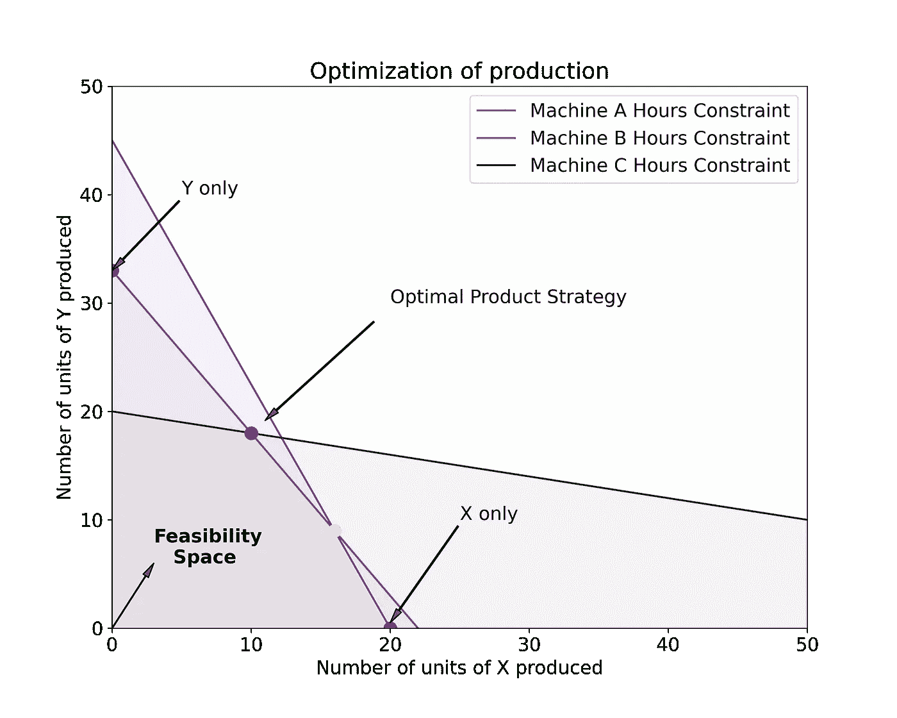
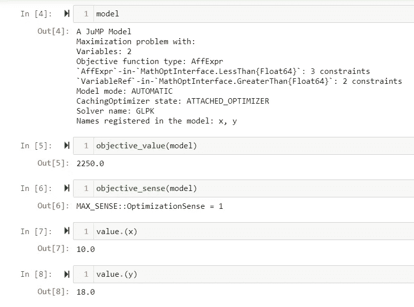
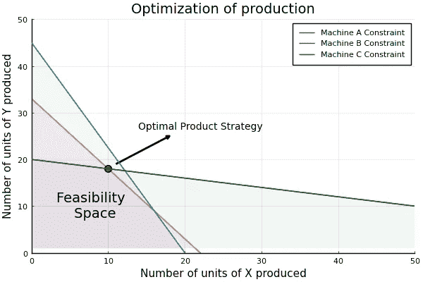

# 用 Python 和 Julia 进行线性编程

> 原文：<https://towardsdatascience.com/linear-programming-with-python-and-julia-be9e045a5d17?source=collection_archive---------4----------------------->

## "真正的优化是现代研究对决策过程的革命性贡献."乔治·丹齐格

五年前，当我在机械工程本科学习期间参加**运筹学(OR)** 课程时，我就对最优化的概念产生了兴趣。这门课程吸引我的主要原因是它涉及解决现实世界的问题，如优化工厂的工作流程、供应链管理、机场航班调度、旅行推销员问题等。**运筹学**研究如何通过使用不同的数学技术或算法有效地做出决策。在现实世界中，这可能意味着在满足成本、时间和资源分配等约束的同时，最大化(利润、收益)或最小化(损失、风险)给定表达式。

它在能源系统优化、供应链管理、物流和库存管理、路由和寻路问题等领域有着广泛的应用。[1].当我还是一名本科生时，用手和计算器手动解决 OR 课程中的优化问题是一项令人生畏的任务。一个步骤中的人为错误意味着接下来的所有步骤都是错误的，必须从头开始重做整个过程。由于编程技术的进步，现在有了开源工具，如 Google [或-Tools](https://developers.google.com/optimization) ，以及 Python 和 Julia 中的不同包，这有助于在几秒钟内解决优化问题。人们只需要在给定的包可以理解的框架内定义问题。


图片来自 [Unsplash](https://unsplash.com/) 的[克里斯·罗尔斯顿](https://unsplash.com/@thisisralston)

除了 Google OR-Tools 之外，一些可用于解决 Python 优化问题的开源包有 [scipy.optimize](https://docs.scipy.org/doc/scipy/reference/optimize.html) 、 [PuLP](https://coin-or.github.io/pulp/) 和 [Pyomo](http://www.pyomo.org/) 。在 Julia 中，有一个类似的包嵌入在语言中，叫做 [JuMP](https://jump.dev/JuMP.jl/stable/) 。在这篇文章中，我将首先使用 Python 中的 Pyomo 包解决一个简单的线性优化问题，然后使用 JuMP 在 Julia 中复制它，并分享我的经验。这篇文章中使用的代码可以在这个 [GitHub 资源库](https://github.com/hbshrestha/Optimization)中找到。让我们开始吧:

**问题陈述**

在这篇文章中，我考虑了一个基于不同机器上的产品加工时间、机器的可用性和每件产品的单位利润来确定工厂中最优产品组合的问题。

*一家公司生产两种产品:X 和 Y。要生产每种产品，它必须经过三台机器:A、B 和 C。生产 X 需要在机器 A 中工作 3 小时，在机器 B 中工作 9 小时，在机器 C 中工作 2 小时。同样，生产 Y 需要在机器 A、B 和 C 中分别工作 2、4 和 10 小时。在制造期间，机器 A、B 和 C 的可用时间分别为 66、180 和 200 小时。每件产品 X 的利润是 90 美元，每件产品 Y 的利润是 75 美元。在一个生产周期内应该生产多少单位的 X 和 Y 才能使利润最大化？*



作者对问题的描述

假设 *x* 和 *y* 分别为要生产的 X 和 Y 的单位， *x* 和 *y* 为我们的决策变量。该问题可以用代数形式表示如下:

```
Profit = 90x+75yObjective: maximize 90x+75y subject to:3x+2y≤669x+4y≤1802x+10y≤200x, y≥0
```

**解算器**

求解器嵌入强大的算法来解决优化问题，并帮助在满足给定目标的约束条件下，围绕资源的规划、分配和调度改进决策。基于问题类别，需要选择合适的求解器来解决优化问题。下表显示了一些同时具有 Python 和 Julia 包装器的解算器的示例。



最优化问题的种类-求解器。作者编译自[真实 Python](https://realpython.com/linear-programming-python/) 和[跳转文档](https://jump.dev/JuMP.jl/stable/installation/#Installing-a-solver)

需要注意的是，并不是所有的解算器都是开放的。例如， [IPOPT](https://coin-or.github.io/Ipopt/) 和 [GLPK](https://www.gnu.org/software/glpk/) 是开放访问解算器，而 [CPLEX](https://www.ibm.com/analytics/cplex-optimizer) 和 [GUROBI](https://www.gurobi.com/) 需要商业许可。

本文中使用的问题是线性规划的一个例子，因为目标和约束都是线性的。在这种情况下，我们可以使用 GLPK 或 IPOPT 的开放存取解决方案来解决问题。如果问题是非线性的(例如带有二次约束)，那么在这种情况下只有 IPOPT 求解器是可用的，而不是基于问题类的 GLPK。

**使用 Pyomo 包在 Python 中求解**

有了一些使用 Pyomo 包的基本实践经验，我发现在 Python 中使用这个包非常直观。Pyomo 允许两种声明模型的策略。当使用依赖于未指定参数值的符号(如`ax+by=c`)定义数学模型时，它被称为抽象模型。通过抽象模型传递数据会创建模型的实例(也称为具体模型；例如`2x+3y = 5`)，其可以通过解算器，如下面的流程图所示。



Pyomo 中抽象模型和具体模型的构建过程。基于[2]

建模组件(如变量)的声明在 Pyomo 中非常简单。目标函数和约束以表达式的形式声明。当宣布一个目标时，重要的是提供一种感觉:是最小化还是最大化给定的表达。

在声明必要的组件之后，模型通过求解器(这里是 GLPK)来求解线性优化问题。当求解器状态为“ *ok* ”且终止条件为“ *optimal* ”时，表示优化问题已成功求解。



Pyomo 的结果

对于给定的问题，模型确定 X 的 10 个项目和 Y 的 18 个项目是最优的，以最大化公司的利润，在本例中是 2250 美元。这个问题也可以通过在图中绘制模型变量和约束来解决。我用 matplotlib 绘制了它们，代码如下:



用 matplotlib 实现线性问题的图形化表示

如上图所示,( 10，18)处的红色标记代表最佳产品策略。我将所有红色、绿色和蓝色阴影相互重叠的空间定义为“**可行性空间**，其中模型满足所有约束。

**用跳跃解决朱丽亚**

Julia 于 2012 年推出，是一种开源语言，其社区近年来一直在增长。由于该语言的强大性能和灵活性，Julia 被认为适合计算密集型任务[3]。在撰写本文时，该语言的通用注册表中有超过 4000 个[包](https://julialang.org/packages/)。

作为 Julia 语言的新手，我想通过复制相同的线性问题来尝试一下。在这一部分，我将描述我是如何做到的。首先我打开 Julia 的命令行[REPL](https://docs.julialang.org/en/v1/stdlib/REPL/)(read-eval-print-loop)并使用 *Pkg* 添加所有需要的包，这是 Julia 的内置包管理器。

```
using Pkg #In-built package manager of JuliaPkg.add(“LinearAlgebra”)    #Analogous to numpy package in PythonPkg.add(“Plots”)    #Add Plots.jl framework for plottingPkg.add(“JuMP”)     #Add mathematical optimization packagePkg.add(“GLPK”)     #Add solverPkg.add(“IJulia”)   #Backend for Jupyter interactive environmentPkg.add(“PyPlot”)   #Julia interface to matplotlib.pyplot in Python
```

安装这些软件包非常方便，每个软件包都在几秒钟内安装到我的系统中。安装完包后，使用 Julia 中的语法:`using <package>`导入它们，这类似于 Python 中的`import <package>`。

调用包后，模型被声明，优化器从 GLPK 设置。正如上面的要点所示，在 Julia 中声明变量、约束和目标要容易得多，因为人们可以使用实数代数表达式直接声明，这使得脚本更短，更容易理解。



跳跃的结果

如上面的截图所示，我用 JuMP 和 Pyomo 得到了相同的结果。接下来，我使用 PyPlot 在 Julia 中图形化地绘制线性问题。

Julia 中的 PyPlot 模块为 Python 的 matplotlib 绘图库，特别是 matplotlib.pyplot 模块提供了一个 Julia 接口。因此，在系统中安装 matplotlib 库是使用 PyPlot [4]的先决条件。我注意到在 Julia 中使用 PyPlot 传递的参数与 Python 中的 matplotlib.pyplot 基本相同，只有术语不同。



使用 pyplot 的线性问题的图形表示

**结论**

在这篇文章中，我演示了一个解决简单线性优化问题的例子，首先使用 Python 中的 Pyomo，然后使用 Julia 中的 JuMP。这些开源软件包和求解器对于解决运筹学领域中复杂的优化问题是一个真正的福音，否则这些问题将花费大量的时间和资源。此外，它们还有助于提高解决优化问题的速度、精度和灵活性(例如，包括灵敏度分析)。

虽然我是 Julia 语言的新手，但是根据我在 Python 方面的经验，我发现理解语法是相对容易的，这是用户友好的，并且用 Julia 表述给定的问题。Julia 被认为结合了 Python 等脚本语言的交互性和语法，以及 C [3]等编译语言的速度。最初键入一个函数时可能会很慢，但是接下来的运行应该会更快。

**参考文献:**

[1]瓦泽高(2021)。[为什么运筹学很棒——简介](http://Why Operations Research is awesome — An introduction)？

[2]哈特等人，(2021)。[pyo mo-Python 中的优化建模](https://www.springer.com/gp/book/9783030689278#aboutAuthors)。

[3]佩克尔，法学博士(2021 年)。朱莉娅:为语法而来，为速度而留

[4]约翰逊，S.G. (2021)。[Julia 的 PyPlot 模块](https://github.com/JuliaPy/PyPlot.jl)。