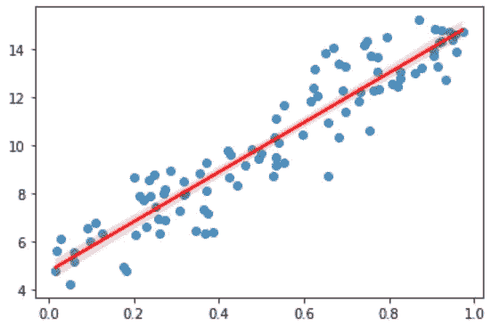
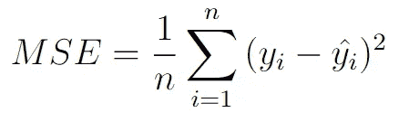
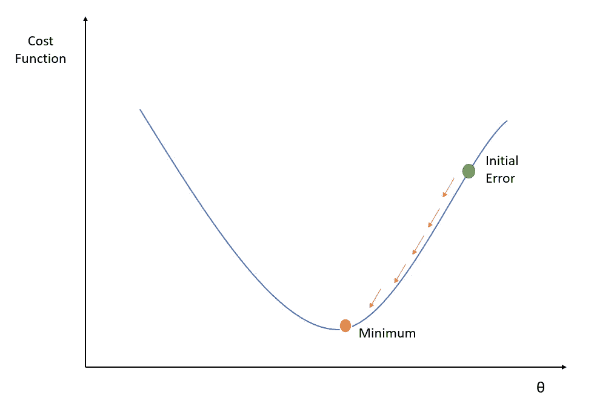
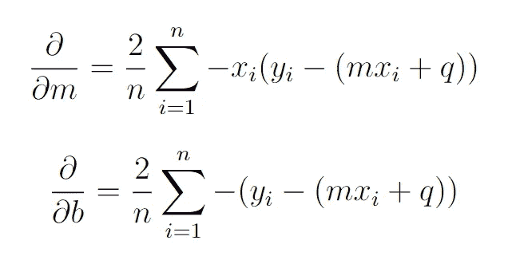

# 仅使用 Numpy 的线性回归和梯度下降

> 原文：<https://towardsdatascience.com/linear-regression-and-gradient-descent-using-only-numpy-53104a834f75?source=collection_archive---------9----------------------->

在 [Unsplash](https://unsplash.com?utm_source=medium&utm_medium=referral) 上由 [Boitumelo Phetla](https://unsplash.com/@writecodenow?utm_source=medium&utm_medium=referral) 拍摄的照片

## 了解如何从头开始实现线性回归模型！

如果你正在学习机器学习，你可能已经了解了线性回归模型和梯度下降算法。问题是这些通常是使用 sklearn 这样的高级库来实现的，所以真正的工作仍然有点神秘。让我们发现从头开始编写代码的真正工作原理！

## 线性回归的目的是什么？

假设您有一个包含 1000 条记录的数据集，每条记录由 5 个要素组成。这个数据集可以非常简单地用一个 *1000x5* 矩阵来表示。对于这些记录中的每一个 *X(i)* 你也有一个相关的输出 *y(i)* ，所以 *y* 这一组输出可以简单地用一个大小为 1000 的向量来表示。

如果我们在一个平面上绘制数据集，假设我们只有一个特征而不是 5 个，我们可以说我们的目标是找到一条线 ***y = mX +q*** 以这样一种方式与我们的数据相交，即数据集的各个点离发现的线不太远。

作者图片

观察一下，在我们要查找的行中， *X* 因为是我们的数据集而已知，所以**隐藏参数**只有 ***m*** 和 ***q*** 。在更多的维度中，因此具有更多的特征，我们不应该找到一条线，但是一个*超平面*和 *m* 和 *q* 将是具有与特征数量一样多的条目的向量。

更正式地说，要最小化的点与线的距离通过一个称为均方误差(MSE)的函数来测量，该函数由以下公式给出:

作者图片

这个公式告诉我们的是，我们实际上想要最小化每个点到直线的平均平方距离。

在公式中，y_i 是已知的输出，由于 *ŷ_i* 是由线给出的，我们想要找到ŷ_i *= mX +q* ，为了最小化这个函数，我们只需要找到最佳参数 *m* 和 *q* 。所以我们可以说 ***MSE*** 是一个依赖于两个参数 *m* 和 *q* : ***F(m，q)*** 的函数 F

一旦我们找到这些参数，我们就可以进行一些预测，对于每个新记录，我们可以知道相关的输出是什么。

## 梯度下降寻找隐藏参数

让我们用图形表示 MSE(成本函数)。

作者图片

由于我们忽略了哪些参数使成本函数最小化， *m* 和 *q* 将被随机初始化。因此，首先我们将在成本函数中的任何一点(见图表)。我们的目标是每次更新参数*θ=【m，q】*，以便找到成本函数的最小值**，这保证了平均而言数据集的点不会离找到的线太远。**

梯度下降( **GD** )算法简单地告诉我们这个更新必须遵循规则:

**θ = θ - α∇F(θ)**

其中α 是称为学习率的先验选择数，而*【∇f(θ】*是一个向量，其中每个条目包含成本函数 *F* 相对于 *θ* 中的参数的偏导数。

因此让我们来计算这些偏导数。

作者图片

太好了！作为最后一个技巧，我们从公式中注意到，只有在对所有 n 条记录求和之后，也就是在遍历了数据集的所有记录之后，我们才应该更新参数 *θ* 。但是由于数据集通常很大，我们只能累加到数字 *k* 并立即执行参数更新，然后继续更新缺失的记录。所以 *k* 称为 ***批次大小*** 和定时取出的 *k* 元素集合称为 ***批次*** 。当你用尽所有可用的批次时，它完成了所谓的 ***时期*** 。如果我想改善你对参数 *θ* 的估计，你可以从新开始。

## 在 Numpy 中实现

让我们导入 numpy，创建一个包含 5 个特性的随机数据集，并随机创建我们需要发现的 *m* 和 *q* 。我们还生成由线性关系给出的实际输出，并在其中添加一些噪声。

请注意，无需区分 m 和 q，注意输出为:

*y = m1x 1+MW x2+m3x 3+m4x 4+m5x 5+q*

但这和写作是一样的

*y = m1x 1+MW x2+m3x 3+M4 x4+m5x 5+m6x 6*

前提是 *m6 = q* 和 *X6* 始终等于 *1* 。

然后，我们需要添加一个“1”的特性，将它与我们已经拥有的数据集连接起来，并将 *q* 添加到矢量 *m* 中。

让我们编写一个函数，它只计算相对于 *m* 的偏导数的值(因为我们去掉了 *q* ，它必须将原始参数的估计值 *m_stat* 作为输入

我们还需要定义 MSE 函数

在训练函数中，我们不断更新参数。第一个 for 循环遍历我们设置的历元数，而第二个嵌套的 for 循环遍历一个历元的所有批次。请注意，对于每个时期来说，打乱数据是很重要的！

我们设置超参数并估计参数

如果我们打印估计的参数和原始参数，我们会发现它们几乎相同，所以我们找到了生成输出的原始行！现在我可以用这条线对新的测试数据进行预测。

## 结论

基于线性回归的模型解释起来相对简单，并且在生成预测时非常有用。线性回归可以应用于从医疗保健到商业的各个领域。在高级机器学习中，例如在文本分类中，线性模型仍然非常重要，尽管还有其他更好的模型。这是因为线性模型非常“稳定”，它不太可能太符合数据。线性回归的一个演变是**多项式回归**，这是一个更复杂的模型，也可以适合引入更复杂特征的非线性数据集，请查看这里:[https://en.wikipedia.org/wiki/Polynomial_regression](https://en.wikipedia.org/wiki/Polynomial_regression)。

## 结束了

作者:*马赛洛·波利蒂*

[Linkedin](https://www.linkedin.com/in/marcello-politi/) ， [Twitter](https://twitter.com/_March08_)