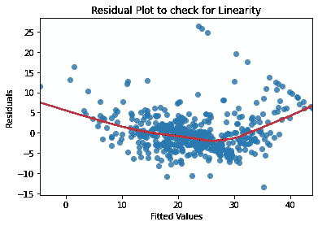
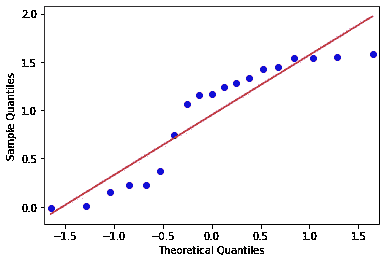
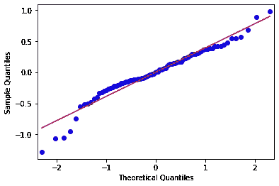
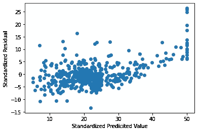
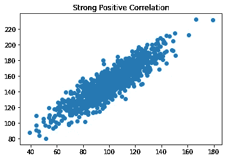
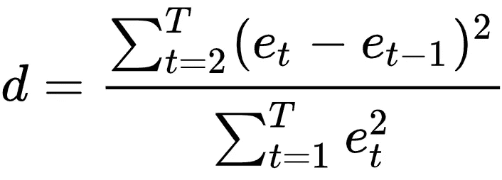

# 线性回归算法假设背后的直觉

> 原文：<https://towardsdatascience.com/linear-regression-assumptions-why-is-it-important-af28438a44a1?source=collection_archive---------0----------------------->

## 建立线性回归模型只是第一步。在我们对模型估计做出推论或使用模型进行预测之前，应该满足某些条件。

达斯汀·格罗在 [Unsplash](https://unsplash.com?utm_source=medium&utm_medium=referral) 拍摄的照片

线性回归模型应针对所有模型假设进行验证，包括函数形式的定义。如果假设被违反，我们需要重新审视模型。

在本文中，我将解释线性回归的关键假设，为什么它很重要，以及我们如何使用 Python 来验证它。我还会谈到在假设不满足的情况下的补救措施。

# 线性回归的假设:

**假设 1**

回归的函数形式是正确指定的，即参数(自变量)的系数和因变量 y 之间存在线性关系

**假设 2**

残差呈正态分布。

**假设 3**

残差的方差在自变量 x 的所有值上都是恒定的(也称为“同方差”)。

**假设 4**

误差之间没有自相关。

**假设 5**

自变量之间没有(低)相关性(也称为‘多重共线性’)。

**让我们详细了解这些假设。**

# 假设 1:回归的函数形式是正确指定的。

线性回归算法假设自变量和因变量 y 的参数之间存在线性关系。如果真实的关系不是线性的，我们就不能使用该模型，因为精度会显著降低。

因此，验证这一假设变得很重要。这通过绘制**残差图**来完成。

在只有一个独立变量的简单线性回归模型的情况下，我们绘制残差对预测值，即误差对预测值 X1。在多元线性回归的情况下，我们有一个以上的预测值，我们绘制残差和预测值或拟合值 ŷ。

残差图不应显示任何模式，即残差应随机分布在水平轴周围。如果存在模式，我们可以推断线性模型的某些方面存在问题，即使用了不正确的函数形式。这也被称为'**模型-** **设定错误**。

在非线性关联的情况下，我们可以在回归模型中使用预测值的非线性变换，例如 log X，X，sqrt(X)。

非线性关联的残差图示例如下所示。

**用 Python 绘制剩余图:**

将残差计算为:

残差= y _ 测试-y _ 预测

简单地绘制残差和预测 y 值的散点图。代码如下所示:
导入 matplotlib.pyplot 为 plt
plt.scatter(y_pred，residuals)

# 假设 2:残差呈正态分布

线性回归模型的建立有两个非常重要的步骤——估计和假设检验。使用普通的最小二乘法(OLS)，我们能够估计参数β1、β2 等。这些参数的值会随着样本的不同而变化，因此我们可以说这些估计量是随机变量。

一旦我们完成了估计，我们需要做假设检验来对总体做出推断。因此，我们想知道 beta hat(估计 beta)与真实 beta 有多接近，或者 beta hat 的方差与真实方差有多接近。

因此，我们需要找出它们的概率分布，没有它，我们就不能得到它们的真实值。

使用 OLS，我们得到**βhat =∑(ki∫Yi)**其中 ki = Xi / ∑(Xi)

这里 i= 1，2，3，4，....观察

这里 X 是非随机的，Ki 是常数。因此，hat(估计的β)是 Yi 的线性函数。

我们可以将上面的等式写成:

**β2 hat =∑ki *(β1+β2∫Xi+ui)**，自 Yi = β1 + β2 * Xi +误差(ui)

由于 k，X 是常数，β2 hat 最终是随机变量 ui 的线性函数。因此，β的概率分布将取决于关于误差项或剩余项 ui 的概率分布的假设。

由于 OLS 估计量的概率分布是推断其总体值所必需的，因此残差的分布在假设检验中起着重要的作用。

**为什么是正态分布？**

误差是模型中不包括的一个或多个独立变量的综合影响。中心极限定理指出，如果有大量独立同分布的随机变量，那么它们之和的分布随着变量数量的增加而趋于正态分布。**因此，CLT 从理论上解释了假设误差为“正态分布”的原因。**

由于正态分布变量的任何线性函数本身都是正态分布的，作出这一假设使我们能够导出 OLS 估计量的概率分布。因此，OLS 估计量也是正态分布的。它进一步允许我们使用 t 和 F 检验进行假设检验。

我们如何确定误差是否正态分布？

检查误差是否呈正态分布的最简单方法是使用 P-P(概率-概率)图。

P-P 图评估理论分布对给定数据分布的模拟程度。残差的正态概率图是一个散点图，x 轴表示正态分布的理论百分位数，y 轴表示残差的样本百分位数。

比较线是 45 度对角线。穿过理论分布的上下百分位数的对角线提供了直观的帮助，以帮助评估理论和样本百分位数之间的关系是否是线性的。当且仅当图落在这条线上时，分布才相等。与这条线的任何偏离都表明两个分布之间的差异

下面是一个误差分布不正常的 P-P 图的例子

这是 P-P 图，其中误差分布为**近似**正态

**用 Python 绘制 P-P 图:**

运行上面的代码得到以下输出:
normality _ plot = sm . QQ plot(residual，line = 'r ')

除了 P-P 图之外，检查误差正态性的更具统计学意义的方法是进行**安德森达林测试**。

**检验误差正态性的安德森-达林试验**

Anderson Darling 统计测量数据遵循特定分布的程度。对于给定的数据集及其分布，数据越符合分布，统计量就越小。
检验的无效假设和替代假设如下:

*零假设* *Ho* :数据遵循指定的分布

*替代假设 Ha* :数据不符合规定的分布

如果 p 值小于选择的α(0.05 或 0.10)，我们拒绝数据来自特定分布的零假设

**安德森达林测试的 Python 代码:**

来自 scipy import stats
Anderson _ results = stats . Anderson(model . resid，dist='norm ')

# 假设 3:对于自变量 X 的所有值，误差的方差是常数

同方差假设( *homo* — **相等，** *同方差* — **spread** )陈述了对应于不同 X 值的 y 总体具有相同的方差，即它不随着 X 的增加而增加也不减少。

异方差是指方差不相等，即 y 群体的方差随 x 而变化。

**非常数方差的原因是什么？**

关于异方差最流行的一个例子是储蓄和收入数据。随着收入的增长，人们有更多的可自由支配收入，因此在收入分配上有更多的选择。因此，回归收入储蓄可能会发现更高的方差，因为收入增加会导致人们在储蓄决策方面有更多的选择。

异方差的其他原因包括异常值的存在、重要变量的遗漏、不正确的数据转换或不正确的方程函数形式。

异方差如何影响 OLS 估计？

如果线性回归的所有假设都满足，OLS 估计提供β的最佳线性无偏估计(蓝色)。

**蓝色**是什么意思？这意味着 OLS 方法给出的估计值是:

**线性:**

它是回归模型因变量 Y 的线性函数

**无偏:**

它的期望值或平均值等于真实值

**高效:**

它的方差最小。方差最小的无偏估计量称为有效估计量。

如果线性回归的所有假设都满足，OLS 给我们最好的线性无偏估计。

然而，如果放松同方差的假设，β估计仍然是线性的和无偏的，但是它们不是有效的/最佳的。为什么？因为，现在估计的β不会有最小方差。

让我们试着更好地理解它。用来解释异方差的最常见的例子是单因素线性回归模型，其中储蓄作为因变量，收入作为解释变量。如上图所示，当收入较低时，储蓄的差异也较低。随着收入的增加，可支配收入也增加，这给了个人更多的储蓄选择。因此，随着收入的增加，储蓄的差异也会增加。从上图中可以明显看出这一点。在同方差数据中，所有观测值的方差是一致的，等于(σ)。对于异方差数据，方差等于(sigma(i))，其中 i=1，2，3，…观察结果。

理想情况下，您希望以这样一种方式进行估计，即与来自变异性较高的人群的观察值相比，来自变异性较低的人群的观察值具有更大的权重，因为这将使我们能够更准确地估计人群回归函数。想法是给与较高方差相关的观察值小的权重，以缩小它们的残差平方。

然而，OLS 并不根据观测值对残差平方和(RSS)的贡献来改变观测值的权重。它对所有的观察都给予同等的重视。因此，当 RSS 被最小化以计算估计值时，具有较高方差的观测值将在等式中具有较大的拉力。因此，使用 OLS 估计异方差数据的β将不再具有最小方差。

因此，用异方差数据估计的β将具有较高的方差，从而具有较高的标准误差。

我们知道 t-stats = beta hat/beta hat 的标准差。

beta 的标准误差越高，t-stats 值越低。这进一步导致更高的 p 值，并且犯第二类错误的机会也增加。**也就是说，当 p 值较高时，重要的变量被推断为不重要。**

它还影响置信区间、T 检验、f 检验和其他假设检验。因此，检测异方差并提供补救措施是非常关键的

**我们如何检测异方差:**

**异方差在残差图中产生独特的扇形或锥形。**要检查异方差性，您需要在多元线性回归的情况下通过拟合值图评估残差，在简单线性回归的情况下评估残差与解释变量的关系。通常，异方差的模式是随着拟合值的增加，残差的方差也增加。

除了上述图之外，还进行了某些统计测试来确认异方差性。其中之一是对正态分布数据的 Breusch-Pagan 检验。

**Breusch 异教异方差检验:**

*零假设* *Ho* —误差方差相等(异方差)
*交替假设 Ha* —误差方差不相等(异方差)

下面的代码给出了假设检验的 p 值。这里 X 是独立变量的列表

从 statsmodels.stats.diagnostic 导入 het _ breuschpagan
bptest = het _ breuschpagan(model 3 . resid，X)[1]
print(' Breuchpagen 测试的 p 值为'，BP test)

如果 p 值小于 0.05，我们拒绝零假设。因此，我们拒绝误差方差相等的零假设。

**异方差的补救措施**

处理异方差的一种方法是使用凹函数(如 log Y 或 sqrt Y)转换响应变量 Y。这种转换会导致较大响应的收缩量更大，从而降低异方差。

# 假设 4:独立变量之间没有(少)多重共线性

多重共线性出现在两个或多个解释变量彼此密切相关的多元回归模型中。

这可能会造成问题，因为很难区分相关变量对响应变量的单独影响，即确定每个变量如何分别与响应变量相关联。

为什么我们假设自变量之间不存在多重共线性？

当 X1 变化一个单位时，β给出响应变量 y 的变化率，保持所有其他 x 不变。当独立变量 X1 和 X2 之间高度相关时，不可能保持 X2 不变，因为它会随着 X1 的变化而变化。对于具有多重共线性的数据，Betas 将采用多个值，并且回归系数没有唯一的解决方案。因此，在高度多重共线性的情况下，β估计是不确定的，标准误差是无限的。

**如果自变量的数量小于或刚好等于观测值的数量，多重共线性是一个更严重的问题。**

**多重共线性如何影响回归模型中的估计和假设检验？**

OLS 估计量将具有较大的方差和协方差，使得估计变得困难。因此，置信区间要宽得多，导致零零假设的接受，从而导致 2 型误差。

由于估计的标准误差较高，t stats = beta hat/(beta hat 的标准误差)变小。因此，多重共线性导致不显著的 t 比率。

在多重共线性的情况下，估计的 betas 对数据的微小变化都非常敏感。

**我们如何检查多重共线性:**

1.  **散点图**

人们可以用散点图来检查自变量之间的相关性。从散点图中很容易看出高度的相关性。如果点位于对角线上或接近对角线，我们可以推断两个变量之间的高度相关性。

2.**方差膨胀因子**

方差膨胀因子或 VIF 用作多重共线性的指标。VIF 值越大，该变量与其他回归变量的相关性越强。VIF 显示了由于多重共线性的存在，变量的方差被夸大了多少。随着共线性程度的增加，VIF 也会增加。如果两个变量之间没有共线性，VIF 将为 1。

它是通过获取一个预测值并将其与模型中的其他预测值进行回归计算而得。这给出了 R 值，然后用于 VIF 公式。通常，VIF 大于 10 的变量被认为是有问题的。

**用于检查 VIF 的 Python 代码:**

来自 stats models . stats . outliers _ impact 导入方差 _ 通货膨胀 _ 因子

def get _ Vif _ factors(X):
X _ matrix = X . values
Vif =[variance _ inflation _ factor(X _ matrix，I)for I in range(X _ matrix . shape[1])]
Vif _ factors = PD。data frame()
vif_factors[' column ']= x . columns
Vif _ factors[' VIF ']= Vif
返回 Vif _ factors

Vif _ factor = get _ Vif _ factors(X _ train))
Vif _ factors

**多重共线性的补救措施**

*   删除具有高 VIF 的变量
*   使用主成分分析(PCA)得出不相关的变量

# 假设 5:没有误差的自相关

线性回归模型假设误差项是独立的。这意味着一个观测值的误差项不受另一个观测值的误差项的影响。如果不是这样，则称为**自相关**。

一般在时间序列数据中观察到。时间序列数据由在离散时间点收集的观测数据组成。通常，相邻时间间隔的观测值会有相关误差。

**自相关的存在如何影响 OLS 估计？**

估计的标准误差往往低估了真实的标准误差。因此相关的 p 值较低。这导致一个结论，即一个变量是重要的，即使它不是。置信区间和预测区间比它们应有的范围要窄。

**我们如何检测自相关？**

**杜宾沃森测试**用于检查自相关。
*零假设 Ho* :没有误差自相关
*替代假设* Ha:有误差自相关

**Durbin Watson 统计检查残差的滞后 1 中是否存在自相关。统计数据如下:**

**统计值将介于 0 到 4 之间**。介于 1.8 和 2.2 之间的值表示没有自相关。小于 1.8 的值表示正自相关，大于 2.2 的值表示负自相关

也可以查看一个散点图，一个轴上是残差，另一个轴上是时间分量。如果残差是随机分布的，就没有自相关。如果观察到特定的模式，则表明存在自相关。

**Python 中的杜宾沃森测试:**

从 stats models . stats . stat 工具导入 durbin_watson

德宾 _ 沃森(模型 1.resid)

**自相关补救措施**

检查自相关是否是由于模型的错误设定，即模型的函数形式不正确或一些重要变量被排除在模型之外。在这种情况下，我们需要重新审视这个模型。
还可以添加因变量的滞后和/或一些自变量的滞后。

**结论:**

所有上述假设对于验证模型都很重要。如果违反了其中的任何一条，那么从模型中得出的预测、置信区间和科学见解都将是误导性的和有偏见的。

希望这篇文章能帮助你更深入地了解最有用的算法之一。

这里有一些很好的参考资料，可以更好地理解这些假设。

1.  《基础计量经济学》，达摩达尔·N·古吉拉特，道恩·C·波特，马诺兰詹·帕尔
2.  《商业分析:数据驱动的决策科学》作者 U Dinesh Kumar
3.  https://statisticsbyjim.com/