# 线性回归解释

> 原文：<https://towardsdatascience.com/linear-regression-explained-89cc3886ab48?source=collection_archive---------25----------------------->


由 [Unsplash](https://unsplash.com?utm_source=medium&utm_medium=referral) 上 [Lea Kobal](https://unsplash.com/@leyko?utm_source=medium&utm_medium=referral) 拍摄的照片

## 数据科学基础

## 了解这种受监督的机器学习算法是如何工作的

*线性回归*可能是最知名的机器学习算法。由于它的简单性、速度和可解释性，它通常是学习或实践数据科学时遇到的第一个算法。如果你想加深对线性回归的理解，这篇文章展示了算法背后的数学，重点是*正规方程*以及如何解释线性回归的参数。


照片由 [Tim Swaan](https://unsplash.com/@timswaanphotography?utm_source=medium&utm_medium=referral) 在 [Unsplash](https://unsplash.com?utm_source=medium&utm_medium=referral) 上拍摄

*我们将看到一些用 Python 编写的代码示例，然而，读者可以在不了解 Python 的情况下吸收概念性知识。*

# 概观📜

> 线性回归是一种预测连续目标的机器学习算法。

线性回归方程由下式表示:

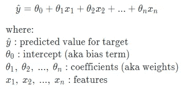

根据所用特征的数量，线性回归可以进一步分为两类。如果使用单一特征来预测目标，则称为*简单线性回归*。如果使用了多个(即两个或更多)特征，则称为*多元*或*多元回归*。

# 训练线性回归🔧

现在，让我们学习模型如何学习最优的[模型参数](https://machinelearningmastery.com/difference-between-a-parameter-and-a-hyperparameter/)(即截距和系数)。在训练线性回归时，我们希望找到最佳的参数组合，以便与任何其他组合相比，它们在所有训练示例中产生最低的误差。对于给定的一组参数，我们可以使用*均方误差(又名 MSE)* 来测量总误差:

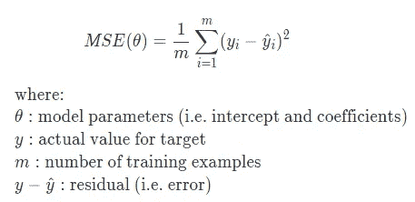

误差是平方的，因此正负误差不会相互抵消。有两种方法可以找到最佳的参数设置:
◼使用标准方程
◼使用优化算法

## 📍使用正常方程

我们将需要了解*矩阵转置*、*矩阵乘法、*和*矩阵求逆*的基础知识，以遵循即将到来的正规方程示例。在我们深入讨论之前，让我们先快速回顾一下这些主题。

**矩阵转置:**下面是转置一个 2x2 矩阵的公式:

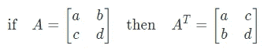

您可以想象您正在沿着从左上延伸到右下的对角线翻转值。这里有一个例子:

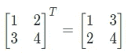

**矩阵乘法:**下面是两个 2x2 矩阵相乘的公式:

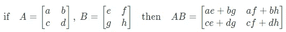

这里有一个例子:

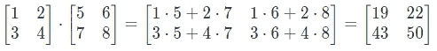

**逆矩阵:**矩阵要有逆矩阵，矩阵必须是方阵(即行数=列数)。下面是计算 2x2 矩阵的逆矩阵的公式:

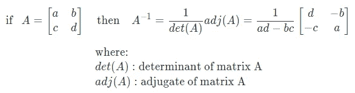

如果一个矩阵的行列式(即`ad-bc`)为零，那么这个矩阵就不会有逆矩阵。这样的矩阵称为奇异矩阵。

下面是一个求逆矩阵的例子:

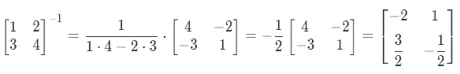

照片由 [v2osk](https://unsplash.com/@v2osk?utm_source=medium&utm_medium=referral) 在 [Unsplash](https://unsplash.com?utm_source=medium&utm_medium=referral) 上拍摄

现在，我们准备好熟悉*正规方程*:

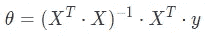

让我们重写我们的线性方程，使得截距是一个特殊的系数，其中对应的特征`x0`取常数值 1:

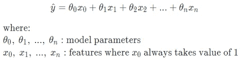

让我们使用玩具数据集上的正态方程来寻找简单线性回归的参数，该数据集具有一个解释特征`x1`和一个目标`y`，以便我们自己可以管理计算。

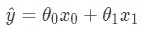

从下面，我们看到了`X`，一个 5x2 的特征矩阵。第一列显示了 5 个训练示例的`x0`，第二列显示了`x1`。首先，我们将`X^T`乘以`X`:

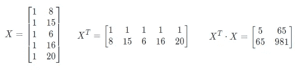

现在，让我们找到它的逆:

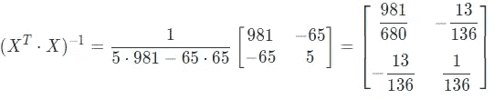

接下来，我们将它乘以`X_T`:

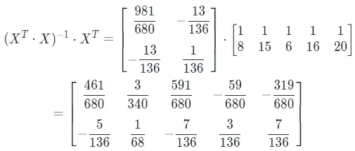

最后，我们将它乘以实际目标值，以找到最佳参数:

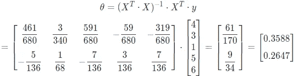

就是这样！我们发现截距是 0.3588，系数是 0.2647。我们也可以在 Python 中进行同样的计算来计算参数:

```
import numpy as np
import pandas as pd
pd.options.display.precision = 4from sklearn.linear_model import LinearRegression# Create sample data
train = pd.DataFrame({'x1': [8, 15, 6, 16, 20], 
                      'y': [4, 3, 1, 5, 6]})
train
```

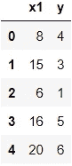

```
# Add x0=[1, 1, .., 1] for the intercept such that X is 5x2 matrix
x0 = np.ones(train.shape[0])[:, np.newaxis]
X = np.concatenate((x0, train.drop(columns='y')), axis=1)# Reshape y from 1D to 2D such that Y is 5x1 matrix
Y = train['y'].values.reshape(-1,1)# Find best parameters for the model
theta = np.linalg.inv(X.T.dot(X)).dot(X.T).dot(Y)
print(f"Intercept: {theta[0][0]:.4f}")
print(f"Coefficient for x1: {theta[1][0]:.4f}")# Predict
train['y_hat_manual'] = X.dot(theta)
train['residual'] = train['y'] - train['y_hat_manual']
train
```

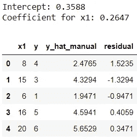

让我们对照 Scikit-learn 的输出快速检查一下:

```
# Check parameters against sklearn
model = LinearRegression()
model.fit(train[['x1']], train['y'])
print(f"Intercept: {model.intercept_:.4f}")
print(f"Coefficient for x1: {model.coef_[0]:.4f}")# Check predictions against sklearn
train['y_hat_sklearn'] = model.predict(train[['x1']])
train
```

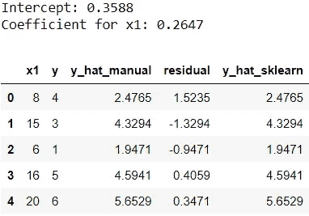

完美，结果匹配！

值得注意的是，如果`X^T ⋅ X`是奇异的(即行列式是零)，那么有些时候正规方程不起作用。

## 📍使用优化算法

训练模型的另一种方法是使用优化算法，如[梯度下降](https://ml-cheatsheet.readthedocs.io/en/latest/gradient_descent.html)，以找到使总误差最小化的最佳参数。优化算法迭代求解参数的最佳组合。使用优化算法训练线性回归时，具有相同比例的要素有助于更快地收敛到全局最小值。实际上，优化算法的选择取决于实现。

# 解释线性回归参数🔎

> **截距**告诉我们所有特征都为 0 时的预期目标值。

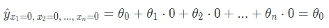

在我们的示例中，当特征`x1`为零时，目标预计为 0.2647:

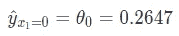

> **系数**告诉我们，当感兴趣的特性增加一个单位，而所有其他特性保持不变时，目标值的预期变化。系数的符号告诉我们特征和目标之间的关系。例如，正系数表示正关系。

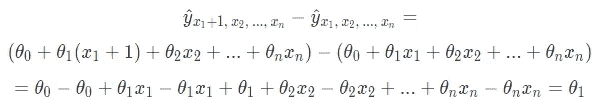

当特性`x1`增加一个单位时，目标预计增加 0.3588:

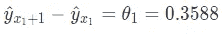

[David Marcu](https://unsplash.com/@davidmarcu?utm_source=medium&utm_medium=referral) 在 [Unsplash](https://unsplash.com?utm_source=medium&utm_medium=referral) 上拍摄的照片

这就是这篇文章的全部内容！希望您喜欢加深对线性回归的了解。在此过程中，我们还复习了基本的线性代数(如矩阵乘法和矩阵求逆)。最后，在向他人解释模型的驱动因素时，能够解释如何解释线性回归结果是很有帮助的。如果你渴望了解更多，请查看关于线性回归假设的资源[。](https://blog.uwgb.edu/bansalg/statistics-data-analytics/linear-regression/what-are-the-four-assumptions-of-linear-regression/)

*您想要访问更多这样的内容吗？媒体会员可以无限制地访问媒体上的任何文章。如果您使用* [*我的推荐链接*](https://zluvsand.medium.com/membership) ，*成为会员，您的一部分会费将直接用于支持我。*

感谢您阅读我的文章。如果你感兴趣，这里有我其他一些帖子的链接:

◼️️ [K 近邻讲解](/k-nearest-neighbours-explained-52c910c035c5)
◼️️ [比较随机森林和梯度推进](/comparing-random-forest-and-gradient-boosting-d7236b429c15)
◼️️ [决策树是如何建立的？](/how-are-decision-trees-built-a8e5af57ce8?source=your_stories_page-------------------------------------)
◼️️ [管道、ColumnTransformer 和 FeatureUnion 说明](/pipeline-columntransformer-and-featureunion-explained-f5491f815f?source=your_stories_page-------------------------------------)
◼️️ [FeatureUnion、ColumnTransformer &管道用于预处理文本数据](/featureunion-columntransformer-pipeline-for-preprocessing-text-data-9dcb233dbcb6)

再见🏃 💨

# 参考📁

*   Aurelien Geron，*使用 Scikit-Learn、Keras 和 TensorFlow 进行动手机器学习，2017 年* -第 4 章