# 线性回归解释(在 R 中)

> 原文：<https://towardsdatascience.com/linear-regression-explained-in-r-924ced3c2969?source=collection_archive---------25----------------------->

## 残差、残差平方和、简单线性回归和多元线性回归的解释，用 R 编写代码

线性回归是我们在数据科学和机器学习中最先学习的概念之一。然而，许多人对线性回归和与之相关的常用术语感到困惑。在本文中，我们一步一步地探索线性回归。我们讨论残差、残差平方和(或误差)、简单和多元线性回归以及线性回归术语。然后我们把所有的东西放在一个简单的 r 中线性回归的例子中。

图片由[维基百科](https://en.wikipedia.org/wiki/Linear_regression)提供。

我们将使用基于[七国研究、](https://www.sevencountriesstudy.com/)的数据集检验线性回归的不同组成部分，该研究检验了影响全球心血管疾病的因素(请注意，该数据集虽然基于研究，但却是模拟数据)。数据集可以在这里下载为. csv [。](https://github.com/brinnaebent/blogs/tree/main/Linear%20Regression)

我们首先要考察以下两列(变量):国家 ID 和冠心病死亡率(每万人口):

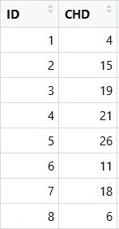

图片由作者提供。

让我们考虑一下冠心病死亡率和任意分配给每个国家的‘ID’之间的关系。由于 ID 栏是任意选择的，我们不会期望它与冠心病死亡率有很大的关系。两个变量的散点图证实了我们的假设:这些列之间没有很强的线性关系。

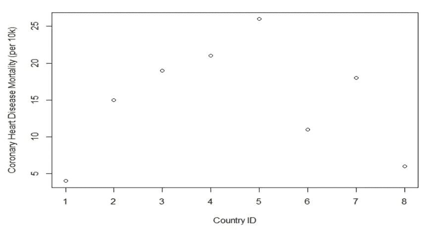

图片由作者提供。

让我们在这些点上画一条线。既然我们已经假设变量之间没有关系，那我们就画一条斜率为 0 的线，表示没有关系。

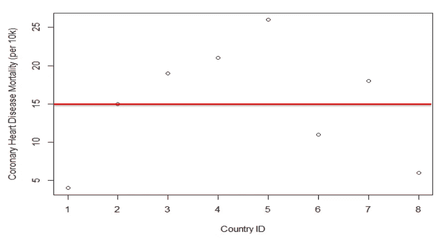

图片由作者提供。

现在我们要确定每个点和我们刚刚画的线之间的垂直距离。从画从直线到每个点的箭头开始。

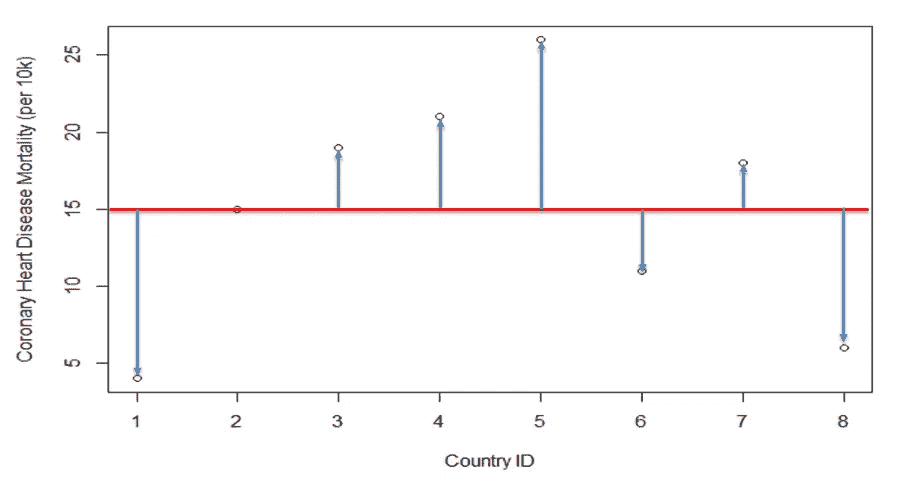

图片由作者提供。

如果我们检查直线和点之间的距离，我们会看到有些点离直线很近(即+3，-4)，有些点离直线很远(即+11，-9)。对于一个点，它正好在直线上，我们看到距离为 0。

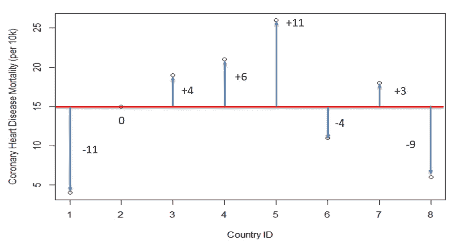

图片由作者提供。

这些从直线到每个点的垂直距离称为**残差**。对于线以上的数据点，残差为正，对于线以下的数据点，残差为负。

如果我们认为线是点应该在哪里的“预测”(基于我们的假设，我们的变量之间应该没有关系)，残差只是观察到的*y 值(点)减去*预测的* y 值(线)。考虑残差的一种方式是，它们是数据“偏离”直线的距离。*

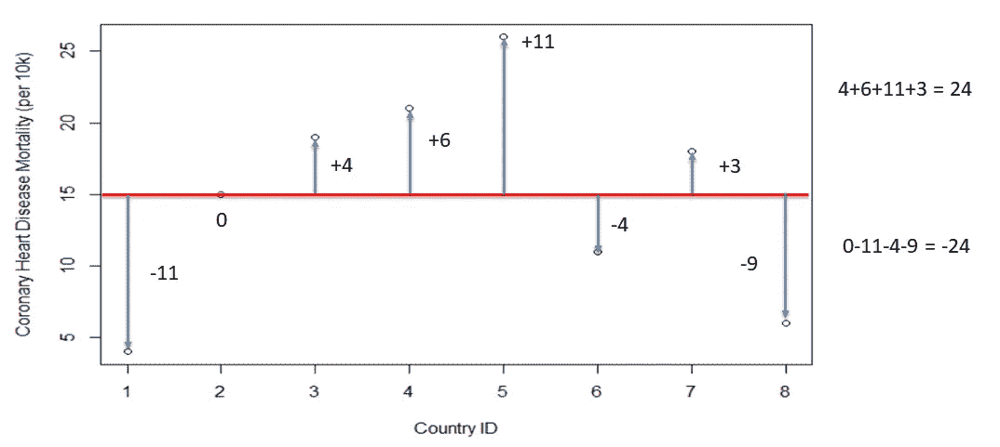

作者图片

现在让我们把线以上和线以下的所有残差加起来。我们会看到正残差(线以上)加起来是 24，负残差(线以下)加起来是-24。如果你的线确实是最佳拟合线，你的**残差总和将总是 0** 。

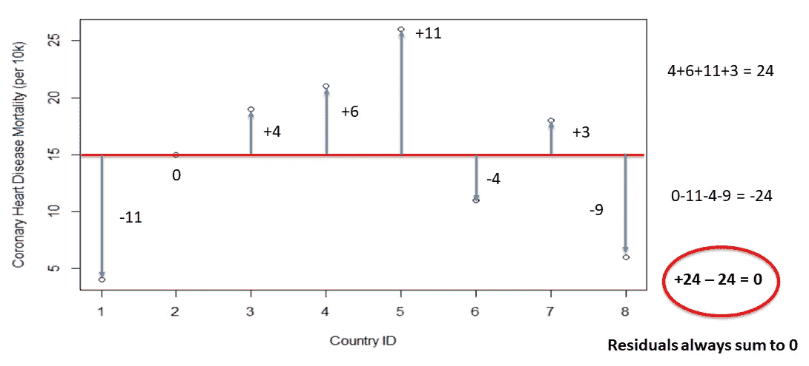

图片由作者提供。

残差的问题是我们不知道线的绝对差。我们对此的解决方案是对残差求平方。这给了我们绝对的差异。这也强调大偏差。

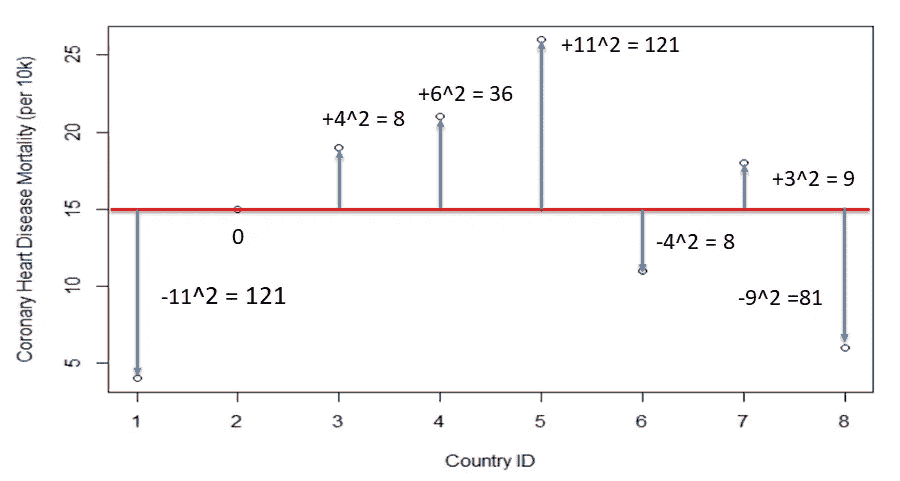

图片由作者提供。

通过对这些平方残差求和，我们可以得到一个很好的误差估计。(误差是*观察值*和*预测值*之间的差值)。我们称之为*残差平方和*，或**误差平方和(SSE)。**你也可能听说这被称为*残差平方和*。

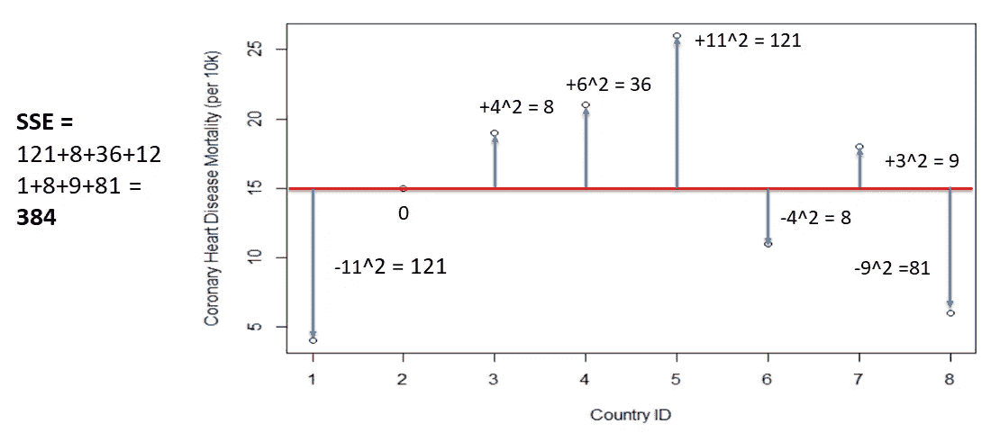

图片由作者提供。

下面是误差平方和的公式，其中 SSE 是误差平方和(或残差)。

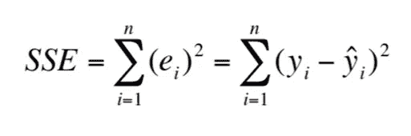

图片由作者提供。

所以现在我们已经了解了残差和误差平方和，我们可以讨论线性回归了！

> **线性回归的目标是创建一个最小化残差平方和的线性模型。**

所以让我们回到我们的数据。我们现在想看看另一个变量，并检查它与冠心病死亡率的关系。“吸烟”这个变量是该国每个成年人每天的平均吸烟量。

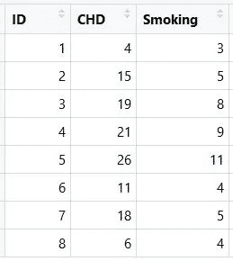

图片由作者提供。

如果我们绘制冠心病死亡率与每个成人每天平均吸烟量的关系图，我们会看到一个很强的线性关系:

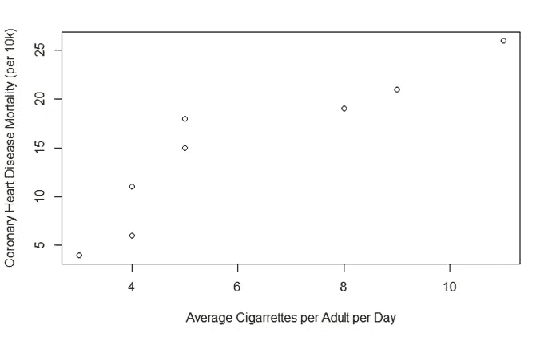

图片由作者提供。

在**简单线性回归**中，我们尝试多条最佳拟合线，直到找到一条**最小化误差平方和**的线。在下面，你可以看到三条不同的线的可视化表示。对于每条线，计算误差平方和。误差平方和最小的线是最符合的**线(这里，这是红线)。**

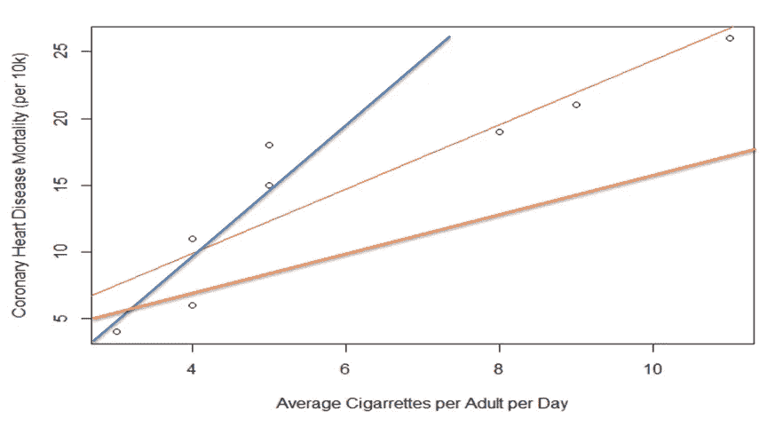

图片由作者提供。

回归只是一种用于数字数据建模和分析的方法。在回归中，评估 2+变量之间的关系。回归可用于预测、估计、假设检验和因果关系建模。

如果我们看看简单线性回归的术语，我们会发现一个方程与我们小学时的标准方程 *y=mx+b* 没有什么不同。

“y”被称为因变量、结果变量或响应变量。“X”被称为独立变量、预测变量、解释变量或回归变量。β0 是截距，β1 是斜率，ε是随机变量。斜率和截距(分别为β1 和β0)也称为回归系数。

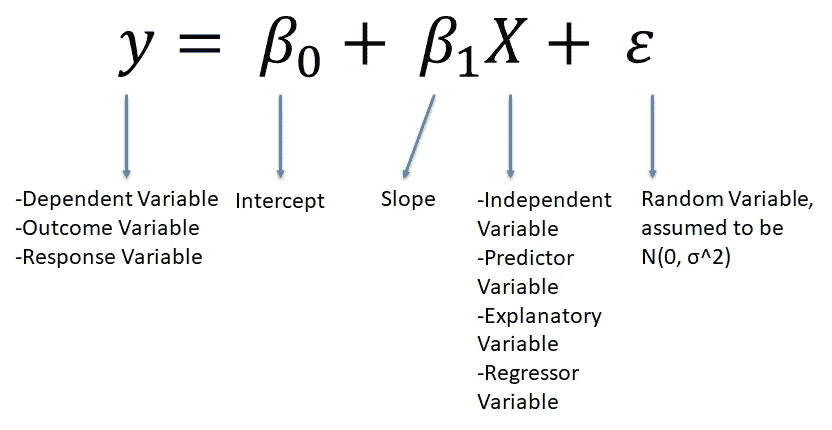

如果我们现在回到前面的例子，我们得到的简单线性回归方程是 y = 0.25 + 2.41x。

让我们问自己几个解释问题，以确保我们理解简单线性回归方程:

1.  β1=2.41 的解释是什么？
2.  如果我们有第九个国家，每个成年人每天平均吸烟= 20 支，你预测死亡率会是多少？Y 的期望值是多少？

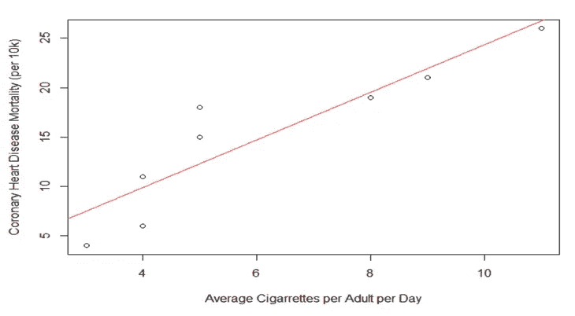

图片由作者提供。

1.  β1=2.41 的解释是什么？**成人每人每天平均吸烟量变化 1 个单位，冠心病的预期变化。**
2.  如果我们有第九个国家，每个成年人每天平均吸烟= 20 支，你预测死亡率会是多少？Y 的期望值是多少？**如果我们在上面的等式中为 X 插入“20 ”,我们会发现 Y 的期望值是 48.45，我们将其四舍五入为 48。**

我们已经检查了简单的线性回归，我们可以确定我们的结果变量和回归变量之间的关系。但是，如果我们有其他潜在的回归变量，比如下面这些，会怎么样呢？

*   人口平均年龄
*   饱和脂肪的平均摄入量
*   平均每天锻炼的时间
*   国家最喜爱的数字

这就是**多元线性回归**的用武之地！多元线性回归与简单线性回归相同，但现在我们有了每个回归变量的回归系数，如下所示。这允许您使用许多不同的变量来预测结果变量，所有这些变量都可能对结果产生影响。

在本例中，年龄、饮食、饱和脂肪、锻炼和吸烟都可能对一个国家的冠心病死亡率产生影响，我们希望将所有这些因素纳入我们的线性回归模型。

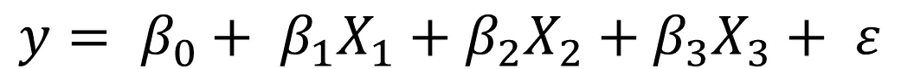

# 密码

数据集可以在这里以. csv [格式下载。](https://github.com/brinnaebent/blogs/tree/main/Linear%20Regression)

在 r 中导入 lme4 库。这将允许你做线性回归模型。这里，您正在进行一个简单的线性回归，使用回归变量“吸烟”预测死亡率(CHD ),因此您将像这样设置您的线性回归:

冠心病~吸烟

然后你可以用一条线画出你的最佳拟合线。

图片由作者提供。

为了确定您的回归系数和 sigma(用于计算线性回归方程中的随机变量)，您将调用模型，打印模型，并打印模型的 sigma 值:

您的输出将显示您的回归系数，β1=2.41 和β0=0.246，以及您的 sigma 值 3.42。

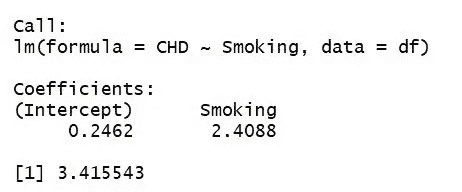

R 中的多元线性回归也一样简单。您将在回归变量之间添加一个“+”。我们添加(1|ID)来告诉模型 ID 是一个组级别的变量。

想更深入地使用 R 进行线性回归吗？[查看混合效果模型，](https://cran.r-project.org/web/packages/lme4/vignettes/lmer.pdf)也可以使用 lme4 库完成！

总之，我们探索了**残差**，它是回归线和每个观察值之间的距离。我们知道线性回归的目标是**最小化残差平方和**。我们为**线性回归**开发了一种直觉，它可以用于预测、估计、假设检验和因果关系建模。我们了解到，我们可以使用**多元线性回归**来考虑多元回归变量。最后，我们学习了如何在 R 中进行线性回归！