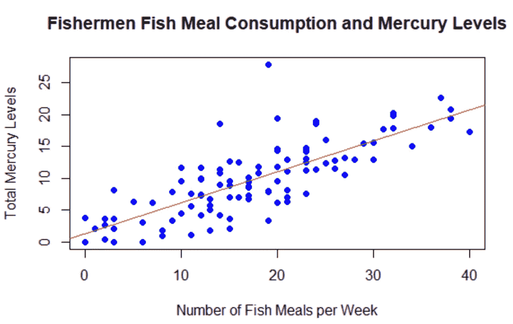
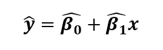
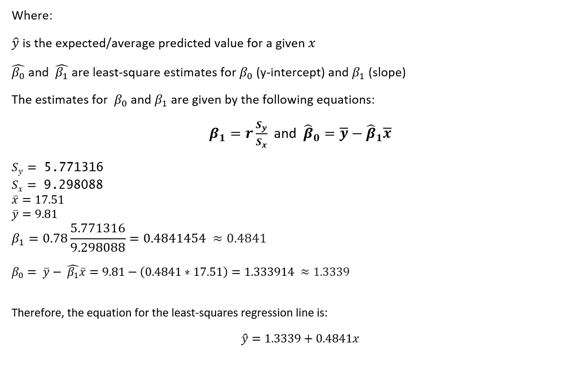
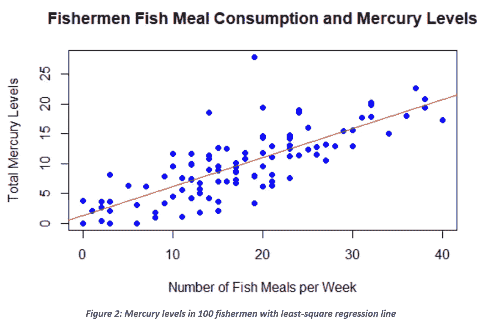
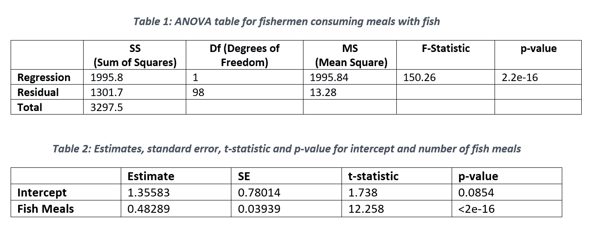
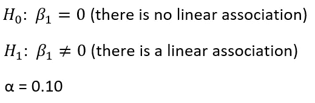
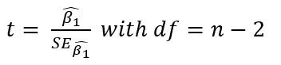
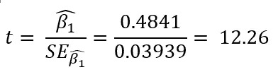
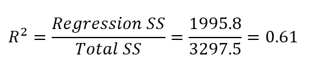
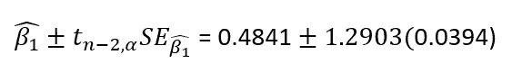

# R 中的线性回归:一个实例研究

> 原文：<https://towardsdatascience.com/linear-regression-in-r-a-case-study-d22fdc0ede54?source=collection_archive---------17----------------------->

## 如何使用 R 来评估数据集中两个变量之间的线性关系的程度

科尔曼·伯恩在 [Unsplash](https://unsplash.com?utm_source=medium&utm_medium=referral) 上的照片

从统计学领域借用，线性回归是一种在机器学习算法中日益流行的简便模型。对于预测分析特别有用，目标是根据历史数据做出最准确的预测。线性回归模拟自变量和因变量之间的关系。

当一个因变量被评估时，该过程被称为**简单线性回归**；当考虑多个时，该过程被称为**多元线性回归**。幸运的是，在 r 中导入的数据集上运行这两种场景的过程是可能的。

在这个特殊的案例研究中，我想看看每周食用的鱼粉数量和渔民体内发现的总汞含量之间是否存在显著的线性关系。本分析中使用的数据集作为附录项目附在文章末尾。因为我们只有两个变量之间的数据，所以我研究了将一个简单的线性回归模型应用于所讨论的数据集。

本文关注的是在 R 中进行线性回归的实际步骤，因此假设您已经掌握了与线性回归、假设检验、ANOVA 表和置信区间相关的知识。如果您需要这些主题的额外背景知识，我建议查看本文末尾列出的关于前面提到的主题的教程。

**第一步:将数据保存到一个文件(excel 或 CSV 文件)并读入 R 内存进行分析**

这一步通过以下步骤完成。

1.将 CSV 文件保存在本地桌面上

2.在 RStudio 中，导航到“会话”->“设置工作目录”->“选择目录”->选择步骤 1 中保存文件的文件夹

3.在 RStudio 中，运行命令:

*数据<-read . CSV("*fisher _ mercury _ levels . CSV*)"*

*附上(数据)*

**第二步:为了了解数据，生成一个散点图。有意识地决定哪个变量应该在 x 轴上，哪个应该在 y 轴上。使用散点图，评估变量之间关联的形式、方向和强度。**

从图中可以看出，每周食用的鱼粉数量与渔民体内的总汞含量之间存在明显的正线性关系。随着每周鱼粉数量的增加，总汞含量也随之增加。这种关联很强，因为大多数点都是彼此紧密相连的(如果画一条线来描述线性回归，这些数据点中的大多数将非常接近，而不是分散在这条线上)。

**第三步:计算相关系数。这种相关性告诉我们什么？**

相关系数是评估两个变量之间关系的强度和方向(正或负)的统计度量。通过在 100 名渔民的每周鱼粉数量和汞含量之间运行 R 中的 cor()函数，计算出该值为 **0.78** 。

由于相关系数值的范围从-1 到 1，负值表示负相关，正值表示正相关，因此可以得出结论，这些值都是正相关的。就相关性强度而言，与相关系数的较低计算值相比，较高的值表明两个变量之间的相关性较强。在这种情况下，0.78 表示强相关性，尤其是考虑到相关系数越接近 1，相关性越强。

**第四步:求最小二乘回归方程的方程，写出方程。将回归线添加到上面生成的散点图中。**

使用下面的公式计算最小二乘回归线的方程。

步骤 5:β1β_ 1 的估计值是多少？我们该如何解读这一价值观？β0β_ 0 的估计值是多少？这个值的解释是什么？

β1 的估计值为 0.4841，这是最小二乘回归线的斜率值。当解释变量增加时，该值表示响应变量的正线性增加。当每周吃鱼的次数增加 2 次时，渔民体内的汞含量大约增加 1 个单位。

β0 的估计值为 1.3339，它反映了最小二乘回归线的 y 截距值。这一点特别重要，因为该值反映了渔民每周不食用含鱼食物时的预期汞含量。beta_0 值表明，汞含量有一个非空(或零)的基线水平，每周不吃鱼并不能保证渔民的汞含量为零。

**步骤 6:计算方差分析表和给出β^ 1 标准误差的表(hat beta 1)。使用α水平 a=0.10 的 t 检验正式测试假设β_ 1 = 0。**

**线性关联的形式测试**

1.  **指定零假设**

**2。指定替代假设**

**3。设置显著性水平**

I .从 t 分布中确定适当的值，n-2 = 100–2 = 98 个自由度，并与α = 0.10 的右尾概率相关联。

二。使用 R，与α = 0.10 和 df = 98 相关的 t 值为 1.2903。

三。如果 t ≥ 1.2903，则拒绝 H0

否则，不要拒绝 H0

**4。计算 t 值**

5.**结论**

拒绝 H0 自 12.26 > 1.29。

每周包括鱼在内的膳食数量与渔民体内的汞含量之间存在线性关联。因此，可以得出结论，每周吃更多的鱼会增加渔民体内的汞含量。

ANOVA 表可用于找到该线性关联的 R^2 值。

上述 R^2 值表明，渔民中汞含量的 61%的差异可以用渔民每周食用的鱼粉数量来解释。

此外，β1 的 90%置信区间计算如下。

β1 的 90%置信区间为 0.41 至 0.55。该值表明回归线的斜率有 90%的概率位于该范围内。

**附录**

1.  源数据

[https://gist . github . com/VSI pra/a895d 0310 c 279 CD 1120349445 DC 00878 # file-fisher _ mercury _ levels-CSV](https://gist.github.com/vsipra/a895d0310c279cd1120349445dc00878#file-fisherman_mercury_levels-csv)

2.r 代码

[https://github . com/VSI pra/medium/blob/main/fisher _ mercury _ levels _ r _ code](https://github.com/vsipra/medium/blob/main/fisherman_mercury_levels_r_code)

3.统计教程

五步假设检验:

<https://www.scribbr.com/methodology/hypothesis-testing/>  

方差分析程序:

<https://sphweb.bumc.bu.edu/otlt/MPH-Modules/BS/BS704_HypothesisTesting-ANOVA/BS704_HypothesisTesting-Anova3.html>  

希望这篇文章能帮助你踏上数据分析之旅！