# 线性回归模型及影响点

> 原文：<https://towardsdatascience.com/linear-regression-models-and-influential-points-4ee844adac6d?source=collection_archive---------8----------------------->

## PYTHON。统计分析。线性回归。

## 使用 Statsmodels 软件包识别有影响的数据点并改进线性回归模型


马克西姆·霍普曼在 [Unsplash](https://unsplash.com?utm_source=medium&utm_medium=referral) 上的照片

线性回归模型在许多公司的分析和决策过程中发挥着巨大的作用，部分原因是它们易于使用和解释。

然而，有实例表明，某些数据点的存在会影响此类模型的预测能力。这些数据点被称为*影响点。*

# **有哪些影响点？**

我们在上一段中注意到*有影响力的*数据点会影响线性回归模型的预测能力。并且有影响的数据点通过极大地影响回归系数 T11 来这样做

很容易将这些点误认为“异常值”，然而，它们有不同的定义。并非所有异常值都被认为是有影响的点。事实上，在某些情况下，异常值的存在虽然不常见，但可能不会改变回归线。

例如，如果你有数据点:(1，1)、(5，5)、(6，6)、(3，3)和(500，500)，你可以认为最后一个点是异常值，但回归寿命保持不变。

相反，我们应该将这些极端值分解为*极端 y 值(高残差/异常值)*和*极端 x 值(高杠杆*)。在某些情况下，观察可能同时具有高残差和高杠杆。

## 极端值

异常值是具有极端 y 值的观测值。因为极值出现在因变量或目标变量中，所以这些观测值具有很高的残差。

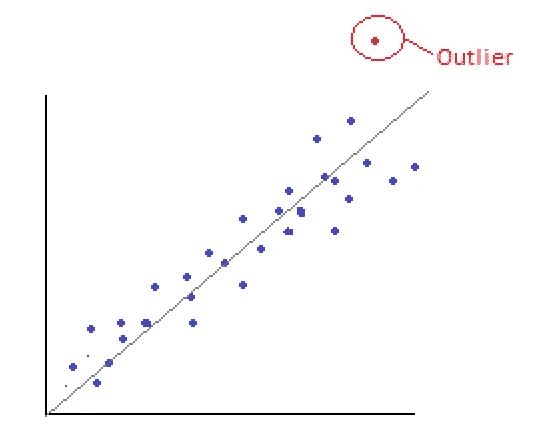

## 杠杆作用

杠杆是预测变量(例如，独立变量或通常为 x 变量)的值与该变量的平均值之间的距离。

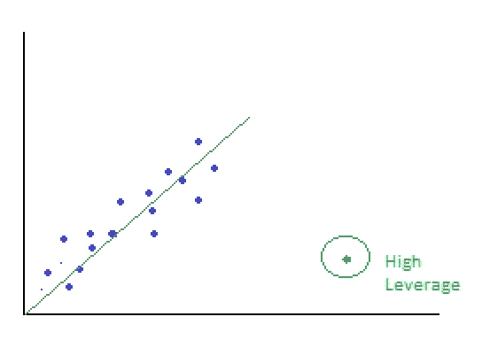

如果预测变量的值不寻常且远离其余值，则观察值具有高杠杆作用。

一个观察可能具有高残差和高杠杆，可能是也可能不是一个有影响的点。

# 识别有影响的数据点

为了更好地理解这个概念，让我们试着在[加州住房 Kaggle 数据集](https://www.kaggle.com/camnugent/california-housing-prices)上进行实践。从我的经验来看，房地产数据集容易产生大量的异常数据，这是一个很好的练习。

## **初始回归模型**

```
#Preliminaries
import pandas as pd
import numpy as np
import itertools
from itertools import chain, combinationsimport statsmodels.api as sm
from statsmodels.formula.api import ols
from statsmodels.graphics.regressionplots import *import matplotlib.pyplot as plt
import seaborn as sns
sns.set_theme()from sklearn.model_selection import train_test_split
import math
import time
```

加载数据集:

```
california = pd.read_csv('data/housing.csv')
california.head()
```

普通最小二乘回归的预处理；

```
#Dummify categorical variables
california = pd.get_dummies(california)#Remove observations that are NaN as these cannot be processed by our package
#Remember to reset the index - as you have removed some observations and the influence diagnostics dataframe would not use the original dataset's indexcalifornia = california[np.isfinite(california).all(1)].reset_index(drop="True")cols = california.columns.to_list()#Target
target= california.median_house_value.values#Features
features = [col for col in cols if col not in ['longitude', 'latitude','median_house_value']] #latitude and longitude are not good predictor variables (they are not meaningful as float variables)
```

将数据集分为训练集和测试集:

```
X_train, X_test, Y_train, Y_test = train_test_split(X, target, test_size = 0.20, random_state = 5)
```

运行我们的初始 OLS:

```
model_1 = sm.OLS(Y_train, sm.add_constant(X_train)).fit()
print_model_1 = model_1.summary()
print(print_model_1)
```

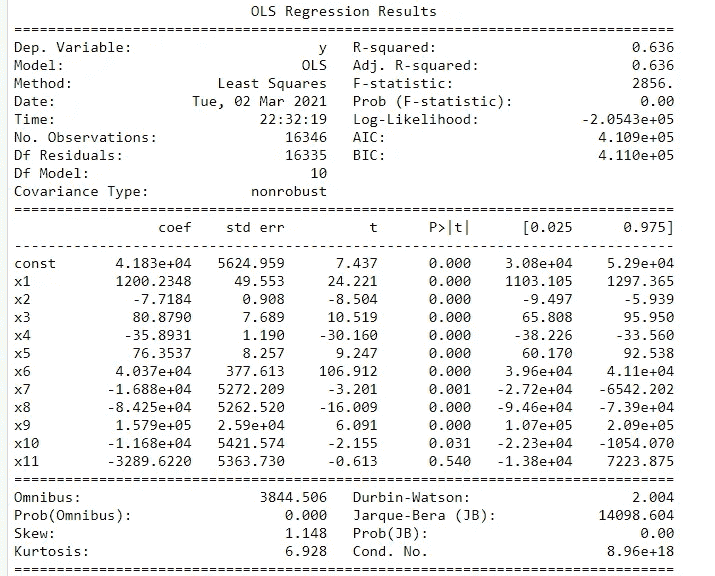

原始/初始模型

## 影响诊断

通常通过视觉手段或通过统计诊断来识别影响点。

方便的是， *statsmodel* 包的 *get_influence* 方法生成一个带有影响诊断的表，我们可以用它来确定这些影响点。

```
influence = model_1.get_influence()
inf_sum = influence.summary_frame()print(inf_sum.head())student_resid = influence.resid_studentized_external
(cooks, p) = influence.cooks_distance
(dffits, p) = influence.dffits
leverage = influence.hat_matrix_diagprint ('\n')
print ('Leverage vs. Studentized Residuals')
sns.regplot(leverage, model_1.resid_pearson,  fit_reg=False)
plt.title('Leverage vs. Studentized Residuals')
plt.xlabel('Leverage')
plt.ylabel('Studentized Residuals')
```

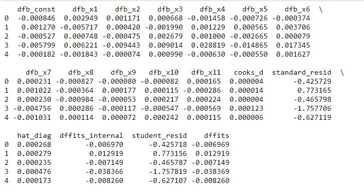

影响汇总框架

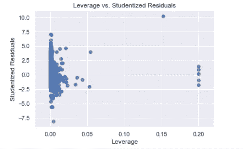

因为我们已经将异常值识别为具有高残差，所以我们可以使用使用 get_influence()生成的汇总表来查看这一点。

快速注意:学生化残差是观察值的残差除以其估计标准偏差所得的商。在某种程度上，这是一种学生的 t 统计量，不同点之间的误差估计不同。这是异常值检测中非常流行的技术。

一般来说，资料来源同意学生化残差的绝对值为 3 的观察被认为是不寻常的，因此是异常值。但是，您可能希望更积极一些，将其设置为低于 3 的值。

```
studentized_resids =  concatenated_df.student_resid
#Print the median house value of the outliers
print(concatenated_df.median_house_value[abs(studentized_resids) > 2])
```


```
#Highest Negative Residuals
studentized_resid_sort = concatenated_df.sort_values(by = 'student_resid')
print ('*'*20 + ' Most Negative Residuals ' + '*'*20)
print (studentized_resid_sort.head())
print ('\n')#Highest Positive Residuals
print ('*'*20 + ' Largest Positive Residuals ' + '*'*20)
print (studentized_resid_sort.tail())
print ('\n')
```

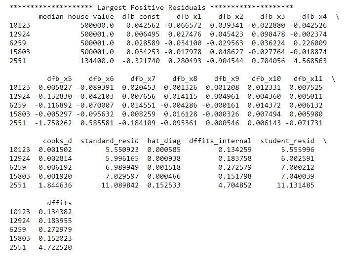

由于称为删除残差或外部学生化残差的过程，正残差中的 NaN 实际上是除以 0 的巨大数字。

一个很好的解释可以在[这里](https://stats.stackexchange.com/questions/123368/studentized-residuals-undefined)找到。

现在，我们已经确定了具有高残差或异常值的观测值，然后我们可以应用一个标准来确定具有高杠杆的观测值。

杠杆切断的公式是:

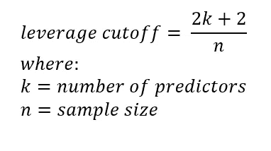

```
#Number of observations
n = california.shape[0]#Predictors
k = california[features].shape[1]#Leverage
cutoff_leverage = ((2*k)+2)/nleverage = concatenated_df.hat_diagleverage_sort = concatenated_df.sort_values(by = 'hat_diag', ascending = False)
print ('*'*20 + ' Highest Leverage Data Points ' + '*'*20)
print (leverage_sort.head())
```

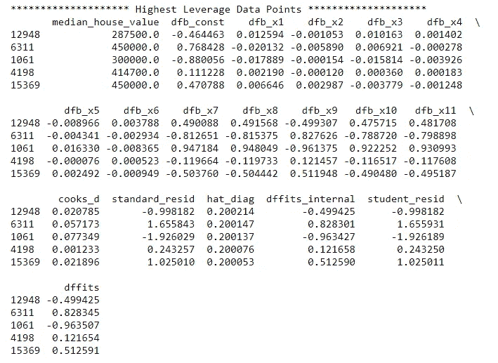

现在，让我们试着理解我们目前所拥有的:异常值和高杠杆数据点。

一些来源会同意，有影响的数据点都是异常值，具有很高的杠杆作用。我们可以在这个练习中实现这一点，但在现实中，即使只是作为一个异常值或高杠杆，也足以使一个观察成为一个有影响的点。

```
#Merge the observations that are outliers and have high leverage
outliers = pd.DataFrame((concatenated_df.student_resid[abs(studentized_resids) > 3]))
high_leverage = pd.DataFrame((concatenated_df.hat_diag[abs(leverage) > cutoff_leverage]))#Influential Dataset
influential_points =pd.merge(outliers,high_leverage, left_index=True, right_index=True)
display(influential_points)
```

影响力图可以帮助我们形象化这些点:

```
fig, ax = plt.subplots(figsize=(12,8))
fig = sm.graphics.influence_plot(model_1, ax= ax, criterion="cooks", alpha = 0.5)
```

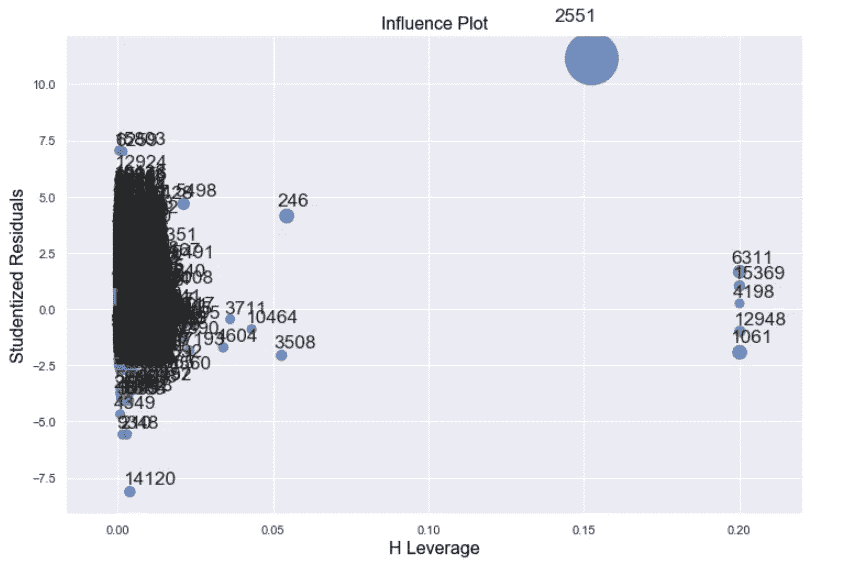

图中出现的数字是这些点的索引。

我们同样可以使用 *yellowbrick* 包来可视化有影响的点。

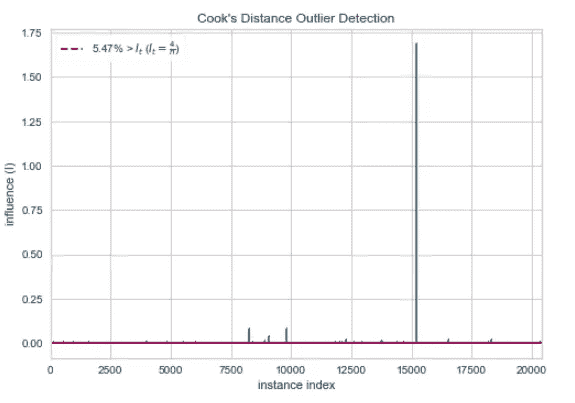

我们看到任何超过红线的观察值都是有影响的数据点。

我们生成的 *yellowbrick* 图使用库克的距离作为整体影响力的衡量标准。另一个用来衡量整体影响力的指标是 DFFITS(拟合差)。

库克距离是非负值，它们越大，观察的影响越大。most 使用的常见临界值是数据集的库克 D 均值的三倍，用于将观察结果归类为有影响的。

```
cutoff_cooks =(concatenated_df.loc[:,"cooks_d"].mean())*3
outliers_2 = pd.DataFrame((concatenated_df.cooks_d[abs(concatenated_df.cooks_d) > cutoff_cooks]))
display(outliers_2)
```

对于 DFFITS，传统的临界值在确定杠杆的临界值时使用相同的变量，但使用以下公式:

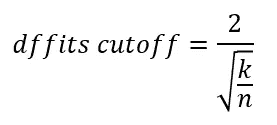

```
#Cutoff for DFFITS
cutoff_dffits = 2* math.sqrt(k/n)
print(concatenated_df.dffits[abs(concatenated_df.dffits) > cutoff_dffits])
```

与库克的距离不同，*dfifts*可以是正的，也可以是负的。值为“0”时，该点正好位于回归线上。

## DFBETAS

当 *dffits* 和 Cook’s distance 测量观察的一般影响时， *dfbetas* 测量由特定变量引起的观察的影响。如你所见，这对于多元线性回归模型非常有用。

```
#Variables for our plots latercolors = ['#e6194b', '#3cb44b', '#ffe119', '#4363d8', '#f58231', '#911eb4', 
          '#46f0f0', '#f032e6', '#bcf60c', '#fabebe', '#008080']markers = ['o','v', '^', 'p', '_', '+',
          'd', 'h', '*','|', 's']dfbetas = [x for x in concatenated_df.columns.to_list() if ('dfb' in x)]dfbeta_cutoff =  2/(n)**(0.5)fig,ax = plt.subplots(figsize=(12,8))for i in range(len(dfbetas)):
    ax.scatter(concatenated_df.median_house_value, 
               concatenated_df[dfbetas[i]], 
               color = colors[i], 
               marker = markers[i],
              label = dfbetas[i],
                alpha=0.5,
              s=100)
    ax.legend(loc='best')

plt.plot((0, 550000), (dfbeta_cutoff, dfbeta_cutoff), '-.r*')
plt.plot((0, 550000), (-dfbeta_cutoff, -dfbeta_cutoff), '-.r*')
```

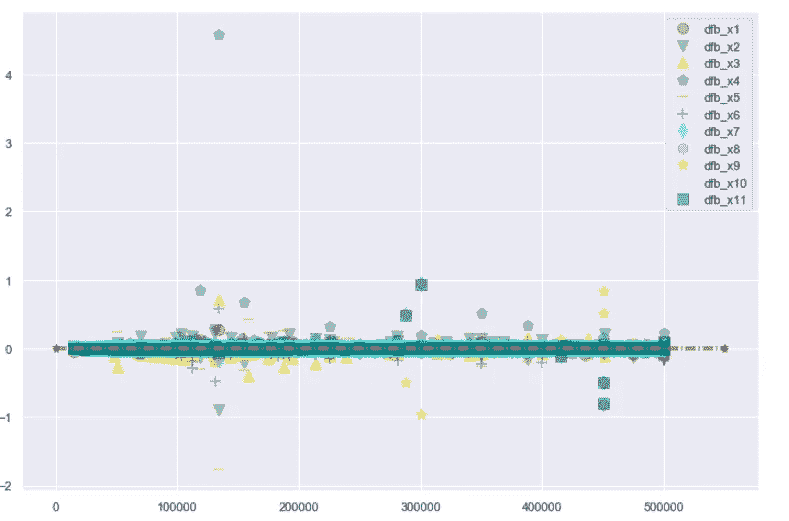

这张图将帮助我们了解哪些具体变量对观测值有重大影响

# 改进回归模型

既然我们有了关于可能有影响的数据点的信息，让我们删除它们，并尝试提高我们的模型的预测能力和拟合度。

```
#Influential Datapoints that we manually identified as both Outliers and have High Leverage
index_1 = outliers.index.to_list()#Outliers Identified Using Cooks Distances
index_2 = outliers_2.index.to_list()#Outliers Indentidied Using DFFITS
index_3 = outliers_3.index.to_list()indices = [index_1,index_2, index_3]for i in range(len(indices)):
    X = california[features].drop(indices[i]).values
    y = california['median_house_value'].drop(indices[i]).values
    X_train, X_test, Y_train, Y_test = train_test_split(X, y, test_size = 0.20, random_state = 5)
    model= sm.OLS(Y_train, sm.add_constant(X_train)).fit()
    print(model.summary())
    print(f'The R-squared for the model after removing influential points from {i} is {round(model.rsquared,3)}')
```

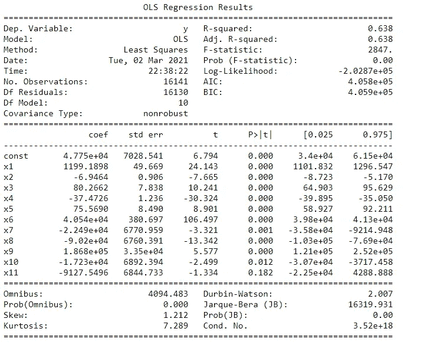

模型排除了那些残差和杠杆都很高的点(指数 1)

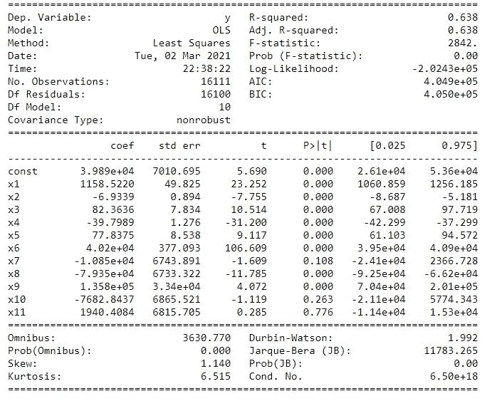

针对使用库克距离(指数 2)确定的影响者调整模型

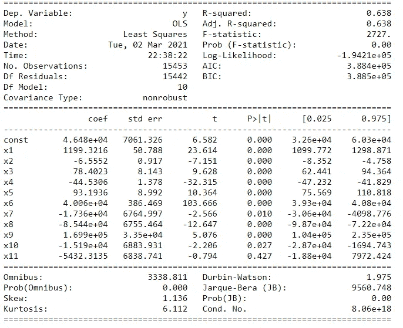

根据 DFFIT(指数 3)确定的影响点调整模型

## 模型比较

让我们比较我们的三个模型，并检查我们的调整是否提高了模型的预测能力。

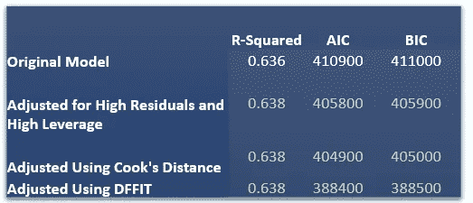

对于 R 平方，所有三个修订的改进都可以忽略不计(0.002)。对此一个可能的解释是我们有一个巨大的数据集。模型精度中的几个点的影响变小。您可以在来自 *sklearn.datasets.* 的 Boston Housing 数据集中验证这一点。这意味着对于较小的数据集来说，移除有影响的点要比对于较大的数据集来说重要得多。

然而，正是在赤池信息准则(AIC)和贝叶斯信息准则(BIC)中，我们看到了移除我们的影响点的好处。在线性回归模型中进行选择时，AIC 和 BIC 都被用作选择标准。这两个数字越低，模型的拟合度就越高。

## 结束语

对于上面的数据集，使用 *dffits* 移除影响点会在我们生成的模型中产生最佳拟合。但是，值得注意的是，在某些情况下，其他两种方法可能会生成更好的模型。

另一件要考虑的事情是:虽然我们可能希望提高模型的预测能力，但排除有影响的数据点不一定是我们想要的。例如，如果模型的目的是识别那些极端的、有影响的实例，比如说贷款违约，删除这些点将使我们的模型不知道什么特征导致这些有影响的实例。

在我的 [GitHub](https://github.com/francisadrianviernes/Machine-Learning/tree/master/Influential%20Points%20vs%20Outliers) 页面上可以找到全部代码。

# **参考文献**

[](https://www.datasklr.com/ols-least-squares-regression/diagnostics-for-leverage-and-influence) [## 离群值、杠杆和有影响的观察值

### 观测值在空间中的位置在确定回归系数时起着重要作用。有些观察是远…

www.datasklr.com](https://www.datasklr.com/ols-least-squares-regression/diagnostics-for-leverage-and-influence) 

[https://stattrek.com/regression/influential-points.aspx](https://stattrek.com/regression/influential-points.aspx)