# 用简单的数学公式检验数据误差的线性回归

> 原文：<https://towardsdatascience.com/linear-regression-test-data-error-with-a-simple-mathematical-formula-4f5161472a8d?source=collection_archive---------28----------------------->

## 每个数据科学家和机器学习研究者都应该记住这个概念

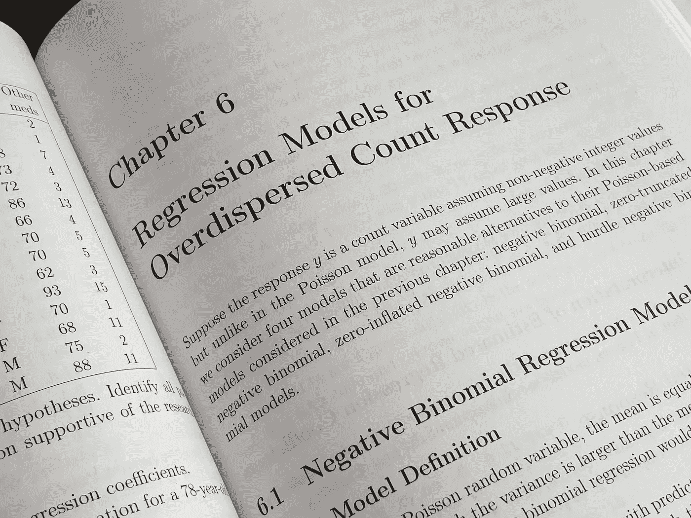

在 [Unsplash](https://unsplash.com/s/photos/regression?utm_source=unsplash&utm_medium=referral&utm_content=creditCopyText) 上由 [Enayet Raheem](https://unsplash.com/@raheemsphoto?utm_source=unsplash&utm_medium=referral&utm_content=creditCopyText) 拍摄的照片

# 1.介绍

线性回归可能是统计/机器学习中最重要的概念之一，因为它易于理解和实现，更重要的是，许多真实情况可以建模为线性，或者可以通过使用适当的数学变换简化为线性。

当我们在数据集上执行统计/机器学习时，我们将数据分成训练和测试数据集。与这种分裂相关的一个非常重要的量是测试数据集上的成本函数的期望值，这是机器学习中非常重要的量。在之前的[文章](/simple-mathematical-derivation-of-bias-variance-error-4ab223f28791)中，我展示了这个期望值是如何在偏差和方差等各种量中分布的，在另一篇[文章](https://medium.com/geekculture/understanding-the-bias-variance-error-with-specific-python-examples-145bd3255cfd)中，我通过 Python 给出的具体例子展示了偏差-方差误差是如何分布的。我建议看一看这些文章，以理解我下面提出的许多数学推导的逻辑流程。

正如我在前面提到的文章中所展示的，测试数据成本函数的期望值由下式给出

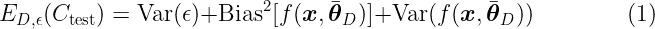

现在假设一个人想进行线性回归(简单的或多元的)并问这个问题:测试数据的总误差的期望值是多少？在本文中，我将向您展示线性回归测试数据误差的表达式确实非常简单，每个数据科学家和机器学习研究人员都应该记住。在本文中，我假设读者了解统计理论、线性代数和微积分。这篇文章的难度处于中高级*水平*。

# 2.线性回归的基本理论

在这里，我简要概述了多重(或多元)线性回归的理论，这将在下一节中非常有用。给定一个数据集 *D = {y_i，****x _****(I)}*of*n*个数据点，其中 *i = {1，…，n}，y_i* 为自变量的分量，****x _****(I)为*自变量 *y 对应的预测向量**

*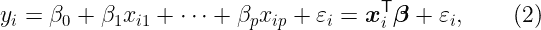*

*其中向量 ***β*** 是具有 *p+1* 分量的系数向量，预测向量****x _****(I)*具有 *p+1* 分量。等式(2)中的符号(T)表示向量或矩阵的转置。这里按照我之前的文章， *ε_i* 表示随机误差或噪声变量假设为独立同分布的高斯变量，均值为零，方差 *σ。***

**因为我们有 n 个数据点，实际上，等式(2)形成了一个线性方程组，可以用更紧凑的形式来写**

**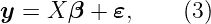**

**其中 *X* 具有 *n* 行和 *p+1* 列的形状*的设计矩阵， ***ε*** 是具有 *n* 分量的误差列向量， ***y*** 也是具有 *n* 分量的自变量列向量***

*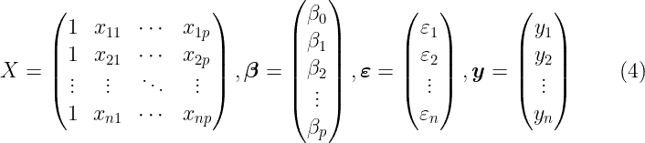*

*要记住的关键点是，方程(2)或(3)是我们对预测值和自变量之间真实线性关系的近似。这是一个近似值，因为它包括随机误差项。目标是通过最小化过程找到向量*，在本文中，我考虑普通的最小二乘(OLS)过程。这个最小化过程要求误差项的欧几里德范数，必须是最小的，即| |***ε***| |**|*=*|**|*X****β-y***| =最小值。**

**通过进行一些简单的计算，包括计算| |*X****β-y***| |的欧几里德范数，并通过对向量 ***β、*** 取偏导数使其最小化，可以得到:**

**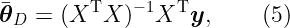**

**等式(5)给出了通过使用 OLS 最小化方法找到的向量 ***θ*** 。在这里，我使用了与我之前的[文章](/simple-mathematical-derivation-of-bias-variance-error-4ab223f28791)中相同的符号来保持我下面提出的推导的逻辑流程。**关于等式(5)很重要的一点是，只有当 X 与 X 的转置的矩阵乘积是可逆矩阵时，它才有效**。如果*n>p*，即行数比列数多得多，这通常是正确的。如果矩阵 rank，rank( *X* ) = *p* ，那么方程(5)中的向量 ***θ*** 唯一，如果 rank(*X*)<*p(*当 *p > n)* 时哪个成立，那么 ***θ*** 不唯一。**

**计算 ***θ*** 有几种方法，可分为直接法和迭代法。直接法包括 Cholesky 和 QR 分解法，迭代法包括 Krylov 和梯度下降法。我不在本文中讨论这些方法。**

# **3.线性回归测试数据误差**

**在这一节中，我将向您展示如何计算测试数据的线性回归的总误差，最终的结果可能会让您大吃一惊。正如我在上一篇文章中所展示的，等式(1)是通过偏差、方差和噪声来表达测试数据平均误差的可能性之一。然而，出于本文的目的，最好使用我上一篇文章的[等式(5)的最终形式，我写为:](/simple-mathematical-derivation-of-bias-variance-error-4ab223f28791)**

**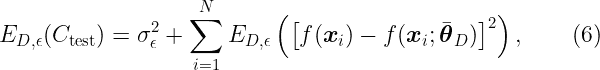**

**作者完成的计算**

**等式(6)是上文等式(1)的等价形式。需要注意的是，等式(6)中的和超过了*测试数据点*而不是训练数据，并且期望值 *E(.)*，是对数据集 *D* 和错误实例 *ε* ***。*** 对于多元线性回归，等式(6)中出现的真实函数和学习函数由下式给出:**

**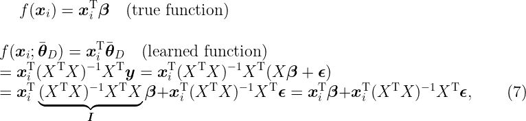**

**作者出于教育目的所做的计算**

**其中等式(7) ***I*** 为单位矩阵。现在，我在等式(6)的第二项中插入真实函数和学习函数，并且我得到(我暂时去掉求和符号):**

**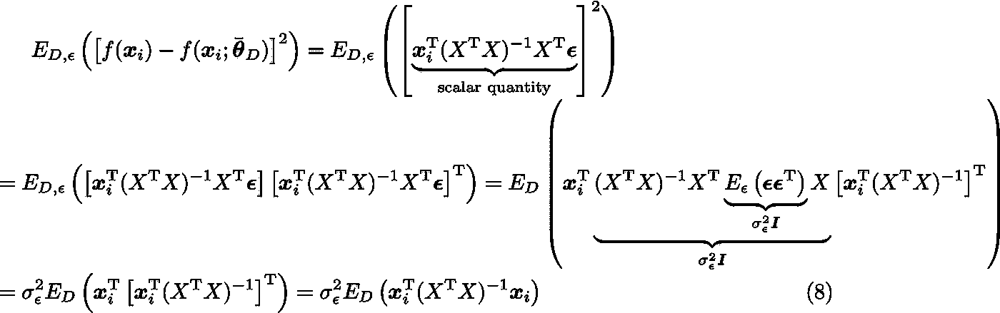**

**作者出于教育目的所做的计算。**

**在推导等式(8)时，我使用了具有逆矩阵的**方阵的不同属性。我没有在这里展示这些属性，因为我假设读者知道它们。****

**现在我要你们非常仔细地注意等式(8)中的最后一项。如您所见，在表达式中出现了训练数据集的期望值，唯一依赖于训练数据集的变量是设计矩阵 *X* 及其转置。如果训练数据集是从数据集的正态分布中随机选择的，这是通常的情况，那么矩阵 *X* 是依赖于训练数据的随机矩阵。**

**当我在我以前的文章中推导偏差-方差误差(上面的等式(1))时，我明确表示，对训练数据集采用超过 *D* 的期望值，因为在选择这些训练数据集时存在随机性。然而，通过选择随机训练数据集，原则上，这也意味着随机测试数据集**，如果**数据在训练-测试过程中从**相同的原始数据集**中分离(例如 80%-20%)。这意味着， *D* 上的期望值可以被拆分为训练和测试数据集的期望值:**

**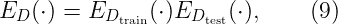**

**下一步是计算等式(9)中矩阵的期望值。在明确地进行计算之前，需要做一些重要的假设。*这些假设是训练和测试数据预测向量分量不相关，正态分布，均值为零，E(****)x****)=****0****，方差等于 1*。这可以很容易地通过标准化随机向量分量来实现，以使均值为零且方差等于 1。这里我假设读者知道这些程序。**

**下一步是查看表达式(4)中的 *X* 矩阵的形式，并将其与其转置相乘。乘法之后，得到一个具有 *(p+1)* 行和列的方阵。左上角的这个矩阵的第一个元素是数字 *n* ，如果在矩阵外分解这个数字，则剩下一个矩阵，该矩阵具有作为元素的每个预测器分量的*算术平均值、*平方平均值、和*互相关值*。在这个阶段，人们调用大随机数定理，该定理指出，对于非常大或无穷大的 *n* ，随机变量的*算术平均值*可以用平均值(=*E(****x****)*)来近似，在我们的情况下，假设平均值为零。同样通过使用向量分量不相关且方差为 1 的事实，对于非常大的 *n* ，与 *X* 转置的 *X* 的乘积的倒数等于 1/ *n* 乘以 *(p+1)* 单位矩阵。通过使用这些论点，我得到:**

**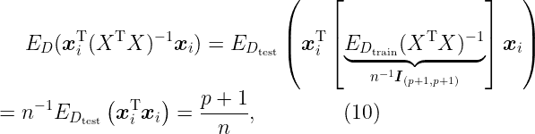**

**作者出于教育目的所做的计算。**

**现在，通过使用等式(8)中的等式(10)并替换等式(6)中的结果，并对测试数据点 *N* 求和，我得到以下最终结果:**

**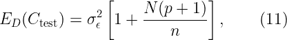**

**多元线性回归试验数据误差的最终表达式。作者出于教育目的所做的计算。**

# **4.结论**

**在本文中，我向您展示了如何在机器学习中计算多元线性回归的总测试数据误差。最终结果在等式(11)中给出，正如我上面提到的，其表达式非常简单，并且取决于训练数据号( *n* )、测试数据号( *N* )和预测器号( *p* )。统计/机器学习模型仅在 *N(p+1)/n* 非常接近零时“学习”良好，这可能发生在 *n > > N(p+1)时。*人们可以通过组合这些数字来尽可能减少总测试数据误差。**

**重要的是，你要提醒所有推导等式(11)的假设。这些假设是:随机误差变量 *ε_i* 独立同分布(i.i.d) 均值为零，方差 *σ。*随机训练和测试数据预测器向量分量是独立的，正态分布，均值为零，方差等于 1，并且独立于 *ε_i.* 另一个重要假设是训练数据预测器数( *n* )必须是一个非常大的数。**

**显然，读者还必须记住我在第 2 节讨论多元线性回归理论时所做的假设。**

# **如果你喜欢我的文章，请与你可能对这个话题感兴趣的朋友分享，并在你的研究中引用/参考我的文章。不要忘记订阅将来会发布的其他相关主题。**