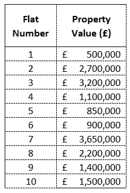
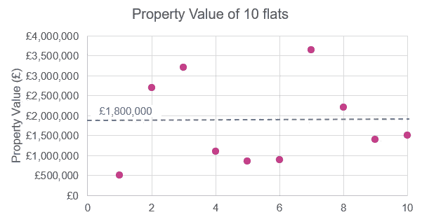
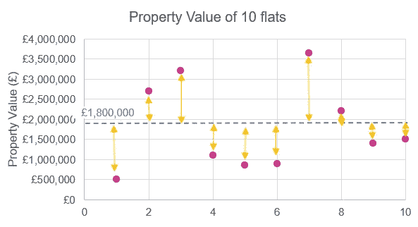
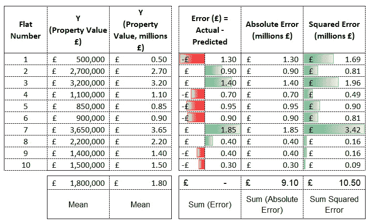
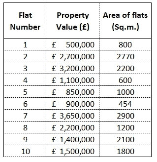
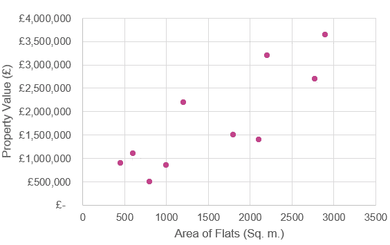
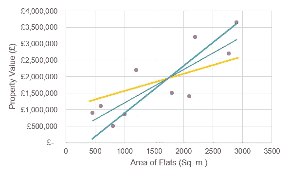

# 线性回归(第一部分)——基本的构建模块！

> 原文：<https://towardsdatascience.com/linear-regression-the-basic-building-blocks-part-1-abd605c39f?source=collection_archive---------17----------------------->

## 介绍最广泛使用的数据科学技术之一的需求和基本概念

由 [Unsplash](https://unsplash.com?utm_source=medium&utm_medium=referral) 上的 [Element5 数码](https://unsplash.com/@element5digital?utm_source=medium&utm_medium=referral)拍摄

# 什么？

作为人类，**我们喜欢寻找事物之间的联系——**不管是有意还是无意，我们都这样做。数据科学家通过大组织收集的数据来解决商业问题；而一个普通人会一边走在街上一边在心里计算他需要走多快才能在某个时间到达目的地。其他常见的例子有:根据你的需求为购物旅行做预算，根据你朋友的品味向他们推荐一件衣服等等。

关键的一点是，你是基于其他一些显式/隐式的已知和未知因素来预测(或估计)某事。例如，在上面的例子中，当你估计你想要的速度时，步行街的街道长度和时间都是因素，同样，你在购物旅行中需要购买的东西是帮助你预测预算的因素，而你朋友的品味是帮助你向他们推荐服装的因素。我们都有意或无意地寻找关系并预测(或估计)事物。这就是我们的工作。日复一日！

> 我们都有意识或无意识地评估或预测事物。我们不妨用艺术和科学的结合来做好它。

回归是一个**数学/统计程序，用于找出一个**因变量**和几个**自变量**变量(或影响因变量的因素)之间的关系**。

*   “因变量”也称为结果变量(通常用 y 表示)
*   自变量也被称为预测因子、特征等。(通常用 X 表示)

*单词“***”****中的“线性回归”*** *是指一个因变量与一组自变量之间存在一种***的“线性”关系。***

# **为什么？**

**线性回归是科学家/分析师了解的第一个算法的数据之一，因为它是大多数高级算法的基础。它有许多使用案例，下面是一些常见的案例:**

1.  **最常见的是使用一组独立变量(或因子/预测因子)来预测变量的值。**
2.  **了解哪些因素(即我们的预测因素/自变量)在预测因变量时是重要的还是不重要的。**
3.  **了解因素(即我们的预测因素/自变量)与因变量是直接关系还是反向关系**
4.  **理解因素对因变量的影响程度。**
5.  **…**

# **起源**

**为了理解线性回归模型，让我们首先理解线性回归的必要性，然后继续我们正在尝试做的事情。**

## **估计或预测的需要**

**正如我们现在所知道的，我们每天都需要预测(或估计)。让我们拿起一个例子来预测你所在地区的房地产价值。为此，您收集了您所在区域的 10 套公寓的数据，并记下了它们的房产价值。下面的表 1 记录了这一点。**

****

**表 1 | 10 个单位的房产价值(虚拟数据)(图片由作者提供)**

**现在，如果你被要求对你所在地区的财产价值提供一个**估计，**只是基于你已经收集的数据(即只是现在的‘财产价值’)；你会怎么做？**

**→是的，你的思路是对的。你会根据你的实际数据点来考虑**‘财产价值’**的**平均值**或**平均值**。结果是:180 万。所以，你会说我所在地区的平均房产价值是 180 万英镑，这是你对任何没有实际价值的新房产的预测。**

**这是正确的；虽然这没有考虑任何其他因素；例如，公寓的平方英尺(或面积)。“房产价值”肯定会随着公寓的大小而变化。但在这种情况下，仅基于一个变量(即“属性值”)，您的最佳估计值为 1.8m，如下所示。**

****

**图表-1 |说明了一个变量情况下的平均最佳估计值**

## **实际与预测偏差:残差或误差项**

**请注意，如果我们对有实际数据的公寓给出 180 万的估价，我们会偏离实际的房产价值，如下图 2 所示。也就是说，**我们预测的(或估计的)属性值与实际属性值**
(在这种情况下预测的是平均属性值)之间存在偏差**

> ****最佳估计是最接近现实的估计**。这意味着一个好的回归模型的目的是**最小化预测值和实际值之间的偏差或可变性**。**

**现在我们知道，对于因变量，我们预测的值总是不同于我们数据中的实际值，了解预测值与实际值之间的偏差可以帮助我们了解我们的预测有多好。**

****

**图表-2 |说明平均工资的差异。根据单个数据点(虚拟数据)进行估计(图片由作者提供)**

**回到我们的例子，我们对“财产价值”的预测是平均值 180 万英镑(因为我们现在只把它作为一个变量“财产价值”的基础)。如果你在图表 2 中看到，这个偏差用黄线表示。**

> **实际值与预测值之间的偏差被称为**误差项或残差**，**

**即**实际—预测=误差项或残差****

## **总结偏差/残差——实际与预测:**

**由于线性回归旨在更好地预测，我们确实需要了解实际和预测之间的偏差，以了解预测有多好。我们确实需要残差(或误差项)的汇总指标，以了解我们的预测与现实(即实际值)的接近程度。**

1.  **总结我们预测的一个快速方法可以是对所有数据点的所有误差项求和**。在下面的表-3 中，您可以看到误差项被计算为 y 实际值和 y 预测值*之间的差值(在这种情况下，y 预测值是 y 的平均值，即 1.8m)。*
    -在一些数据点中，**误差为正，而在一些数据点中，误差为负**；取**和将抵消误差项的影响**。
    *-因此，误差项(或残差)* ***之和不是描述实际值与预测值之间偏差*** *的良好度量。*****
2.  **总结这一点的一个更好的方法是取实际值与预测值之间的绝对差值***(抵消误差项为负或为正的影响)*，然后取其和。这被称为**绝对误差之和**。
    -在下面的表-3 中，您可以看到误差项的绝对值，然后我们求和得到 9.10m。*这解决了由于正负误差项相互抵消的问题。*****
3.  ****绝对误差和是描述实际值与预测值**之间偏差的好方法，但它对所有剩余数据点**赋予相同的权重。也就是说，高或低残差得到相同的权重。对此的改进是惩罚实际值和预测值相距较远的数据点(即**更多地惩罚高误差项**)。这可以通过取所有数据点之间的平方差，然后取它们的和来实现。这被称为'**误差/残差平方和**'(平方和也被称为' SS ')。
    -在下面的表-3 中，您可以看到平方误差，然后我们求和得到 10.5 米。*请注意，这解决了一些误差项相互抵消的问题，同时也惩罚了更高的误差项。* - **SS** 是**描绘**实际与预测**偏差**的好方法**。******

**了解 SS 很重要，因为这将用于解释线性回归中的进一步概念。**

****

**表-3 |显示了误差项,“属性值”(虚拟数据)的总和(绝对误差)和平方差(图片由作者提供)**

## **我们能改进这种估计/预测吗？**

**改进预测意味着最小化实际值与预测值之间的偏差。也就是说，让我们的预测尽可能接近实际值，这意味着**最小化误差/残差的平方和**。**

**一种方法是收集公寓面积的数据，并在此基础上改变我们对房地产价值的预测。这肯定比所有类型公寓(从小型公寓到大型多层别墅)180 万套的预测更准确**

**→ *这是我们对线性回归的初步了解*，因为认为**在“房产价值”和“公寓的平方英尺(面积)”**之间存在线性关系似乎是合乎逻辑的，我们可以使用其中一个来预测(或估计)另一个。
*(“单位面积”用于估算/预测“物业价值”)***

**现在，让我们假设当你收集 10 套公寓的“财产价值”数据时，你也设法收集了公寓的平方英尺(或面积)。现在，如表 2 所示，有两个变量在起作用:**

*   **房产价值——房产的价值*(需要预测)***
*   **户型面积——户型面积*(可用于预测“房产价值”)***

****

**表 2 | 10 个单位的房产价值和面积(虚拟数据)(图片由作者提供)**

**请注意，我们试图建立的关系是“财产价值”取决于“平方英尺面积”，而不是相反，因为那样没有意义*(财产的面积通常是固定的，财产价值将取决于它)*
即**财产价值→ f(单位面积)****

**现在，为了理解这种关系，让我们在两个轴上绘制这些数据点；让我们用 Y 轴代表“房产价值”，X 轴代表“公寓面积”。**

****

**图表-3 |显示 10 个单位的物业价值与面积的关系(虚拟数据)(图片由作者提供)**

**现在，在做任何分析之前，让我们先看看图表 3。它显示属性值随着面积的增加而增加，似乎**和**是线性相关的。**

**让我们把模型-1 作为我们预测所有公寓的平均房产价值的场景。模型 2 作为一个场景，其中我们使用“公寓面积”来进行预测。**

*   **模型-1:预测的属性值=平均值(属性值)**
*   **模型 2:预测房产价值→ f(公寓面积)**

**如果我们知道我们试图估算/预测其房产价值的公寓的面积，也就是说，通过知道公寓的面积，我们将能够对更接近实际价值的房产价值进行预测，那么我们对 180 万英镑的平均估算/预测就有了直观的意义。**

**→当我们在组合(即模型-2)中引入平面面积时，模型-1 中实际值与预测值(预测值定义为平均值)的可变性(或偏差)将会降低，因为我们将获得更接近实际值的预测值。**

**→ *这就是线性回归的作用。***

> **当我们知道一个或多个预测变量(也称为自变量)的值时，线性回归帮助我们**估计/预测**一个变量(也称为因变量)的值。**
> 
> **线性回归模型的目的是通过使用独立变量来最小化预测值与实际值之间的可变性，即最小化残差平方和。**

**通过比较我们的模型#1(预测 y =的平均值)与我们的新模型(其中 y →函数(X ))之间的残差平方和(代表实际值与预测值),可以确定我们预测 y 变量的能力。
→如果我们的模型#2 是重要的，它将给我们一个更接近实际的预测；这意味着它将“吃掉”我们的基础模型#1 的一些可变性/偏差。**模型旨在最小化残差平方和**(代表可变性/偏差)，该模型将更好地“拟合”数据。**

# **线性回归——模型**

**线性回归模型是一种数学方程，它根据一个或多个自变量对因变量的值进行建模。线性回归的一般形式:**

**因变量是自变量的函数: **y → f (X)****

**即**y = B0+B1 * X1+B2 * X2+B3 * X3+……**—等式(1)**

**其中，y —因变量和
X1，X2，X3，..—帮助我们估计/预测 y 的独立变量**

**思考我们预测资产价值的问题，**

****属性值(预测)= B0 + B1 *(平坦面积)** —方程(2)*(请注意我们这里只有一个自变量，即平坦面积)***

**等式(2)清楚地表示 2-D 平面中的直线，预测的属性值在 Y 轴上，平坦区域在 X 轴上。这意味着，线性回归产生一条直线，这意味着图表 4 中描述的任何一条线都可以是我们的回归线(请参见下面的图表 4)。**

****

**图表-4 |显示可能的线性回归线(虚拟数据)(图片由作者提供)**

**请注意，对于给定的 X(平面面积)值，所有这些线都预测 y(即属性值)，并且所有这些线都与实际的 y 值(即数据中的实际属性值)有一些偏差。请注意，如前所述，建模的目的是尽量减少预测值与实际值的偏差。**

**在所有这些线中，将有一条线给出最接近 Y 的实际值(即实际属性值)的 Y 的预测或估计。这被称为最佳拟合的**线**。**

> **最佳拟合线是通过我们的数据点的线性线，它最好地表达了我们的因变量和自变量之间的线性关系。**

> ****简单线性回归**实际上是两个模型的**比较**:**
> 
> **-一种是**自变量甚至不存在**，即 y 的平均值是我们的预测(或者**y 的平均值是回归线****
> 
> **-一个是**y→函数(X)** 和**回归线最小化实际与预测**的可变性(称为最佳拟合线)**

# **总结！**

*   **我们每天都在以某种形式进行回归，以预测这样或那样的事情。**
*   **我们的目标是预测尽可能接近实际情况，即尽量减少实际与预测之间的偏差。**
*   **线性回归:**y = B0+B1 * X1+B2 * X2+……****
*   **误差/ **残差= y(实际)— y(预测)**。**
*   **SS(平方和)是捕捉一个变量内部和两个变量之间偏差的好方法。**
*   **最佳拟合线→最佳拟合回归线，目标是最小化实际值与预测值之间的偏差**，即最小化残差平方和**。**

## **保持联系..**

**如果你喜欢这篇文章并且对类似的文章感兴趣 [***在 Medium 上关注我***](https://medium.com/@deepakchopra2911) ， [***加入我的邮件列表***](https://medium.com/subscribe/@deepakchopra2911) 和*(..如果你已经不是了..)*跳上去成为[***Medium 家族的一员***](https://medium.com/@deepakchopra2911/membership)*获取成千上万篇有用的文章。*(如果您使用以上链接，我将获得您约 50%的会员费)****

*****..不断学习，不断成长！*****