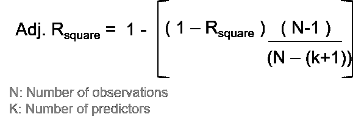

# 线性回归(第二部分)——幕后数据科学！

> 原文：<https://towardsdatascience.com/linear-regression-the-behind-the-scenes-data-science-part-2-efdb9bf5437c?source=collection_archive---------16----------------------->

## 深入探究最广泛使用的数据科学技术背后的数据科学/数学

安妮·斯普拉特在 [Unsplash](https://unsplash.com?utm_source=medium&utm_medium=referral) 上的照片

# 线性回归

我们知道，当我们试图用一组**独立**变量(称为预测因子)预测一个变量(称为**因变量**)的值时，需要线性回归

*请查看我之前关于为什么需要回归的帖子的链接。*

 [## 线性回归——基本构件！(第一部分)

### 介绍最广泛使用的数据科学技术之一的需求和基本概念。

towardsdatascience.com](/linear-regression-the-basic-building-blocks-part-1-abd605c39f) 

# 回归方程

让我们坚持同一个例子*(如上面的文章)*，其中我们试图预测一个地区的“财产价值”，并收集了 10 套公寓的以下数据。

图片-1 |收集的 10 套公寓的房产价值和面积数据(虚拟数据)(图片由作者提供)

图 1 显示了“房产价值”(Y 轴)和“公寓面积”(X 轴)的数据和散点图。“房产价值”和“面积”的平均值由**蓝色十字(X 均值，Y 均值)**表示。

我们在图中清楚地看到,“房产价值”根据“公寓面积”而变化；因此，与其用**使用‘平均房产价值’**、**进行一刀切的预测，我们不如**使用**、【公寓面积】来预测‘房产价值’**，因为它们之间显然存在**线性关系**。

即**属性值→ f(平面面积)**

*这可以理解为“房产价值”是“公寓面积”的函数，或者“房产价值”随“公寓面积”而变化。*

上述关系由线性回归模型描述。描述这一点的线性回归模型的一般形式是:

> y-预测= B0 + B1 * X1 + B2 * X2 + B3 * X3 +…

> 对于这个特定的场景，其中我们有一个独立变量，线性模型将是这样的:
> **y = B0 + B1 * X** —等式(1)
> …其中，y =房产价值(根据模型预测)，X =公寓面积

让我们对 image-1 中定义的数据进行回归。我们现在将使用 Excel，但同样的过程可以在任何统计工具中复制。

当我们使用 Excel 建立一个快速简单的回归模型时，我们得到了**一条最佳拟合线，即基于 10 个公寓的房产价值和面积数据的模型拟合的回归线**。请参见下面的图表-1，其中“蓝线”为最佳拟合线。我们还得到了详细的统计数据，如下表 2 所示，将在本文后面详细讨论。

*(请注意，即使我们使用任何不同的工具来做线性回归，我们也会得到非常相似的输出)*

图表-1 |对 10 个平面的虚拟数据进行简单线性回归的最佳回归直线(图片由作者提供)

*   可能有许多直线符合数据，但是线性回归的目的是**最小化实际值和预测值之间的偏差**。
    -因此，回归线或最佳拟合线是最适合数据的线，即最小化实际值和预测值之间的偏差。
*   请注意，最佳拟合的**线穿过代表 X 和 Y(即分别为面积和属性值)平均值的质心点(X-mean，Y-mean)** 。
    →实际数据(X，Y)的质心与预测数据(X，Y-pred)的质心相同。
    →y-actual 的平均值与 y-pred 的平均值通过回归得到
*   我们得到的代表最佳拟合线的回归方程是:

> **y = 0.209 + 0.001 * X** —等式(2)

将此与等式(1)进行比较，我们看到 B0=0.209，B1=0.001 *(除了图 2 所示输出中的系数之外，什么都不是——将在下面详细讨论)*。

*   此外，值得注意的是，任何回归模型运行总是基于样本。我们很少也不太可能获得全部人口的数据。在本例中，我们也对 10 套公寓的相关数据进行了分析。
    →我们从回归模型中得到的值是**基于样本的人口估计值，模型是基于样本建立的**。

# 一些必须知道的术语/概念:

现在，我们将尝试详细了解输出。首先，在深入研究回归输出统计之前，让我们理解一些术语及其含义。

## y 的预测值

最佳拟合直线的等式(2)给出了 y 的预测值:
**y = 0.209 + 0.001 * X.**

如果我们将数据表(图 1)中的 X 值代入上述等式，我们将获得每个观察值的属性值(y)的预测值。

## 误差项或残差

我们知道，无论模型有多好，实际值和预测值之间总会有一些差异。

这个差值被称为**残差**或**误差项**

→ y(实际)= y(模型)+误差
*其中，y(模型)由上述*的最佳拟合方程(1)定义

> **误差项/残差** =实际和预测属性值的差异

请注意，在进行回归时，我们试图对数据进行建模，目的是**获得因变量 y** (取决于自变量 X 的值)**的更准确预测，而不是使用 y 的平均值进行“一刀切”的预测。**

→也就是说，我们希望使用独立变量**来预测一个比仅使用平均 y 值的最基本预测更接近实际 y 值**的 y 值。

> **快速回忆！！**
> 
> 正如我们在'[中讨论的线性回归——基本构建模块！(Part-1)](/linear-regression-the-basic-building-blocks-part-1-abd605c39f) ，我们知道**方差或平方和(SS)** 是一种理解和量化数据中**‘偏差’或‘可变性’**的好方法，因为:
> -在 SS 中，**负偏差和正偏差不会相互抵消**。
> -平方确保**高偏差受到更多惩罚。**

请参见下图-2，由于引入了自变量，引入了一条回归线，为我们提供了因变量的预测值(基于自变量)。
→显然，预测比平均预测更接近实际值。这意味着，由于独立变量的引入，预测值和实际值之间的差异已经减小，并且部分差异可以由独立变量来解释。

> 可变性(总)=可变性(预测)+可变性(残差)
> 
> →平方和总计=平方和模型+残差平方和

图表-2 |描绘最佳拟合线周围的预测、残差、平方和(虚拟数据)(图片由作者提供)

平方和总计=模型平方和+残差平方和

**总平方和(SST) :** 这代表实际(或观察到的)因变量与其均值之间的“偏差”。
-计算为实际(或观察到的)因变量与其均值之间的平方差之和(跨越所有数据点)。

**误差/残差平方和(SSE/SSR)** :这是误差项或残差(即因变量的实际值和预测值之间的差异)的平方和(跨越所有数据点)。

**平方和模型(SSM)** :这是因变量的预测值与预测均值之间的平方差。

# 简单线性回归的输出

如上所述，在运行一个简单的线性回归之后，我们得到了一堆统计数据输出。请参见下面的表 2。

表 2 |对 10 套公寓的房产价值和面积收集的数据进行线性回归的输出统计(虚拟数据)(图片由作者提供)

现在，让我们试着详细理解这一点:

# 方差分析表

图 2(上图)的第 1 部分给出了与我们的回归模型相对应的方差分析表。这个我们来详细了解一下。

## **自由度(df)**

这些是与方差来源相关的自由度。
*N:观测值总数，k:自变量个数*

*   因为我们有 10 个观察值，并且预测 1 个变量，所以我们有超过 9 个数据点的自由度。所以，总自由度是 9。
    **df(Total) =观察数量-预测数量= N-1**
*   由于我们有 1 个独立变量，回归模型的 df 为 1。
    **df(回归或模型)=自变量数量= k**
*   在总自由度中，k 与回归(或模型)相关联，剩余的自由度被分配给残差。
    **df(残差或误差)= df(总量)—df(回归)= N-(k+1)**

在我们的模型中，N=10，k=1..代入上面的值，我们得到，
→ df(总)=9，df(回归)=1，df(残差)=8

## **平方和(SS)**

正如上一节所讨论的，SS 代表任何数据的可变性。分三级计算:
-合计*(实际值与平均值)*，
-回归*(模型预测值与平均值)*，
-残差*(实际值与模型预测值)*。

我们现在知道:

图片-2 | SST、SSM 和 SSR 的计算(图片由作者提供)

在表-2 中，我们可以看到 SST=10.495，SSM=7.260，SSE=3.235，SST=SSM+SSR 成立。

## 均方误差(毫秒)

这被定义为每个自由度的平方和(变化)。它的计算方法是将平方和除以自由度。

> **均方=平方和/ df**

在我们的例子中，我们得到:
— MS(模型)= SS(模型)/ df(模型)= 7.260/1 = 7.260
— MS(误差)= SS(残差)/ df(残差)= 3.235/8 = 0.404

## F 值和显著性 F(或 P 值/ Pr。> F)

它被定义为均方差(模型)与均方差(残差)的**比率。**

> ***解读:*** 可以认为是模型 vs .中和自由度后的残差对可变性的解释程度。
> 
> **F 值= MS(模型)/ MS(残差)**
> 
> 更高的 F 值→模型解释的可变性远高于未解释的可变性→显著模型

**显著性/ P 值/ Pr。 **F 检验**的> F"** 表示我们有**的**置信水平，即使用的自变量可靠地预测因变量**。然后将显著性或 P 值与预定的α水平(通常设置为 5%)进行比较。**

> ***释义*** *:*
> 
> 假设:自变量不能可靠地预测因变量
> 
> —如果 P 值≤ 5% → **拒绝假设**，我们可以得出结论“是的，至少有一个自变量可靠地预测了因变量”
> 
> —如果 P 值> 5% → **假设不能被拒绝**并且我们可以得出结论“没有足够的证据表明自变量可靠地预测因变量”

注:请注意，上述 **F 检验是一个整体模型显著性检验**，以显示所有自变量**合在一起**是否能够可靠地预测因变量，即我们的模型是否显著。

对于我们的模型，F 值= MS(模型)/ M(残差)= 17.953
对应 p 值=0.00249=0.2% < 5%
→自变量可靠预测因变量。

# 回归统计表

图 2(上图)的第 2 部分为我们提供了与回归模型的拟合优度相关的数据。这个我们来详细了解一下。

*请参见代表该零件的下表 2.2，以便快速参考。*

表-2.2 |简单线性回归的输出统计数据—回归拟合优度测量(虚拟数据)(图片由作者提供)

## 多重 R /相关系数

这代表由我们的回归模型得出的因变量的**实际值**和**预测值**之间的**相关系数**。用 **r** 表示。

> ***解读:*** 一般给出一个思路 y-actual 和 y-predicted 是同向运动还是反向运动。

*   它取值在-1 和 1 之间；即 **-1 ≤ r ≤1**
*   -ve 值表示两者向相反方向移动，即一个增加，另一个减少，反之亦然。
*   +ve 值表示两者向同一方向移动；即

这可能不是最重要的拟合优度度量，因为它不能让我们知道 y 预测值与 y 实际值有多接近，不管它们是否相关。

对于我们的模型，r = 0.832 即 y-实际值和 y-预测值密切相关，并在同一方向移动

## r 平方

r 平方是用于评估线性回归模型的重要拟合优度度量。它被定义为由自变量解释的因变量的变化的**百分比。**

> **R-square =平方和模型/平方和总数= SSM/SST**

正如我们所知，SSM ≤ SST(通过引入独立变量，变率降低):

*   R-square 将介于 0-1 之间，并以百分比(0%-100%)表示。
*   数值越高→模型解释的变异越多→线性回归模型越好

> ***解释:*** R 平方代表模型所解释的实际因变量的变化程度。
> —高 R 平方→模型解释的高变化→好模型

对于我们的模型，R-square = 7.260/10.495 = 0.692 = 69.2%
，即我们的模型能够解释我们数据中总方差的 69.2%。

## 调整后的 R 平方

随着更多的预测因子被添加到模型中，每个独立变量将解释因变量的一些变化*(在某些情况下，这只是由于预测因子的随机可变性而偶然发生的，而不是预测因子实际上是重要的)*。因此，如果我们继续增加更多的预测因子，我们可以继续增加 R-square，在某些情况下，这只是由于偶然的变化。

**可调 R-square** 是一个考虑到与手头数据相比使用相对较多预测值的影响的指标，而**给出了模型**的 R-square 的更真实的图像。

> ***释义:***
> 
> 调整后的 R-square 代表模型解释的实际因变量的变化程度(在对使用的预测值与观察值进行中和后)。

图-3 |调整后 R 平方的计算(图片由作者提供)

值得注意的是，(1-Rsquare)是无法解释的方差，用分数(N-1)/(N-(k+1))来加权

*   当**观察值(N)的数量远远高于预测值(k)** 的数量时；分数(N-1)/(N-(k+1))将趋向于 1。
    而无法解释的方差(1-R 平方)不会被过重。
    → **调整后的 R 角尺和 R 角尺将彼此靠近**。
*   **当 N 和 k 相当时**；即，与观察数量相比，大量的预测值；(N-1)/(N-k-1)将是一个很高的数；即过度加权未解释的方差(1-R 平方)并降低调整后的 R 平方。
    → **调整 R 平方将比 R 平方小得多**

对于我们的模型，N=10，k=1..
→调整后的 R 平方= 65.3%(非常接近 R 平方)

## 回归模型(SE 模型)的标准误差

标准误差(SE)是另一种显示回归分析精度的拟合优度测量值，**它代表实际观测值与回归线(即预测值)之间的平均距离**-数字越小，您对回归方程越有把握。

它被计算为均方残差(或误差)的平方根。

图-4 |标准的计算。回归模型的误差(图片由作者提供)

虽然 R-square 和调整后的 R-square 表示由模型解释的因变量方差的百分比，**标准误差是一种绝对度量，它显示数据点与回归线**之间的平均距离。

对于我们的模型，SE(回归)= 0.636

请注意，值得将此与因变量的平均值进行比较，因为两者的单位相同(本例中为“百万”)。

# 参数估计表

图 2(上图)的第 3 部分给出了与回归模型的参数估计或系数相关的数据。这个我们来详细了解一下。

*请参见下表 2.3，了解该部分的快速参考。*

表-2.3 |简单线性回归的输出统计—参数估计(虚拟数据)(图片由作者提供)

我们回归模型方程由下式给出: **y-pred=B0 + B1*X1 + B2*X2..**

具体到这个模型， **y-pred = 0.209 + 0.001 * X**

## **系数:**

参数估计或回归系数是 B1，B2 的值..等等。它们可以被认为是独立变量的**权重或重要性**(即 X1，X2、..等等。).

> **快速回忆:**
> 
> 值得一提的是，我们得到的是基于样本分析的(总体)参数估计。

我们有两种类型的系数:

1.  截距系数(即 B0)，它是独立的(即上面的回归方程中没有任何独立变量)
2.  独立变量(B1，B2，..等等。)

## **1。截距项或 B0 或β-0**

在回归分析中，我们试图预测因变量的值，而不是一个或多个自变量的值。

**截距项**或 **B0** (通称**β-0**)代表**因变量**在**所有自变量都不发挥作用**(即为零)时所取的值。

> 截距是所有 X=0 时 y 的**预期均值**

如果你仔细观察图表-1，它是最佳拟合线与 Y 轴相交的点；即 X 为 0 时的 y 值。

> ***释义*** *:*
> 
> 它可以被解释为当所有 X 都不存在(即零)时的**最小值‘Y’。
> 在我们的例子中，这意味着最小的“房产价值”，其中“公寓面积”为零。**

在我们的示例中，B0=0.207，因此这意味着即使公寓的面积(X 变量)为零，属性值(y 变量)也是 20.7 百万(在我们的模型中，y 的单位是百万)。在这种情况下，这没有多大意义，因为公寓的面积永远不会为零。然而，如果我们预测“iPhone 的销售”,并使用“广告支出”作为因变量，那么截距将代表没有广告支出时的“iPhone 销售”(即广告支出=0)，这是有意义的，因为一些人将购买它而不管广告与否。
*→所以，平心而论，* ***拦截可能有意义也可能没有意义****；这完全取决于* ***围绕模式的商业意识。***

## 2.X1 或 B1 或β-1 的参数估计/系数

自变量的系数代表因变量相对于自变量的**变化率**。也可以认为是自变量对因变量预测的**影响程度**。

参数估计也被称为**β系数**或**斜率**。

> ***释义*** *:*
> 
> 对于线性回归，它可以被解释为由于 X 的一个单位变化而导致的 Y 的**变化，假设其他一切保持不变。
> -在我们的案例中，这意味着“公寓面积”增加一个单位时“房产价值”的变化。**

在我们的示例中，B1=0.001，因此这意味着当平面面积(X 变量)有一个单位变化时，属性值(y 变量)增加 0.001。
→暗示当面积增加 1 平方时。m，房产价值增加 0.01 万或 1K(面积单位为 sq。m .和以百万为单位的财产价值)。
→即 100 平方英尺。m .面积的增加导致属性值增加 100K ( 0.1m)
这是有意义的，因为属性值会随着面积的增加而增加。

*   系数的绝对值代表自变量对因变量预测的影响程度。
    —绝对值越高→对应自变量的影响越高。
*   系数的**符号代表自变量对应的因变量的变化方向**。
    — **系数为+ve** →自变量增加时因变量增加，即 **y 直接随 X 变化**。
    — **系数为-ve** →自变量减少时因变量增加，自变量增加时因变量减少，即 **y 间接随 X 变化**。

## 系数对应的标准误差

这些是与系数相关的标准误差。这表示参数估计(或回归系数)的不确定性。

*   标准误差用于测试参数是否明显不同于 0，方法是将参数估计值除以标准误差以获得 t 值(请参见 t 值和 p 值一栏)。
*   标准误差也可用于形成参数的置信区间，如该表的最后两列所示。

图-5 |标准的计算。贝塔系数的误差(图片由作者提供)

对于我们的模型，
SE(B1)= 0.000237
SE(B0)= 0.426009

## t-Stat/P-值对应的系数

与 t-stat 对应的 t-Stat 和 P-value 用于**检查系数或参数估计值是否与 0** 显著不同。

> t-Stat =系数/标准。误差(系数)
> 
> 较高的 t-Stat →系数的估计值远高于相应的不确定性/误差→统计显著系数

“ **P 值/Pr>t”**表示测试我们正在观察的参数估计值是否偶然不同于 0。

它是通过将 P 值与预先确定的α水平(通常设置为 5%)进行比较来确定的，如果 P 值小于α，则系数(以及独立变量)在统计上是显著的。

> **释义:**
> 
> *假设:参数估计为 0(即β(I)或 B(i)= 0)*
> 
> 如果 P 值≤ 5% → **拒绝假设**，我们可以得出结论:
> —“**参数估计/系数显著不同于 0** ”或
> —“在我们的模型中，相应的**自变量显著影响因变量**”。
> 
> 如果 P 值> 5% → **假设不能被拒绝**，我们可以得出结论:——“参数估计/ **系数与 0 没有显著**不同，我们看到的任何非零值可能是偶然的”或
> ——“在我们的模型中，相应的**自变量没有显著影响因变量**

注:请注意，上述测试是对模型中所有自变量的系数进行的，表明它们在预测因变量时是否具有统计显著性。

在我们的模型中，我们只有一个独立变量，即“平面面积”
对应于面积系数的 P 值为 0.003 或 0.3% < 5% (alpha)
→系数明显不同于零。
→“公寓面积”在预测“财产价值”时很重要。

## 对应于系数的置信限

作为输出统计的一部分，我们也得到了参数估计的 95%置信限(β系数)——参数估计的置信下限和置信上限(LCL 和 UCL)。

**【LCL、UCL】**被称为**置信区间** **(CI)** ，它的中心总是有**当前参数估计值** **。请注意，任何模型都是在样本上运行的，因为我们很可能没有整个人口的视图，CI 可以让我们了解**当我们查看整个人口时，参数估计值**可以有多低和多高。**

image-6 |参数估计的置信上限和置信下限的计算，Beta(图片由作者提供)

> ***释义:***
> 
> —如果我们对不同的样本重复这个练习，对于 95%的样本(其中 CI 可能不同于我们当前的 CI)，参数估计值将在我们当前的 CI 范围内。

—如果**置信区间包含 0** ，则**系数不显著**，P 值将大于α*(因为这意味着如果我们用不同的样本重复分析，在某些样本中，我们将得到为零的系数)*

# 总结一下:

*   回归方程:**y-pred = B0+B1 * X1+B1 * X2+……**
*   **回归模型的 P 值(f 检验)** →传达整个模型是否显著(即至少一个自变量在预测因变量时显著)
*   评估模型的拟合优度度量:
    **R-square** :模型解释的 y 中的变化比例。
    **Adj. R-square** :根据数据和预测值调整以上。
    **【SE(Model)】**:Reg 上的预测与实际相差多远。线。
    **倍数 R**:y-实际与 y-预测的相关系数
*   参数估计:
    **截距项**:所有 X 均为 0 时 y-pred 的期望值。
    **贝塔系数**:x 变化一个单位，y 变化一个单位。
*   **P 值(参数估计值)**:表示参数估计值(β系数)在统计上是否不为零。
    →各个自变量是否显著？

## 保持联系..

如果你喜欢这篇文章并且对类似的文章感兴趣 [***在 Medium 上关注我***](https://medium.com/@deepakchopra2911)[***加入我的邮件列表***](https://medium.com/subscribe/@deepakchopra2911) 和*(..如果你已经不是了..)*跳上成为 [***媒介家族的一员***](https://medium.com/@deepakchopra2911/membership)*获取数以千计的有用文章。*(如果您使用以上链接，我将获得您 50%的会员费)**

****..不断学习，不断成长！****