# 带自举的线性回归

> 原文：<https://towardsdatascience.com/linear-regression-with-bootstrapping-4924c05d2a9?source=collection_archive---------4----------------------->

## 还有一些人依靠自己的努力从最底层爬到了最高层


自举线性回归|照片由[艾哈迈德·迪里尼](https://unsplash.com/@ahmadirini)拍摄

这篇文章建立在我的[线性回归](/an-introduction-to-linear-regression-9cbb64b52d23)和[引导重采样](/bootstrap-resampling-2b453bb036ec)的基础上。

对于我的读者中有文学头脑的人来说，副标题是引自詹姆斯·乔伊斯 1922 年的《尤利西斯》!“bootstrap”一词的来源是文学，但不是来自乔伊斯。这种用法表示:通过自己的努力使自己变得更好——进一步演变为包含一系列自我维持过程的隐喻，这些过程在没有外部帮助的情况下进行，这可能是我们最熟悉的上下文。

对于数据科学家和机器学习工程师来说，这种自举上下文是采样数据的重要工具。出于这个原因，最重要的一点是要考虑是什么导致了数字的变化，分布的变化。当我们有少量数据时，我们使用重采样，因为它允许我们看到有多少变化。

以下内容有助于解释应用于线性回归模型的两种类型的引导！

## Python Jupyter 笔记本示例

我们将现有的数据样本视为我们现有总体的唯一代表。然后，为了从中获得更多的数据集，我们用替换数据对数据**进行重新采样。**

例如，假设我们对一个有 20 名学生的教室进行了一项关于老师年龄的调查。他们的 20 个答案模拟如下:

```
import numpy as np
from scipy import stats
import matplotlib.pyplot as plt
from sklearn.utils import resample%matplotlib inline# 20 student guesses of the teacher’s age
teacher_age = [24, 40, 27, 33, 31, 33, 35, 32, 29, 34, 39, 40, 41, 36, 34, 35, 29, 30, 35, 98]# expected age could be the average
teacher_avg = np.mean(teacher_age)
print(‘Average of teacher age guesses: {} years old’.format(teacher_avg))teacher_std = np.std(teacher_age)
print(‘Std_Dev of teacher age guesses: {0:.2f} years’.format(teacher_std))
print(len(teacher_age))
```

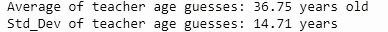

考虑到猜测，其中只有 5 个高于平均水平。目测数据，我们看到这是因为一个 98 年的异常值。虽然我们可以考虑丢弃这个异常值以获得更好的猜测，但我们也可以使用 bootstrap 重采样来获得更多接近父分布的数据。这里，我们将使用替换样本对**进行重复采样，以获得一组子样本。每个子样本也将有 20 个数据点，与原始样本相同。**

名词（noun 的缩写）b:记住，当用替换抽样时，有可能——但不太可能——得到一个异常值被挑选了几次的子样本！我们在`np.random.choice`中设置了`replace=True`标志。

```
n_sets = 100
n_samples = len(teacher_age)def generate_samples(dataset, n):
 return list(np.random.choice(dataset, size=n, replace=True))boot_samples = [generate_samples(teacher_age, n_samples) for _ in range(n_sets)]print(‘Here are the top 3 samples generated:’)
print(‘{}, …’.format(boot_samples[0:3]))
```

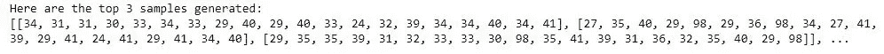

现在，我们计算每个样本的平均值和标准差，然后输出平均平均值和 100 个子样本标准差的平均值

```
sample_means = [np.mean(x) for x in boot_samples]
sample_stdev = [np.std(x) for x in boot_samples]# take the average of all the means
set_mean = np.mean(sample_means)
# average of all the std_devs
set_stdev = np.mean(sample_stdev)print(‘Average of the sample averages: {0:.2f}’.format(set_mean))
print(‘Average of the sample st. devs: {0:.2f}’.format(set_stdev))
```

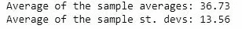

好一点了

嗯——到目前为止，自举几乎没有改变什么。集合的样本平均值非常相似(这是我们所期望的)，但是我们也没有对我们创建的 100 个子样本做太多工作。

让我们创建一个函数，从子样本中删除最低和最高的 N 个元素，并将此函数应用于每个样本，然后调查所有自举样本的平均值和标准偏差:

```
def trim_mean(dataset, n):
 # sort dataset in ascending order
 sorted_list = sorted(dataset)
 # trim the list (each list is of size: 20 - 2 = 18)
 trimmed_list = sorted_list[n:(len(sorted_list) — n)]
 return(trimmed_list)# apply function to all n (100) samples
boot_trims = [trim_mean(x, 1) for x in boot_samples]# each sample mean and st. dev.
trimmed_means = [np.mean(x) for x in boot_trims]
trimmed_stdevs = [np.std(x) for x in boot_trims]# average of all the means
trimmed_mean_avg = np.mean(trimmed_means)
# And the average of all the standard deviations
trimmed_stdev = np.mean(trimmed_stdevs)print(‘Average of the sample averages: {:.2f}’.format(trimmed_mean_avg))
print(‘Average of the sample std_devs: {:.2f}’.format(trimmed_stdev))
```

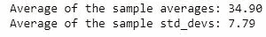

注意数字的变化！

## 平均值直方图

```
import seaborn as snsbins = [x for x in range(25, 55)]ax = sns.distplot(sample_means, bins, label=’Original Bootstrap’)
ax = sns.distplot(trimmed_means, bins, label=’Trimmed Bootstrap’)
ax.legend(loc=’upper right’)
plt.show()
```

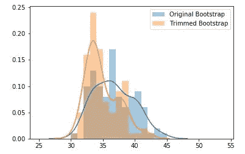

请注意，修剪意味着我们右侧的离群数据更少

多模态(多峰值)是二次采样的产物，它们受到二次采样的随机数据的严重影响，但总体而言，数据呈正态分布。

如果我们修剪更多的数据点，分布会有什么不同？让我们来看看:

```
# create different trimmed means
boot_trim1 = [trimmed_mean(x, 1) for x in boot_samples]
boot_trim2 = [trimmed_mean(x, 2) for x in boot_samples]
boot_trim3 = [trimmed_mean(x, 3) for x in boot_samples]
boot_trim4 = [trimmed_mean(x, 4) for x in boot_samples]# sample each mean and std dev
trimmed_mean1 = [np.mean(x) for x in boot_trim1]
trimmed_stdev1 = [np.std(x) for x in boot_trim1]trimmed_mean2 = [np.mean(x) for x in boot_trim2]
trimmed_stdev2 = [np.std(x) for x in boot_trim2]trimmed_mean3 = [np.mean(x) for x in boot_trim3]
trimmed_stdev3 = [np.std(x) for x in boot_trim3]trimmed_mean4 = [np.mean(x) for x in boot_trim4]
trimmed_stdev4 = [np.std(x) for x in boot_trim4]# plot the means
bins = [x for x in range(25, 55)]ax = sns.distplot(trimmed_mean1, bins, label=’Trimmed 1') #trim most #extreme min and max values
ax = sns.distplot(trimmed_mean2, bins, label=’Trimmed 2')
ax = sns.distplot(trimmed_mean3, bins, label=’Trimmed 3')
ax = sns.distplot(trimmed_mean4, bins, label=’Trimmed 4') # trim 4 #most extreme min and max values
ax.legend(loc=’upper right’)
plt.show()
```

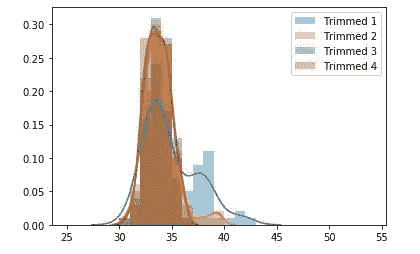

请注意，随着越来越多的数据被修剪，多模态越来越少。取极限值，该修整函数将只返回最接近中值的值。学生们的猜测现在紧密围绕着我们认为的“真实平均值”，也就是老师的年龄！

## 自举回归

bootstrap 方法可以应用于回归模型。引导回归模型可以洞察模型参数的可变性。了解回归系数中有多少随机变化是很有用的，因为数据值的变化很小。

和大多数统计一样，几乎任何回归模型都可以进行 bootstrap。但是，由于 bootstrap 重采样使用大量子样本，因此计算量会很大。

名词（noun 的缩写）b:对于大规模的问题，需要使用像 k 倍交叉验证这样的其他重采样方法。快乐的数据科学之地(nee Physics Land)不是同一个浮点不准确和需要做出妥协的灰色世界。

让我们创建数据并拟合线性回归:

```
import numpy as np
import matplotlib.pyplot as plt
import pandas as pd
import statsmodels.formula.api as sm# synthetic sample data
n_points = 25
x = np.linspace(0, 10, n_points)
y = x + (np.random.rand(len(x)) * 5)
data_df = pd.DataFrame({‘x’: x, ‘y’: y})ols_model = sm.ols(formula = ‘y ~ x’, data=data_df)results = ols_model.fit()# coefficients
print(‘Intercept, x-Slope : {}’.format(results.params))
y_pred = ols_model.fit().predict(data_df[‘x’])# plot results
plt.scatter(x, y)
plt.plot(x, y_pred, linewidth=2)
plt.grid(True)
plt.xlabel(‘x’)
plt.ylabel(‘y’)
plt.title(‘x vs y’)
plt.show()
```

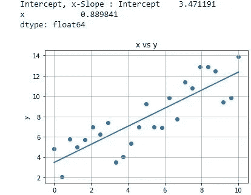

最小二乘线性回归

## 重采样点

要执行的第一种引导是参数重采样。参数化，因为我们的模型有一个参数，均值，我们试图估计。

熊猫`sample`功能将帮助我们完成这一过程:

```
# resample with replacement each row
boot_slopes = []
boot_interc = []
n_boots = 100
plt.figure()
for _ in range(n_boots):
 # sample the rows, same size, with replacement
 sample_df = data_df.sample(n=n_points, replace=True)
 # fit a linear regression
 ols_model_temp = sm.ols(formula = ‘y ~ x’, data=sample_df)
 results_temp = ols_model_temp.fit()

 # append coefficients
 boot_interc.append(results_temp.params[0])
 boot_slopes.append(results_temp.params[1])

 # plot a greyed out line
 y_pred_temp = ols_model_temp.fit().predict(sample_df[‘x’])
 plt.plot(sample_df[‘x’], y_pred_temp, color=’grey’, alpha=0.2)# add data points
plt.scatter(x, y)
plt.plot(x, y_pred, linewidth=2)
plt.grid(True)
plt.xlabel(‘x’)
plt.ylabel(‘y’)
plt.title(‘x vs y’)
plt.show()
```

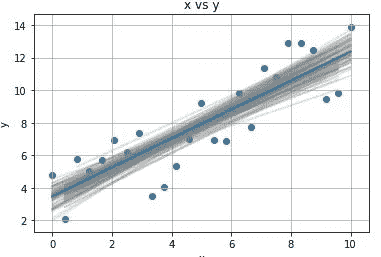

注意灰色带的形状|它们在中心比边缘更集中

上面的波段更多地位于数据的中心而不是边缘，因为更多的数据集中在中心而不是边缘。

斜率和截距系数的分布:

```
sns.distplot(boot_slopes)
plt.show()
```


斜率的良好正态分布

```
sns.distplot(boot_interc)
plt.show()
```

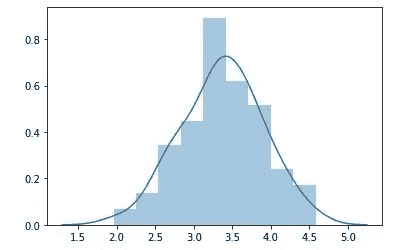

斜率标准差的正态分布

上面的数据描绘了一幅参数自举的美丽画面。然而，如果偶然(这种可能性更大)，我们有稀疏的数据，那么我们随机选择的点可能完全在一个区域内，而不在另一个区域内——回想一下，尽管是一个孤立点，但异常值可以被采样多次。

为了解决这个问题，我们可以应用一种不同类型的自举，称为“**非参数自举**”，我们对残差而不是参数本身应用自举。

# 重采样残差(非参数自举)

这个想法是我们想要在原始数据中的每个 x 位置观察一个点。因此，**我们拟合原始数据，并在每个点**重新洗牌残差。

名词（noun 的缩写）b:我们做这件事的能力的基础假设是误差是独立的，并且在我们的数据中是同分布的( **IID** )。

```
# create synthetic sample data
n_points = 25
x = np.linspace(0, 10, n_points)
y = x + (np.random.rand(len(x)) * 5)
data_df = pd.DataFrame({‘x’: x, ‘y’: y})# fit linear regression model
ols_model = sm.ols(formula = ‘y ~ x’, data=data_df)
results = ols_model.fit()# get predicted values
y_pred = results.predict(data_df[‘x’])# get residual values
resids = results.resid
```

既然我们拟合了最小二乘拟合的值和残差，我们通过**对残差进行采样并将其添加到拟合值**来生成 **N** (100)组新数据:

```
boot2_slopes = []
boot2_interc = []
n_boots = 100
plt.figure()
for _ in range(n_boots):
 # create a sampling of the residuals with replacement
 boot_resids = np.random.choice(resids, n_points, replace=True)
 y_temp = [y_pred_i + resid_i for y_pred_i, resid_i in zip(y_pred, boot_resids)]

 sample_df = pd.DataFrame({‘x’: list(x), ‘y’: y_temp})
 # Fit a linear regression
 ols_model_temp = sm.ols(formula = ‘y ~ x’, data=sample_df)
 results_temp = ols_model_temp.fit()

 # get coefficients
 boot2_interc.append(results_temp.params[0])
 boot2_slopes.append(results_temp.params[1])

 # plot a greyed out line
 y_pred_temp = ols_model_temp.fit().predict(sample_df[‘x’])
 plt.plot(sample_df[‘x’], y_pred_temp, color=’grey’, alpha=0.2)# add data points
plt.scatter(x, y)
plt.plot(x, y_pred, linewidth=2)
plt.grid(True)
plt.xlabel(‘x’)
plt.ylabel(‘y’)
plt.title(‘x vs y’)
plt.show()
```

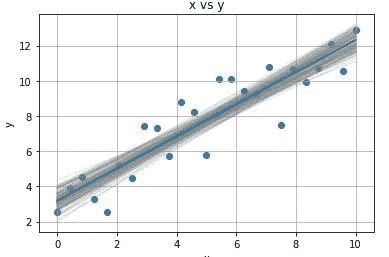

和以前一样，这些线条更多地集中在中间

我们再次检查参数的分布:

```
sns.distplot(boot2_slopes)
plt.show()
```

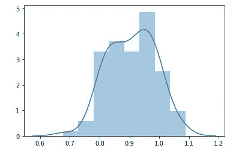

```
sns.distplot(boot2_interc)
plt.show()
```

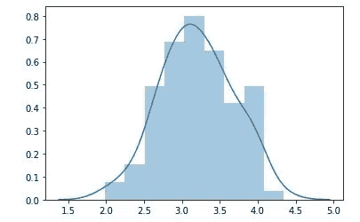

这有助于我们理解线性回归参数的误差。事实上，这种类型的自举可以扩展到大多数具有唯一最优解的线性和非线性模型。使用这种方法，我们可以得到每个参数的误差分布！

# 结论

Bootstrap 不是唯一的重采样方法，有几种方法，但在我看来，它是生产模型中最好的方法之一，因为它对父分布做了最少的假设，并在许多语言和包中得到了很好的实现。

在本文中，我们从两个方面研究了如何将 bootstrapping 技术应用于线性回归:

**参数引导** —从所有点重新采样:

1.  用替换多次采样数据(100)
2.  对每个样本进行线性回归拟合
3.  存储系数(截距和斜率)
4.  绘制参数的直方图

**非参数增强捕获** —对特征值分布不均匀的残差进行重采样:

1.  找到所有原始数据的最佳线性回归
2.  从拟合中提取残差
3.  使用残差样本创建新的 y 值
4.  用新的 y 值拟合线性回归
5.  存储斜率和截距
6.  绘制参数的直方图

就像尤利西斯自己在他的“Odessy”中一样——我希望我已经创造了一个简单的叙事，有助于说明在线性回归背景下的自助重采样。接下来我将继续写关于回归的文章，但是增加了谈论过度拟合和使用正则化帮助的内容！

在 [Linkedin](https://www.linkedin.com/in/james-a-w-godwin/) 上找到我

*物理学家兼数据科学家——适用于新机遇| SaaS |体育|初创企业|扩大规模*