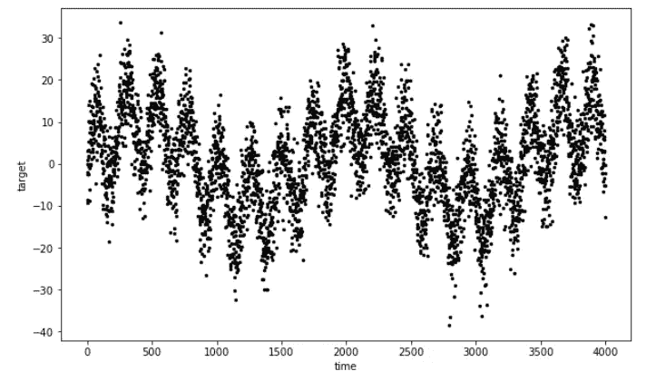
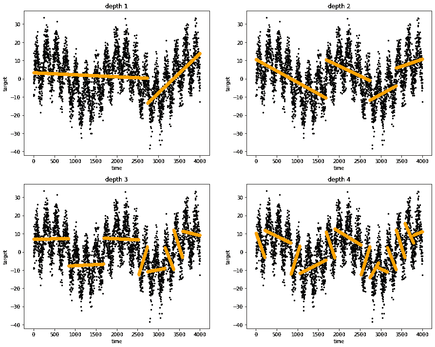
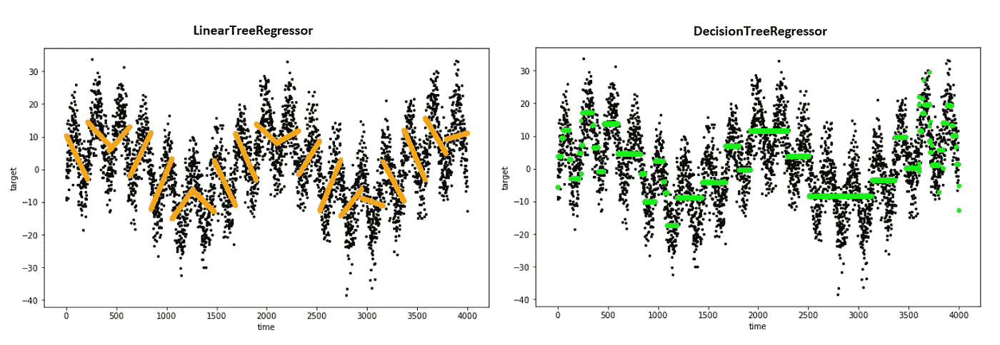
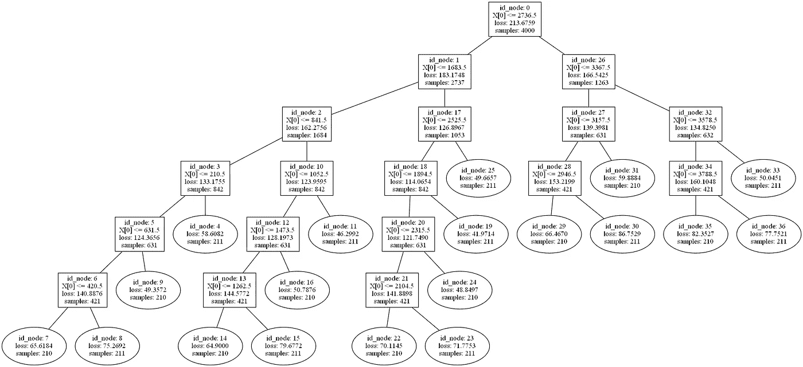
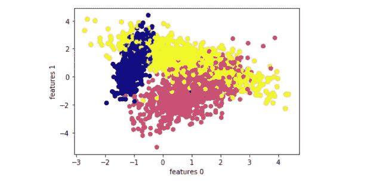
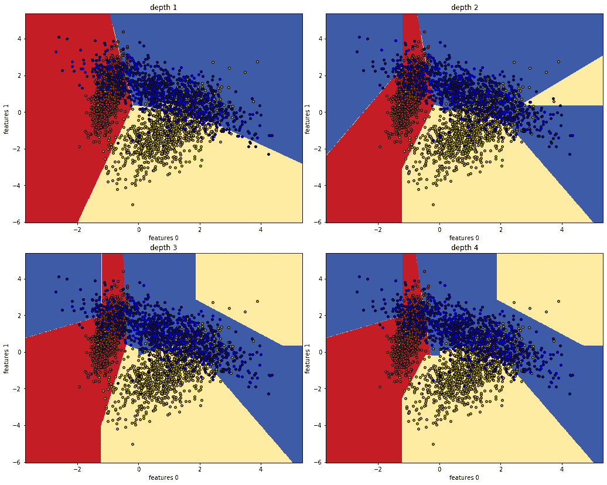
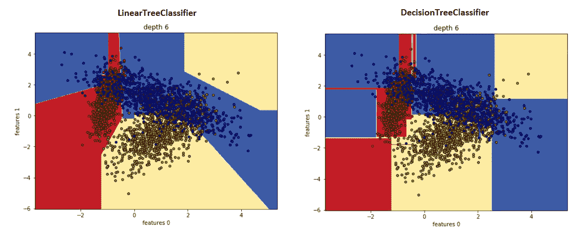
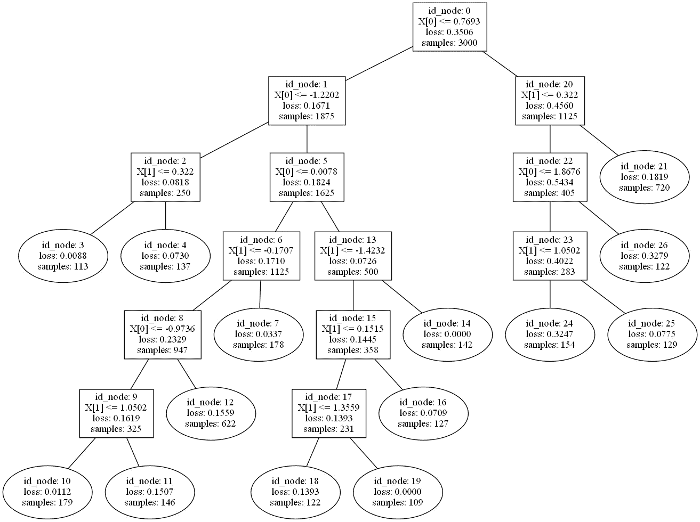

# 线性树:线性模型和决策树的完美结合

> 原文：<https://towardsdatascience.com/linear-tree-the-perfect-mix-of-linear-model-and-decision-tree-2eaed21936b7?source=collection_archive---------10----------------------->

## 发现和开发线性模型树——决策树的一种有价值的替代方法

理查德·巴纳德在 [Unsplash](https://unsplash.com?utm_source=medium&utm_medium=referral) 上拍摄的照片

决策树是统计学和机器学习领域中众所周知的算法。当然，每个数据科学家都尝试过拟合决策树。它们是我们学习如何处理监督和非监督任务的每个数据挖掘课程的首要主题之一。拟合决策树时，目标是通过学习基于几个输入变量的简单决策规则来创建预测目标值的模型。

决策树的预测是在最佳数据分割过程结束时获得的简单常数近似值。这个基本特性使得决策树被广泛采用。它们易于理解和解释。不需要关于输入数据的特定假设(无数据准备，对要素类型无约束)。相反，如果生长不受监控，它们很容易过度生长。如果在训练阶段，一些看不见的样本落在勘探程度较低的部分，不稳定性可能是一个严重的问题。

不是每个人都知道决策树算法的简单而有效的变体。这些被称为**模型树**。他们学习训练数据的最佳分割，就像在标准决策树中一样，主要区别在于分割的良好性是通过拟合模型来评估的。**模型树**的一个特例被称为**线性树**。这意味着在树叶中有线性模型，而不是简单的常数近似。这可以看作是对标准决策树的简单改进/替代，同时保留了解释能力。

在这篇文章中，我们将介绍如何使用**线性树**包轻松创建线性树。[**Linear-tree**](https://github.com/cerlymarco/linear-tree)**是*一个 python 库，在叶子处用线性模型构建模型树*。**

> **线性树被开发为与 scikit-learn 完全集成。`LinearTreeRegressor`和`LinearTreeClassifier`作为 scikit-learn BaseEstimator 提供。它们是在数据上构建决策树的包装器，以适应来自`sklearn.linear_model`的线性估计器。在 [sklearn.linear_model](https://scikit-learn.org/stable/modules/classes.html#module-sklearn.linear_model) 中可用的所有模型都可以用作线性估值器。**

**换句话说，我们只需要选择一个线性模型来构建我们的线性树。线性树包装器只是在数据上开发一个决策树结构。在每个节点上，它搜索一个最佳分割，简单地评估子节点的加权损失是否低于父节点的损失。所涉及的损失来自于数据部分的线性模型拟合。**

**每个特征中的分割阈值通过分位数宁滨导出，以加快处理速度。唯一涉及的参数是损失`criterion`、`max_depth`、`min_samples_split`、`min_samples_leaf`和`max_bins`(它们是自解释的，与经典决策树中的相同)。让我们看看它的实际效果。**

# **回归线性树**

**在本节中，我们使用线性树来建模回归任务。为了便于理解和直观解释，我们拟合了 1D 时间序列数据。**

****

**1D 正弦数据(图片由作者提供)**

**我们在不同深度进行拟合，以观察线性树如何分割输入空间并进行预测。**

****

**不同深度的线性树回归(图片由作者提供)**

**显而易见，线性树在分割中进行线性近似。这与经典的决策树形成对比，后者对相同的数据进行常数近似运算。**

****

**深度 6 的线性树和决策树回归器(图片由作者提供)**

**训练完成后，我们可以绘制树形图，查看训练过程中遵循的学习路径。**

****

**绘制线性树回归方程(图片由作者提供)**

# **用于分类的线性树**

**在本节中，我们使用线性树来模拟分类任务。为了便于理解和直观解释，我们拟合了一个 2D 数据集。**

****

**2D 分类数据(图片由作者提供)**

**我们在不同深度进行拟合，以观察线性树如何分割输入空间并进行预测。**

****

**不同深度的线性树分类器(图片由作者提供)**

**显而易见，线性树在分割中进行线性近似。这与对相同数据进行分段常数近似的经典决策树形成对比。**

****

**深度 6 的线性树和决策树分类器(图片由作者提供)**

**训练完成后，我们可以绘制树形图，查看训练过程中遵循的学习路径。**

****

**绘制线性树分类器(图片由作者提供)**

# **摘要**

**在这篇文章中，我们介绍了经典决策树的一种变体，称为模型树，它评估适合更复杂模型的分裂，而不是进行简单的常数近似。然后我们提出了****一个 python 框架，用线性模型构建模型树。我们用简单的例子展示了线性树是如何工作的，以及与决策树的区别。线性树并不被认为是标准的决策树，但是它们显示出是一个很好的选择。一如既往，这并不适用于所有情况，采用这种模型系列的好处可能会因研究的情况而异，必须进行适当的验证。******

******[**查看我的 GITHUB 回购**](https://github.com/cerlymarco/MEDIUM_NoteBook)******

****保持联系: [Linkedin](https://www.linkedin.com/in/marco-cerliani-b0bba714b/)****