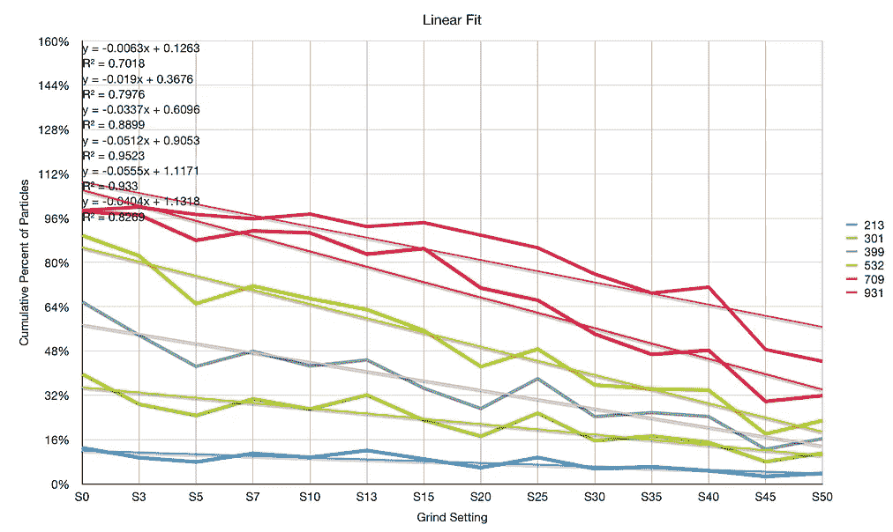

# 咖啡研磨机的线性度

> 原文：<https://towardsdatascience.com/linearity-of-a-coffee-grinder-9bed5b84b4be?source=collection_archive---------28----------------------->

## 咖啡数据科学

## 咖啡研磨机的线性度如何？

拨入一袋新咖啡通常很有挑战性，因为它可能需要多次拍摄，这个过程花费的时间越长，你浪费的钱就越多。一个潜在的问题是磨床上的刻度盘。

我想更好地了解我目前的研磨机(利基零)，所以我收集了多个研磨设置的数据。我查看了研磨设置如何影响研磨分布，目的是回答以下问题:

> 刻度盘设置对研磨设置的线性影响有多大？

# 数据收集

我一次使用 5 个 beans 收集数据，我从在小生境 Zero 上设置 0 (S0)开始。该设置递增 5，直到 S50。在每次设置更改之间，我使用以下协议:

1.  将设置调高 10，运行研磨机几秒钟。
2.  向下拨回所需设置，运行研磨机几秒钟。
3.  添加豆子并运行研磨机。
4.  给地面拍张照片。

然后我从顶部取了一个样品，应该是转移研磨最少的，我按照[协议对它们进行成像](https://medium.com/nerd-for-tech/measuring-coffee-grind-distribution-d37a39ffc215)。这些图像通过我的软件用来确定研磨分布。

最后，我有一些额外的时间，所以我添加了 S3，S7 和 S13，给了一些额外的设置，因为我喝的大多是浓缩咖啡。

# 数据

我绘制了所有设置的累积分布，有很多重叠:

我专注于直径小于 1000 微米的粒子。很难看出分布是如何至少以某种线性模式变化的。这对于我预期峰值移动的单个仓来说尤其如此，但是大多数研磨没有单个峰值。

我尝试用不同的方式将数据绘制成累计堆积条形图，这至少在视觉上很吸引人。

这个情节让我意识到我的数据太多了。所以我减少了箱子的数量，并绘制了研磨设置:

模式更清晰了。所以我用一条直线来拟合这个数据。线性拟合相对较好，但二阶多项式拟合效果稍好。

从数据来看，似乎磨床的设置是相当线性的。这意味着设置 10 应该是设置 0 和设置 20 之间粒子分布的中间值。

如果你愿意，可以在 Twitter 和 YouTube 上关注我，我会在那里发布不同机器上的浓缩咖啡视频和浓缩咖啡相关的东西。你也可以在 [LinkedIn](https://www.linkedin.com/in/robert-mckeon-aloe-01581595?source=post_page---------------------------) 上找到我。也可以关注我[中](https://towardsdatascience.com/@rmckeon/follow)。

# [我的进一步阅读](https://rmckeon.medium.com/story-collection-splash-page-e15025710347):

[浓缩咖啡系列文章](https://rmckeon.medium.com/a-collection-of-espresso-articles-de8a3abf9917?postPublishedType=repub)

[工作和学校故事集](https://rmckeon.medium.com/a-collection-of-work-and-school-stories-6b7ca5a58318?source=your_stories_page-------------------------------------)

[个人故事和关注点](https://rmckeon.medium.com/personal-stories-and-concerns-51bd8b3e63e6?source=your_stories_page-------------------------------------)

[乐高故事启动页面](https://rmckeon.medium.com/lego-story-splash-page-b91ba4f56bc7?source=your_stories_page-------------------------------------)

[摄影启动页面](https://rmckeon.medium.com/photography-splash-page-fe93297abc06?source=your_stories_page-------------------------------------)

[使用图像处理测量咖啡研磨颗粒分布](https://link.medium.com/9Az9gAfWXdb)

[改善浓缩咖啡](https://rmckeon.medium.com/improving-espresso-splash-page-576c70e64d0d?source=your_stories_page-------------------------------------)

[断奏生活方式概述](https://rmckeon.medium.com/a-summary-of-the-staccato-lifestyle-dd1dc6d4b861?source=your_stories_page-------------------------------------)

[测量咖啡磨粒分布](https://rmckeon.medium.com/measuring-coffee-grind-distribution-d37a39ffc215?source=your_stories_page-------------------------------------)

[咖啡萃取](https://rmckeon.medium.com/coffee-extraction-splash-page-3e568df003ac?source=your_stories_page-------------------------------------)

[咖啡烘焙](https://rmckeon.medium.com/coffee-roasting-splash-page-780b0c3242ea?source=your_stories_page-------------------------------------)

[咖啡豆](https://rmckeon.medium.com/coffee-beans-splash-page-e52e1993274f?source=your_stories_page-------------------------------------)

[浓缩咖啡用纸质过滤器](https://rmckeon.medium.com/paper-filters-for-espresso-splash-page-f55fc553e98?source=your_stories_page-------------------------------------)

[浓缩咖啡篮及相关主题](https://rmckeon.medium.com/espresso-baskets-and-related-topics-splash-page-ff10f690a738?source=your_stories_page-------------------------------------)

[意式咖啡观点](https://rmckeon.medium.com/espresso-opinions-splash-page-5a89856d74da?source=your_stories_page-------------------------------------)

[透明 Portafilter 实验](https://rmckeon.medium.com/transparent-portafilter-experiments-splash-page-8fd3ae3a286d?source=your_stories_page-------------------------------------)

[杠杆机维护](https://rmckeon.medium.com/lever-machine-maintenance-splash-page-72c1e3102ff?source=your_stories_page-------------------------------------)

[咖啡评论和想法](https://rmckeon.medium.com/coffee-reviews-and-thoughts-splash-page-ca6840eb04f7?source=your_stories_page-------------------------------------)

[咖啡实验](https://rmckeon.medium.com/coffee-experiments-splash-page-671a77ba4d42?source=your_stories_page-------------------------------------)