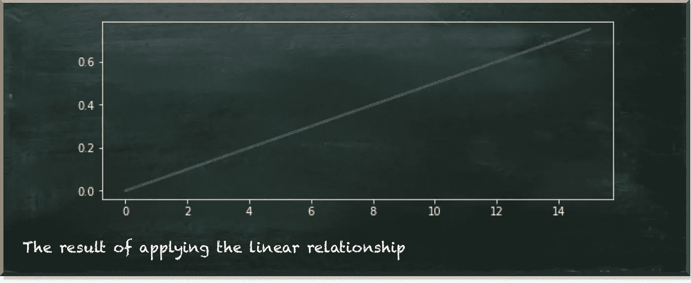

# 线性相关量子变量

> 原文：<https://towardsdatascience.com/linearly-dependent-quantum-variables-30c5d8d006c0?source=collection_archive---------28----------------------->

## 成为一名程序员没有坏处——即使是作为一名数据科学家

量子机器学习要不要入门？看看 [**动手量子机器学习用 Python**](https://www.pyqml.com/page?ref=medium_lindep&dest=/) **。**

实用数据科学是关于变量及其相互影响的。例如，一个人的身高会影响这个人在特定情况下是否必须闪开。

当然，并不是所有的变量都一样。例如，当一个人的身高变化很大时，我们可以用“是”或“否”来回答她是否需要闪避。相应地，我们用不同种类的分布来描述变量。我们用正态分布来定义一个人的身高。我们用伯努利分布来定义她是否需要闪避。

下图描述了这两个变量。

作者图片

显而易见的问题是:“一个人的身高如何影响她是否需要闪开？”

人的身高的 X 轴是一个比例标尺。这意味着这个轴上的值是有序的。我们可以说一个 2 米(6.6 英尺)的人比一个 1.5 米(4.9 英尺)的人要大。此外，我们甚至可以设置两个高度的关系。2 米的人比 1.5 米的人高三分之一(2 米= 1.5 米*(1+1/3))。

标度的类型不仅仅是为了数学上的方便。但它通常有现实世界的含义。例如，我们可以说，当一个人的尺寸超过一个通道的尺寸时，她需要闪开，如果你愿意，可以说是一扇门。由于身高的 X 轴是有序的，我们推导出，如果某个身高的人需要闪避，那么所有更高的人也需要闪避。因此，需要躲避的概率随着体型的增大而增大。

即使我们不知道这两个变量之间的确切关系，我们也可以说它必须增加(实际上，它必须是非减少的，以便在某些设置中一条平坦的线是可以的)。但是，仍然有许多函数可以描述递增效应，例如二次函数、对数函数或指数函数。然而，最简单也可能是最实际的影响是线性依赖。意味着每增加一个高度，闪避的概率就相应增加。

下图描绘了我们在上一篇文章的[中建模的这种关系。](/how-to-work-with-a-quantum-normal-distribution-170ccc4e2da2)

作者图片

但是，上一次，我们模拟了这种特殊的关系。八个量子位状态表示人的高度，状态 000 代表最小的人，111 代表最高的人。我们用三个量子位来描述一个人的高度，我们说每走一步闪避的概率增加 0.1。

但是如果你想模拟一个不同的斜率呢？或者也许你想用四个而不是三个量子位？

当然，我提供了完整的源代码。所以，调整代码是可能的。但我想说实话。不管怎样，这是一种痛苦。如果你关注过我的文章，你已经知道我不是物理学家或数学家，而是计算机科学家。

任何计算机科学家的共同特征是什么？没错，当涉及到重复性的任务时，我们很懒。编写自动化函数比一遍又一遍地重复解决相同的问题有趣得多。

因此，让我们创建一个自定义的量子变换门，以模拟正态分布和从属伯努利分布之间的线性关系。

作者图片

今天，我们从终点和我们希望看到的结果开始。下面的清单显示了我们如何定义这两个变量并在它们之间创建线性关系。

我们从声明两个常数开始。`ND_QUBITS`表示我们在正态分布中使用的量子比特数。`POS_RELATED`指定我们用作因变量的量子位的位置。因为我们把因变量放在电路中正态分布的右边，它的位置就是正态分布的量子比特数(因为我们从 0 开始计算位置)。

关系函数是一个辅助函数，一旦我们运行电路，它就会获取测量结果。对于正态分布的每个值，它计算因变量的比率。在清单的最后，我们用它来生成显示两个变量之间线性依赖关系的图。

电路的创建非常简单。首先，我们创建一个`QuantumRgister`来保存我们的量子位。它比我们用于正态分布的多一个量子位。然后，我们定义正态分布并将其附加到电路中。看看[这篇文章](/quantum-normal-distribution-cc6710c27879)，了解更多关于如何使用量子正态分布的信息。

同样，我们将`linear_dependency`添加到电路中。我们指定依赖关系的步长(斜率)和我们使用的量子位。

当我们运行这段代码时，我们期望得到下图所示的结果。

作者图片

我们可以看到总共有 16 个状态，因为我们用了 4 个量子位。X 轴上的每一步，因变量的概率增加 0.05，即步长。

在我们查看神奇的`linear_dependency`函数之前，我们先定义导入和一个在之前已经[使用过的辅助函数。`prob_to_angle`将概率转化为量子位状态向量旋转，我们可以将其输入 RY 门。](https://betterprogramming.pub/if-you-want-to-gamble-with-quantum-computing-e327c11f97e5)

下面的清单描述了`linear_dependency`函数。它非常整洁。但是相信我，它是个怪物。

那么，我们在这里做什么？

首先，我们创建一个单独的`QuantumCircuit`，作为函数的结果返回。这允许我们像上面那样在主程序中把它作为一个门来`append`。

电路声明后，我们定义`qubits`。这是我们在这里使用的所有量子位的简单列表。例如，如果我们使用三个量子位进行正态分布，`qubits`就是`[0, 1, 2]`。

现在，我们循环遍历这个列表(`for i in range(1, len(qubits)+1):`)。但是我们不是从零而是从一开始计数，也不是从二而是三结束计数。

到目前为止，一切顺利。但是现在，我们进入了最困难的部分。接下来，我们遍历给定多个元素(`i`)的`qubits`列表的所有组合。

对于`i=1`，每个组合都有一个元素。这些是`0`、`1`、`2`。

对于`i=2`，每个组合有两个元素。这些是`0,1`、`0,2`、`1,2`。

对于`i=3`，每个组合有三个元素。这是`0,1,2`。

对于这些组合中的每一个，我们从值 0 开始。然后，我们从 1 到组合中的元素数循环(`for j in range(1, len(com)+1):`)。同样，我们在给定元素数量的循环中创建所有可能的组合(`j`)。

所以，如果`i=1`和`j=1`，列表`com`只包含一个项目，`0`、`1`或`2`。然后，我们将这个项目创建为一个组合。

在我们看如何处理这些组合之前，我们先来看一下`i=2`的情况。这种情况有三次:`0,1`、`0,2`、`1,2`。我们示例性地谈论`0,1`。然后，我们为`j=1`创建单品组合`0`和`1`。我们创建了两个项目的组合`0,1`。我们对案例`0,2`、`1,2`做相应的事情。

最后，对于`i=3`和`0,1,2`的`com`列表，我们做到以上所有，我们也创建了`0,1,2`的三项组合。

现在让我们看看我们在这个内部组合循环中做了什么，看看我们在所有这些组合中做了什么。首先，我们计算符号。这要么是-1，要么是 1，取决于`com`中的项目数减去实际项目数是偶数(然后是`1`)还是奇数(然后是`-1`)。

然后，我们从`val`变量中加上(如果`sign=1`)或减去(如果`sign=-1`)代表组合中的单个数字的`step`乘以 2 的概率的角度。

好吧，我承认，没有例子是不可能理解这里发生了什么的。所以，让我们把代码写得不那么“紧凑”

让我们替换外部组合循环(`for com in combinations(qubits, i):`)中的所有内容

对于单项组合(或`i=1`)，我们执行以下操作:

我们将因变量变为正态分布的量子比特数的 2 倍。数字越高，影响越大。

对于两个项目的组合，我们会:

我们将从属量子位旋转代表 2 的总概率的角度，到量子位的数目减去单独代表每个数字的角度。

在上周的帖子中，我们详细探讨了潜在的基本原理。

最后，对于三项组合，我们做:

如你所见，我们应用于量子位的旋转是一组量子位中所有组合的总和。幸运的是，这一切都包含在`linear_dependency`函数中。

好的一面是它适用于任何数量的量子位。所以，你只需要调整数字(别忘了在`select`函数里也要改变它。当然，你需要确保最大概率不超过 1。所以，对于更多的量子位，你需要选择更小的步长。这是六个量子位的结果。

作者图片

结果是一条直线横跨 2⁶=64 国家。

# 结论

在这篇文章中，我们学习了如何在两个量子变量之间建立线性关系。由于控制变量(正态分布)由多个量子位组成，我们需要相当多的量子门来模拟这种行为。实际上，这可能很麻烦。

因此，我们创建了一个定制的量子位转换门，它为我们完成了所有繁重的工作。我们只需要指定控制分布和目标量子位。

量子机器学习要不要入门？看看 [**动手量子机器学习用 Python**](https://www.pyqml.com/page?ref=medium_lindep&dest=/) **。**

免费获取前三章[点击这里](https://www.pyqml.com/page?ref=medium_lindep&dest=/)。