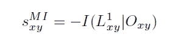
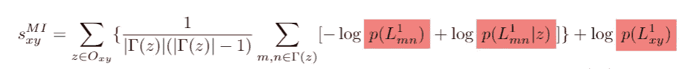
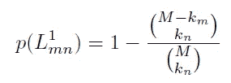
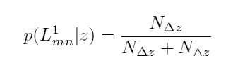
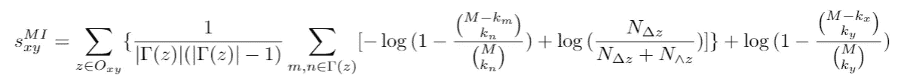
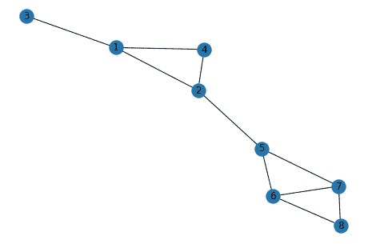

# 链接预测和信息论:教程

> 原文：<https://towardsdatascience.com/link-prediction-and-information-theory-a-tutorial-a67ecc73e7f9?source=collection_archive---------24----------------------->

## 网络科学

## 使用互信息测量图中候选链接的可能性。


图片由来自 Pixabay 的 Gerd Altmann 提供

在我的文献回顾中，我偶然发现了一个分析链接预测问题的信息论框架( [Tan et al. (2014)](https://journals.plos.org/plosone/article?id=10.1371/journal.pone.0107056) ， [Kumar and Sharma (2020)](https://www.nature.com/articles/s41598-020-77364-9) )。对于什么是链接预测的概述，请阅读我以前的文章[这里](/link-prediction-in-bipartite-graph-ad766e47d75c)。基本思想是预测图中看不见的边。这样的边可以表示不同网络中的引用关系、友谊或依赖性。该框架将这种任务建模为信息论问题，其中如果基于所选择的模型，边具有高概率(低不确定性/低信息),则它更有可能在一对节点上形成。

在本文中，我们将展示如何在实践中使用这个框架。我们首先介绍这个模型，并提供一个代码实现来运行一个小图。本文大量来源于谭等人。艾尔。(2014)，所以查看他们的论文以了解更多细节。

> 如果你对更完整的数学推导感兴趣，阅读我的教程笔记[这里](https://blog.eekosasih.com/notes/link-prediction-mutual-information)。此外，我还在 jupyter 笔记本[中实现了这些代码。](https://github.com/edwardelson/link-prediction)

# 理论框架

给定一个图 G，我们想要确定观察到一对节点(x，y)之间的边的可能性。该框架将这种可能性(s_xy)定义为在给定它们的共同邻居 O_xy 的情况下看到边(x，y)的条件信息的负值。在信息论中，概率越高，信息越少(不确定性减少)，因此通过添加负项，可能性(s_xy)与概率成正比。



为了简洁起见，我们在这里没有推导出完整的等式(更多细节请参见前面提到的教程笔记)。相反，我们立即陈述可能性的最终等式。我们可以看到，它基本上是来自节点 x 和 y 的共同邻居的概率的集合(用红色突出显示)。



概率主要有两种，一种是先验 p(L_mn)或 p(L_xy)，另一种是似然 p(L_mn | z)。后者是在考虑了节点 x 和 y 的共同邻居 z 之后的条件概率。这两个概率可以根据研究人员的亲和力灵活选择。在谭等人看来。艾尔。(2014)，但是，使用了以下概率模型选择。

先验模型被定义为 1 减去在图中总共 M 条边中，在 M 和 n 之间根本看不到边的组合概率。



似然模型被定义为公共邻居节点 z 的聚类系数。该系数被定义为观察到的三角形的数量与由 z 及其邻居形成的可能三角形(即三元组)的数量之比。



没有理论证明为什么这两种模式是最佳选择。不过，谭等人。艾尔。(2014)表明，从经验上看，它们的性能通常优于其他模型。

我们可以将这两个模型插回到原始的和框架中，这样就剩下最后一个等式了。



# 代码实现

我们现在用 python 实现这个框架。首先，我们导入必要的包。

```
import networkx as nx
import math
import itertools
import numpy as np
```

为了展示这个框架在实践中是如何使用的，我们将使用 Tan 等人提供的一个虚拟图。艾尔。(2014).我们使用 networkx 来定义图形对象。

```
G = nx.Graph()
edgeList = [(1, 2),(1, 3),(1, 4),(2, 4),(2, 5),(5, 6),(5, 7),(6, 7),(6, 8),(7, 8)]
G.add_edges_from(edgeList)
nx.draw(G, with_labels=True)
```



接下来，我们将可能性分数定义为一个包含节点 x 和 y 的函数。它由几个循环组成，这些循环聚合了来自节点 x 和 y 的公共邻居的信息。该框架包含两个概率模型:先验和可能性，我们将在接下来进行描述。

```
# score based on mutual information
def s(x , y, prior, likelihood):
 # common neighbors
 CN = nx.common_neighbors(G, x, y) # prior (x, y)
 priorXY = — np.log2(prior(x, y, G)) # sum over neighbors
 cnMI = 0
 for z in CN:
   # degree of z
   kz = G.degree(z)
   coeffZ = 1 / (kz * (kz-1)) # sum over edges = neighbors of z
   zMI = 0
   for m, n in itertools.combinations(G.neighbors(z), 2):
     priorInfo = — np.log2(prior(m, n, G))
     likelihoodInfo = — np.log2(likelihood(z, G)) # combine mutual information
     zMI += 2 * (priorInfo — likelihoodInfo) # add average mutual information per neighbor
   cnMI += coeffZ * zMI return cnMI — priorXY
```

我们现在将先验定义为组合学概率的函数。

```
def prior(m, n, G):
 kn = G.degree(n)
 km = G.degree(m)
 M = G.number_of_edges()

 return 1 — math.comb(M-kn, km)/math.comb(M, km)
```

同时，似然性被定义为节点 x 和 y 的公共邻居 z 的聚类系数。

```
def likelihood(z, G):
 kz = G.degree(z)
 N_triangles = nx.triangles(G, z)
 N_triads = math.comb(kz, 2)

 return N_triangles / N_triads
```

我们现在已经定义了整个框架。按照 Tan 等人提供的例子。艾尔。(2014)，我们可以通过调用 s 函数来计算节点 2 和 3 的得分。瞧！我们得到-1.667，正如论文中所示。

```
# -1.667
s(2, 3, prior, likelihood)
```

# 结论

我们已经看到了如何将链接预测问题集成到信息论框架中。使用后者，我们可以根据自己的选择插入一些不同的概率模型。在本文中，我们研究了一个基于聚类系数和组合概率的特殊模型。欲了解更多型号，请参考 Tan et。艾尔。(2014)和 Kumar 和 Sharma (2020)。

## 参考

1.  基于势能和互信息的二分网络链接预测方法。*科学报道* **10** ，20659 (2020)。
2.  复杂网络中的链接预测:一个互信息的视角。PLOS 一中 9，e107056 (2014)。