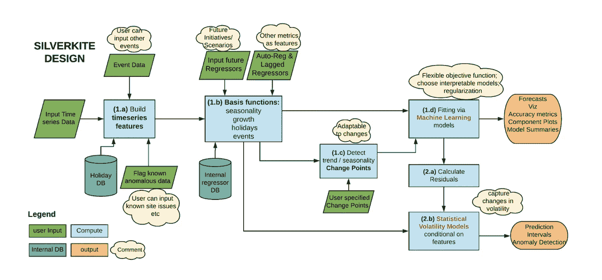
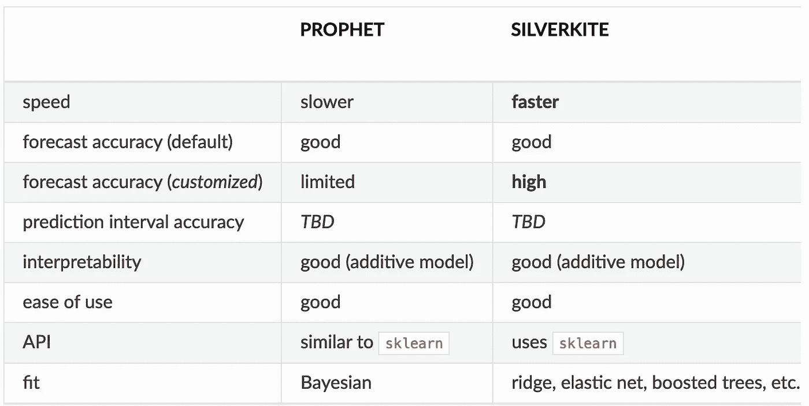
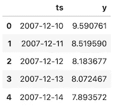
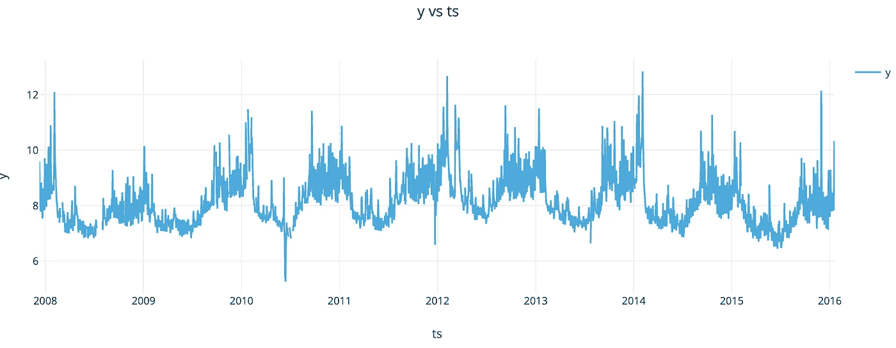
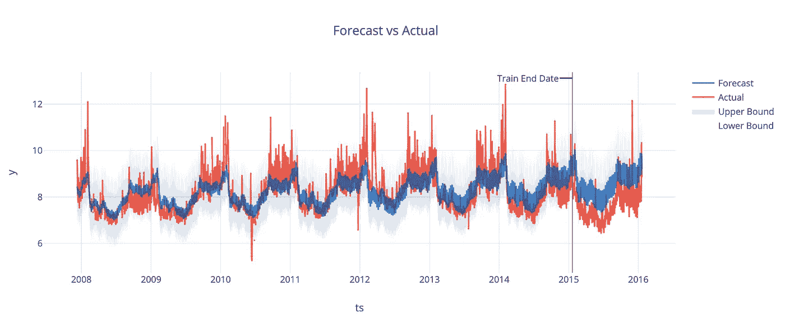
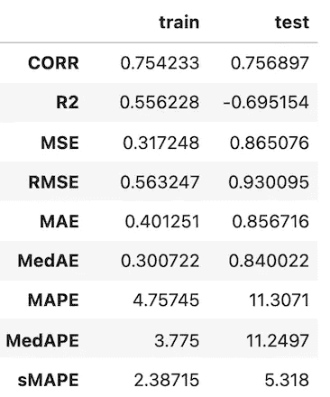
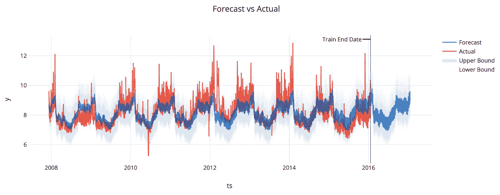
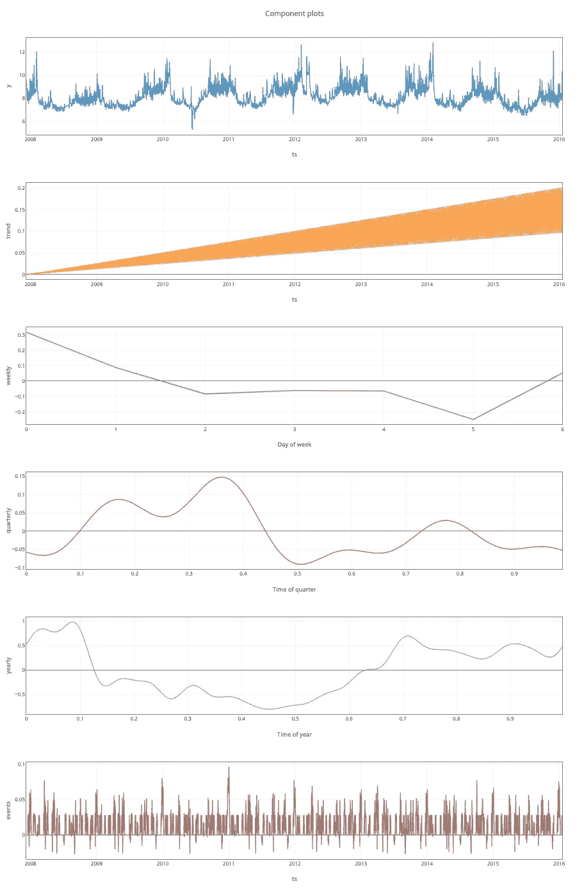
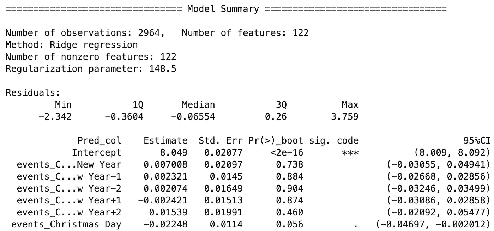
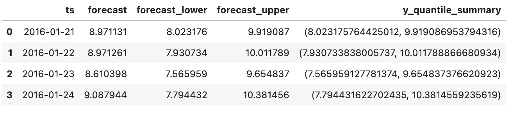

# LinkedIn 对 Prophet-silver kite 和 Greykite 的回应

> 原文：<https://towardsdatascience.com/linkedins-response-to-prophet-silverkite-and-greykite-4fd0131f64cb?source=collection_archive---------15----------------------->

照片由[亚伦·伯顿](https://unsplash.com/@aaronburden?utm_source=unsplash&utm_medium=referral&utm_content=creditCopyText)在 [Unsplash](https://unsplash.com/s/photos/kite?utm_source=unsplash&utm_medium=referral&utm_content=creditCopyText) 拍摄

## [行业笔记](https://towardsdatascience.com/tagged/notes-from-industry)

## 时间序列预测新算法综述

早在 2017 年，脸书发布了其先知模型，对时间序列预测领域产生了相当大的影响。许多企业开始使用它并测试它的功能，因为它提供了相当好的开箱即用的结果。几年过去了，现在 LinkedIn 带着自己的算法 Silverkite 和 Python 库进入了这个领域，这是一个灵活、直观、快速的预测库。

[来源](https://engineering.linkedin.com/blog/2021/greykite--a-flexible--intuitive--and-fast-forecasting-library)

在本文中，我将提供新算法和库的概述。我也会试着指出 Silverkite 和 Prophet 之间的一些相同点和不同点。由于这是一个非常新的库，于 2021 年 5 月发布，所以在实践中使用它还有很多需要探索和学习的地方。我必须说我真的很期待，这篇文章只是一个开始！

# 银风筝

你可以想象了解 LinkedIn 的业务，在创建 Silverkite 算法时，他们在脑海中有一些模型应该处理的事情:它必须在具有潜在时变趋势、季节性、重复事件/假期、短期影响等的时间序列上工作良好。您可能会认识到 Prophet 的一些共同元素，但我们将回到这一点。

鉴于我上面所描述的，并知道预测将按规模运行，作者在开发 Silverkite 时重点关注以下属性:

*   **灵活性** —根据论文[1]，该模型处理“趋势、季节性、节假日、变点和自回归的时间序列回归”。并且由用户来选择他们确实需要的可用组件并适合所选的 ML 模型。自然地，提供了良好的默认值和模型，因此很容易开箱即用 Silverkite。
*   **可解释性** —不仅仅是性能重要，方法的可解释性通常也同样重要(或者更重要，当涉及到说服利益相关者时)。这就是为什么 Silverkite 提供了“探索图、调优模板和带有明确假设的可解释预测”(见[1])。
*   **速度** —最后一个连接到*规模预测*部分。这就是 Silvekite 允许快速原型(使用可用的模板)和大规模部署创建的模型的原因。

对于 Silverkite，没有一个等式可以作为模型的*来呈现。这就是为什么我将使用原始论文中的图表来提供架构及其组件的概述。*

Silverkite 的架构图。来源:[1]

让我们从颜色的描述开始。绿色对象是模型的输入—时间序列、潜在事件数据、已识别的异常数据、潜在的未来回归变量(我们知道它们将在预测中发挥作用)、自回归组件和变点。和 Prophet 一样，我们既可以自己提供改变点——基于领域知识——也可以让 Silverkite 自己找出这些改变点。有一个很好的描述了识别变点的算法，但是我建议你参考[的原始论文](https://arxiv.org/abs/2105.01098)。

橙色表示模型的输出-预测以及预测间隔和诊断(准确性度量、可视化和摘要)。

最后，蓝色代表算法的计算步骤。检查矩形时，我们还可以看到一些数字，它们表示计算的阶段:

*   阶段 1——条件均值模型——用于预测感兴趣的指标，
*   阶段 2——波动性模型——对残差拟合一个单独的模型。

作者在[2]中指出，这种架构选择有助于提高灵活性和速度，因为集成模型“易受易处理性差(参数估计的收敛问题)或模拟未来值(预测)的发散问题的影响”。

让我们更深入地了解计算的每个子阶段:

*   1.a 该部分处理从时间戳(小时、星期几、月、年等)中提取潜在特征。)，以及节假日等事件数据。
*   1 . b——在本部分中，特征被转换为适当的基函数(例如，[傅立叶级数项](https://en.wikipedia.org/wiki/Fourier_series))。这种转换背后的想法是，为了便于解释，空间中的要素可以用于附加模型。
*   1.c —趋势和季节性随时间变化的变点检测。
*   1.d 在此阶段的最后一步，将适当的 ML 模型拟合到步骤 1.b 和 1.c 中的要素。作者建议对此步骤使用正则化模型，如 Ridge 或 Lasso。

在第二阶段，可以将条件方差模型拟合到残差中，以便波动率是指定因素的函数，例如一周中的某一天。

我想说，这将是足够的介绍。在这一点上，我还想提一下吸引我注意力的两个显著特征:

*   通过提供外部变量，我们还可以包含领域专家的意见。想象一下，对于某种预测，专家们已经对它将如何随时间演变有了相当好的想法。我们可以使用这样一个外部变量来尝试帮助模型。
*   包括假期/特殊日子之前/之后的时间。这是一个可以在许多预测任务中派上用场的功能，但首先想到的是零售预测，如销售。在这种情况下，某些节日(比如圣诞节)前后的日子与一年中正常的*日子有很大不同。更有趣的是，前几天可能与后几天有着非常不同的模式！*

最后，我想回到两个模型的比较——Silverkite 和 Prophet。为此，我将展示 Silverkite 文档中的一个表，该表提供了模型的高级比较。

[来源](https://linkedin.github.io/greykite/docs/0.1.0/html/pages/stepbystep/0100_choose_model.html)

主要区别在于安装的型号和速度。关于两种型号的可定制选项的详细对比，请参见[此处另一张表](https://linkedin.github.io/greykite/docs/0.1.0/html/pages/stepbystep/0100_choose_model.html)。

那么什么时候用 Silverkite，什么时候先知呢？一如既往，视情况而定。总的来说，作者建议使用更适合您的用例的方法。很公平。但它们也提供了进一步的暗示。如果你是贝叶斯方法的支持者，或者需要随着时间的推移而改变能力的逻辑增长，请使用 Prophet。另一方面，如果你想预测一个分位数(而不是平均值)或者需要一个快速模型，那么使用 Silverkite。

介绍到此结束。让我们看看如何在实践中使用模型！

# `greykite`在实践中

对于本文，我将使用来自官方文档的改编代码。在这个例子中，我们将使用培顿·曼宁维基页面视图数据 Prophet 文档中使用的相同数据集。我们从导入库开始。

我可能会吹毛求疵，但进口不是很简单，需要习惯。然后，我们使用`DataLoader`类加载数据。

作者图片

如果您曾经使用过 Prophet，我相信您会认识到熟悉的数据帧结构。正如我们现在将看到的，`greykite`在命名方面更加灵活。下一步，我们定义一些关于数据集的元信息。

现在是实例化模型的时候了。首先，我们创建一个`Forecaster`类的对象，然后创建配置。我们指定我们想要使用 Silverkite(我们可以很容易地在这里插入 Prophet 进行比较，因为它在`greykite`中也是可用的)。[模型模板](https://linkedin.github.io/greykite/docs/0.1.0/html/pages/stepbystep/0200_choose_template.html)背后的想法是它们提供默认的模型参数，并允许我们以更有组织的方式定制它们。在这种情况下，我们对 365 天和 95%置信区间的预测范围感兴趣。最后，我们使用指定的配置和我们的数据运行预测。

默认情况下，`greykite`将使用三重时间序列交叉验证(基于扩展窗口)。既然我们有了合适的模型，现在我们将依次检查一些感兴趣的元素。首先，我们可以绘制原始时间序列。

[https://gist . github . com/erykml/9293 e 2428815 faf 4 f 511 af 9 e 90 be 38 BD](https://gist.github.com/erykml/9293e2428815faf4f511af9e90be38bd)

作者图片

然后，我们使用下面的代码片段检查交叉验证的结果。

默认情况下，`run_forecast_config`方法提供完整的历史评估。有两种输出，一种来自存储在`grid_search`中的交叉验证分割，另一种来自存储在`backtest`中的维持测试集的结果。

在下表中，我们可以看到 3 次分割的 MAPE(平均绝对百分比误差)。在代码片段中，我们指定了`cv_report_metrics=None`以使输出更加简洁。您可以删除它以查看所有可用的指标和列。

作者图片

现在，让我们看看`backtest`，即维持测试集。

作者图片

我们在图中可以看到的是拟合值的组合(直到 2015 年底)，然后是测试集上的预测(训练时从未见过)，这是整个 2016 年。我们还在模型模板中看到了我们要求的 95%置信区间。我们可以使用下面的代码片段来查看训练集和测试集的一些评估指标。

下表仅包含选定的指标，原始输出要详细得多，您可以在笔记本中看到它(文章末尾的链接)。

作者图片

最后，我们可以检查实际预测。请记住，我们已经检查了拟合值和测试集的性能。但是正如我们不久前在配置中指定的那样，我们有兴趣预测 1 年后的情况，也就是 2017 年。

作者图片

这已经很多了，但是请再多忍耐一会儿。我们已经获得了预测，这很好，但是，我们仍然需要涵盖一些内容来完成基本介绍。列表上的下一项是一些有用的诊断。

就像在《先知》中，我们可以看到分解的时间序列。我们只需要运行以下命令:

我们可以看到系列，以及趋势，每周，每季度和每年的组成部分。最后，我们看到事件的影响。关于 Silverkite 默认事件的列表，请点击[查看](https://linkedin.github.io/greykite/docs/0.1.0/html/pages/model_components/0400_events.html)。

作者图片

然后，我们还可以查看模型的摘要，以检查模型的系数。这个输出对于以前使用过`statsmodels`的人来说是熟悉的。我们使用`[-1]`符号从底层 scikit-learn `Pipeline`中提取估计量。

和以前一样，我截断了列表以节省空间。这就是为什么只有几个值是可见的。总结已经很有帮助了，因为我们看到了所使用的特征的数量、估计量的种类(岭)以及所选择的超参数值。

作者图片

作为最后一步，我们将创建一些新的预测。与 Prophet 类似，我们创建一个新的未来数据框架，然后使用拟合模型的`predict`方法。

作者图片

你可能会奇怪，为什么我们在这里看到的是 2016 年的预测，而不是 2017 年。这是因为`make_future_dataframe`方法的默认设置是在训练数据结束后立即创建这 4 个观察值。正如我们之前看到的，我们将 2016 年用作维持测试集，因此它不用于培训。请记住，在创建未来数据框架时，您需要传递进行预测可能需要的所有额外回归变量。这个简单的例子不是这样的。

要深入了解，请务必查看文档和其他[快速入门示例](https://linkedin.github.io/greykite/docs/0.1.0/html/gallery/quickstart/index.html)。

# 外卖食品

*   Silverkite 是 LinkedIn 的新时间序列预测模型，在某种程度上类似于脸书的先知。
*   创建该模型是为了处理具有潜在时变趋势、季节性、重复事件/假期、短期影响等的时间序列。
*   这个库为时间序列预测提供了一个统一的框架，它包括 Silverkite 和 Prophet。

你可以在我的 [GitHub](https://github.com/erykml/medium_articles/blob/master/Time%20Series/greykite.ipynb) 上找到本文使用的代码。此外，欢迎任何建设性的反馈。你可以在推特或评论中联系我。

如果您喜欢这篇文章，您可能还会对以下内容感兴趣:

 [## 脸书的先知+深度学习= NeuralProphet

### 用深度学习的力量改进可解释的先知模型

towardsdatascience.com](/facebooks-prophet-deep-learning-neuralprophet-76796aed1d86)  [## 开始学习时间序列预测的最佳书籍

### 更妙的是，它是免费的！

towardsdatascience.com](/the-best-book-to-start-learning-about-time-series-forecasting-69fcc618b6bb)  [## 分层时间序列预测简介—第二部分

### Python 中使用 scikit-hts 的示例

towardsdatascience.com](/introduction-to-hierarchical-time-series-forecasting-part-ii-e73dfd3de86b) 

# 参考

[1] *生产系统的柔性预测模型*—[https://arxiv.org/abs/2105.01098](https://arxiv.org/abs/2105.01098)

[2][https://engineering.linkedin.com/blog/2021/greykite-一个灵活-直观-快速-的预测库](https://engineering.linkedin.com/blog/2021/greykite--a-flexible--intuitive--and-fast-forecasting-library)