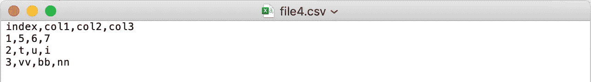
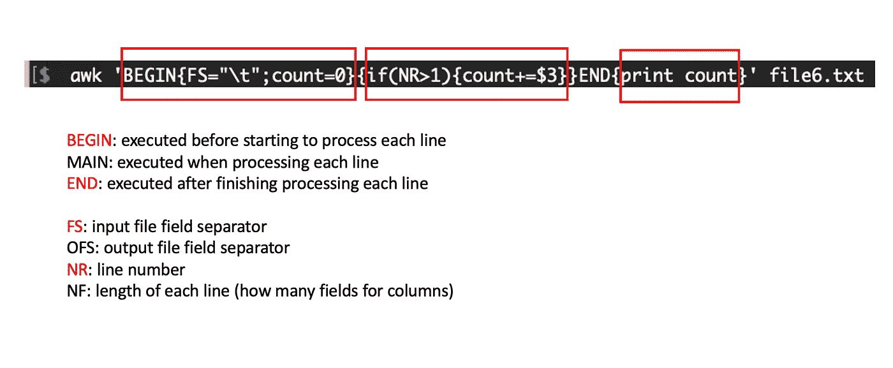

# Linux Shell 命令可以节省您的时间

> 原文：<https://towardsdatascience.com/linux-shell-commands-can-be-your-time-saver-eabee76914b?source=collection_archive---------5----------------------->

## 一个有用的 Shell 命令，可以大大提高您的生产力


照片由 [Sai Kiran Anagani](https://unsplash.com/@_imkiran?utm_source=medium&utm_medium=referral) 在 [Unsplash](https://unsplash.com?utm_source=medium&utm_medium=referral) 上拍摄

当谈到文件解析或数据预处理时，您首先想到的编程语言是什么？

它可能是 Python、R 或其他类似的脚本语言。诚然，这些现代的高级语言非常强大，使我们能够通常用不到几十行代码来实现我们的目标。然而，Linux Shell 命令似乎是一颗被遗忘的明珠，因为它的语法相对陈旧，在线教程也不太直观。

在本文中，我将让您感受一下 Shell 命令在某些情况下是多么强大，更重要的是，您可以轻松地学习并在日常工作中直接采用它。在这篇文章中，我将只关注一个特定的工具`awk`。如果你觉得这些例子有用，我想让你参考我的 [Github 页面](https://github.com/frankligy/Linux_HandBook_Bioinformatics)以获得更多使用其他 Linux 实用函数的例子。

事不宜迟，我们开始吧！

# 我有一个 CSV 文件，如何将分隔符改为制表符？

很常见的是，某个程序的输入文件需要是一个. tsv 文件或由 tab 划分的文件，而我们只有一个来自 Microsoft Excel 的. csv 文件。(如下图所示)



我们有 CSV 文件

您只需要在终端中键入一行代码:

```
awk '{$1=$1}1' FS="," OFS="\t" file4.csv > file4.txt
```

现在我们有:


我们想要的标签划界文件

我们暂且不解释，即使你不知道它为什么工作，你也可以在你的 Mac 终端或 Windows 的 Unix 终端输入这个命令，然后你就再也不用担心这种类型的转换任务了，不是吗？

现在让我们深入研究一下语法本身，awk 是 Linux Shell 环境中一个强大的文件处理工具，这个命令的作用是:

`{$1=$1}1`:重置缓冲区(不了解详情没关系)

`FS=","`:告诉 awk 当前分隔符是`,`

`OFS="\t"`:告诉 awk 想要的分隔符是`\t`

然后只需指定您的输入文件和输出文件路径，awk 将转储结果，完成！

我承认这在 Python 或 R 中并不难做到，但是想想看，只需在终端中键入一个命令，而不是打开 Python IDE，读取文件，然后用另一个分隔符重写文件，这有多方便。Shell 命令的酷之处在于，它通常是预先安装在您的 PC 上的，您不需要担心设置环境、安装包(例如 python pandas 包)。**总结一下，learning Shell 并不打算取代任何其他语言，它只是为您带来一些非常方便的功能，在某些情况下可以节省时间，那么为什么不使用它们呢？**

# 如何使我的水平输出垂直

为了说明这个问题，假设您有以下文件:


原始水平输入

为了使它们垂直显示，您只需要一行代码:

```
awk '{for(i=1;i<=NF;i++){print $i}}' file5.txt > file5_new.txt
```

文件会是什么样子？


新垂直输出

这个 awk 命令所做的是，对于每一行(在这个输入文件中，我们只有一行)，我们遍历列，从索引 i=1 开始，这是第一列，以索引 i=NF 结束，NF 是 awk 中的一个特殊变量，它代表每行的长度。因此，上面的命令只是简单地说，对于列中的每一项，我们将一个接一个地打印出来，每一项都将占据一整行，这使得我们能够实现我们的目标。

那么你可能会问，如果我有一个垂直输出，但我希望它是水平显示的，你可以反向操作吗？当然可以！

```
​cat file5_new.txt | tr '\n' ' ' | awk '{$1=$1}1' FS=" " OFS="\t" > file5_restore.txt
```

查看结果:


恢复原始水平格式

对该命令稍加解释，我们首先使用`cat`读取文件，然后我们使用`tr`命令将每行的换行符替换为空白，结果如下:


中间结果

然后从这里开始，我们再次使用`awk`命令简单地将分隔符从空白改为制表符(在上一节中解释过)，完成！

# **理解 awk 的顶点任务**

我们已经感受到了`awk` 的强大:有一个非常经典的任务可以指导你理解`awk`命令的基本语法。

假设您有一个如下所示的文件:


输入文件

我想知道`col3`的和，一行代码能实现吗？这很有用，因为在现实生活中，输入文件可能有 1 百万行，而不是这个玩具示例中的 4 行。

```
$ ​awk 'BEGIN{FS="\t";count=0}{if(NR>1){count+=$3}}END{print count}' file6.txt171
```

现在让我们来说明这些机制:



awk 的解释

`awk`逐行处理文件，但是在深入每一行之前会执行`BEGIN` 中的某个东西，处理完每一行之后会执行某个东西。这个属性允许我们很容易地计算平均值或总和，因为它基本上是一个运行总和，所以当我们初始化一个`count`变量，并向它添加值直到结束，我们可以打印出最终的`count`或平均它以获得平均值。这样，我们会发现很多任务在 Linux Shell 中仅仅通过使用`awk`就可以管理。

# 为什么 Linux 和 Shell 通常是有用的

我经常被问到的一个问题是，既然 Python 可以以更结构化的格式解决大多数任务，我们为什么还需要学习 Shell 命令？答案是，壳牌有其独特的优势:

1.  在 Python 中，我们正在处理**变量，**我们在内存中操作几十个变量，并得到想要的输出。但是在 Shell 中，我们正在处理**文件**，它允许你在几行代码中自动操作数千个文件。

2.Shell 命令允许您执行**跨语言**任务，或者**将几个 Python、R 甚至 Matlab 脚本粘合在一起作为元脚本**。

3.在某些情况下，Shell 命令可能比其他脚本语言更方便(**一行代码对几行代码**)。

4.Linux 系统在云计算平台、高性能超级计算机和 GPU 中普遍存在，我们很可能会处于没有 python 解释器可用的情况。那么 Linux 和 Shell 命令将成为您完成任务的唯一武器。

# 结论

我希望您喜欢阅读这篇文章，如果您想了解更多关于现实生活中的 Shell 命令示例，我希望您可以参考我的 Github 页面:

[https://github.com/frankligy/Linux_HandBook_Bioinformatics](https://github.com/frankligy/Linux_HandBook_Bioinformatics)

感谢阅读！如果你喜欢这篇文章，请在 medium 上关注我，非常感谢你的支持。在我的 [Twitter](https://twitter.com/FrankLI55917967) 或 [LinkedIn](https://www.linkedin.com/in/guangyuan-li-399617173/) 上联系我，也请让我知道你是否有任何问题或你希望在未来看到什么样的教程！