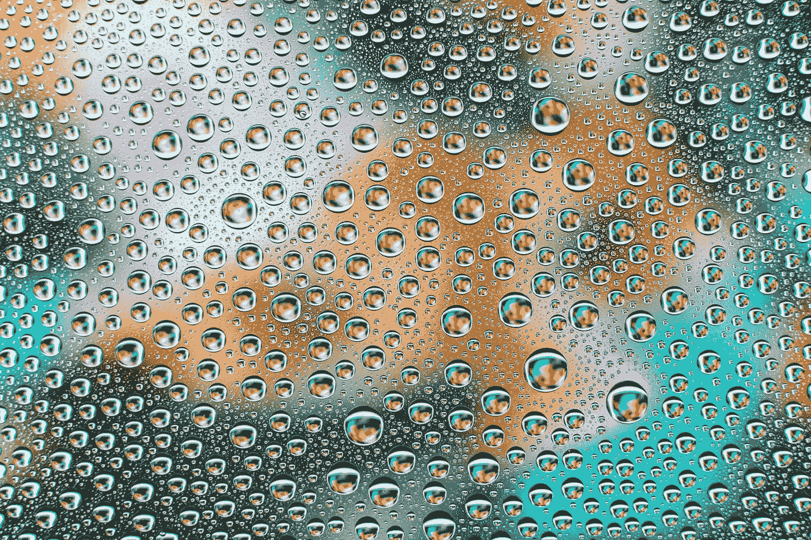
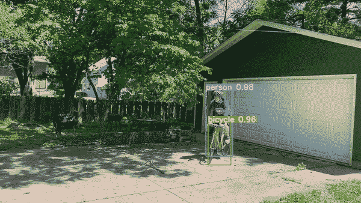
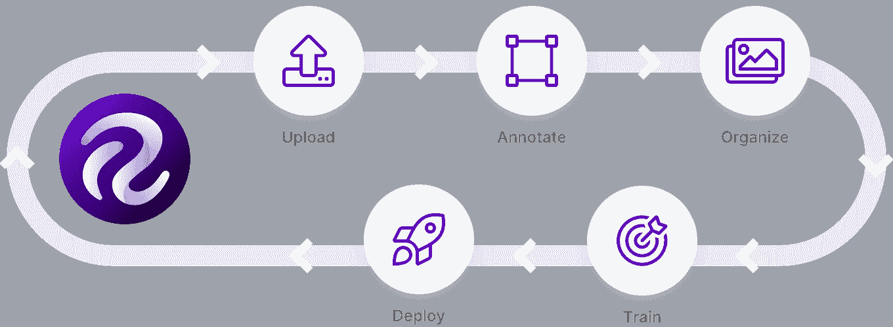
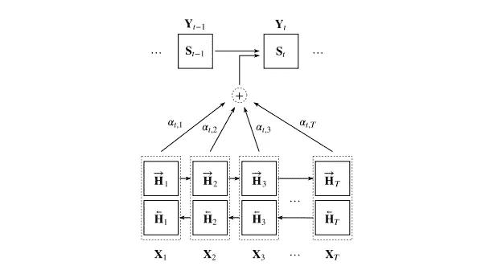
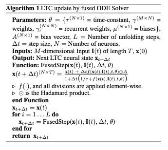

# 计算机视觉中的液态神经网络

> 原文：<https://towardsdatascience.com/liquid-neural-networks-in-computer-vision-4a0f718b464e?source=collection_archive---------7----------------------->

## 在本帖中，我们将讨论新的液体神经网络，以及它们对视觉领域的意义

([引用](https://unsplash.com/photos/hPJkIXIMOW8))

围绕麻省理工学院最近发布的[液态神经网络](https://news.mit.edu/2021/machine-learning-adapts-0128)，人工智能社区正在兴奋起来。哈萨尼和他的团队取得的突破令人难以置信。

让我们开始吧。

这篇文章的 YouTube 版本。

# 什么是液态神经网络？

# 背景

人工智能的研究和应用涉及深度神经网络的构建和训练。在 liquid neural networks 之前，所有深度学习系统都有相同的漏洞，即它们根据向它们显示的训练数据，学习从输入数据到输出预测的固定映射，使它们容易受到周围不断变化的环境的影响。此外，大多数深度学习模型是上下文无关的。例如，当将[对象检测模型](https://blog.roboflow.com/object-detection/)或[分类模型](https://models.roboflow.com/classification)应用于视频时，视频将被逐帧处理，而不依赖于其周围的上下文。

*在 Roboflow Ranch 上逐帧推断(没有上下文)*

为了解决这个问题，使用人工智能的开发人员和工程师通常会收集非常大的代表性数据集，并参与[主动学习](https://blog.roboflow.com/what-is-active-learning/)，以便随着新的边缘案例的发现，通过重新训练周期来不断改进他们的系统。

*[*主动学习*](https://blog.roboflow.com/what-is-active-learning/) *循环**

*然而，所有这些重新标记、重新培训和重新部署可能会很繁琐——如果您正在使用的网络能够学会适应新的在线场景，那不是很好吗？*

*进入液态神经网络。*

# *液态神经网络设计*

*液态神经网络是一种处理时间序列数据的递归神经网络形式。递归神经网络表现出强大的性能，并根据文本流或科学测量的时间序列等序列进行预测。*

**

**递归神经网络架构的图形描绘(* [*引用*](https://arxiv.org/pdf/1912.05911.pdf) *)**

*当输入数据是序列时，递归神经网络的性能优于普通的前馈神经网络，因为它们可以更有效地跟踪序列不同部分的相关信息。*

*液态神经网络建立在递归神经网络的基础上，通过使隐藏状态在时间序列的时间常数上是动态的。在每一个预测步骤中，液态神经网络都在计算预测的结果以及随时间演变的下一个隐藏状态的形成。*

**

**何液体神经网络算法*[*arxiv 论文*](https://arxiv.org/pdf/2006.04439.pdf)*

*要了解更多实施细节，我们建议深入研究[液态神经网络论文](https://arxiv.org/abs/2006.04439)。*

# *液态神经网络承诺*

*液态神经网络被证明可以改进跨多个领域的时间序列建模，包括人类手势、人类活动、交通、电力、臭氧、连续 MNIST 和居住。这些初步结果是有希望的。*

*液态神经网络的长期目标是形成一个随场景和时间灵活变化的系统，最终开启一个不必通过[主动学习](https://blog.roboflow.com/what-is-active-learning/)持续改进的系统。*

# *液态神经网络如何影响视觉？*

*从长远来看，像液体神经网络这样的架构可能会大大提高我们在视频处理中训练弹性模型的能力，这些模型能够适应不断变化的环境。*

*然而，液态神经网络对视觉的影响还有很长的路要走。[液态神经网络库](https://github.com/raminmh/liquid_time_constant_networks)中的初始实验都是基于时间序列的，而不是基于图像和视频的。*

*`Processed files: 1\. Vectorial velocity of left hand (x coordinate) 2\. Vectorial velocity of left hand (y coordinate) 3\. Vectorial velocity of left hand (z coordinate) 4\. Vectorial velocity of right hand (x coordinate) 5\. Vectorial velocity of right hand (y coordinate) 6\. Vectorial velocity of right hand (z coordinate) 7\. Vectorial velocity of left wrist (x coordinate) 8\. Vectorial velocity of left wrist (y coordinate)`*

*液态神经网络中手势的时间序列数据的示例数据*

*从他们的资料库推广到图像和视频应用，将不可避免地涉及麻省理工学院实验室未来的研究和建设。*

# *结论*

*液体神经网络是递归神经网络的新突破，创建了一个随时间灵活采用的模型。然而，这项研究正在进行中，我们可能还需要一段时间才能看到这些网络对计算机视觉领域的现有战略产生影响。*

*更多关于计算机视觉的最新研究，请查看我们的帖子:*

*   *[OpenAI 的剪辑模型](https://blog.roboflow.com/how-to-use-openai-clip/)*
*   *[缩放后的 YOLOv4 物体检测模型](https://blog.roboflow.com/scaled-yolov4-tops-efficientdet/)*

*如果你想开始训练计算机视觉的最新技术，请查看:*

*   *[Roboflow 的模型库](https://models.roboflow.com/)*

**原载于 2021 年 2 月 12 日 https://blog.roboflow.com**[*。*](https://blog.roboflow.com/liquid-neural-netowrks/)**