# 白酒消费:一个数据故事

> 原文：<https://towardsdatascience.com/liquor-consumption-a-data-story-cf7b26213c10?source=collection_archive---------41----------------------->

## 丹佛市的酒类商店活动:总体趋势和季节性分析


科林·劳埃德在 [Unsplash](https://unsplash.com/s/photos/denver?utm_source=unsplash&utm_medium=referral&utm_content=creditCopyText) 上的照片

人类总是深入研究醉酒作为现代生活负担下的一种娱乐方式。自从酒精被发现以来，它就被当作一种休息和放松的工具，人类已经将饮酒作为一种社会联系的形式。在历史上，将大麻用于娱乐经常被看不起，但这种趋势现在正朝着对这种物质更积极的观点转变。2012 年，这两种主要的娱乐物质在丹佛市开始发挥作用，因为这一年大麻在科罗拉多州合法化。随着两种大型娱乐性药物在该市的出现以及自大麻合法化以来一百多家药房的兴起，分析丹佛市这些药物的消费趋势似乎是合乎逻辑的。这篇文章是一系列文章中的第一篇，旨在分析丹佛的酒和大麻流行情况，并且只涉及丹佛的酒类商店，本系列的下一篇文章将研究丹佛药房的概念。

在我们的分析中，我们将使用 [Safegraph](http://safegraph.com) 模式数据以及来自丹佛市的数据。SafeGraph 是一家数据提供商，为数千家企业和类别提供 POI 数据。它向学者们免费提供数据。在这个特定的项目中，来自模式数据集的关于访问和流行度指标的数据将证明对我们的分析非常有帮助。模式数据的模式可以在这里找到:[模式信息](https://docs.safegraph.com/v4.0/docs/places-schema#section-patterns)

***注意:*** *如果您想自己学习本文中的代码，可以查看* [*笔记本*](https://colab.research.google.com/drive/18c_Ipl6zIUZUUeEAgHxdeaJ44of2sVi1#scrollTo=hmvO7bPzPgGA) *的链接。这提供了这个项目的所有代码片段，并且可以证明展示了每个代码片段如何相互连接的更好的想法。*


Fabrizio Conti 在 [Unsplash](https://unsplash.com/s/photos/clouds?utm_source=unsplash&utm_medium=referral&utm_content=creditCopyText) 上拍摄的照片

从丹佛市的档案中下载酒类数据后，我们可以开始可视化我们将用于分析酒类商店的数据集的前半部分:

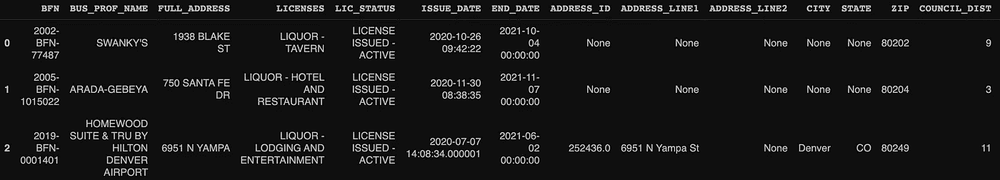

**这是丹佛烈酒数据的模式:**

1.  *BFN — BFN 标识符*
2.  *业务部门名称—业务名称*
3.  *FULL_ADDRESS —企业地址*
4.  *许可证—许可证类型*
5.  *LIC _ 状态—许可证的状态*
6.  *发行日期——许可证发行日期*
7.  *结束日期—许可证到期日期*
8.  *ADDRESS_ID —唯一地址标识符*
9.  *ADDRESS_LINE1 —与商业机构相关联的主要地址*
10.  *ADDRESS_LINE2 —与商业机构相关联的二级地址*
11.  *城市——建立城市*
12.  *国家——成立国*
13.  *邮政编码—机构的邮政编码*
14.  *DIST 市议会—市议会区域唯一标识符*
15.  *警察 _DIST —警区唯一标识符*
16.  *普查区域—普查区域标识符*
17.  *街坊——酒铺的街坊*
18.  *ZONE_DISTRICT — Zone district 唯一标识符*
19.  *X_COORD —机构经度*
20.  *Y_COORD —建立纬度*

这个数据中一个引人注目的有趣的列是 licenses 列。让我们看看该数据集中有哪些独特的许可证:

```
#bar chart of unique types of liquor licensesplt.bar(unique_licences, liquor_df['LICENSES'].value_counts())liquor_df['LICENSES'].value_counts()
```

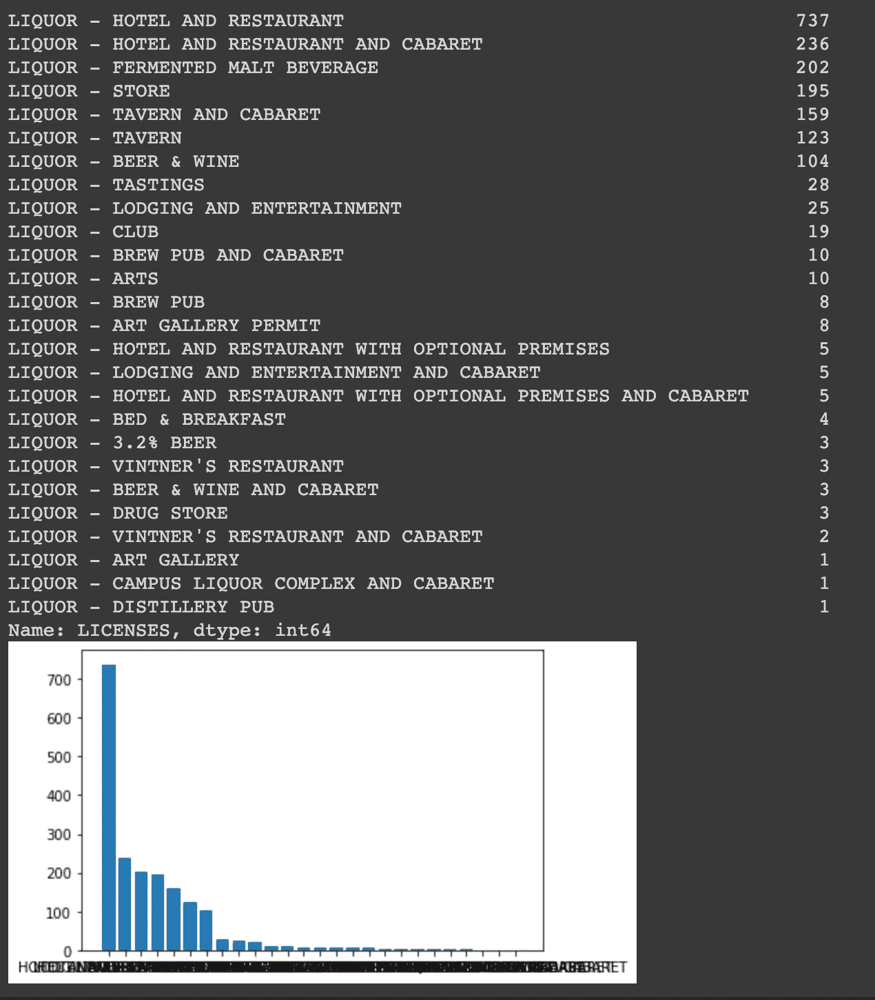

从这些数据中，我们将只记录与有效售酒许可证相关的位置:

```
liquor_df = liquor_df.where(liquor_df[‘LIC_STATUS’] == ‘LICENSE ISSUED — ACTIVE’).dropna()
```

接下来的步骤是一些数据清理任务，完成这些任务是为了确保数据正是我们要分析的。在这个特定的分析中，我们将只查看来自酒类商店的数据，而不查看其他来源的数据:

```
# Dropping irrelavent columnsliquor_df = liquor_df.drop([‘ADDRESS_ID’,’ADDRESS_LINE1',’ADDRESS_LINE2'], axis = 1)#Dropping columns that aren’t recorded as from Denver, COliquor_df = liquor_df.where(liquor_df[‘CITY’] == ‘Denver’).dropna()liquor_df = liquor_df.where(liquor_df[‘LICENSES’] == ‘LIQUOR — STORE’).dropna()liquor_df[‘index’] = range(1, len(liquor_df) + 1)
```

现在我们可以从 [SafeGraph](http://safegraph.com) 加载丹佛的酒类商店的模式数据。输出将如下所示:

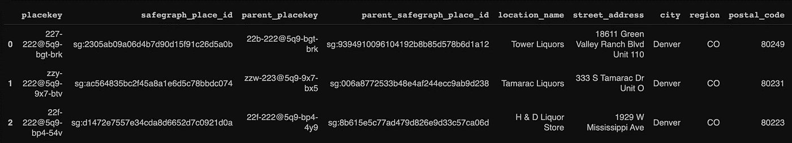

因此，现在我们有两个独立的数据集，一个来自官方城市丹佛，包含位置坐标和酒类许可证类型等信息，另一个来自 SafeGraph，包含关于访问和受欢迎程度的信息。问题是，我们如何连接这两个数据集。答案可以在 [Placekey](http://placekey.io) 代的概念中找到。

Placekey 通过为所有感兴趣的点生成唯一的标识符并将生成的值用作连接列，解决了地址匹配概念带来的许多问题。创建位置键的过程非常简单，您可以在[这里](https://www.placekey.io/tutorials/joining-poi-and-non-poi-datasets-with-placekey)找到这个过程的详细步骤指南

```
placekey_api_key = ‘I0rCRT7FQshK7whZfcfRn56dGA3k4m5U’pk_api = PlacekeyAPI(placekey_api_key)def get_df_for_api(df,column_map = {“index”: “query_id”, “BUS_PROF_NAME” : “location_name”,”FULL_ADDRESS” : “street_address”,“CITY”: “city”, “region”: “region”, “ZIP”: “postal_code”}): df_for_api = df.rename(columns=column_map) cols = list(column_map.values()) df_for_api = df_for_api[cols] df_for_api[‘iso_country_code’] = ‘US’ return(df_for_api)liquor_df[‘index’] = liquor_df[‘index’].astype(str)liquor_df[‘region’] = liquor_df[‘STATE’]df_for_api = get_df_for_api(liquor_df)df_for_api.head(3)
```

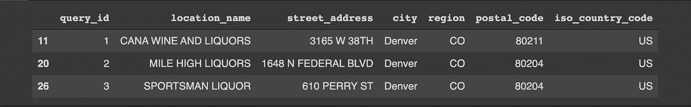

```
data_jsoned = json.loads(df_for_api.to_json(orient=”records”))print(“number of records: “, len(data_jsoned))print(“example record:”)data_jsoned[0]
```

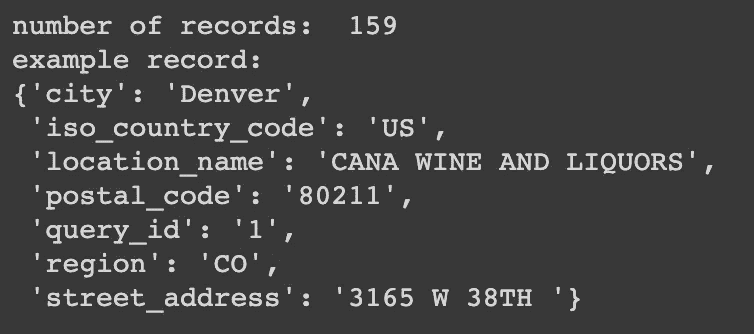

```
responses = pk_api.lookup_placekeys(data_jsoned, verbose=True)df_placekeys = pd.read_json(json.dumps(responses), dtype={‘query_id’:str})df_placekeys.head(7)
```

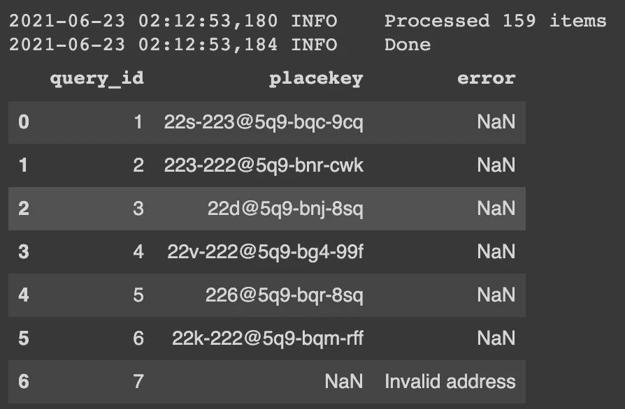

这个代码片段将这些生成的 placekeys 合并到我们之前清理的丹佛市烈酒数据中:

```
def merge_and_format(loc_df, placekeys_df): lr_placekey = pd.merge(loc_df, placekeys_df, left_on=”index”, right_on=”query_id”, how=’left’) lr_placekey = lr_placekey.drop(‘error’, axis=1) lr_placekey[‘address_placekey’] = df_placekeys.placekey.str[:3] + df_placekeys.placekey.str[-12:] lr_placekey = lr_placekey[[‘placekey’, ‘address_placekey’] +     list(loc_df.columns)] return(lr_placekey)loc_placekey = merge_and_format(liquor_df, df_placekeys)loc_placekey.head(3)
```

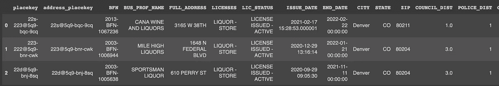

该代码片段现在获取丹佛市的数据，并使用生成的 placekeys 将该数据与 SafeGraph 模式数据连接起来

```
def merge_with_patterns(patterns_df, loc_res_placekey): patterns_df[‘address_placekey’] = patterns_df.placekey.str[:3] +     patterns_df.placekey.str[-12:] df = loc_res_placekey.merge(patterns_df.drop(‘placekey’, axis=1), how=’inner’,on=’address_placekey’) df = df.reset_index().drop(‘index’,axis=1) return(df)df = merge_with_patterns(patterns18_df, loc_placekey)cols = list(df.columns)cols.pop(cols.index(‘address_placekey’))df = df[[‘address_placekey’] + cols]print(df.shape)liquor_GS_df = dfdf.head(3)
```

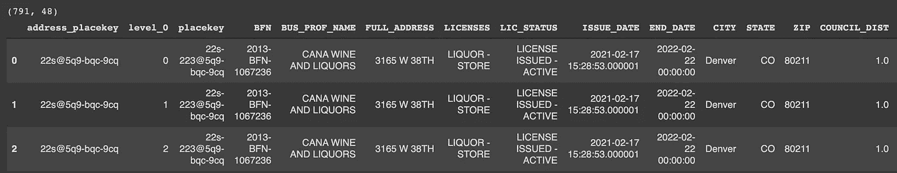

从数据(791，48)的形状中，我们可以看到 Denver Liquor 数据的最初 18 列现在已经附加了来自模式数据的另外 20 列。

现在我们所有的数据都准备好了，我们可以开始分析，看看我们的数据告诉我们什么故事。让我们从白酒数据开始分析。


sPhoto 由[塞拉斯·拜施](https://unsplash.com/@silasbaisch?utm_source=unsplash&utm_medium=referral&utm_content=creditCopyText)于 [Unsplash](https://unsplash.com/s/photos/water?utm_source=unsplash&utm_medium=referral&utm_content=creditCopyText)

# 丹佛的酒类商店和斯凯酒的神秘

首先，让我们分析整个数据集的平均月访问量。为此，我们可以只取需要的列，以避免混乱，并将它们存储在不同的数据帧中

```
l_avg_df = liquor_GS_df[[‘BUS_PROF_NAME’,’FULL_ADDRESS’,’LICENSES’,’ZIP’,’NEIGHBORHOOD’,’date_range_start’,’date_range_end’,’raw_visit_counts’,’raw_visitor_counts’,’visits_by_day’]]
```

在这里，我们可以向 dataframe 添加一个月平均访问量列，但要这样做，我们必须首先将访问量列从字符串转换为数组:

```
from ast import literal_evall_avg_df[‘visits_by_day’] = l_avg_df[‘visits_by_day’].transform(lambda x: literal_eval(x))l_avg_df[‘Monthly_avg_visits’] = l_avg_df[‘visits_by_day’].transform(lambda x: sum(x)/len(x))
```

现在，我们可以看到哪些商店在 2018 年的平均月访问量最大和最小

```
max_avg = l_avg_df[l_avg_df[‘Monthly_avg_visits’] == max(l_avg_df[‘Monthly_avg_visits’])]min_avg = l_avg_df[l_avg_df[‘Monthly_avg_visits’] == min(l_avg_df[‘Monthly_avg_visits’])]print(max_avg)print(min_avg)
```

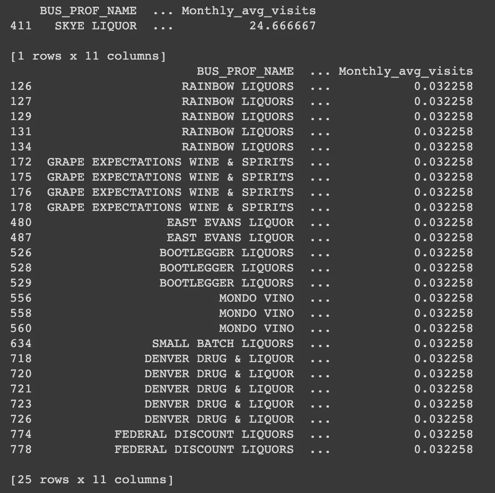

由此，我们可以看到，斯凯酒在 2018 年是非常频繁的访问。但是我们怎么能确定这个看似巨大的访问量不是数据的偏差，因为这个值仅仅存在于丹佛所有访问量最少的商店中呢？一个快速的解决方案是创建一个箱线图

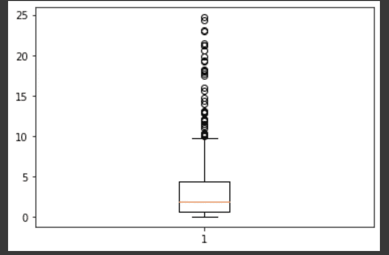

由此我们可以看出，虽然有许多值接近 SKYE LIQUOR 的值，但所有这些值都是异常值，并不代表数据的真实平均值(接近 2.5)。因此，这家店的受欢迎程度远远超过了该市的其他酒店，这是一个有趣的发现…

当将数据中所有记录的每月平均访问量绘制成条形图时，我们看到数据中有一个更加惊人的趋势。绿色条显示了 SKYE LIQUORS 的值，访问次数显示其范围从 20 到 140:这个范围明显高于其他记录的所有其他访问次数。这家店有什么特别的？

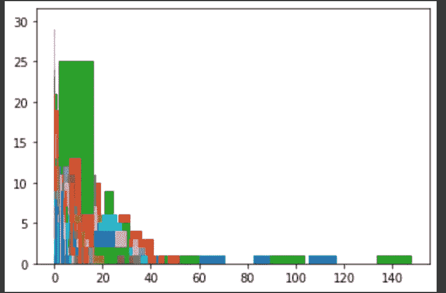

让我们分析一下这些记录每小时的流行程度，看看分析结果是否也显示了这种趋势。

```
l_pop_df = liquor_GS_df[[‘BUS_PROF_NAME’,’FULL_ADDRESS’,’LICENSES’,’ZIP’,’NEIGHBORHOOD’,’date_range_start’,’date_range_end’,’popularity_by_hour’,’popularity_by_day’]]
```

像以前一样，我们必须为我们的分析创建一个月平均受欢迎程度列:

```
l_pop_df[‘popularity_by_hour’] = l_pop_df[‘popularity_by_hour’].transform(lambda x: literal_eval(x))l_pop_df[‘Monthly_avg_pop’] = l_pop_df[‘popularity_by_hour’].transform(lambda x: sum(x)/len(x))
```

使用我们新创建的专栏，让我们看看 2018 年丹佛市最少和最受欢迎的酒类商店

```
max_avg_pop = l_pop_df[l_pop_df[‘Monthly_avg_pop’] == max(l_pop_df[‘Monthly_avg_pop’])]min_avg_pop = l_pop_df[l_pop_df[‘Monthly_avg_pop’] == min(l_pop_df[‘Monthly_avg_pop’])]print(max_avg_pop)print(min_avg_pop)
```

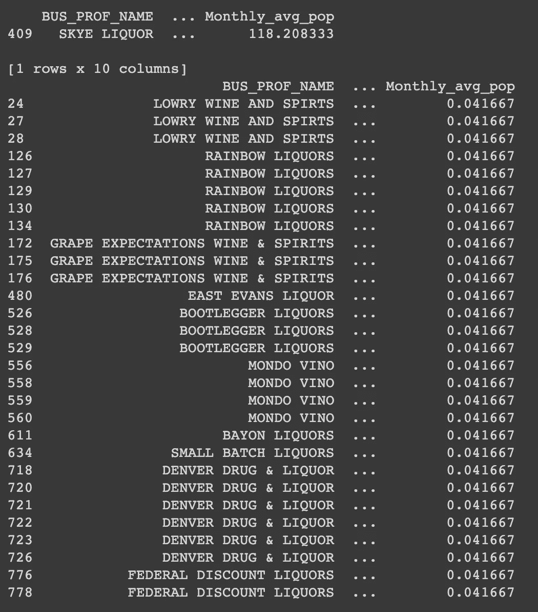

这些值之间的差异是惊人的！与周围的竞争对手相比，这家商店拥有如此惊人的人气和访客指标的根本原因是什么？为了确保这不是一个有偏差的数据，我们应该先看看箱线图

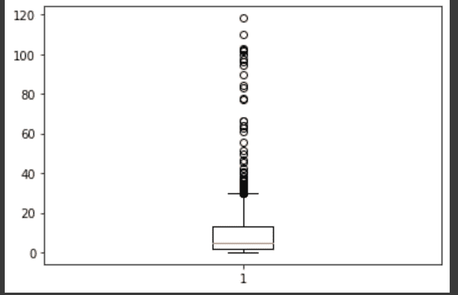

我们可以看到，像以前一样，与其余数据和平均受欢迎程度相比，斯凯酒的受欢迎程度是一个巨大的异常值，这似乎是< 10 . The difference in popularity between this store and its surroundings is truly intriguing. What is so special about this location?

```
l_pop_df[l_pop_df[‘BUS_PROF_NAME’] == ‘SKYE LIQUOR’].head()
```

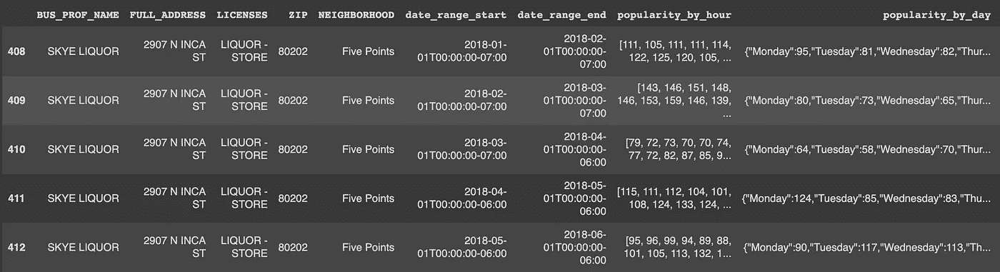

A quick google search shows that the location itself has only mediocre ratings (3/5 on google 1.5/5 on yelp and 1/5 on Facebook). How do other stores in the same area as this one fare in terms of popularity?

```
l_pop_df[l_pop_df[‘ZIP’] == ‘80202’].head()
```

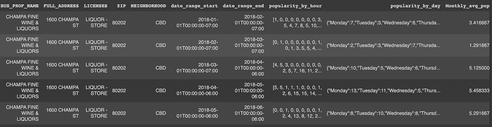

While it seems that the remaining two stores in this particular location are more leaning towards the mean of the overall popularity of the dataset, this particular store is at a much higher rating than the others. What is bringing SKYE LIQUOR this kind of foot traffic?

Perhaps the popularity of SKYE LIQUOR has something to do with the locations that surround it. This information can be best retrieved through the related_same_day_brand column

```
liquor_GS_df[liquor_GS_df[‘BUS_PROF_NAME’] == ‘SKYE LIQUOR’][‘related_same_day_brand’].tolist()
```

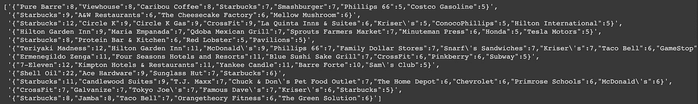

It seems that SKYE LIQUOR may have some of its popularity attributed to its surroundings. The location is placed next to a very popular rooftop diner in Denver and receives large crowds from the nearby Costco and Pure Barre gym. In addition to these locations, the store is right next to a Smashburger which will attract lots of customers as well. Thus the answer to this store’s success could in some part be attributed to its location.

Now that we have performed a basic dive into this data and the intricacies behind the success of one particular liquor store, it's time to take a step back and look at the overall trend of liquor consumption for the year 2018.

# Liquor Consumption: a Monthly Analysis

***注:*** *可以想象，对一年中的每个月执行相同分析的代码可能有点重复。因此，为了压缩本文的篇幅并减少重复，我将只显示一月份完成的分析的代码，并只显示所有后续月份的结果。如果您希望查看每个月数据的代码，请不要犹豫，查看本文*的 [*笔记本*](https://colab.research.google.com/drive/18c_Ipl6zIUZUUeEAgHxdeaJ44of2sVi1#scrollTo=hmvO7bPzPgGA)

*第一步是将数据分成几个月:*

```
*liquor_GS_df[‘date_range_start’] = liquor_GS_df[‘date_range_start’].apply(lambda x: pd.Timestamp(x))liquor_GS_df[‘date_range_end’] = liquor_GS_df[‘date_range_end’].apply(lambda x: pd.Timestamp(x))liquor_GS_df[‘date_range_start’] = pd.to_datetime(liquor_GS_df[‘date_range_start’], utc=True)liquor_GS_df[‘date_range_end’] = pd.to_datetime(liquor_GS_df[‘date_range_end’], utc=True)liquor_GS_df[‘month_start’] = pd.DatetimeIndex(liquor_GS_df[‘date_range_start’]).monthliquor_GS_df[‘month_end’] = pd.DatetimeIndex(liquor_GS_df[‘date_range_end’]).month*
```

*现在我们有一个月份值用于分离过程，任务变得简单了，如下所示:*

```
*L_GS_df_1 = liquor_GS_df[liquor_GS_df[‘month_start’] == 1]L_GS_df_2 = liquor_GS_df[liquor_GS_df[‘month_start’] == 2]L_GS_df_3 = liquor_GS_df[liquor_GS_df[‘month_start’] == 3]L_GS_df_4 = liquor_GS_df[liquor_GS_df[‘month_start’] == 4]L_GS_df_5 = liquor_GS_df[liquor_GS_df[‘month_start’] == 5]L_GS_df_6 = liquor_GS_df[liquor_GS_df[‘month_start’] == 6]L_GS_df_7 = liquor_GS_df[liquor_GS_df[‘month_start’] == 7]L_GS_df_8 = liquor_GS_df[liquor_GS_df[‘month_start’] == 8]L_GS_df_9 = liquor_GS_df[liquor_GS_df[‘month_start’] == 9]L_GS_df_10 = liquor_GS_df[liquor_GS_df[‘month_start’] == 10]L_GS_df_11 = liquor_GS_df[liquor_GS_df[‘month_start’] == 11]L_GS_df_12 = liquor_GS_df[liquor_GS_df[‘month_start’] == 12]*
```

*现在数据已经被正确格式化，让我们使用相同的访问者和受欢迎程度指标来查看哪些商店在一月份是受欢迎的:*

```
*l_avg_df_1 = L_GS_df_1[[‘BUS_PROF_NAME’,’FULL_ADDRESS’,’LICENSES’,’ZIP’,’NEIGHBORHOOD’,’date_range_start’,’date_range_end’,’raw_visit_counts’,’raw_visitor_counts’,’visits_by_day’]]l_avg_df_1[‘visits_by_day’] = l_avg_df_1[‘visits_by_day’].transform(lambda x: literal_eval(x))l_avg_df_1[‘Monthly_avg_visits’] = l_avg_df_1[‘visits_by_day’].transform(lambda x: sum(x)/len(x))max_avg = l_avg_df_1[l_avg_df_1[‘Monthly_avg_visits’] == max(l_avg_df_1[‘Monthly_avg_visits’])]min_avg = l_avg_df_1[l_avg_df_1[‘Monthly_avg_visits’] == min(l_avg_df_1[‘Monthly_avg_visits’])]print(max_avg)print(min_avg)*
```

*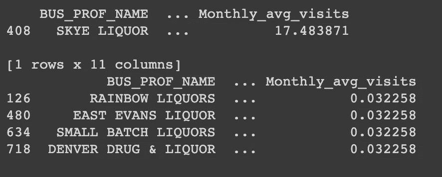*

*这里值得注意的一点是，仅从一月份来看，最受欢迎和最不受欢迎的酒类商店的平均访客数量有所下降。这可能是一个事实的指标，丹佛市在一月份倾向于比一年中的其他时间消耗更少的酒。让我们进一步分析数据。*

*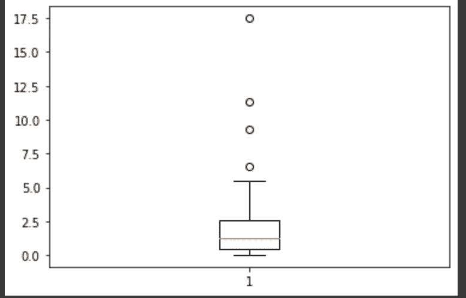*

*我们可以看到，一月份丹佛的平均酒类商店访问量低于全年数据(约 1.5 次对约 5 次)*

*现在，让我们使用流行度指标执行相同的分析，看看是否会出现相同的趋势:*

```
*l_pop_df_1 = L_GS_df_1[[‘BUS_PROF_NAME’,’FULL_ADDRESS’,’LICENSES’,’ZIP’,’NEIGHBORHOOD’,’date_range_start’,’date_range_end’,’popularity_by_hour’,’popularity_by_day’]]l_pop_df_1[‘popularity_by_hour’] = l_pop_df_1[‘popularity_by_hour’].transform(lambda x: literal_eval(x))l_pop_df_1[‘Monthly_avg_pop’] = l_pop_df_1[‘popularity_by_hour’].transform(lambda x: sum(x)/len(x))max_avg_pop = l_pop_df_1[l_pop_df_1[‘Monthly_avg_pop’] == max(l_pop_df_1[‘Monthly_avg_pop’])]min_avg_pop = l_pop_df_1[l_pop_df_1[‘Monthly_avg_pop’] == min(l_pop_df_1[‘Monthly_avg_pop’])]print(max_avg_pop)print(min_avg_pop)*
```

*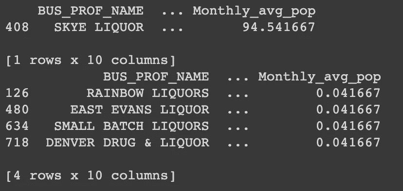*

*看起来受欢迎程度度量的值在一月份也下降了，这进一步证实了我们的说法，即与一年的其余时间相比，丹佛的酒类商店在一月份不那么经常被访问。*

*以此分析为例，下面是剩余几个月的结果:*

***二月:***

*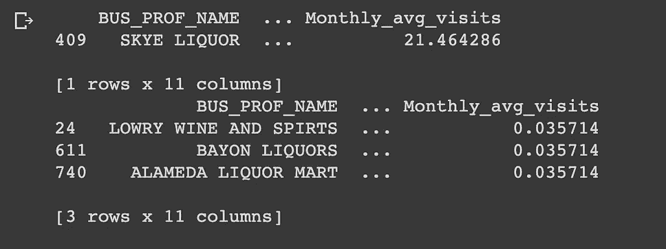**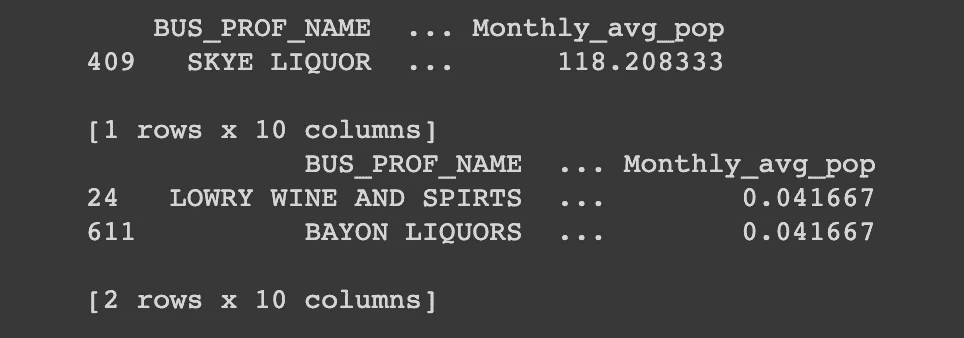*

***三月:***

*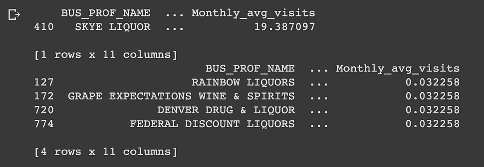**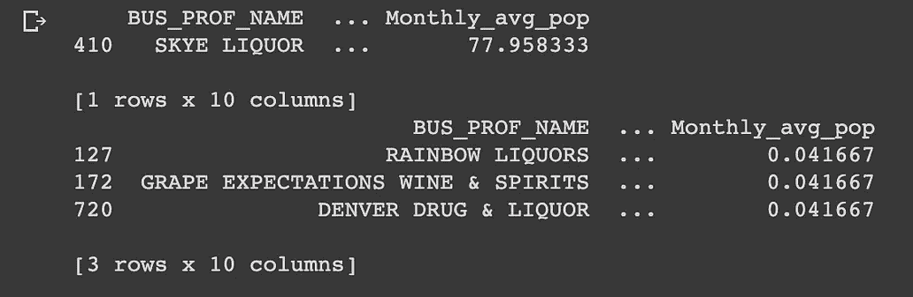*

***四月:***

*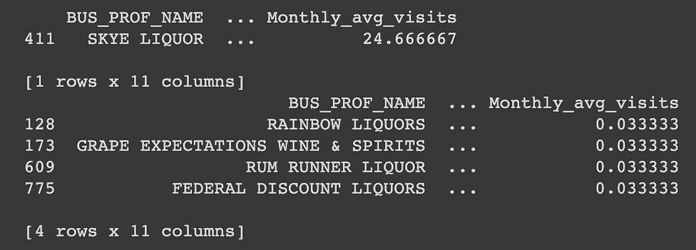**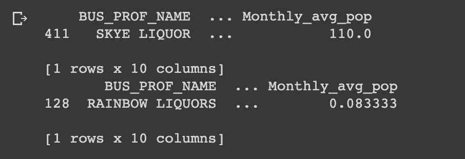*

***五月:***

*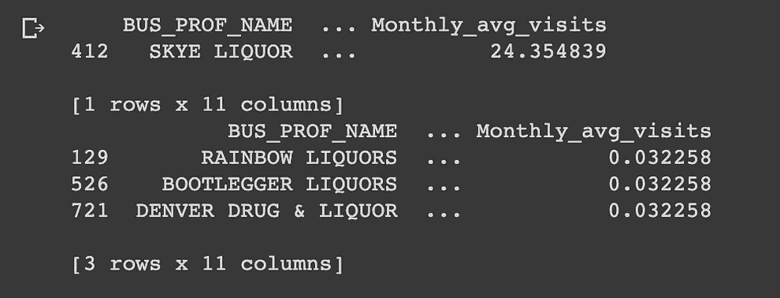**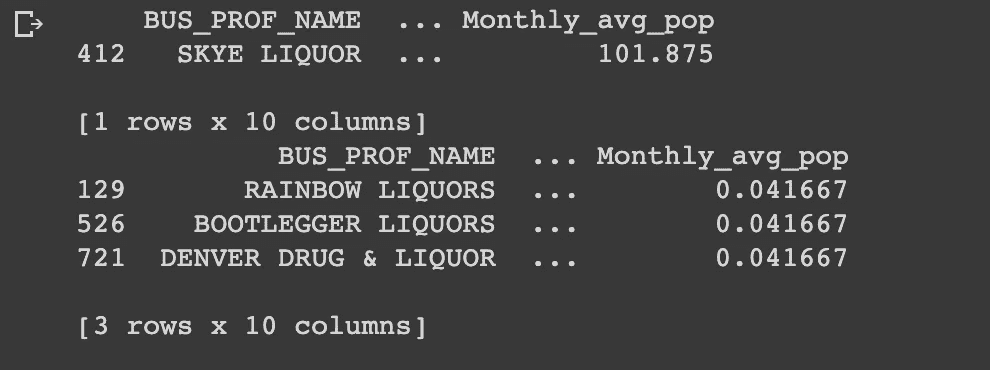*

***六月:***

*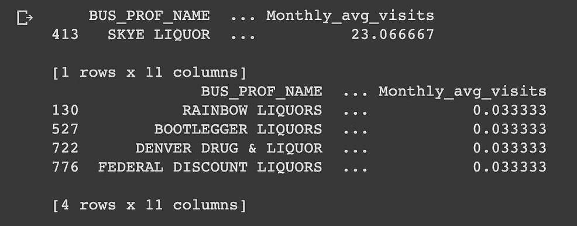**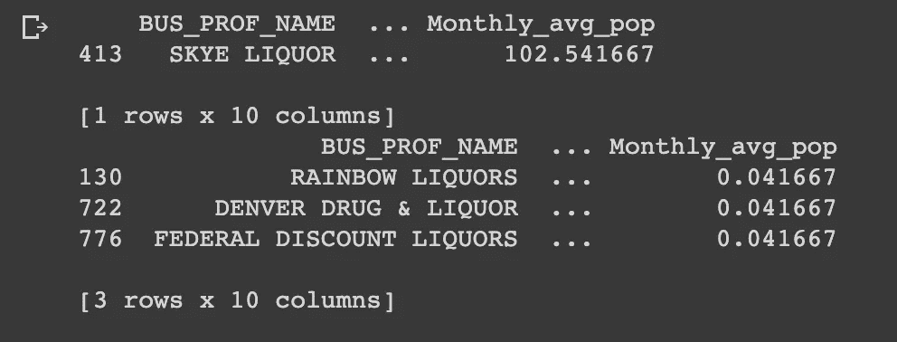*

***七月:***

*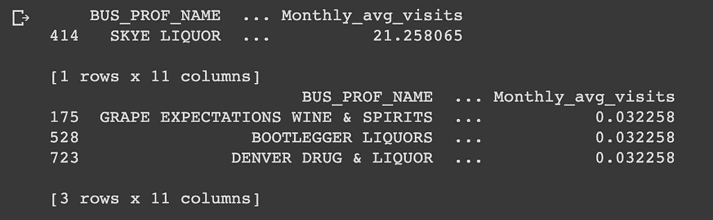**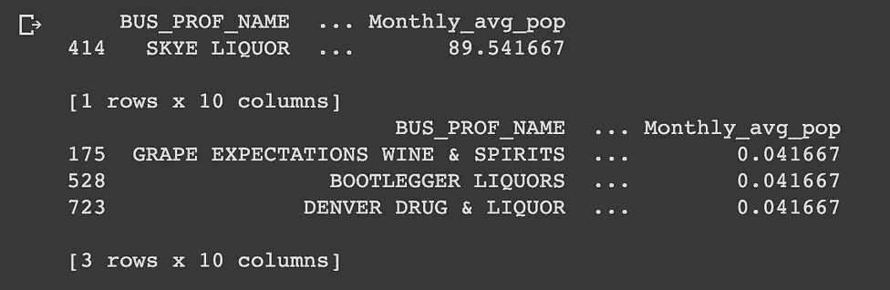*

***八月:***

*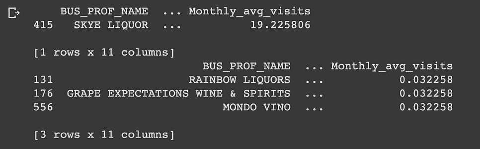**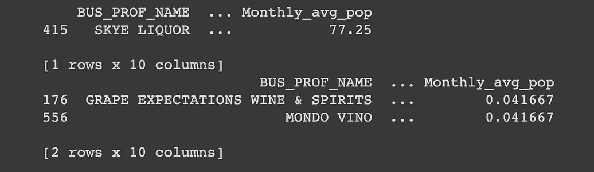*

***九月:***

*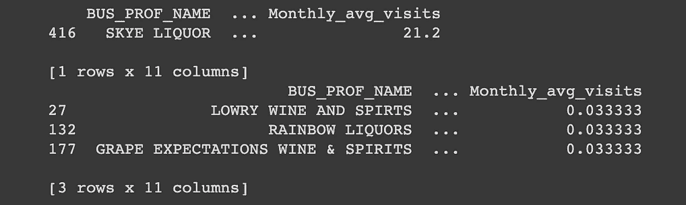**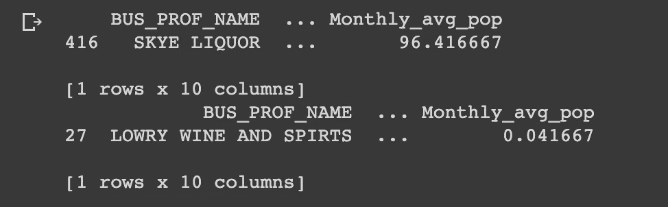*

***十月:***

*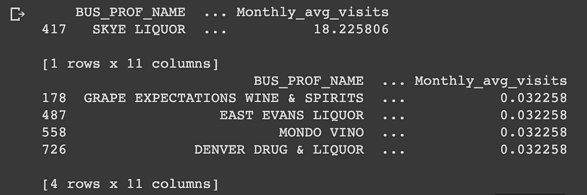**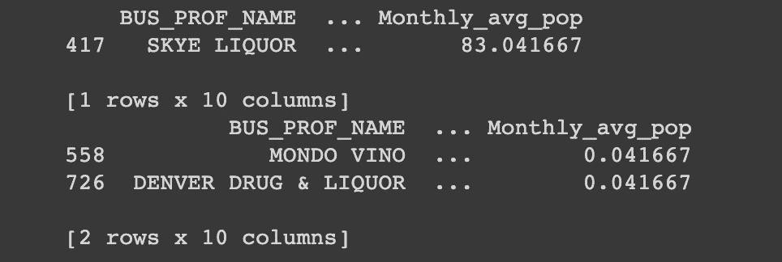*

***11 月:***

***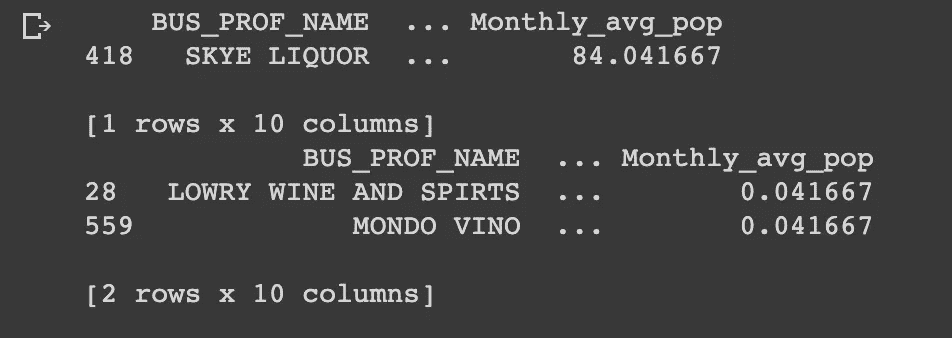*

*十二月:*

*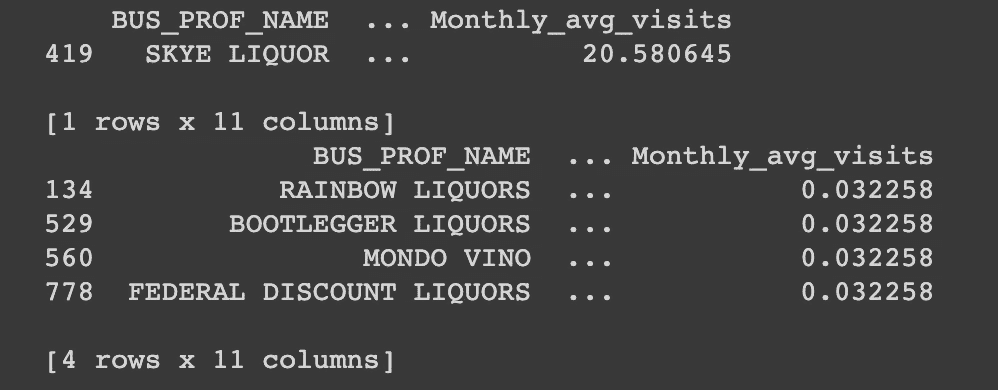**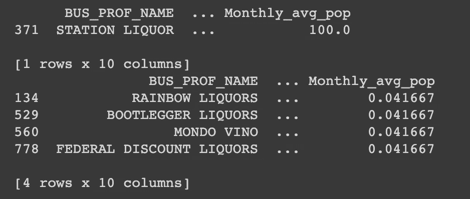*

*月度数据似乎显示了一个非常有趣的模式。随着一年向温暖的季节(春季和夏季)前进，丹佛最少和最受欢迎的酒类商店的访问量和人气指标显示出增长趋势。因此，酒类商店的总体受欢迎程度可以归因于天气吗？这似乎与许多庆祝节日都有酒的事实相矛盾(圣诞节、新年、感恩节等。)都是在较冷的季节庆祝。让我们看看季节和酒类商店人气之间的相关性是否真的与数据的季节分析相符。*

# ***酒类商店数据的季节性分析:丹佛酒类商店在较温暖的季节更受欢迎吗？***

*为了稍微简化一下这个问题，让我们只使用 SKYE LIQUOR 的值，因为剩余的数据显示出随着月份的推移，与我们最受欢迎的酒类商店的趋势相同。首先，让我们将月度分析的所有数据汇编成一个数据框架:*

```
*Season_Df = pd.DataFrame(data = {‘Monthly_avg_visits’: [17.483871,21.464286,19.387097,24.666667,24.354839,23.066667,21.258065,19.225806,21.2,18.225806,17.933333,20.580645],’Monthly_avg_pop’: [94.541667,118.208333,77.958333,110.0,101.875,102.541667,89.541667,77.25,96.416667,83.041667,84.041667,100.0],‘Season’: [‘Winter’,’Winter’,’Spring’,’Spring’,’Spring’,’Summer’,’Summer’,’Summer’,’Fall’,’Fall’,’Fall’,’Winter’]})Season_Df.head()*
```

*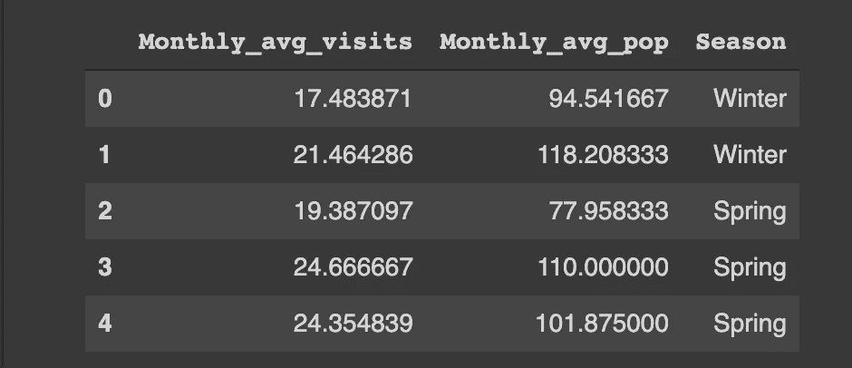*

*现在数据已经整理好了，让我们先用散点图展示一下每个季节的受欢迎程度:*

*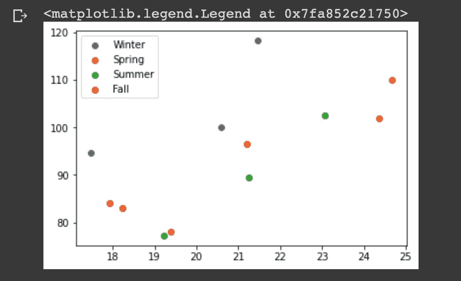*

*我们可以看到一个总的趋势，随着访问量的增加，商店的受欢迎程度也在增加。更深入地看，我们可以看到冬季和秋季显示出最低的访问数量，但一个特定的冬季月份拥有最大的受欢迎值。这个月映射回一月。这可能是新年饮酒导致的高峰吗？让我们通过柱状图进一步分析数据。*

*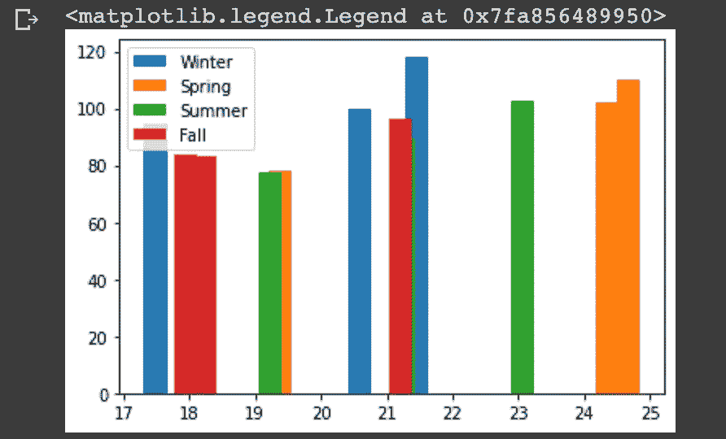*

*现在我们可以清楚地看到，夏季和春季是斯凯酒接待游客最多的月份。但是，这个数据可能太小，不足以确定所有丹佛酒类商店都是如此。让我们尝试对所有丹佛酒类数据进行同样的分析:*

```
*def season_func(month): if(month == 1 or month ==2 or month == 12): return ‘Winter’ elif(month == 3 or month == 4 or month == 5): return ‘Spring’ elif(month == 6 or month == 7 or month == 8): return ‘Summer’ elif(month == 9 or month == 10 or month == 11): return ‘Fall’liquor_GS_df[‘Season’] = liquor_GS_df[‘month_start’].transform(lambda x: season_func(x))liquor_GS_df[‘popularity_by_hour’] = liquor_GS_df[‘popularity_by_hour’].transform(lambda x: literal_eval(x))liquor_GS_df[‘Avg_pop’] = liquor_GS_df[‘popularity_by_hour’].transform(lambda x: sum(x)/len(x))liquor_GS_df[‘visits_by_day’] = liquor_GS_df[‘visits_by_day’].transform(lambda x: literal_eval(x))liquor_GS_df[‘Avg_visits’] = liquor_GS_df[‘visits_by_day’].transform(lambda x: sum(x)/len(x))*
```

*现在让我们用一个受欢迎程度散点图来直观显示数据:*

*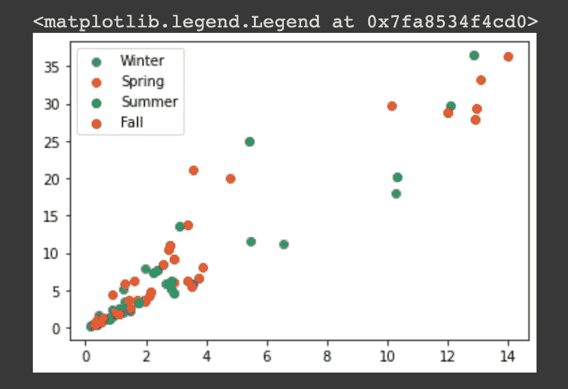*

*现在这种趋势更加明显。随着受欢迎程度的增加，访问指标似乎随着访问者指标的增加而增加，并显示出明显的线性趋势。就受欢迎程度和访问相关性而言，与春季和夏季相关联的值往往比与冬季和秋季相关联的记录更高，从而证实了我们的理论，即丹佛市在一年中较温暖的月份更经常访问酒类商店。*

# ***Liqour 数据结论***

*从这一分析中，我们能够看到几个趋势。就游客而言，斯凯酒业在 4 月、5 月、6 月、2 月和 7 月的游客最多。这是可以理解的，因为这几个月与阵亡将士纪念日、父亲节、情人节和 7 月 4 日等重大节日相关。然而，这有点有趣，不是我所期望的。大多数人会联想到饮酒的主要节日是圣帕特里克日(3 月)、感恩节(11 月)、圣诞节(12 月)。因此，在这五个月中没有任何一个出现在榜单上是非常令人惊讶的。我认为这是因为这些假期不足以抵消总体平均水平。相反，这一趋势表明，随着一年进入春季和夏季，酒精消费量增加。*

*当查看丹佛酒类商店数据的受欢迎程度时，SKYE LIQUORS 往往是除 12 月之外所有月份中最受欢迎的商店。12 月最受欢迎的酒类商店是车站酒。这种变化可能是由于节日期间更多的游客来到车站酒吧，这在这个时候颠覆了斯凯酒的受欢迎程度。酒类商店人气的趋势似乎遵循酒类商店平均月访问量的趋势；随着时间的推移，春季和夏季的到来，丹佛的酒类商店似乎越来越受欢迎。*

*我们将在下一篇文章中使用同样的方法处理丹佛药房的数据。那项分析的结果与这项研究的结果大相径庭，两项研究结果的并列实际上相当有趣。*

****提问？****

*我邀请你在 [SafeGraph 社区](https://www.safegraph.com/academics)的 **#safegraphdata** 频道问他们，这是一个面向数据爱好者的免费 Slack 社区。获得支持、共享您的工作或与 GIS 社区中的其他人联系。通过 SafeGraph 社区，学者们可以免费访问美国、英国和加拿大 700 多万家企业的数据。*