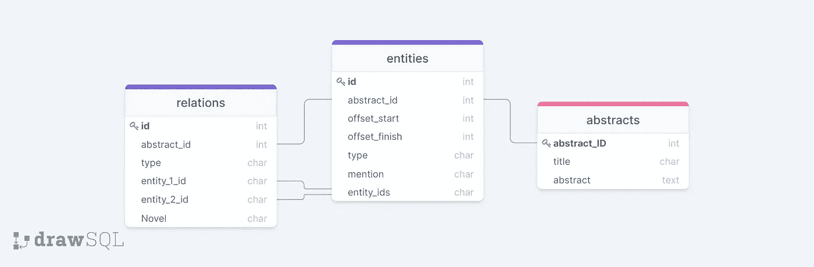
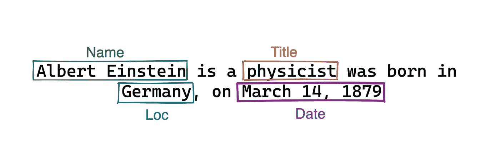
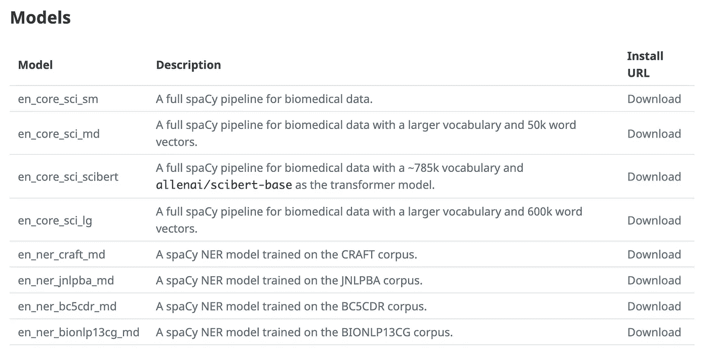
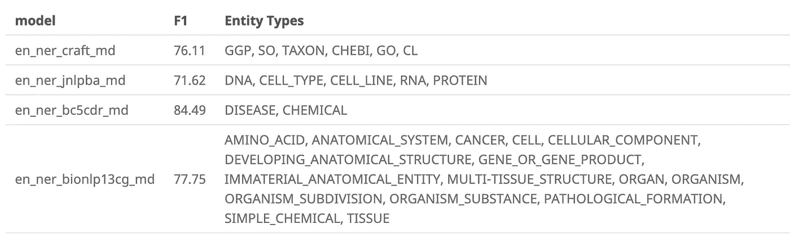

# NCATS 和美国宇航局的 LitCoin NLP 挑战

> 原文：<https://towardsdatascience.com/litcoin-nlp-challenge-by-ncats-nasa-48eaf8578ed1?source=collection_archive---------15----------------------->

## 自然语言处理

## 你能识别研究标题和摘要中的生物医学实体吗？


[阿德里安·匡威](https://unsplash.com/@adrienconverse?utm_source=medium&utm_medium=referral)在 [Unsplash](https://unsplash.com?utm_source=medium&utm_medium=referral) 拍摄的照片

在过去的两场比赛中，你用数据科学预测了[视频人气](https://medium.com/bitgrit-data-science-publication/building-an-xgboost-model-to-predict-video-popularity-ce4a39a356d7)和[病毒推文](/using-data-science-to-predict-viral-tweets-615b0acc2e1e)，现在是时候进行全新的挑战了！

[Bitgrit](https://bitgrit.net/) 发布了一项 NLP 挑战赛，奖金池为 10 万美元💵！

本次比赛的第一阶段将于 2021 年 12 月 23 日**结束，**因此[注册](https://bitgrit.net/competition/13)以获取数据，并跟随本文开始吧！

## 目标🥅

开发一个 NLP 模型，识别研究摘要中提到的生物医学🧬实体。

这场比赛分为两部分。

*(以下信息摘自网站)*

**第 1 部分:**仅给定一个抽象文本，目标是找到所有节点或生物医学实体(在文本和 BioLink 模型类别中的位置)。

如网站所述，生物医学实体的类型来自 [BioLink 模型类别](https://biolink.github.io/biolink-model/)，可以是且只能是以下之一

*   疾病表型特征
*   化学性质
*   有机体轴突
*   基因产品
*   序列变体
*   细胞系

**第 2 部分:**给定摘要和从中注释的节点，目标是找到它们之间的所有关系(节点对、BioLink 模型谓词和新颖性)。

从比赛的描述来看:

> 竞赛的每个阶段都旨在刺激自然语言处理领域的创新，要求参赛者设计能够从科学文章的文本中准确识别科学概念的系统，将这些概念连接到知识断言中，并确定该断言是新的发现还是背景信息。

这篇文章将集中在第一部分，这是确定生物医学实体。

## 数据是什么样的？

```
📂 LitCoin DataSet
 ├── **abstracts_train.csv
** ├── **entities_train.csv
** ├── relations_train.csv
 └── **abstracts_test.csv**
```

关于数据的一点信息:

*   在这里你可以找到生物医学期刊文章的标题和摘要。
*   `entities_train`有您需要预测的 6 个类别，以及单词在标题为 abstract 的字符串中的偏移位置。
*   `relations_train`是针对竞争的第 2 阶段，所以现在不用担心这个数据。

## 数据之间的关系

在这个数据集中，关系很简单，实体通过`abstract_id`与抽象相关，通过`entity_ids`与关系相关

下面是这种关系的可视化。



作者图片(使用 [drawsql](https://drawsql.app/) 创建)

关于[竞赛](https://bitgrit.net/competition/13)指南部分数据的更多信息。

现在你对目标有了一个想法，对给你的数据有了一些了解，是时候动手了。

**所有的代码都可以在**[**Google collab**](https://colab.research.google.com/drive/1LjXUYzq9q7Gt_wpRddnr5AAM1mhcFSbe?usp=sharing)**或者在**[**deep note**](https://deepnote.com/project/Identifying-biomedical-Entity-with-scispCy-pgWj5hVkR7KU54QikLp2kg/%2Fbiomedical.ipynb)上找到。

# 命名实体识别(NER)

有不同的自然语言处理任务可以解决不同的问题——文本摘要、词性标注、翻译等等。

对于这个特殊的问题，我们正在解决[命名实体识别](https://en.wikipedia.org/wiki/Named-entity_recognition)的问题，特别是在生物医学实体上。

## 这是什么？

根据维基百科，NER 被定义为

> [**信息提取**](https://en.wikipedia.org/wiki/Information_extraction) 的子任务，寻求**定位[非结构化文本](https://en.wikipedia.org/wiki/Unstructured_data)中提到的** [命名实体](https://en.wikipedia.org/wiki/Named_entity)并将其分类到**预定义类别**中，如人名、组织、地点、[医疗代码](https://en.wikipedia.org/wiki/Medical_classification)、时间表达式、数量、货币值、百分比等。

例如，以下面的句子为例:

> 阿尔伯特·爱因斯坦是一位物理学家，1870 年 3 月 14 日出生于德国

如果您阅读了它，您会立即能够将命名实体分为以下类别:

*   人物:阿尔伯特·爱因斯坦
*   职位:物理学家
*   地点:德国
*   日期:1870 年 3 月 14 日

虽然对我们人类来说识别和分类很简单，但计算机需要 NLP 来理解人类语言。

这就是 NER 所做的——它识别并分割文本中的主要实体。整个目标是让计算机从大量非结构化文本数据中提取相关信息。

有了足够的数据，您可以训练 NER 模型，使其能够以高精度对这些实体进行分类和分段。这些模型能够产生如下的可视化效果。



图片作者(用 [excalidraw](https://excalidraw.com/) 制作)

## 怎么会？

有不同的库和包，如 [spaCy](https://spacy.io/) 和 [NLTK](https://www.nltk.org/) 可以让你执行 NER，许多不同方法的预训练 NER 模型也可以在网上获得。

由于我们的问题更具体地针对生物医学文本，我们将使用 [scispaCy](https://allenai.github.io/scispacy/) ，这是一个包含 [spaCy](https://spacy.io/) 模型的 Python 包，用于处理生物医学、科学或临床文本。

scispaCy 提供了以下预先训练好的模型供您使用。



scispaCy 中的预训练模型([来源](https://allenai.github.io/scispacy/))

请注意，有 4 个 NER 模型是在不同的生物医学文章语料库上训练的。

文档还为我们提供了预训练模型预测的实体类型。



模型的实体类型([来源](https://allenai.github.io/scispacy/)

了解实体类型和它们所代表的内容将很快派上用场。但是现在，让我们安装必要的库并深入研究代码。

# 安装库和模型

要使用 scispacy，我们需要`spacy`至少是版本`3.0.1`

然后，我们将安装 scispacy 和四个模型。

# 加载库

然后我们将导入必要的库，以及模型。

# 导入数据

csv 文件由制表符分隔，所以我们使用`sep`参数来指定。

# 电子设计自动化(Electronic Design Automation)

## 抽象数据

从输出中，我们正好有 400 个标题和抽象数据用于预测实体类型。

## 实体数据

查看一下我们的实体数据，我们会发现从标题和抽象字符串中提取了超过 13k 个实体。

## 检查缺少的值

使用我编写的[辅助函数](https://deepnote.com/project/Identifying-biomedical-Entity-with-scispCy-pgWj5hVkR7KU54QikLp2kg/%2Fbiomedical.ipynb)，数据集中没有丢失的值。

## 有多少种实体类型？

通过简单的条形图，似乎 GeneOrGeneProduct 是最常见的类型。

现在我们对数据有了更好的理解，让我们开始看看 scispaCy 能做些什么。

# 科学在行动

让我们从第一个标题和抽象字符串开始。

第一个字符串有 717 个字符。

打印在下面，我们可以看到那串。

## 加载模型

现在让我们加载在 BioNLP13CG 语料库上训练的第一个模型— `bionlp13cg_md`，并将我们的文本传递给该模型。

我们现在有一个包含实体信息的文档对象。

## 获取实体

在它上面调用`.ents`，我们可以看到它提取的实体。

## 可视化带有标签的实体

我们甚至可以让 spaCy 将实体和标签可视化在我们的标题+抽象字符串上。这是通过`displacy`功能完成的

文档实体还具有属性`text`、`label_`、`start_char`和`end_char`，这些是我们在这个挑战中需要的重要信息。

瞧啊。你已经从一篇生物医学论文的标题中提取了实体，并用 scispaCy 的预训练 NER 模型进行了摘要！

现在让我们看看其他 3 个模型提取了什么实体。

## [工艺文集](http://bionlp-corpora.sourceforge.net/CRAFT/)模型

## [JNLPBA 语料库](https://paperswithcode.com/dataset/jnlpba)模型

## [BC5CDR 语料库](https://paperswithcode.com/dataset/bc5cdr)模型

现在让我们把所有这些实体分类放在一起。

现在，让我们为合并提取的实体创建一个数据框，包含文本、标签、起始字符和结束字符。

然后，我们将其与训练数据中给出的实体类型进行比较。

我们可以通过两个数据框之间的内部连接并排比较它们。

至于确定映射到哪一个，您需要通过 [biolink 模型](https://biolink.github.io/biolink-model/)，以及四个语料库的文档。

例如，基于[工艺](https://github.com/UCDenver-ccp/CRAFT)文集[文章](https://bmcbioinformatics.biomedcentral.com/articles/10.1186/1471-2105-13-161)，这些是实体类型所代表的

*   `GGP`—geneorgenphenotype
*   `SO` —序列本体
*   `TAXON` — NCBI 分类学
*   `CHEBI` —生物感兴趣的化学实体
*   `GO` —基因本体(生物过程、细胞成分、分子功能)
*   `CL` —细胞系

要更改数据中的值，我们可以使用 pandas 的`map`函数。

*注意:所以，TAXON 和 DNA 被映射到相同的值，因为 map 函数要求所有值都被映射到某个值。*

最终产品类似于您需要提交给竞争对手的产品，只是它仍然缺少 id、abstract_id，并且列名需要重命名。

注意:在 entites _ train 中，start_char 需要在 offset_start 之后增加 1

现在的挑战是如何在标题和摘要的其余部分做到这一点。

# 结论

注意，本文只介绍了解决这个问题的一种方法，我并不认为这是最好的解决方案。

这里有一些改进给定方法的方法

1.  使用数据调整每个句子/摘要中概念的频率
2.  根据数据中某些类别的分类方式以及阅读语料库和 biolink 文档，纠正一些错误分类
3.  使用数据来知道具体要搜索哪些本体

祝比赛一切顺利，第二阶段再见！

想要与其他数据科学家讨论这一挑战吗？加入[不和谐服务器](https://discord.com/invite/H5UTQs32Bn)！

关注 [Bitgrit 数据科学出版物](https://medium.com/bitgrit-data-science-publication)获取更多类似的文章！

关注 Bitgrit 的社交网站📱保持对研讨会和即将到来的比赛的更新！

*   [网站](https://bitgrit.net/)
*   [推特](https://twitter.com/bitgrit_global)
*   [领英](https://www.linkedin.com/company/bitgrit/mycompany/)
*   [Instagram](https://www.instagram.com/bitgrit/)
*   [脸书](https://www.facebook.com/bitgrit/)
*   [YouTube 频道](https://www.youtube.com/channel/UCsEdlkbxrAH93NVGFgGtgdA)
*   [电报社区](https://t.me/bitgrit)！