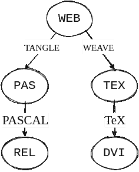

# 有文化的编程，可重复的研究，和“干净的代码”+文档串

> 原文：<https://towardsdatascience.com/literate-programming-reproducible-research-and-clean-code-docstrings-accf1a9f6661?source=collection_archive---------25----------------------->

## 概念之间的概述和比较以及它们的适用范围

帕特里克·托马索在[未喷涂](https://unsplash.com/photos/Oaqk7qqNh_c)上拍摄的照片。

## 什么是“识字编程”？

Donald Knuth 在 1984 年正式提出了“识字编程”的概念(Knuth，1992)。在他的书中，他建议在程序的构建中改变以下态度:

> 与其想象我们的主要任务是指示计算机做什么，不如让我们集中精力向人类解释我们希望计算机做什么。

在斯坦福大学，识字编程的想法是通过`WEB`系统实现的。它包括将文档格式化语言与编程语言相结合(Knuth，1992)。在 1983 年提交给计算机杂志的原始报告中，`WEB`系统的例子由`TeX`和`PASCAL`组成。这个选择并不令人惊讶，因为唐纳德·克努特创造了`TeX`。代码被写在一个单独的`.WEB`文件中。Knuth 喜欢使用术语`WEB`的一个原因是，他认为一段复杂的代码就像一张*网*简单的材料被巧妙地放在一起(Knuth，1992)。“编织”过程包括将文档格式语言分离到一个单独的文件中。而“缠结”需要提取编程语言以产生机器可执行的代码(Knuth，1992)。这个过程如图 1 所示(Knuth，1992)

**图 1** :采用原图，显示`.WEB`文件的双重用途。“编织”将`TeX`从`.WEB`文件中分离出来，将其编译成输出文件，而“缠结”提取`PASCAL`代码以生成机器可执行的程序。图表是在 draw.io 中创建的。

如果你考虑使用识字编程的工具，他们的[网站](http://www.literateprogramming.com/tools.html)有一个长长的工具列表，可以用来编写识字编程的代码([“更多工具】](http://www.olavpedersen.com/2021/03/literate-programming-reproducible-research-and-clean-code-docstrings/#orgc8c4cf3))。虽然它是全面的，但它没有列出稍后将提到的奇妙工具。网上还有其他几个似乎很受欢迎的项目，比如扎卡里·耶迪迪亚的[识字](https://github.com/zyedidia/Literate)项目。

## 数据科学和可再生研究

“数据科学”一词最早可能出现在 1974 年，最初由以下引文定义(曹，2017)。

> 一旦数据被建立，处理数据的科学，而数据与它们所代表的关系被委托给数据的其他领域。

自 2012 年以来，这个词越来越受欢迎(曹，2017)。这种增长可能是由于数据挖掘、大数据的出现，以及人工智能(AI)和机器学习(ML)的进步。由于大量数据的积累，跨学科的工具正在被结合起来形成一个“新”的领域。数据科学更现代、更全面的定义如下(曹，2017)。

> 从学科角度来看，数据科学是一个新的跨学科领域，它综合并建立在统计学、信息学、计算、通信、管理和社会学的基础上，研究数据及其环境(包括领域和其他上下文方面，如组织和社会方面)，以便通过遵循数据到知识到智慧的思维和方法将数据转化为见解和决策。

文化编程的一个中心点是将原始文档“编织”和“缠结”成两个独立的文件。原始的 *web* 文档不一定会被用作最终结果。然而，现代使用“可重复研究”意味着使用类似的文字编程 *web* 文档作为最终结果(Goodman 等人，2018)。

**图 2**:Jupyter 笔记本的例子，展示了富文本、代码块以及输出的混合。图片取自[维基共享资源](https://commons.wikimedia.org/wiki/File:Screenshot_of_a_Jupyter_Notebook_with_SPARQL_kernel_after_running_a_query_to_the_Wikidata_Query_Service_as_of_21_September_2020.png)，作者为[丹尼尔·米森](https://commons.wikimedia.org/wiki/User:Daniel_Mietchen)。

计算机科学家 Jon Claerbout 创造了“可重复研究”这一术语，并用文档的读者能够看到从原始数据到代码生成表格和图表的整个过程来描述它(Goodman et al .，2018)。这个术语可能有点令人困惑，因为再现性长期以来一直是研究和科学方法的重要组成部分。

一般来说，在科学领域使用软件的一个问题是正在进行的研究的可重复性(Hinsen，2013)。因此，围绕代码的更大的上下文是更重要的，并且可能不是通过代码本身就能自我解释的。探索性数据科学领域的专家甚至很难跟踪他们进行的实验。这可能会导致混淆已经进行了哪些实验以及这些实验是如何得出结果的(Hinsen，2013)。由于数字化和数字工具已经成为许多领域中更重要的一部分，可复制的研究在流行病学、计算生物学、经济学和临床试验等领域变得流行(Goodman et al .，2018)。

虽然有文化的编程和可复制的研究在形式上密切相关，但它们的用途略有不同。文化编程并不专门用于研究，而是一种更广泛的编程方法。而可再现性研究侧重于提供实验或研究的完整背景，而不是使代码本身更易读。

一些更受欢迎的可重复研究工具是用于 python 编程的 [Jupyter 笔记本](https://jupyter.org)(图 2 中的示例)，以及将`SWeave`和`knitr`集成到用于统计语言 R 编程的[R Markdown](https://rmarkdown.rstudio.com)(Kery et al .，2018)。Jupyter Notebooks 是 IPython(交互式 Python)项目的一个开源衍生项目。Python 被认为是一种相当容易学习的语言，有几个 python 项目既支持数据操作，又支持不同的机器学习框架，如 [Tensorflow](https://www.tensorflow.org) 和 [PyTorch](https://pytorch.org) 。这使得 Jupyter 笔记本特别适合数据科学。

## 可读和干净的代码

上面提到的 Knuth 态度的改变主要是为了让代码对人类来说更可读。有文化的编程是实现这个目标的一种方法，但不是唯一的途径。如果代码写得这么好，完全不言自明，那会怎么样。

罗伯特·c·马丁，被亲切地称为“鲍勃叔叔”，是一名软件工程师，也是畅销书*干净代码:敏捷软件工艺手册*的作者(马丁&科普林，2009)。他有一个有趣的关于干净代码的演讲，他解释说代码应该读起来像“写得很好的散文”。他在书中写道(马丁&科普林，2009 年):

> 事实上，花在阅读和写作上的时间比远远超过 10 比 1。作为编写新代码工作的一部分，我们不断地阅读旧代码。…[因此，]让它容易阅读，就更容易写作。

虽然编写可读的代码是我们一直努力的目标，但它可能永远不会完全不言自明。因此，最好用文档来补充代码。

## 使用文档字符串的自我文档化

Emacs 有一个很好的方法[自文档](https://www.emacswiki.org/emacs/SelfDocumentation#:~:text=Emacs%20is%20an%20extensible%20self,primitives%20and%20values%20with%20AproposMode.)，这对于理解用`elisp`编写的编辑器源代码非常有帮助。它使用*文档字符串*(或 docstrings)，这些是直接写入代码的注释。用代码编写注释来描述函数并不罕见。然而，传统的文件内文档在运行时被从源代码中剥离，比如 [Javadocs](https://docs.oracle.com/javase/7/docs/technotes/tools/windows/javadoc.html) 。文档字符串在编写它的代码的整个运行时期间都被维护。然后，程序员可以在程序的整个运行时间内交互式地检查这一点。

一些支持文档字符串的著名语言包括:

*   Lisp/Elisp
*   计算机编程语言
*   长生不老药
*   Clojure
*   哈斯克尔
*   腌食用小黄瓜
*   朱莉娅

Emacs 几乎就像在一个`lisp`终端工作。编辑器完全是用`lisp`的变体写的，叫做`elisp`。例如，为了垂直分割一个窗口，函数`split-window-below`被调用。下面的代码片段是这个函数的源代码的开始。

当调用函数`describe-function`并输入函数名“split-window-below”时，会在一个 mini-buffer(一种小缓冲区)中生成如下输出。该文档是在运行时动态创建的。

> split-window-below 是' window.el '中的一个交互式编译 Lisp 函数。
> 
> 它绑定到 SPC w -，SPC w s，M-m w -，M-m w s，C-x 2，
> 
> (下方拆分窗口&可选尺寸)
> 
> 可能在 Emacs 版本 24.1 或之前引入。
> 
> 将所选窗口拆分为两个窗口，一个在另一个上面。所选窗口在上方。新分离的窗口位于下方，显示相同的缓冲区。返回新窗口。
> 
> 如果可选参数 SIZE 被省略或为零，则两个窗口的高度相同或接近。如果 SIZE 为正值，上部(选定的)窗口将显示尺寸线。如果 SIZE 为负，下面的(新的)窗口将得到-SIZE 行。
> 
> 如果变量‘split-window-keep-point’非零，则两个窗口都获得与所选窗口相同的点值。否则，选择窗口开始以最小化重新显示的量；这在慢速终端上很方便。
> 
> [返回]

比较源代码中的 docstring 和`describe-function`的输出，输出文档中添加了更多的信息。这是次要的，但是在 emacs 中使用`describe-*`函数可能是学习 Emacs 最有用和最有帮助的方法。然而，这确实显示了如何在 emacs 中使用 docstrings 的好处。

## 识字编程和可复制研究的组织模式

虽然 Jupyter 笔记本是一种写可重复研究的奇妙方式，但它们不是一种有文化的编程方法，因为它们不是用来“编织”和“纠结”的。最初的工具，如`WEB`识字编程系统，不允许交互式编译嵌入式代码。然而，Org-mode 是第一个为可重复研究和识字编程提供全面支持的组织(Schulte et al .，2012)。

[Org-mode](https://orgmode.org) 在 emacs 中是一种叫做*主模式*的东西。一个`.org`文件本质上是一种纯文本标记语言，但是在 org-mode 中可以做的事情太多了，令人难以置信。通过一些配置，它可以用作几乎任何东西，包括高级议程系统、日历、财务账本、 [zettlekasten](https://en.wikipedia.org/wiki/Zettelkasten) 笔记记录系统( [org-roam](https://github.com/org-roam/org-roam) )，以及几乎任何文本格式的导出器。即使这是一个不完整的列表，但是对于那些感兴趣的人来说，这是一个更完整的列表。

**图 3** :一个“`.org’`文件的例子，在`emacs-lisp`中有代码块，这些代码块会和一个叫做`spacemacs.el`的文件纠缠在一起。这是我的. spacemacs.org 识字配置文件截图。

使用名为`org-babel`的包，它可以允许使用 org-mode 的内置导出功能进行“编织”，以及使用整个文件的`org-babel-tangle`进行“缠结”(见图 [3](http://www.olavpedersen.com/2021/03/literate-programming-reproducible-research-and-clean-code-docstrings/#orgc1de209) )。与其他标记语言一样，`.org`文件已经支持代码块的富文本格式。通过简单的标签和命令，代码可以运行。通过使用某些`session`标签，代码块可以动态运行。以这种方式在同一个文件中的同一个或多个会话中运行嵌入式代码块对于可重复的研究非常重要。Schulte 等人在 2012 年发表的论文中详细介绍了使用 org-mode 进行识字编程和可重复研究的情况。解释和演示如何使用`org-babel`的博文可以在[这里](http://howardism.org/Technical/Emacs/literate-devops.html)找到。

## 结束语

虽然有文化的编程是为编程项目提供更多上下文的有用工具，但在许多情况下，编写自我解释的代码可能是纯软件工程的最佳途径。可复制的研究更适合于解释一项研究或一项实验，这在当今科学实践中特别有用，因为数字工具的使用持续增长。与软件工程相反，这些用例不太适合简单地编写自我解释的代码。有文化的编程和可复制的研究针对不同的目的攻击混合的自然语言和计算语言文档(Schulte et al .，2012)。虽然识字编程将自然语言引入编程文件，但可再生研究将嵌入式可执行代码添加到自然语言文档中(Schulte et al .，2012)。

如果人类能够轻松地编写机器代码，就不需要所有不同类型的编程语言了。我们使用编程语言的原因是为了能够解释和理解我们正在指示计算机做的事情。因此，让代码易于理解应该是当务之急。即使 Knuth 的文化编程可能不适合所有的环境，我认为他告诉读者我们正在指导机器执行什么的态度在任何编程环境中都是有价值的。对于协作和长期复杂的编码项目来说尤其如此。

虽然提到了识字编程和可复制研究之间的一些差异，但没有讨论识字编程的具体例子。配置文件是文化编程的理想选择。他们通常需要解释设置的上下文或设置本身。写完有文化的配置后，可以把它们纠结起来生成实际的配置。我希望尽快写一篇文章，展示我是如何为 spacemacs 创建一个有文化的配置的。

# 文献学

[1] Knuth，D. E .，*识字方案编制*(1992 年)，Cent。学习郎。Inf *。*

[2]曹，l .，*数据科学:一个全面的综述* (2017)，美国计算机学会计算机科学分会。Surv。，第 50 卷，第 1-42 页。计算机协会。从 https://dl.acm.org/doi/10.1145/3076253[取回](https://dl.acm.org/doi/10.1145/3076253)

[3] Goodman，S. N .，Fanelli，d .，& Ioannidis，J. P .，*研究再现性是什么意思？* (2018)，Get。敬美好的未来。生物医学。Sci。(第 8 卷，第 96-102 页)。斯普林格国际出版公司。从 www.ScienceTranslationalMedicine.org[取回](http://www.ScienceTranslationalMedicine.org)

[4] Hinsen，k .，*用于可再生研究的软件开发* (2013)，Comput。Sci。英语。, 15(4), 60–63.

[5] Kery，M. B .，Radensky，m .，Arya，m .，John，B. E .，& Myers，B. A .，*笔记本中的故事:使用有文化的编程工具探索数据科学* (2018)，从[https://doi.org/10.1145/3173574.3173748](https://doi.org/10.1145/3173574.3173748)检索

[6] Martin，R. C .，& Coplien，J. O .，*干净代码:敏捷软件工艺手册* (2009)，新泽西州上马鞍河:普伦蒂斯霍尔。检索自[https://www . Amazon . de/gp/product/0132350882/ref = oh % 5f details % 5f 00% 5fs 00% 5fi 00](https://www.amazon.de/gp/product/0132350882/ref=oh%5Fdetails%5Fo00%5Fs00%5Fi00)

[7]舒尔特(e .)、戴维森(d .)、戴伊(t .)、张秀坤(c .),*《用于文化编程和可复制研究的多语言计算环境》* (2012)，J. Stat。Softw *。*，46 (3)，1–24。检索自[https://www . jstatsoft . org/index . PHP/jss/article/view/v046i 03/v46i 03 . pdf](https://www.jstatsoft.org/index.php/jss/article/view/v046i03/v46i03.pdf)[https://www . jstatsoft . org/index . PHP/jss/article/view/v046i 03](https://www.jstatsoft.org/index.php/jss/article/view/v046i03)

[8] *更多工具*。真实的程序*。*从 http://www.literateprogramming.com/tools.html[取回](http://www.literateprogramming.com/tools.html)

*原载于 2021 年 3 月 13 日 http://www.olavpedersen.com**[*。*](http://www.olavpedersen.com/2021/03/literate-programming-reproducible-research-and-clean-code-docstrings/)*