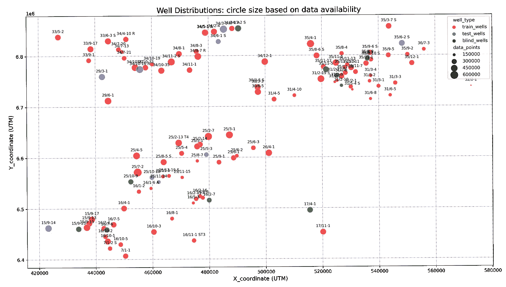
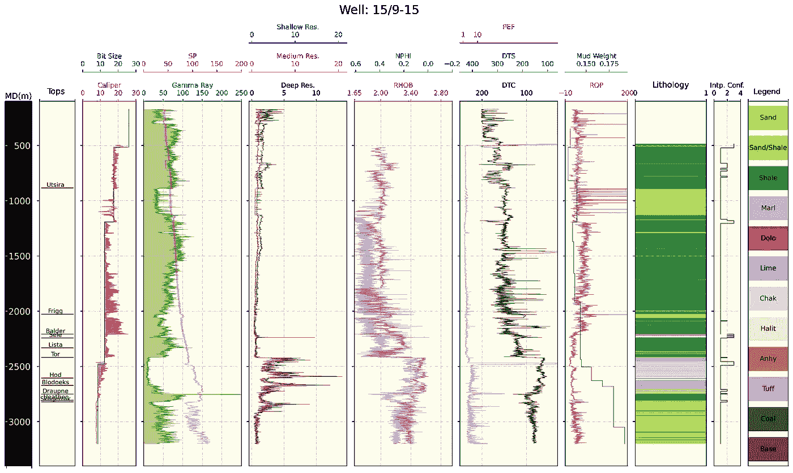
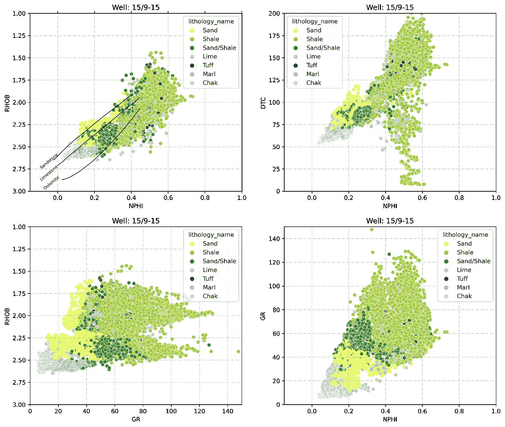

# 使用深度学习进行岩性预测:Force 2020 数据集:第 1 部分(数据可视化)

> 原文：<https://towardsdatascience.com/lithology-prediction-using-deep-learning-force-2020-competition-dataset-part-1-1ba0264981b4?source=collection_archive---------25----------------------->

## 多类分类:地质示例

本次竞赛的目的是根据测井记录预测岩性标记，提供 NDP 岩石地层和油井 X，Y 位置。在这项工作中，试图有一个标准的方法，像其他机器学习问题一样，使用深度学习方法来提高预测分数。数据集的维度非常大，出于训练目的，我们应该考虑计算成本限制。为了解决这个问题，我们可以利用 TensorFlow 库在 GPU 中进行并行计算。由于我们将构建一个几乎庞大的神经网络(几个隐藏的密集层)，GPU 计算可以比 CPU 训练模式加快训练过程至少十倍。在做任何事情之前，我们需要熟悉数据集。您可以从[这里](https://zenodo.org/record/4351156#.YD17iWhKjUr)访问完整的数据下载链接。
参见 [GitHub](https://github.com/mardani72/Lithology_Prediction_Deep_Learning) 账号获取本文使用的源代码。

## 数据集:

它总共包含 118 口井的数据，其中 98 口用于训练，10 口用于测试，其余为挪威海上的盲井数据。此外，油井坐标和解释岩相和岩石地层学，这些测井测量包括:卡利、RDEP、RHOB、DHRO、SGR、GR、RMED、RMIC、NPHI、PEF、RSHA、DTC、SP、BS、ROP、DTS、DCAL、泥浆比重。除 GR 和深度外，其他测井记录有缺失值，将在数据准备过程中处理。详细的数据解释，可以从[这里](https://xeek.ai/challenges/force-well-logs/overview)阅读更多。

在第 1 部分中，将像传统的岩石物理方法一样绘制井位图、测井记录和一些重要的交会图，以便用户熟悉数据集。在此之前，我们要下载 LAS 文件，用 Python 读入磁盘。如果你是在 Python 环境中处理 LAS 文件的新手，我邀请你阅读我的第[篇](/10-steps-in-pandas-to-process-las-file-and-plot-610732093338)和第[篇](/5-steps-in-pandas-to-process-petrophysical-well-logs-de6c8d03d9b1)与此主题相关的帖子。

虽然在竞赛中提供了训练和测试数据集。csv 格式作为单个文件，在这里，我们更愿意处理 LAS 文件和地层顶部。为了便于比较，我们将考虑与竞争中的训练井和测试井相同的井。

## 油井数据分布:

在下图中，地理井位置用圆形中的 X 和 Y 坐标绘制。圆圈大小与该特定井的可用数据点成比例。很明显，我们正在处理三组井，西北、西南和东北。我们可以看到，选择测试井与整个数据点分布相当一致。我们将在接下来的部分中涉及更多。

作者图片

## 测井曲线:

为每口井绘制了最重要和最频繁的测井记录。您可以调用 *log_plots(well_name，start_depth，stop_depth)* 来可视化您喜欢的井。

事实上，这种绘图是获取油井数据的最定性的方法之一。您可以检查噪声级别、各种日志之间的相关性、特定日志的可用性或缺失。为了理解数据集，建议仔细浏览每个孔。除了特征选择的定量方法之外，有时，视觉判断也是有帮助的。

作者图片

## 交叉图:

交会图是数据关联和变量关系的重要可视化工具。对于这个具有 16 个特征的数据集，我们可以绘制超过 3500 个唯一的交会图，但这不是一个合理的方法。我们应该考虑那些岩石物理上有意义的关系的测井记录。伽马射线、声波、密度和中子孔隙度与有意义的岩性类型分组有很大的相关性。

作者图片

在这项工作的下一部分，我们将讨论数据操作和建模准备。如有任何问题或更多细节，请联系我。