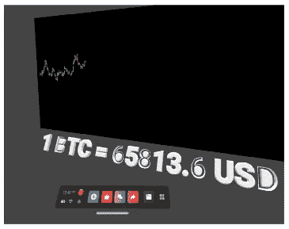
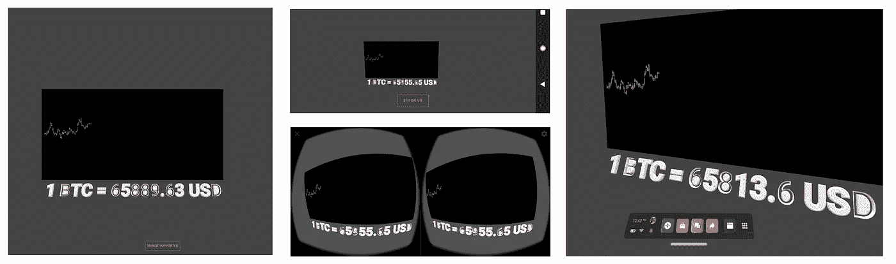

# 网上虚拟现实环境中加密货币数据的实时显示

> 原文：<https://towardsdatascience.com/live-display-of-cryptocurrency-data-in-a-vr-environment-on-the-web-af476376d018?source=collection_archive---------17----------------------->



在 Oculus Quest 2 VR 耳机中查看历史比特币数据。作者 Luciano Abriata 图。

## 一种“虚拟股票交易中心”

您已经在以前的文章中看到，我强烈支持客户端 web 编程。从简短的 JavaScript 代码到[对齐空间中的 3D 点集合](/the-definitive-procedure-for-aligning-two-sets-of-3d-points-with-the-kabsch-algorithm-a7ec2126c87e)到[用于网络浏览器计算的 JavaScript 库](/websites-for-statistics-and-data-analysis-on-every-device-ebf92bec3e53)，然后我用来运行例如[PCA online](/exploring-the-script-of-a-youtube-video-through-2d-projections-of-its-bags-of-words-6502bce920d8)；从作为网页运行的用于化学教育的增强现实应用程序到机器学习工具，从在网络浏览器中跟踪你的手的机器学习工具到实时获取加密货币数据的 JavaScript 代码。

这篇新文章的目标是展示如何轻松地将各种技术结合到复杂的未来程序中，这些程序可以在计算机、智能手机、平板电脑甚至 VR 设备的 web 浏览器中运行。无需安装任何程序或应用程序，只需使用您手边的设备访问网页，只需通过互联网分发，并且只需一段代码即可在所有设备上正确显示。

具体来说，我在这里向您展示了一个 web 应用程序的基础知识，该应用程序在一个图形界面中显示历史和实时加密货币数据，该界面可在所有这些设备上工作，包括高端 VR 头戴设备，在那里体验变得完全身临其境……就像在证券交易中心一样，只是它是专门针对加密货币的，并且是完全虚拟的！

从左至右，在我的笔记本电脑、智能手机(进入 VR 模式之前和以下纸板护目镜的 VR 模式)和 Oculus VR 设备中查看这个 web 应用程序的运行情况:



这款网络应用可以在笔记本电脑上看到(从左到右),没有虚拟现实可用，但你仍然可以用鼠标或键盘在虚拟现实场景中移动；一部智能手机，你可以通过触摸手势在场景中四处移动，或者通过使用护目镜进入沉浸式 VR 模式，或者在 Oculus Quest 2 设备的高度沉浸式 VR 视图中。由作家卢西亚诺·阿布利亚塔创作的人物。

想去玩吗？在您设备的浏览器中打开此链接，无论它是什么:

[**https://lucianabriata . alter vista . org/tests/cryptogames/cryptoVR/index . html？API key = yourpakeyhere**](https://lucianoabriata.altervista.org/tests/cryptogames/cryptoVR/index.html?apikey=YOURAPIKEYHERE)

在 VR 设备中打字更快的短链接(如果预装了 API 键):[https://bit.ly/3ckORFr](https://bit.ly/3ckORFr)

# 关键组件

虽然您可以在上面的链接中看到确切的代码，但让我来概述一下它是如何工作的。这个 web 应用的关键组件有两个:用于检索加密货币数据的 cryptocompare API，以及用于处理跨设备兼容的 webVR 视图的 WebXR。

## Cryptocompare API

我已经在本文中介绍了这个 API 以及如何调用它:

</obtaining-historical-and-real-time-crypto-data-with-very-simple-web-programming-7b481f153630>  

我们在这里调用 API 两次。第一次获取过去 6 小时的历史数据( *getBtcDataHistoryMinute* ):

```
//look inside var response = await fetch(‘[https://min-api.cryptocompare.com/data/v2/histohour?fsym=BTC&tsym=USD&limit=360&toTs=-1&api_key='](https://min-api.cryptocompare.com/data/v2/histohour?fsym=BTC&tsym=USD&limit=720&toTs=-1&api_key=') + apikey );
```

然后每分钟一次获取更新的价格( *getBtcData* ):

```
fetch(‘[https://min-api.cryptocompare.com/data/price?fsym=BTC&tsyms=USD'](https://min-api.cryptocompare.com/data/price?fsym=BTC&tsyms=USD'))
```

**一些细节:**

1-注意 API 调用是异步的。他们从以下几点开始:

```
var getBtcData = async () => {
...
var getBtcDataHistoryMinute = async () => {
```

2-因此，由于我们需要确保首先显示历史数据，我们需要使用一个辅助变量来标记历史数据是否已经被检索和显示。变量为 *historydone* ，初始化为 false，仅在*getBtcDataHistoryMinute*过程结束时变为 true:

```
var historydone=false...var getBtcData = async () => {
 if (historydone==true) {
 fetch(‘[https://min-api.cryptocompare.com/data/price?fsym=BTC&tsyms=USD'](https://min-api.cryptocompare.com/data/price?fsym=BTC&tsyms=USD'))...} var getBtcDataHistoryMinute = async () => {
  var response = await fetch('[https://min-api.cryptocompare.com/data/v2/histohour?fsym=BTC&tsym=USD&limit=360&toTs=-1&api_key='](https://min-api.cryptocompare.com/data/v2/histohour?fsym=BTC&tsym=USD&limit=720&toTs=-1&api_key=') + apikey );...historydone = true...}
```

3-正如你在查看 web 应用程序的链接和上面的代码片段中看到的，cryptocompare API 是作为一个参数输入的:[https://cryptovr.glitch.me/?apikey=replacethiswitapikey](https://lucianoabriata.altervista.org/tests/cryptogames/cryptoVR/index.html?apikey=YOURAPIKEYHERE)

web 应用程序获取密钥，并显示以下信息:

```
const urlParams = new URLSearchParams(window.location.search);
var apikey = urlParams.get(‘apikey’)
```

4-BTC 价格每分钟更新一次是由一个三. js *时钟的 *timeOffset = 60* 和 *elapsedTime* 控制的。*

## 用于跨设备 VR 显示的 WebXR

WebXR 支持跨设备增强、虚拟和混合现实；web 意味着它可以很容易地与 web 提供的无数其他功能集成在一起。

**用于数据显示的 VR 元件**

主“屏幕”实际上是一个黑色的平面，数据通过使用盒几何(*盒几何*)绘制。这些框的 x 和 z 大小是固定的，而 y 大小取决于我们想要显示的数字，实际上是作为以前和当前价格之间的差异的绝对值来计算的: *Math.abs(y-yprev)。*然后我们需要把它放在空间中，如果价格上涨，我们基于 *yprev* 或者如果价格上涨，基于 *y* 。下面是代码的主要部分:

```
const geometry = new THREE.BoxGeometry( 0.005, Math.abs(y-yprev), 0.005 );
 const cube = new THREE.Mesh( geometry, tmpMaterial );
 plot1.add( cube );
 if (yprev < y)
 {
 cube.position.set(x,yprev,0.005)
 }else{
 cube.position.set(x,y,0.005)
 }
```

在这段代码中，x 以某种方式递增，来度量从第一个点开始经过的时间。对于加载时显示的图表的历史部分，这是过去 6 小时内每分钟一个数据点(360 点)。

条形的颜色取决于价格自上一步以来是上涨还是下跌:

```
if (prices[i] < prices[i-1]) {    //price went down, so red
 var tmpMaterial = new THREE.MeshBasicMaterial( { color: 0xff0000 } );
 }else{                           //price went up, so green
 var tmpMaterial = new THREE.MeshBasicMaterial( { color: 0x00ff00 } );
}
```

**web xr 中的文本**

这是非常困难的，特别是因为我需要每次 BTC 价格更新时改变文本。我发现的(低效但足够实用的)方法是用一个*组*来放置和移除 *textMesh* 对象。例如，在脚本的开始，我用它来初始化文本(实际上并没有显示出来，因为它很快就被第一个 BTC 价格替换掉了):

```
var group = new THREE.Group();scene.add(group);var textMesh;//For fonts, I got Roboto from Google Fonts and then
//converted it into three.js-compatible json with [https://gero3.github.io/facetype.js/](https://gero3.github.io/facetype.js/)
//Then just load it and use it like this:var loader = new THREE.FontLoader();loader.load(“./Roboto_Bold.json”, function(font) {
 var textGeo = new THREE.TextGeometry(“BTC data here”, {
 font: font,
 size: 0.2,
 height: 0.01,
 curveSegments: 12,
 bevelEnabled: true,
 bevelThickness: 0.02,
 bevelSize: 0.01,
 bevelOffset: 0,
 bevelSegments: 2
 });var textMat = new THREE.MeshLambertMaterial({color: 0xFFFFFF});textMesh = new THREE.Mesh(textGeo, textMat);textMesh.position.z = -1.4;
 textMesh.position.y = 0.5;
 textMesh.position.x = -1.9;
 textMesh.rotation.x = -Math.PI/8;

 group.add(textMesh);});
```

正如评论所解释的，我用这个工具得到了 JSON 格式的字体:[https://gero3.github.io/facetype.js/](https://gero3.github.io/facetype.js/)从谷歌字体得到的文件。由于一些奇怪的原因，转换并不完美，正如你所看到的，字体的一些功能显示得不够好…

上面的代码创建第一段文本，并将其放在一个组中。但是后来，每次我们需要更新 BTC 价格时，我们首先必须从*组*中删除 *textMesh* ，创建一个新的 *textMesh* ，最后将其添加回*组*:

```
loader.load(“./Roboto_Bold.json”, function(font) {
 var textGeo = new THREE.TextGeometry(‘1 BTC = ‘ + lastprice.toString() + ‘ USD’, {
 font: font,
 size: 0.2,
 height: 0.01,
 curveSegments: 12,
 bevelEnabled: true,
 bevelThickness: 0.02,
 bevelSize: 0.01,
 bevelOffset: 0,
 bevelSegments: 2
 });

 group.remove(textMesh);var textMat = new THREE.MeshLambertMaterial({color: 0xFFFFFF});textMesh = new THREE.Mesh(textGeo, textMat);textMesh.position.z = -1.4;
 textMesh.position.y = 0.5;
 textMesh.position.x = -1.9;
 textMesh.rotation.x = -Math.PI/8;group.add(textMesh);

 });
```

当然，所有这些代码都可以优化，但这是最基本的。此外，还有其他更合适的方法来放置在程序执行过程中会改变的文本。

**希望你玩 VR 和 cryptos 玩得开心；如果你需要帮助或者想找一些适合你需要的小工作，请不要犹豫联系我！**

我是一个自然、科学、技术、编程和 DIY 爱好者。生物技术专家和化学家，在潮湿的实验室和电脑前。我写我广泛兴趣范围内的一切。查看我的 [*列表*](https://lucianosphere.medium.com/lists) *了解更多故事。* [***成为中等会员***](https://lucianosphere.medium.com/membership) *访问其所有故事和* [***订阅获取我的新故事***](https://lucianosphere.medium.com/subscribe) ***通过电子邮件*** *(我为其获得小额收入的平台的原始附属链接，无需向您支付特殊费用)。* [***通过各种方式在这里捐赠***](https://lucianoabriata.altervista.org/office/donations.html)**。* [*这里联系我*](https://lucianoabriata.altervista.org/office/contact.html) *。**

**到* ***咨询关于小工作*** *(关于编程、biotech+bio info 项目评估、科学推广+交流、分子数据分析与设计、分子图形、摄影、分子网络教程、科学教学与辅导等。)查看我的* [***服务页面这里***](https://lucianoabriata.altervista.org/services/index.html) *。**