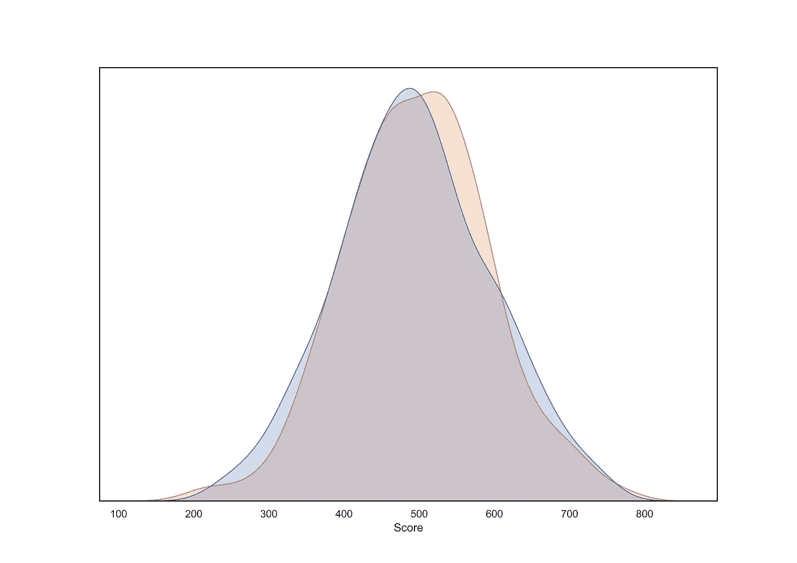

# 生活在荒野中:与统计理论不一致的世界中的假设检验

> 原文：<https://towardsdatascience.com/living-in-the-wilderness-hypothesis-testing-in-a-world-that-disagrees-with-statistical-theory-15c9cac30a7a?source=collection_archive---------33----------------------->

## 通常统计理论在数据科学实践中会失去支持。但当这种情况发生时，一切并没有失去。我们可以在数据上下双倍的赌注，但仍然会赢——如果我们对自己正在做的事情小心谨慎的话

马特·科菲尔在 [Unsplash](https://unsplash.com?utm_source=medium&utm_medium=referral) 上拍摄的照片

有时，将著名的钟形曲线称为“正常”似乎有些自相矛盾。在传统统计理论做出的所有假设中，正态假设因其不成立的频率而臭名昭著。我在这篇文章中的目的是展示一种当传统假设检验的正态性假设被违反时检验假设的方法。在这种情况下，我们不能依赖理论结果，所以我们需要离开理论的象牙塔，对我们的数据加倍下注。为了达到这个目的，首先我简要回顾一下什么是假设检验，重点是对它背后的推理的直观理解(不允许使用等式！).然后，我继续进行一个案例研究，这个案例是由一个常态假设不成立的商业问题引发的。这使问题具体化，并将指导我们的讨论。在解释完这个问题后，我将展示自举是一种很好的方法，可以填补理论留下的空白，而不会改变假设检验核心的推理。特别是，我将展示自举导致关于测试的正确结论。我以对 bootstrapping 和类似方法的批判性评价结束这篇文章，指出它们的优缺点。

# 简介:假设检验的核心

许多数据科学家很难理解假设检验。我认为问题在于有太多的数学烟火，以至于我们看不到我们想要完成的目标。我不是说数学是一种负担，而是说它的好处是有代价的。通过以如此复杂的方式确保我们所说的是真实的，我们最终会忘记我们想要说的是什么。仅此而已。我和你一样，是科学女王卑微的仆人。

所以让我们把我们敬爱的女王放在一边，非正式地考虑一下假设检验。从本质上来说，假设检验是一种论证——一些导致某种结论的推理。论点有很多种，那么什么样的论点是假设检验呢？我们称之为*reduction ad absurdum*，这是一种奇特的拉丁语，大致翻译为“荒谬的还原”。在这种争论中，我们假设某事是真实的。然后我们表明，如果这个事情是真的，我们得出的结论是如此荒谬或可笑，我们必须拒绝我们假设的有效性。我们的假设一定是错误的，否则我们就是不合理的。

想想警探。他们总是这样做。首先，每个人都是嫌疑犯:在一个腐败警察的世界里，甚至你的搭档都可能制造出你现在看到的尸体。然而，在出色的警察工作之后，你可能最终会想“如果我的搭档真的杀了那个人，她会毫无理由地这么做！”认为今天有人会无缘无故地杀人显然是荒谬的。因此，你必须要么断定你的伴侣没有这样做，要么断定你属于精神病院。你选择第一个案子，然后着手更可能的嫌疑犯。

这正是我们在假设检验中所做的，当我们预先假设零假设是真的，并且是默认的。零假设是我们简单假设某个量为真的陈述，因为不同老师指导下的学生成绩相等。当零假设为假时，替代假设为真，因为等级不同。检验统计量和正态分布的意义在于表明相信零假设为真是否荒谬。相信不同老师指导下的学生成绩相等(平均而言)可能和相信你的警察搭档无缘无故杀了某个随机的家伙一样荒谬。

但也可能不是。这可能是真的，而且非常合理。事实上，有些老师比其他老师优秀，这反映在学生的平均成绩上。你最终可能会逮捕你的搭档，因为他杀了一个人，而你发现这个人会告诉你她在某个毒贩的口袋里。这就是为什么在这两种情况下我们都需要*证据*。在统计学中，我们以数据的形式收集它们。p 值只是一种定量方法，用来表明在看到证据后相信零假设是正确的是多么荒谬。它没有告诉我们，我们的零假设一定是假的，只是说*极有可能*它确实是假的。这就是为什么错误率在统计学中无处不在。

到目前为止还不错，但是产生一个我们用来得出结论的可怕表格的正态分布怎么办？正态分布是由我们的数学女王用她的大量假设提供的。我们的检验统计量具有正态分布，因为如果零假设为真，就会出现这种情况。这里:我们需要假设零假设的有效性来构建测试。这是我们需要从某处开始的数学方式(为什么不从零假设开始呢？).这就是为什么我们说，在进行测试时，在零假设下，测试统计量遵循正态分布*。*

我们敬爱的女王需要她的军队中的一个士兵来为我们提供如此美丽的结果。这个兵就是两个给定老师下的成绩分布是正态分布的说法。因此，它们的差异也将是正态分布的。我们的女王向我们保证，我们将得到一个正态分布的检验统计量；因此我们不需要自己去推导。也就是说，我们不需要为每个有正态分布的测试自己推导曲线。统计理论已经给了我们答案！在这种情况下，我们要做的工作要少得多。

但是当变量不是正态分布时会发生什么呢？我们的测试仍然是一个荒谬的*演绎*。然而，因为正态性假设被违反，我们需要一些东西来代替无法使用的预先计算的正态分布。没有统计理论的支持，我们需要找到一个仅使用数据的替代品。我们将会看到自举是实现这一点的好方法。不过，在讨论 bootstrap 之前，让我们用一个测试的例子来更具体地说明问题，在这个例子中，变量应该是正态分布的*而不是*。

# 案例研究:检验关于信用评分的假设

从前，一位数据科学家在信贷市场工作。她需要测试由第三方进行的信用评分是否能区分还款概率高的客户和还款概率低的客户。让我们将每一类客户端称为“好”和“坏”客户端。信用评分只是一个分级系统，其中“好”客户通常比“坏”客户获得更高的分数。信用评分越高，客户不还贷的可能性就越低。信用评分是信贷市场业务的核心，因为我们想要回我们的钱(加上利息)。信用不是慈善。

那么，信用评分的基本特征是什么？从数据科学家的角度来看，信用评分只是一个分类器，用来预测贷款违约。因此，一个良好的信用评分应该有一个良好的“好”和“坏”客户之间的分离程度。特别地，分数的分布应该使得“好的”客户聚集在较高的分数上，“坏的”客户聚集在较低的分数上。

试着想象这个模式。你能明白为什么这是统计理论的一个大问题吗？让我们看看“好”客户。因为它们中的大多数位于较高的分数上，所以具有高分的“好”客户端的概率很高。另一方面，在低分上拥有“好”客户的概率很低。因此，这种概率分布是负偏态的。“坏”客户的分布反映了这一点，因此是正向倾斜的。如果我们把这两条曲线画成蓝色和红色，我们会得到下图。

**图 1:评分良好时“良好”和“不良”客户的信用评分分布**。“好”客户端聚集在较高的值上(蓝色曲线)，而“坏”客户端聚集在较低的值上(红色曲线)。这种行为在理论上是丑陋的，但在商业上是美丽的。请注意，曲线之间有一些重叠:没有机器学习算法是完美的！作者图片

我们不能依赖这里的正态假设。但这还不是最大的问题。最大的问题是，如果信用评分是坏的，认为“好”和“坏”客户的分布是正态分布是非常合理的。为了形象化这一点，考虑一个糟糕的分类器。它不能有效区分阶级。因此，所有的分数应该在两类客户中随机分配。没有什么特别的原因可以解释为什么有些客户会比其他人得到更低的分数。这种随机性导致两条近似正态的曲线，一条在另一条之上，如下图所示。

**图 2:当评分为“坏”时，“好”和“坏”客户的信用评分分布**。对于“好的”和“坏的”客户来说，分值都是随机的。因此，有理由假设它们遵循正态分布。曲线重叠是因为算法没有有效地分离类别。作者图片

我们现在处于一个理论噩梦中:我们有一个问题，正态假设可能是合理的，也可能是不合理的。我们无法知道是哪种情况，因为知道这一点需要知道答案！我们确实可以通过获取更多的数据来处理偏斜。通过这种方式，测试的准确性将足以保证结论的可靠性。然而我们不需要这个。获取更多数据不应该是作为数据科学家的你想到的第一个答案，因为大多数情况下你对此无能为力。通常，获取更多数据是不切实际的、极其昂贵的，甚至是不可能的。大数据时代并不是优秀的数据科学家不努力使用尽可能少的数据来完成工作的借口。这就是统计学的意义所在。

怎么才能解决这个问题？我们需要一个足够通用的方法来处理这两种情况，这样我们就不需要担心信用评分是好是坏。答案是:自举。我将向您展示，在这两种情况下，bootstrap 导出了我们的检验统计量的分布(在零假设下),从而引导我们得出正确的结论。

这里我们有一个典型的思维实验。我模拟了两个信用评分，一个好的和一个坏的，这样我就能事先知道哪个是哪个。这是测试某个东西是否有效的好方法。我们只需要检查它是否导致预期的答案，我们事先知道这是正确的。如果这种方法确实能引导我们找到答案，那它就是有效的。让我们看看自举如何进行。

# 用 bootstrap 想象零假设的世界

自举非常简单。它只是一系列微小样本的抽取，因此相同的观察可以被多次采样。在这里模拟的数据集的情况下，每种类型的信用评分都有 1，000 行数据。用它们，我们提取了大量的微小样本，大小约为 20 或 50。然后，我们计算每个子样本的检验统计量，并存储结果。假设我们抽取了 10，000 个子样本(获取更多数据可能超出了您的能力范围，但今天的计算机能力可能并非如此！).如果我们做了这个测试统计值数组的直方图，我们应该得到测试统计值的概率分布。我们剩下要做的就是得到与我们期望的统计显著性水平相对应的分布分位数，然后*瞧*:问题解决了。

在我们在计算环境中敲击键盘之前，我们应该记住一些非常重要的事情:我们需要零假设下测试统计量的分布！在进行 bootstrap 之前，我们需要以这样一种方式转换我们的数据，使我们的零假设为真。让我们方便地陈述我们的无效假设如下:*“好”和“坏”客户的平均信用评分相等*。另一个假设是:“好”客户的平均信用评分比“坏”客户的平均信用评分大*。*

*现在我们可以进行测试了。拿数据集求高分。让我们将 1000 个观察结果按类别分类。通过这种方式，我们将“好”和“坏”客户端的分布作为两个独立的分布。我们如何改变这些数据以使零假设成立？我们知道减去一个变量的均值会导致其均值为零。如果我从“好”客户的分数和“坏”客户的分数中减去平均值，他们的平均值都是零，对吗？如果它们的平均值都为零，则它们的平均值相等！零假设是真的！*

*让我们想象一下我们在数据集中进行的转换。想象数据集是一个电子表格。首先，我们有两列:信用分数和班级标签。然后，我们将与类标签 0(无默认)相关的所有分数和与类标签 1(默认)相关的所有分数分开。现在我们有两个独立的列:一个是“好”的客户分数，另一个是“坏”的客户分数。这类似于著名的控制-治疗组二分法。当减去每一列的平均值时，我们不能覆盖这些列，因为我们需要原始数据来检验我们的零假设。因此，我们复制它们，并从复制中减去平均值。现在我们有四列:两个原始分数数组加上相应的居中分数数组。*

*是时候进行一些引导了。你能看出这两个居中的分数数组是一种想象如果零假设为真世界会是什么样子的方式吗？忘记细节，专注于事实。两个数组的平均值相等吗？是的，它们都等于零。这就是零假设为真的世界。现在的问题是:如果我们从这两个数组中取样，并计算微小子样本的检验统计量，我们将得到零假设下检验统计量的分布，对吗？这正是我们解决问题的原因。我们不是依靠理论来知道零假设下的分布，而是自己用数据来计算，数据经过转换后，零假设是正确的。当优雅的数学方法帮不上忙时，这就是我们需要的计算性的强力解决方案。*

*如果我们这样做是为了好的分数，我们应该得到下面的分布。请注意，正如所料，它是不对称的。为了得出一些结论，我们需要知道我们的检验统计量的值是多少，这样我们观察到的值等于或低于它的概率(在零假设下)是 95%。如果我们的分数是正态分布的，这个值将是 1.64，因为我们的测试是单侧的(不需要将错误率平均分成两个尾部)。然而这个值是 2.37。为什么？*

**

***图 3:信用评分良好时的原假设下的检验统计量分布**。注意不对称。好吧，这不是不对称分布的完美例子，但它仍然是不对称的！如果不是，临界值应该是 1.64，而不是 2.37。这种不对称性给我们的临界值增加了 0.73 个点，以说明发现两个群体平均值之间巨大差异的可能性更高。作者图片*

*因为这两种分布聚集在信用评分值的相反极端。因此，与分数围绕某个平均值均匀分布的情况(如遵循正态分布)相比，我们预计更有可能出现大的差异。正是这个事实给我们的临界值增加了 0.73 分。这 44%的增长对我们的测试产生了巨大的影响。如果我们使用 1.64，我们将忽略一个关于良好信用评分的基本事实:他们将“好”和“坏”客户分组在他们价值范围的相反侧。我们会说我们的错误率是 5%,但实际上要高得多！我们错误地断定*我们的信用评分良好的可能性会大得多！**

*我们现在有了合理的临界值。观察值是多少？让我们取两个*原始*数组作为好的分数(不具有零均值的数组),并使用*所有*观察值计算测试统计量。我们得到的值是 51.66。这是我们对检验统计的观察值。*

*现在让我们检查一下我们的零假设(平均信用分数相等)是否成立。比较我们的观察值和临界值，我们看到观察值要大得多。我们预计，如果我们的零假设是真的，95%的时间我们应该观察到一个低于临界值(2.37)的检验统计值。然而我们的观测值比这个值(51.66)大得多。如果零假设为真，观察到如此巨大数值的概率是多少？我的天，如果 2.37 代表 95%，那么 51.66 的概率是多少？事实上，这是一个非常小的概率。为了合理地相信零假设的有效性，我们应该假设我们是如此幸运，如果零假设为真，我们得到了一个样本，其中的观察值是预期的。那就像中了很多次彩票一样！那一点都不合理！因此我们的零假设一定是假的！*反证法*。*

*这如何验证引导程序？问题是我们知道分数是好的*，因为我们把它构造成好的*。因此，bootstrap 应该引导我们拒绝“好”和“坏”客户之间的平均分数相同的零假设。这是一个好的信用评分的预期。是引导我们得出这个结论的吗？是的，确实如此:零假设被证明是错误的，而且可信度很高。所以 bootstrap 适用于信用评分良好的情况。*

*信用评分不好的情况呢？让我们做同样的事情:打开另一个包含 1，000 行数据集的电子表格。根据类别标签将其分成两个分布。复制它们，并从副本中减去它们的平均值。现在引导居中的数组，并计算测试统计的分布。分布应该如下图所示。*

**

***图 4:信用评分不良的原假设下检验统计量的分布**。看它多像理论曲线啊！如此相似，以至于我们的临界值是 1.67，只比理论的 1.64 高 0.03 分。作者图片*

*这里两种分布都是正态分布。检验统计量的分布也是(近似)正态的，这是有道理的。我们又回到了统计理论的领域。自举能得出正确的结论吗？我们的临界值是 1.67(注意和 1.64 有多接近！).我们的观测值是-0.73，远低于这个值。因此，我们确实在观察，如果我们的零假设为真，将会发生什么！因此有理由得出这样的结论:是的！我们事先知道分数不好，所以 bootstrap 在这里也有效！如果在两种情况下都行得通，而且每一个信用评分都必须是好的或坏的，那么这个方法就足够通用，让我们不用担心第三方的信用评分确实是好的还是坏的。愿数据告诉我们是哪种情况！*

# *结论:不要用叉子喝汤！*

*有时我们被迫背离统计理论的优雅和方便的结果。我们可能会面临从理论的象牙塔中跳出来的艰难决定，以在不良概率分布的荒野上实现我们的目标。幸运的是，像 bootstrap 这样的工具为我们创造了在异国风景中安全着陆的好地方。*

*然而，像所有工具一样，bootstrap 需要谨慎和更多的批判性思考。bootstrap 是一种统计学家称之为*非参数*的方法。它通过增加对准确反映现实的数据的信任，填补了理论留下的空白。这应该马上引起警惕，因为在我们的测试中，我们没有检查我们的样本是否具有代表性。我们简单地假设它是，就像我们在传统的理论测试中所做的那样。如果我们的样本不具有代表性，无论我们的“微小”自举样本有多大，用它们计算的每个检验统计量都会有偏差。因此，我们在零假设下的整个分布是有偏差的。对于测试的自举版本来说，这是一个更严重的问题，因为在传统版本中，零假设下的分布总是相同的。因此，在传统的测试中，偏差只作用于我们的观察值。然而，在自举版本中，偏差同时作用于我们的观测值*和*我们的测试统计分布。这里出了更多的问题。*

*这只是冰山一角。我们还假设我们有合理数量的数据。虽然数据不多，但足以精确计算简单的统计数据。bootstrap 似乎是小样本的救星，因为它以类似模拟的方式处理问题。这是一种危险的错觉。Bootstrap 不是 Monte Carlo，在 Monte Carlo 中，我们可以从理论分布中随意抽取样本。Bootstrap 总是依赖于所收集数据的一小部分。问题是小东西的一小部分甚至更小。我对每个自举样本仅使用了 20 个观察值，以表明我们不需要数百个观察值来获得合理的结果。尽管我肯定会增加这个值，但是计算 20 次观察的平均值仍然是合理的。如果我只有 100 个观察值，我会从 3 到 5 个观察值中计算出平均值？这是一个非常嘈杂的估计！这是非参数方法的一个特别的弱点。因为他们在数据上下了双倍的赌注，我们经常需要*更多的*数据，而不是在参数方法下所必需的。这就像统计理论为我们省去了使用参数方法时收集更多数据的麻烦。非参数方法是为了一般性而交换数据:我们接受获得更多更好数据的义务，作为更大灵活性的对应。这个额外的义务意味着我们需要确保我们有足够的数据来避免嘈杂的估计。*

*有时候这种交易非常有利可图。这里我们强调了偏斜分布的情况。我们看到，我们可以很好地处理偏态分布，同时在正态分布时也接近理论结果。然而，这种普遍性并不以偏斜度结束。我们还可以对除平均值以外的其他统计数据进行假设检验，这是用参数方法很难做到的。我们可以很容易地测试中位数、修整平均数、我们想要的每一个分位数等等。只要我们有足够的无偏数据(再加上一定的计算能力)，非参数方法真的是很强大的工具。*

*但是，不要被非参数方法的聪明所吓倒。这经常导致对何时应用它们的错误判断。看到数据科学家们对他们面临的每一种问题都采用同样的方法，我感到非常痛苦。尤其是如果这种方法有很强的数据、计算或理论要求。我认为这是我们工作描述的一部分，抵制仅仅因为我们有一个非常棒的锤子就把一切都看成钉子的诱惑。统计方法只是一堆数据分析的有用工具，就像餐具是一堆吃饭的有用工具一样。每一种工具都必须应用于它被设计用来处理的问题——并且只为他们而应用。叉子是非常有用的吃饭工具，但是试着用它们喝汤吧！*

*本文中使用的代码和结果可以从 GitHub 知识库[这里](https://github.com/fabiobaccarin/bootstrap_hypothesis_testing)获得*