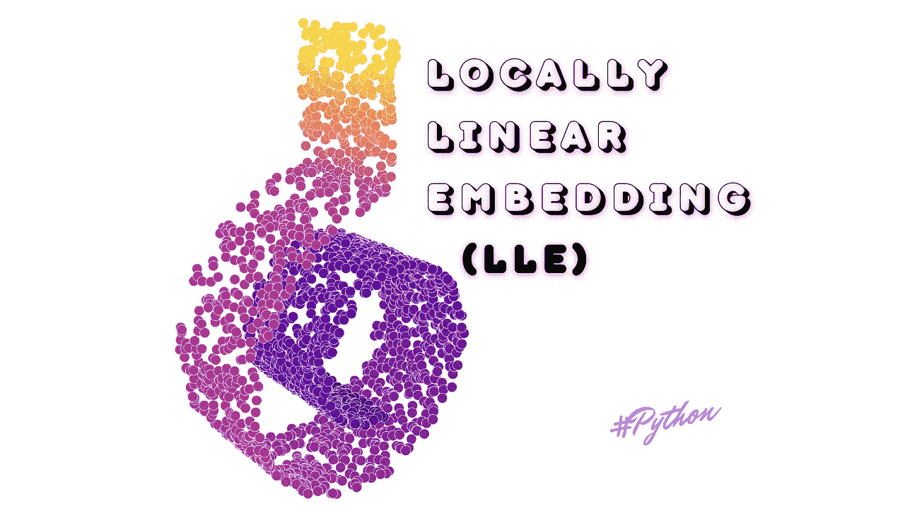
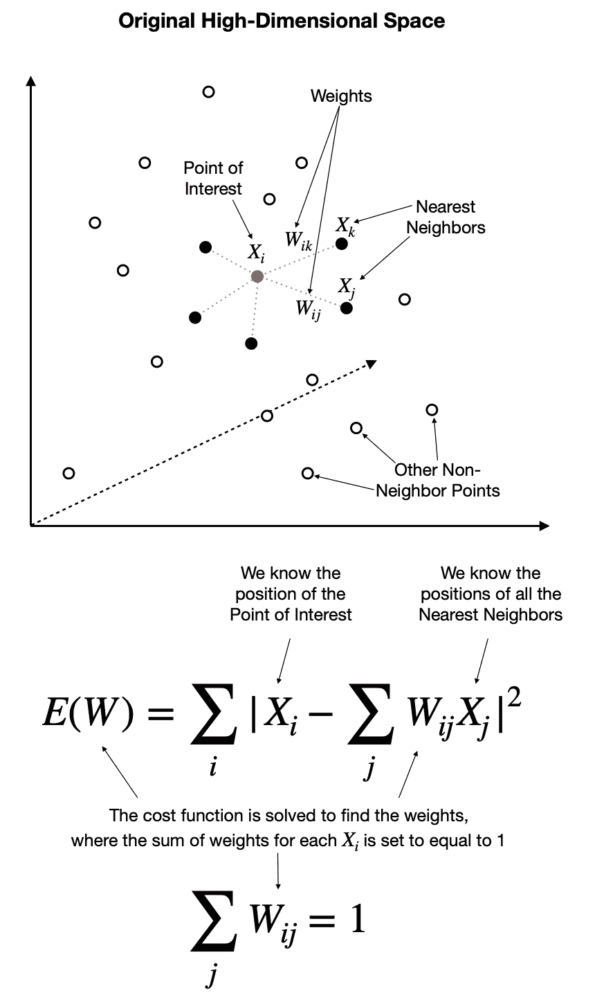
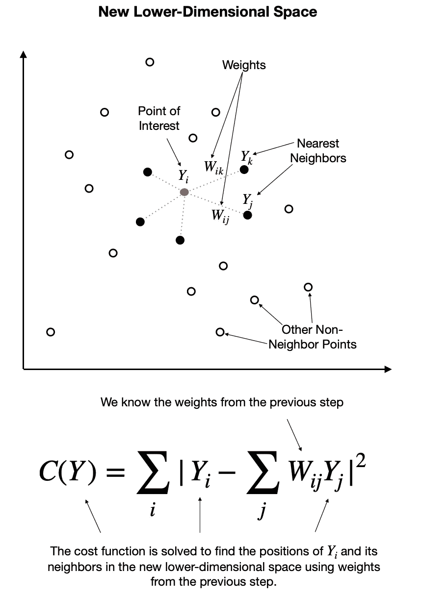
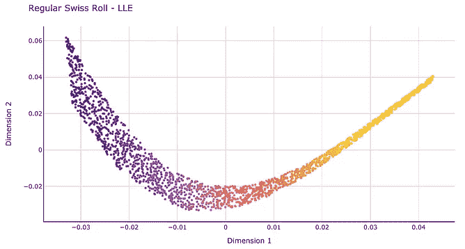
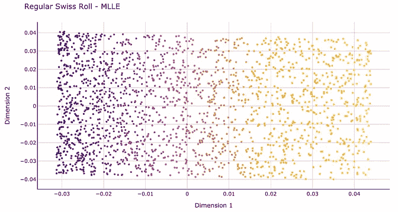
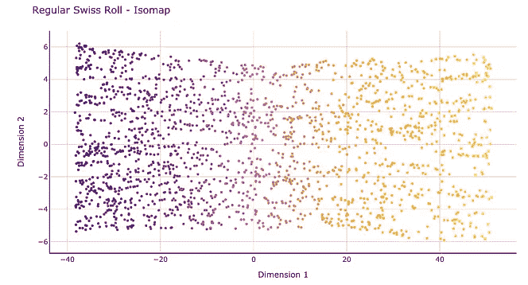
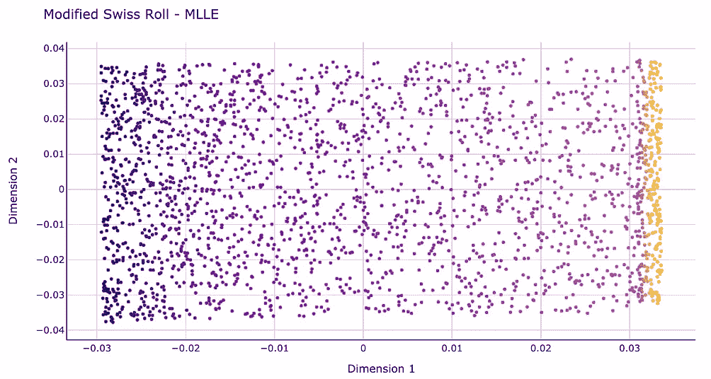
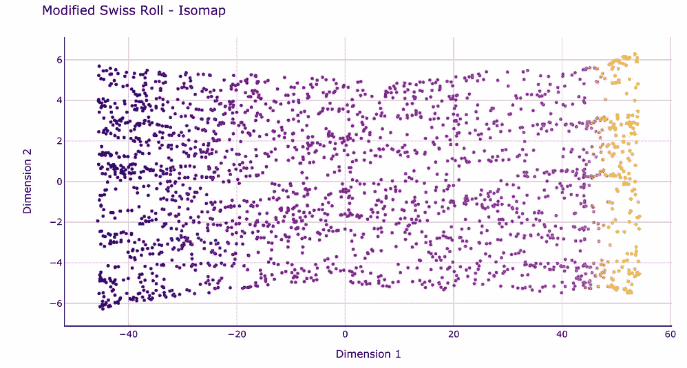

# LLE:局部线性嵌入 Python 中降维的好方法

> 原文：<https://towardsdatascience.com/lle-locally-linear-embedding-a-nifty-way-to-reduce-dimensionality-in-python-ab5c38336107?source=collection_archive---------3----------------------->

## [技巧和窍门](https://towardsdatascience.com/tagged/tips-and-tricks)，机器学习

## 详细介绍了 LLE 的工作原理，以及它与 Isomap 等类似算法的比较

局部线性嵌入(LLE)。图片由[作者](https://solclover.com/)提供。

# 介绍

为您的数据选择正确的降维技术可能是一项挑战。然而，如果你正在寻找一个非线性的方法，那么局部线性嵌入(LLE)和[等距映射(Isomap)](/isomap-embedding-an-awesome-approach-to-non-linear-dimensionality-reduction-fc7efbca47a0) 将是一个很好的探索。

在本文中，我将带您详细了解 LLE 是如何工作的，以及它与 Isomap 有何不同。此外，我将提供一个 Python 示例来比较这些算法。

# 内容

*   机器学习算法领域中的 LLE
*   对 LLE 如何工作的直观解释
*   LLE 的 Python 示例及其与 Isomap 的比较

# 机器学习算法领域中的局部线性嵌入(LLE)

即使是经验丰富的数据科学家也很容易迷失在行业中使用的数百种不同的机器学习算法中。因此，我相信通过将一些最常用的算法分类来创建一个结构是有价值的。

它永远不会完美，因为一些算法足够灵活，可以执行多项任务。尽管如此，以下是我创建这种分类的尝试。确保通过点击来浏览此**交互式**图表👇在不同的章节**上展示更多**。

机器学习算法分类。由[作者](https://solclover.com/)创建的互动图表。

如你所见，局部线性嵌入(LLE)属于机器学习的**无监督**分支，属于**维度缩减**算法组。

这意味着，与线性判别分析(LDA)等监督技术不同，使用 LLE 进行降维不需要目标变量。

***如果你喜欢数据科学和机器学习*** *，请* [*订阅*](https://solclover.com/subscribe) *每当我发表新的故事时，你都会收到一封电子邮件。*

# 局部线性嵌入是如何工作的？

## 高级步骤

类似于 Isomap，LLE 结合了几个步骤来产生低维嵌入。这些是:

1.使用 KNN 方法**找到每个数据点的 k 个最近邻居**。这里，“k”是您可以在模型超参数中指定的任意数量的邻居。

2.**构建一个权重矩阵**，其中每个点的权重通过最小化如下所示的成本函数的误差来确定。注意，每个点都是其邻居的线性组合，这意味着非邻居的**权重为 0** 。

在原始高维空间中寻找权重。图片由[作者](https://solclover.com/)提供。

3.**通过最小化下面所示的成本函数，找到**新的低维嵌入**中所有点的位置**。请注意，这里我们使用第二步中的权重(W)并求解 y。实际求解是使用部分特征值分解来执行的。

在新的低维嵌入中寻找点的位置。图片由[作者](https://solclover.com/)提供。

完成上述步骤后，我们得到了数据的低维表示，如果我们将维度减少到 3D 或更低，通常可以使用标准散点图来可视化。

## LLE 变体

您应该知道一些 LLE 变体，它们改进了原始设置。但是，请注意，这些改进是以效率为代价的，这会使算法变慢。下面是 [scikit-learn](https://scikit-learn.org/stable/modules/manifold.html#modified-locally-linear-embedding) 对这些变体的描述:

*   **修正的 LLE(MLLE)**—LLE 的一个众所周知的问题是正则化问题。解决这个问题的一种方法是在每个邻域中使用多个权重向量。这是 MLLE 的精髓。
*   **黑森 LLE(HLLE)**——黑森特征映射是解决 LLE 正则化问题的另一种方法。它在每个用于恢复局部线性结构的邻域围绕一个**基于 hessian 的二次型**。

虽然我不会详细介绍，但我建议您尝试一下，看看哪种变体能为您的数据产生最好的结果。就我个人而言，我发现 MLLE 在大多数情况下表现良好(参见下一节中的示例)。

## LLE 和 Isomap 的区别

这两种算法在处理降维的方式上是相似的，但它们也有不同之处。

与 LLE 类似，Isomap 在第一步中也使用 KNN 来查找最近的邻居。然而，第二步构建邻域图，而不是将每个点描述为其邻居的线性组合。然后，它使用这些图形来计算每一对点之间的最短路径。

最后，Isomap 使用所有点之间的成对距离来构造低维嵌入。

## 我应该选择 LLE 而不是 Isomap 吗？

一般来说，LLE 是一种更有效的算法，因为它不需要估计相距很远的数据点之间的成对距离。此外，它假设局部观察时流形是线性的。因此，它从局部线性拟合中恢复非线性结构。

然而，由于 LLE 只注重保护局部结构，它可能会在全球范围内引入一些意想不到的扭曲。

在下面的 Python 部分，我使用 LLE、MLLE 和 Isomap 来创建 3D 形状的 2D 嵌入，称为“瑞士卷”这些例子可以很好地说明这些算法之间的结果差异。

# LLE 的 Python 示例及其与 Isomap 的比较

## 设置

我们将使用以下数据和库:

*   [Scikit-learn library](https://scikit-learn.org/stable/index.html)for
    1)创建数据([make _ Swiss _ roll](https://scikit-learn.org/stable/modules/generated/sklearn.datasets.make_swiss_roll.html))；
    2)执行 LLE 和修改的 LLE 嵌入( [LLE](https://scikit-learn.org/stable/modules/generated/sklearn.manifold.LocallyLinearEmbedding.html) )
    3)执行等距映射([Isomap](https://scikit-learn.org/stable/modules/generated/sklearn.manifold.Isomap.html))；
*   [Plotly](https://plotly.com/python/) 用于数据可视化
*   用于数据操作的[熊猫](https://pandas.pydata.org/docs/)和 [NumPy](https://numpy.org/doc/stable/user/index.html)

让我们从导入库开始。

接下来，我们使用 Sklearn 的 make_swiss_roll 创建包含瑞士卷的数据数组。

您会注意到，我们制作了两个瑞士面包卷，而不是一个。第一个是标准的，而第二个在顶部包含一个额外的矩形插件。

为了理解我的意思，让我们首先定义两个函数，我们将在整个项目中使用这两个函数来可视化我们的 3D 瑞士卷和 2D 嵌入结果。

使用上面的 Plot3D 函数，我们可以可视化我们的两个瑞士卷:

常规一:`**Plot3D(X, y, “Regular Swiss Roll”)**`

交互式常规 3D 瑞士卷。图由[作者](https://solclover.com/)提供。

修改一:`**Plot3D(X_two, y_two, “Modified Swiss Roll”)**`

交互式修改三维瑞士卷。图由[作者](https://solclover.com/)提供。

## 执行局部线性嵌入(LLE，MLLE)和 Isomap

设置完成后，我们现在将使用 LLE、改进的 LLE 和 Isomap 嵌入进行降维。

首先，让我们定义几个可重用的函数。

我们现在可以调用上面的函数进行降维。

让我们使用不同的数据和算法创建五个 2D 嵌入。请注意，在所有情况下，我们将邻居的数量设置为 30，而对其他超参数使用默认值。我们的五个嵌入将是:

*   普通瑞士面包卷上的标准 LLE
*   普通瑞士面包卷上的改良 LLE
*   普通瑞士卷上的 Isomap
*   改良瑞士卷上的改良 LLE
*   改良瑞士卷上的 Isomap

最后，我们可以使用之前创建的 Plot2D 函数在 2D 散点图上绘制结果。

让我们先做一个普通的瑞士面包卷。

使用三种不同算法的瑞士卷的 2D 嵌入:1 .LLE，2 岁。改良的 LLE，3。Isomap。图片由[作者](https://solclover.com/)提供。

我们可以看到，标准 LLE 不能成功地展开瑞士卷。相比之下，改良的 LLE 和 Isomap 做得很好，产生了相似的结果。总的来说，在这三种算法中，MLLE 似乎具有最小失真的 2D 嵌入。

接下来，让我们用 MLLE 和 Isomap 可视化修改的瑞士卷嵌入的结果。

使用两种不同算法的改良瑞士卷的 2D 嵌入:1 .改良版 LLE 2。Isomap。图片由[作者](https://solclover.com/)提供。

这一次，我们可以看到两种算法的结果之间的更多差异。

MLLE“努力”处理引入 3D 形状的不同角度，最终将瑞士卷矩形部分的所有点紧密地聚集在一起。与此同时，Isomap 能够非常均匀地展平整个结构。

# 结论

局部线性嵌入(LLE)和特别是修改的变体(MLLE)是一个非常好的工具。

由于 LLE 被设计为专注于局部结构，它可以比其他类似的算法(如 Isomap)更快地执行计算。但是，选择使用哪种算法将取决于数据和需要执行的任务。

与数据科学中的许多情况一样，您可能希望试验一些不同的算法，以找出哪种算法最适合您的数据。

我真诚地希望我的解释和比较对你有所帮助。如果您有任何问题或建议，请随时联系我们。

干杯👏
**索尔·多比拉斯**

***如果你已经花光了这个月的学习预算，下次请记得我。*** *我的个性化链接加入媒介是:*

 [## 通过我的推荐链接加入 Medium 索尔·多比拉斯

### 作为一个媒体会员，你的会员费的一部分会给你阅读的作家，你可以完全接触到每一个故事…

solclover.com](https://solclover.com/membership) 

一些相关的文章你可能会感兴趣:

 [## Isomap 嵌入——一种令人敬畏的非线性降维方法

### 如何用等距映射“展开瑞士卷”？

towardsdatascience.com](/isomap-embedding-an-awesome-approach-to-non-linear-dimensionality-reduction-fc7efbca47a0)  [## t-SNE 机器学习算法 Python 中降维的利器

### 如何使用 t 分布随机邻居嵌入(t-SNE)来可视化高维数据？

towardsdatascience.com](/t-sne-machine-learning-algorithm-a-great-tool-for-dimensionality-reduction-in-python-ec01552f1a1e)