# 将数据从 Twitter 加载到雪花

> 原文：<https://towardsdatascience.com/load-data-from-twitter-to-snowflake-introduction-73b9ca166870?source=collection_archive---------25----------------------->

## 这个项目使用 Python 和 Tweepy 将 Twitter 中的半结构化数据加载到雪花中的数据模型中。

# 端到端设计

这是一个端到端项目最终看起来是什么样子的图表，以及遵循本文之后您应该期望实现什么。

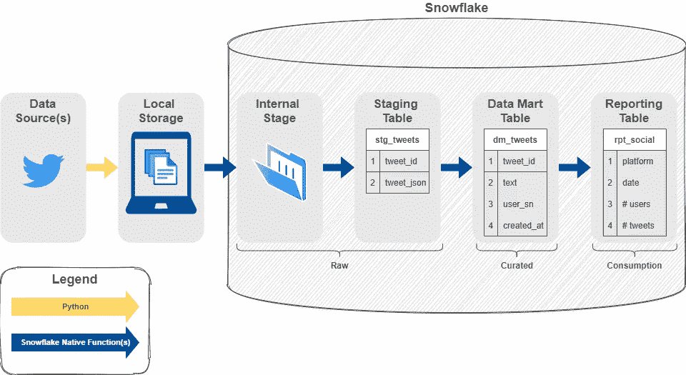

作者图解。这是项目设计的高级大纲。

# **目录**

*   简介——你正在读！
*   [从 Twitter API 中提取数据](#b86e)
*   [土地原始推特数据变成雪花](#cb3b)
*   [解析并加载雪花中的 Twitter 数据](#da3a)

这个项目主要源于在使用 Alteryx 和 SnapLogic 等数据集成软件进行 ETL(提取-转换-加载)多年后对学习 Python 的兴趣。我想亲自动手使用 Python，并决定构建一个小项目。在开始这个项目之前，我在 Udemy 上了一门 [Python 课程做准备。我选择使用 Twitter 是因为它有大量可公开访问的数据，选择 Python 是出于个人兴趣，选择雪花是因为它有 30 天的免费试用期。](https://www.udemy.com/course/the-python-bible/)

希望这些即将到来的材料会对你有所帮助。我在网上做了一些研究，但只在万维网上找到了一些零星的信息。我发现有很多数据科学家将 Twitter 数据用于机器学习目的。平心而论，**这是一个数据工程项目，而不是数据科学项目**。如果您是一名数据科学家，这其中的某些部分在检索原始数据方面仍然有用。

正如目录中提到的，这个项目分为三个主要部分。一些简短的相关文章和官方文档也被链接以获得进一步的支持。

## 将涵盖哪些内容

1.  如何获得您的 Twitter API 密钥和令牌
2.  如何使用 Tweepy user_timeline 方法提取 Twitter 数据
3.  将 Tweepy user_timeline 数据加载到计算机上的本地文件夹中
4.  将原始数据从本地存储加载到您将创建的雪花内部命名阶段
5.  使用流和任务将数据从雪花内部阶段自动加载到基本数据库表中

## 什么不包括在内

1.  如何安排 Python 脚本检索 Twitter 数据？已经有很多关于这个的网上资料
2.  雪花基础——我会尽可能地提供链接，但我建议查看[官方文档](https://docs.snowflake.com/en/)
3.  如何为企业平台“生产”这种设计

你准备好了吗？如果是这样，那就从 Twitter 上拉数据开始吧！

# 从 Twitter API 中提取数据

在这一部分，我建立了我的 Twitter 账户[，获得 API 密匙和令牌](https://teky.medium.com/get-twitter-api-keys-and-tokens-808455c4109a)，然后将数据本地放入我的电脑。登陆到 S3 或类似的存储也是可能的，但为了简单起见，我把数据放在本地。

此外，由于我有企业数据系统的工作背景，我理解让 AWS 团队为您提供一个 S3 存储桶有多么官僚。因此，这篇文章将数据放在本地，也许在将数据放入正式的存储服务之前，您可以将它用作初步的概念验证。从长远来看，绝对推荐将数据存储到 S3(或其他地方)而不是你的本地计算机上。

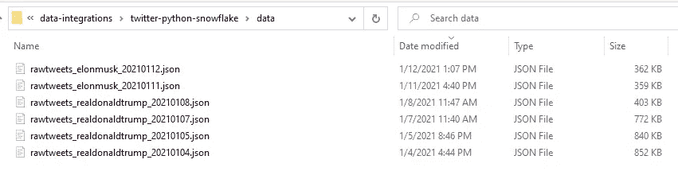

作者截图。这是您的文件在本节结束时应该存储在本地的样子。

> 您在下面看到的图表将是整个项目中反复出现的图像。用绿色突出显示的是我们将涉及的项目部分。

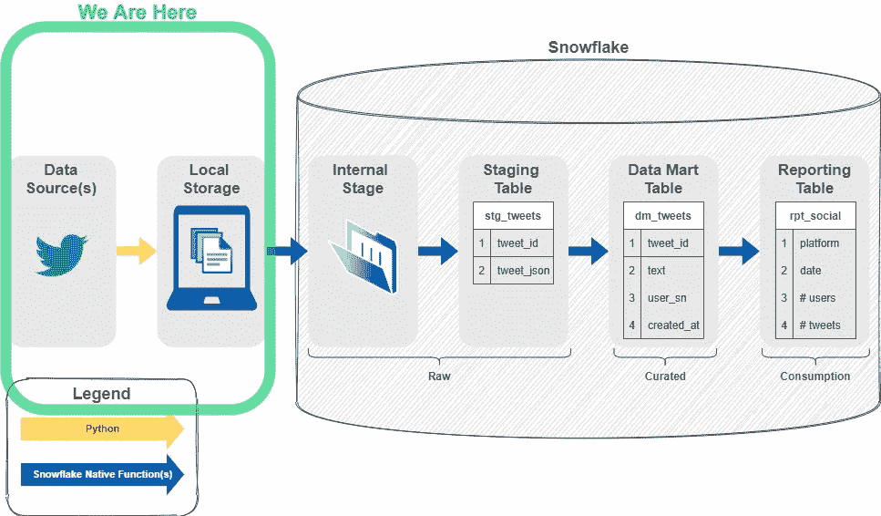

作者图解。我们去拿数据吧！！

## 但是首先，有一些管理步骤

1.  从 [Twitter 开发者门户](http://developer.twitter.com/)获取 API 密钥和令牌。如果你不确定如何获取这些信息，请随意阅读我在[上发布的获取 Twitter API 密钥和令牌](https://teky.medium.com/get-twitter-api-keys-and-tokens-808455c4109a)的短文。
2.  将这些密钥存储到一个配置文件中。这是我自己配置的一个超级简单的例子。

在我的开发中，我只是想获取单个 Twitter 用户在一段时间内的推文，因此我主要使用 [API.user_timeline](http://docs.tweepy.org/en/latest/api.html#API.user_timeline) 方法。

在下面的 Python 脚本中，我提取了 Elon Musk 的推文(twitter_id = 44196397 ),但是您可以将该变量更改为您选择的任何人。有很多免费网站可以做到这一点，或者你可以使用 Twitter 提供的便捷的邮递员收藏。我使用这个 Postman 集合对 API 端点进行了初始测试。

如上面代码的第 10–12 行所示，我将返回的 JSON 数据作为本地文件存储在我的计算机上。您必须对此进行更新，并且可以将其更改为您选择的任何位置。

如果运行 ***打印(tweet。_json)*** ，您应该会看到将打印到您的 json 文件中的 tweets，如下图所示。如果你期望有特别多的推文，我不推荐打印这个。

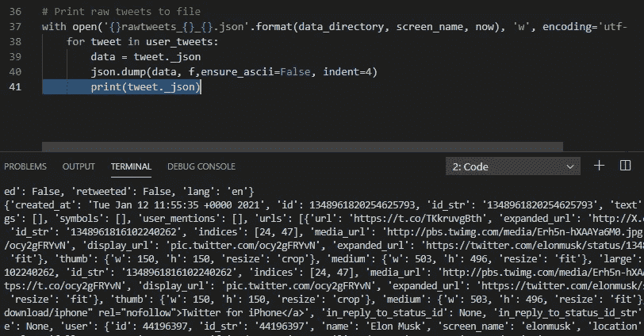

这是文件存储到本地文件夹后的样子。我实际上是用一个现在被禁止的 Twitter 账户开始这个迷你项目的(你可以从文件名中看出…)，所以我不得不转向另一个 Twitter 账户。

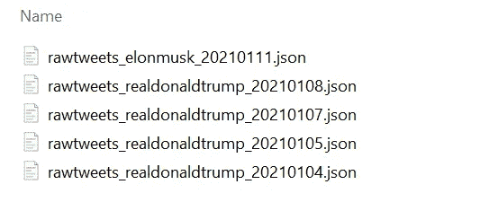

为了结束项目的第一部分，您现在应该已经准备好了包含 Twitter 数据的本地文件。下一步是将原始数据加载到雪花中。

# 将 Twitter 原始数据放入雪花中

好的，你在本地有你的原始数据，但是你可能想与其他团队成员共享这些数据，或者至少不把它单独存储在你的本地计算机上。如果没有人能够访问大量数据进行分析，那么这些数据还有什么意义呢？

下一节将带您了解如何将本地文件放入一个名为 stage 的[雪花内部，它将作为原始数据的历史存储。我们将通过使用本机雪花函数来实现这一点。](https://docs.snowflake.com/en/user-guide/data-load-local-file-system-create-stage.html)

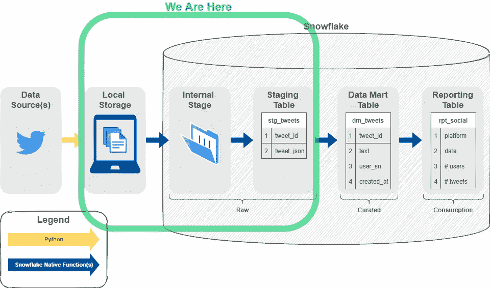

作者图解。让我们把原始数据变成雪花吧！

如果您成功地将数据从 Twitter 提取到 JSON 文件中，并打开其中任何一个文件，您应该会看到下面的 JSON 对象和相应的键/值对。

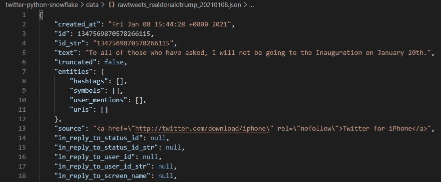

作者截图。这是原始 JSON 数据的一个例子。

要将这些 JSON 文件加载到雪花中，您将使用一个 stage。stage 对象存在于数据库对象中，因此首先，您需要在雪花中创建一个数据库和任何其他基础对象。下面是我的 SQL 代码，我在代码块后逐行分解它。SQL 脚本本身也有注释。

## 要分解代码:

*   第 4–9 行:创建项目中使用的初始数据库和对象。我选择将 ***stg/dm/rpt*** 层设置为模式，但是您可以根据个人或专业经验进行更改。

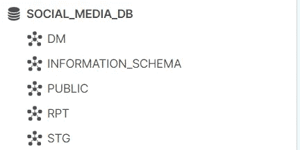

作者截图。这是创建数据库和模式后应该看到的内容。

*   第 11–12 行:为了将 JSON 数据加载到一个命名的 stage 中，我们需要定义一个[文件格式](https://docs.snowflake.com/en/sql-reference/sql/create-file-format.html)。你可以在创建 stage 时直接这样做，但是我选择创建一个可重用的文件格式。

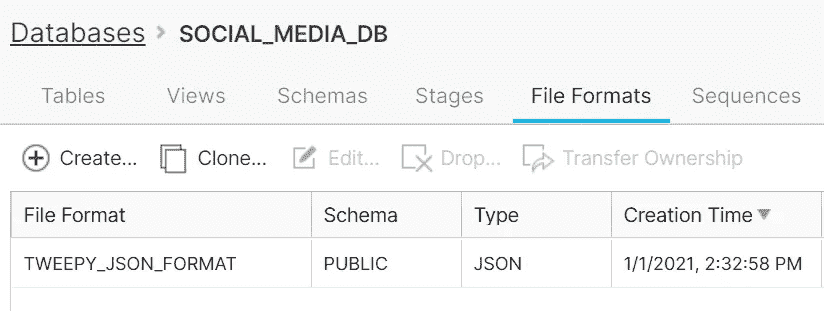

作者截图。

> 要查看文件格式，请导航至数据库选项卡> SOCIAL_MEDIA_DB >文件格式选项卡。您也可以在工作表中运行以下脚本。

```
show file formats;
```

*   第 14–15 行:这里我创建了一个名为 ***twitter_stage*** 的内部命名 stage，并使用之前创建的文件格式。

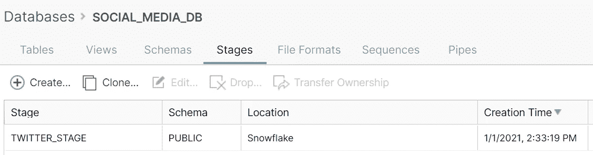

作者截图。

> 要查看阶段，请导航至数据库选项卡> SOCIAL_MEDIA_DB >阶段选项卡。您也可以在工作表中运行以下脚本。

```
show stages;
```

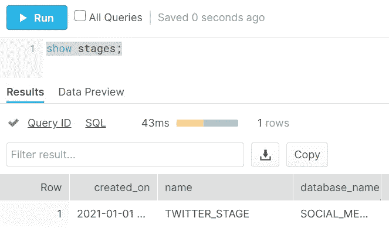

作者截图。

> 在第 14–15 行创建阶段后，您需要运行一个 PUT 命令来加载文件:

*   打开命令提示符
*   通过运行以下代码连接到您的雪花帐户。我在我的 [SnowSQL 配置文件](https://docs.snowflake.com/en/user-guide/snowsql-config.html#connection-parameters-section)中设置了 ***trialaccount*** 连接细节。

```
snowsql -c trialaccount
```

*   根据需要更改上下文，然后运行下面的 *PUT* 命令。确保将文件夹路径更改为您在本系列第 1 部分中决定的路径。

```
put file://‪**xxx**\data\rawtweets* [@twitter_stage](http://twitter.com/twitter_stage);
```

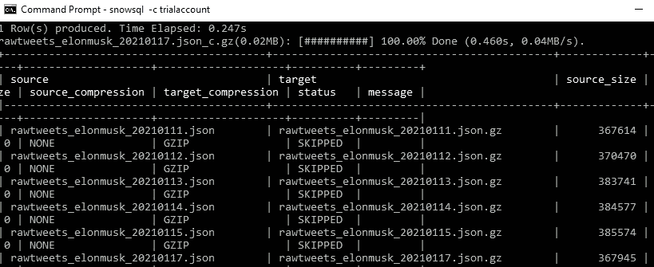

作者截图。这是运行 PUT 命令后应该看到的内容。

*   第 17–25 行:这里我创建了一个名为 ***jobrunner_wh*** 的仓库，我将使用它来运行我未来的调度任务。您可以决定是创建新仓库还是使用默认仓库。我特意选择创建一个新的仓库来隔离和监控资源。
*   第 30–36 行:这个 DDL 在先前创建的 ***stg*** 模式中创建临时表。我们的原始 JSON 只有一列($1)，但是 Snowflake 提供了额外的元数据，您可以使用 *parse_json* 函数提取和解析基本信息。
*   第 39–40 行:这创建了雪花流，它将跟踪 stg_raw_twitter 表的变化。因为我从 Tweepy user_timeline 方法中提取了最后 100 条 tweet，所以有些 tweet 是多余的。我不希望这些多余的推文在我的策划和消费表中引起下游的欺骗。该流将跟踪对 staging 表的插入、更新和删除，我们将在加载数据集市表时使用该表。
*   第 43–59 行:这部分脚本是复制命令，您可以运行该命令将数据从我们的命名阶段***Twitter _ stage***加载到我们的临时表***stg _ raw _ Twitter***。我们将在以后自动化所有任务时再次使用它。

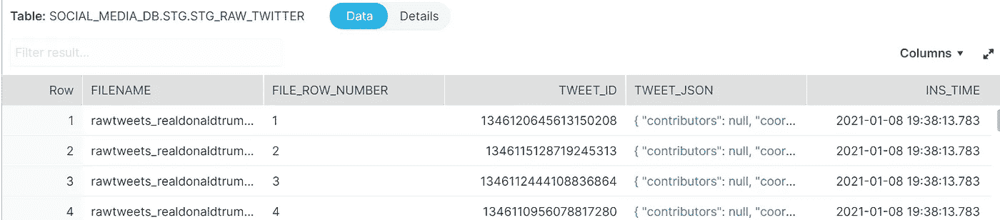

作者截图。这是运行复制到命令后应该看到的内容。

*   第 62 行:使用这个 select 语句查看我们在第 39 行创建的流***stg _ raw _ Twitter _ stream***捕获的对***stg _ raw _ Twitter***的更改。 [Streams](https://docs.snowflake.com/en/user-guide/streams.html) 本质上是跟踪表格先前版本的变化。

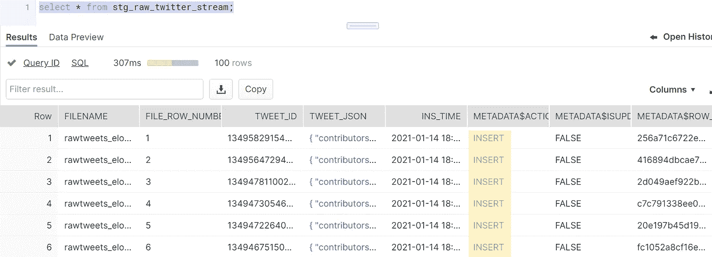

作者截图。用黄色突出显示的是对 stg_raw_twitter 所做的更改。

这就对了。您已经将 JSON 形式的原始数据放到了雪花中，并开始跟踪这些数据的变化。接下来，我们将构建更便于分析师使用的表格，并总结端到端构建。

# 在雪花中解析、加载和调度 Twitter 数据

最后，让我们解析数据，并从您的暂存层>数据集市层>报告层加载它。这个数据负载将使用雪花流和任务进行调度。

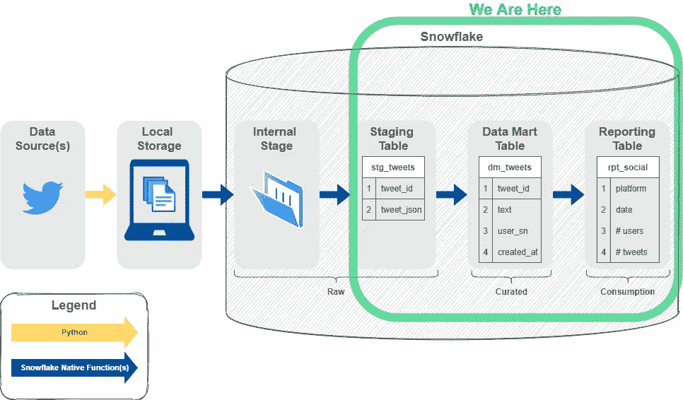

作者图解。让我们让数据对分析师更友好！

此时，您应该在一个名为 ***stg_raw_twitter*** 的表中拥有数据。这些数据大部分保留在 JSON 中，如果您使用常见的数据可视化软件，仍然需要对其进行解析以便进行下游分析。

## 在本节中，我们将执行以下操作:

1.  创建一个数据集市(DM)表，其中包含一些来自原始 JSON 的解析数据
2.  创建一个任务来加载 DM 表
3.  创建一个报告(RPT)表，从 DM 表中聚合数据
4.  创建一个任务来加载 RPT 表
5.  根据我们在系列中创建的任务和流，概述端到端数据流

## 要分解代码:

*   第 4–12 行:这创建了数据集市表 ***dm_tweets*** ，该表最终可以连接到其他表以生成报告表。为了简化这个项目，我只有一个 DM 表。
*   第 15–78 行:这是一段很长的代码，但它实际上是从我们根据 STG 表创建的流中向上插入 DM 表。这意味着它将更新任何已更改的行，插入任何新行，并删除任何已删除的行。

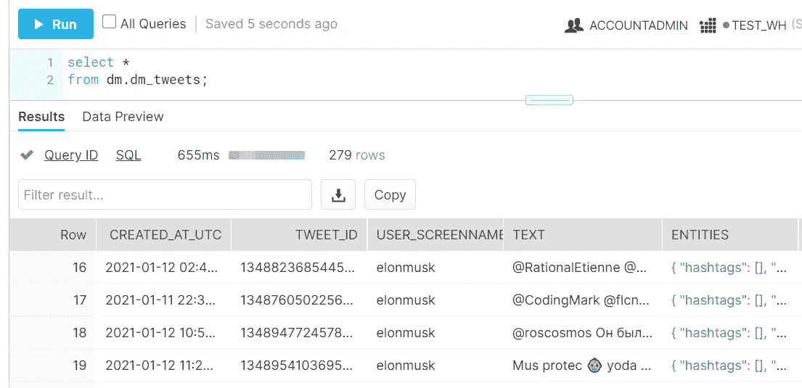

雪花 Web UI 中数据输出的作者截图。

*   第 60–107 行:这创建了一个名为 ***load_dm_tweets*** 的任务，它运行上面的 *MERGE INTO* 语句。该任务依赖于我们在上一篇文章中创建的***load _ stg _ task***任务的成功加载。
*   第 112–120 行:在这里，我们创建了报告表 ***rpt_social*** 。现在，这部分完全取决于你的判断，但是我创建了一个简单的聚合表来获得每天用户和推文的不同数量。

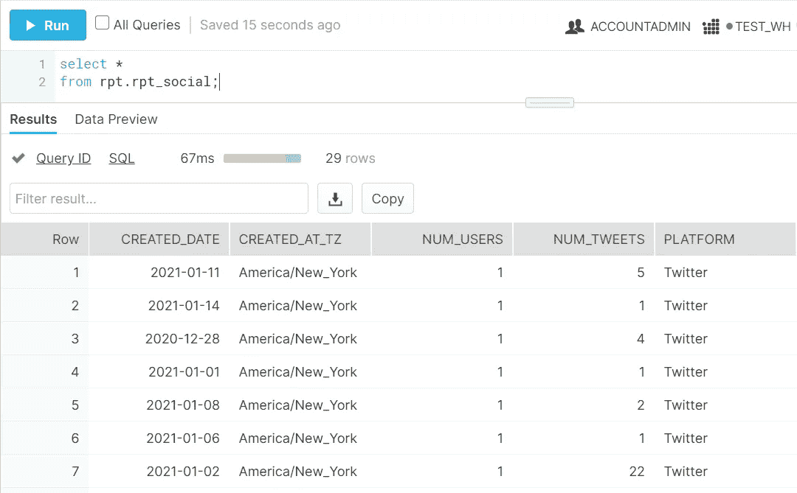

雪花 Web UI 中数据输出的作者截图。

*   第 123–152 行:该部分创建一个名为***load _ RPT _ social***的任务，以使用一个非常基本的 *SELECT* 语句来 *CREATE* 或*REPLACE*the***RPT _ social***表。在这里，您可以随意更改任何逻辑。只需确保报告表的 DDL 被修改以匹配您的更改。

## 操作的任务顺序

我们现在已经创建了 3 个任务，它们应该相互依赖。下图显示了高层关系。


作者图解。简单的东西。

在运行项目中的 SQL 代码之后，除了最初创建的数据库对象之外，您现在应该还拥有以下对象:

**阶段**

*   twitter_stage

**表格**

*   stg_twitter_raw
*   dm _ 推文
*   rpt _ 社交

**流**

*   stg _ 推特 _ 原始 _ 流

**任务**

*   加载 _stg_tweets
*   load_dm_tweets
*   负载 _ rpt _ 社会

## 快速回顾一下，这是你在这个小项目中完成的内容:

1.  使用 Tweepy API 类下载原始 Twitter 数据
2.  创建初始数据库对象
3.  将原始数据加载到这些初始数据库对象中
4.  在您的临时表上建立变更跟踪
5.  创建和加载下游表
6.  创建任务相关性，以确保加载下游数据

# 考虑

这个项目可以在几个方面进行改进。例如，不是调度 ***load_stg_tweets*** 任务在特定频率上加载，而是可以基于 ***twitter_stage*** 中新数据的到达来加载。数据模型本身非常简单，可能不包括您或您的团队关心的特定 KPI。此外，这不是为生产目的准备的，我相信还有其他项目需要改进，所以请随意分享！

# 结论

祝贺你通过了这个 ***Twitter 到雪花*** 项目，我希望它对你有所帮助。如果你有任何问题或意见，请留言。我在下面包括了一些进一步的参考资料以及修订历史记录，以防你将来回到这里。

# 密码

*   [https://github.com/kim-te/twitter-python-snowflake](https://github.com/kim-te/twitter-python-snowflake)

# 参考

*   [https://docs.snowflake.com/en/](https://docs.snowflake.com/en/)
*   [https://docs.tweepy.org/en/latest/index.html](https://docs.tweepy.org/en/latest/index.html)
*   [https://developer.twitter.com/en/docs/twitter-api](https://developer.twitter.com/en/docs/twitter-api)
*   [https://documenter.getpostman.com/view/9956214/T1LMiT5U](https://documenter.getpostman.com/view/9956214/T1LMiT5U)

# 揭发

*   Twitter、TWEET、RETWEET 和 TWITTER 徽标是 [Twitter，Inc.](https://about.twitter.com/content/dam/about-twitter/company/brand-resources/en_us/Twitter_Brand_Guidelines_V2_0.pdf) 或其附属公司的商标。
*   所有的观点都是我自己的，不反映过去、现在或未来的工作。

# 修订历史

1.  2021 年 1 月 17 日—本文最初作为一系列文章发表于 2021 年 1 月 15 日。然而，由于一些非常有效的反馈，我已经将这个系列整合成一篇长文。