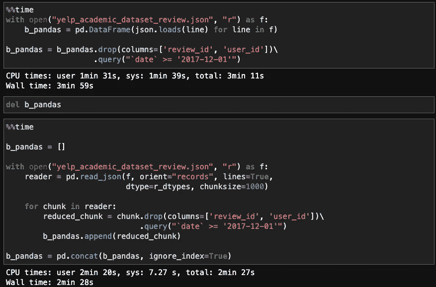

# 轻松加载 Yelp 评论(或其他大型 JSON 文件)

> 原文：<https://towardsdatascience.com/load-yelp-reviews-or-other-huge-json-files-with-ease-ad804c2f1537?source=collection_archive---------14----------------------->

## 熊猫用户:这是你如何大块吃竹子，并尽快去掉不必要的部分。

Yelp 数据集已经成为数据科学项目的热门去处，可能是因为它 1)与日常生活相关；2)像生产数据一样“真实地”调整大小。例如，`yelp_academic_dataset_review.json`本身就占据了 5.9 GB 的磁盘空间，足以让现代的笔记本电脑在加载它的时候停下来。

在本文中，我将分享一些关于如何高效加载 Yelp JSON 文件的技巧。希望这些提示可以转移到你可能从事的其他项目中去！

下面显示的所有代码块都可以复制到 Jupyter 笔记本单元中，并以独立的方式执行。最后包含了一个基准来展示所实现的显著加速。

**(补遗，2021 年 4 月 4 日)**从技术上讲，Yelp 文件是由 [**行分隔的** JSON 文件](https://hackernoon.com/json-lines-format-76353b4e588d):每行代表一个单独的 JSON 对象，而不是整个文件是一个单一的、巨大的 JSON 对象。这类文件的正确扩展名是。但公司在发布数据时可能不会进行区分。感谢[罗恩李](https://www.linkedin.com/in/rongpengli/)指出这些事情。


照片由 [Xtina Yu](https://unsplash.com/@tongs?utm_source=medium&utm_medium=referral) 在 [Unsplash](https://unsplash.com?utm_source=medium&utm_medium=referral) 上拍摄

# 可以用`modin`吗？

你可能知道`[modin](https://modin.readthedocs.io/en/latest/)`，它提供了`pandas` API，但是在幕后运行并行化的例程。不幸的是，由于无法解释的原因，我在这里演示的代码无法在`modin`上运行。截至 2021 年 4 月 4 日，`modin` [的官方文档表明](https://modin.readthedocs.io/en/latest/supported_apis/io_supported.html)仅“部分”支持`read_json`方法。

好的— — `pandas`是的。

# 选择正确的数据类型

尽管有些 Kaggle 笔记本上显示的是，`pandas.read_json` *可以直接读取 Yelp JSON 文件。对于我们的目的来说，一个重要的参数是`dtype`:我们可以指定每一列应该使用的数据类型，以减少不必要的 RAM 使用。*

每个评论(行)由四个数字描述:星级(1-5)，以及它收到的有用/酷/有趣的投票数。知道星级只能在一个很窄的范围内，并且每个评论不太可能得到，比如说，数百万的投票，我们可以选择如下的数据类型。

注意，我还指定了`lines=True`和`orient="records"`，这对`read_json`使用我们的文件是必要的。`lines=True`参数导致`pandas`将文件“作为 json 对象逐行读取”— —这对应于 Yelp 文件的结构。

```
import numpy as np
import pandas as pdr_dtypes = {"stars": np.float16, 
            "useful": np.int32, 
            "funny": np.int32,
            "cool": np.int32,
           }with open("yelp_academic_dataset_review.json", "r") as f:
    df = pd.read_json(f, orient="records", lines=True, dtype=r_dtypes)
```

# 成块阅读--并尽快过滤

我上面的代码将一次性读取整个 5.9 GB 的文件。然而，由于我们可能*并不*需要整个审查数据集，我们应该尽快过滤它— —理想的是在文件 I/O 期间*。*

我是这样做的:首先在`read_json`中指定`chunksize`，这样我就得到一个迭代器，每次迭代都会产生一个对应于`chunksize`评论(行)的 DataFrame。这样，我不会一下子耗尽笔记本电脑的内存--同时能够删除我不需要的列和行。

注意`[query](https://pandas.pydata.org/docs/reference/api/pandas.DataFrame.query.html)`在选择所需行时的使用。如果你还没有了解它，你应该了解一下— —它允许你在复杂的条件下过滤行*，而不需要*定义冗长的布尔掩码。比方说，我只对最近 3 年的数据感兴趣；因此，`.query(`date` ≥ ‘2017–12–01’)`中``包围了一个列名。

```
import numpy as np
import pandas as pdb_pandas = []
r_dtypes = {"stars": np.float16, 
            "useful": np.int32, 
            "funny": np.int32,
            "cool": np.int32,
           }with open("yelp_academic_dataset_review.json", "r") as f:
    reader = pd.read_json(f, orient="records", lines=True, 
                          dtype=r_dtypes, chunksize=1000)

    for chunk in reader:
        reduced_chunk = chunk.drop(columns=['review_id', 'user_id'])\
                             .query("`date` >= '2017-12-01'")
        b_pandas.append(reduced_chunk)

b_pandas = pd.concat(b_pandas, ignore_index=True)
```

最后调用`pandas.concat`将所有的块放在一个数据帧中，然后您可以将其与业务元数据等合并。

# 基准

将数据加载时间从 4 分钟减少到 2.5 分钟，提高了 38%！



速度基准比较一个天真的方法(上)和这篇文章的(下)。图片来自本文作者自己的实验。

# 包扎

1.  明智地使用`dtype`来指定列数据类型。这是`pandas`中 I/O 方法的一个常见论点。
2.  分块读取文件，积极向下过滤以节省内存。同样，`chunksize`参数由几个`pandas.read_*`方法共享，包括`[read_csv](https://pandas.pydata.org/pandas-docs/dev/reference/api/pandas.read_csv.html)`！
3.  学习如何使用`pandas.DataFrame.query`；这将节省大量布尔掩码的键入和命名。