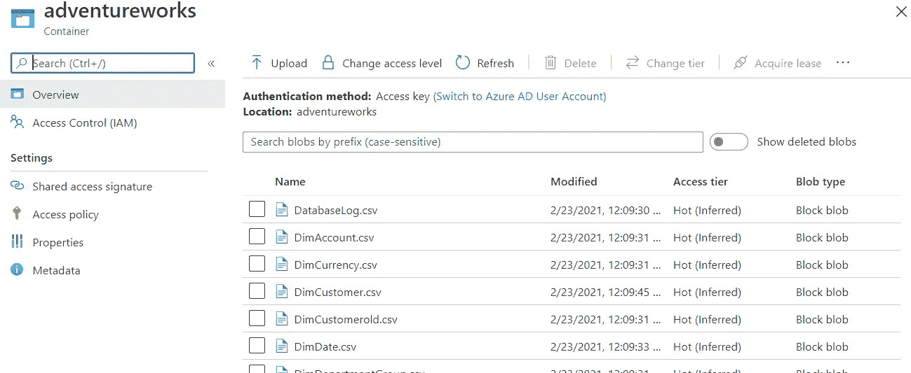
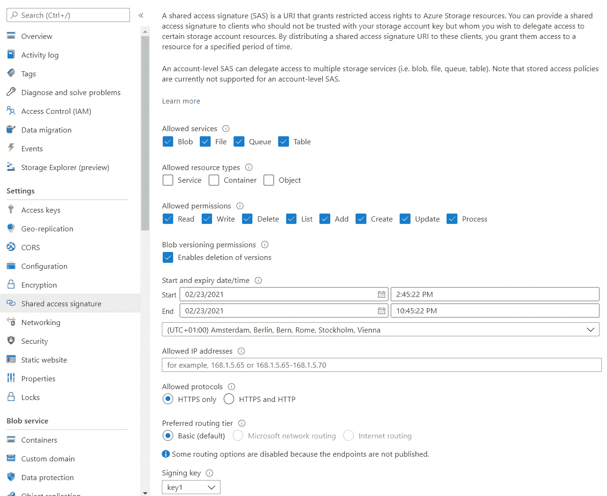

# 将 csv 文件从 Azure 存储加载到 Azure SQL 数据库

> 原文：<https://towardsdatascience.com/loading-a-csv-file-into-azure-sql-database-from-azure-storage-6e68bc0ac863?source=collection_archive---------10----------------------->

## 轻松快捷地将 csv 文件加载到 Azure SQL 数据库


在 [Unsplash](https://unsplash.com/s/photos/database?utm_source=unsplash&utm_medium=referral&utm_content=creditCopyText) 上由 [Boitumelo Phetla](https://unsplash.com/@writecodenow?utm_source=unsplash&utm_medium=referral&utm_content=creditCopyText) 拍摄的照片

周末，我想对 Databricks 的某些功能做一个快速的概念验证，我想使用 Azure SQL 作为一个来源。我面临了相当多的挑战，谷歌没有好心到给我提供一个解决方案。我尝试了从 bcp 到在我的本地计算机上批量插入文件的所有方法，但不知何故，它出现了无法修复的错误。

最后，我设法将 csv 文件加载到数据库中，并想到与每个人分享这一点，这样，如果你必须快速将数据加载到 Azure SQL 数据库中，而你不想在 Databricks 中编写脚本或使用 Azure Data Factory 来完成这样一个简单的任务。在你继续之前，我假设你对 Azure 生态系统有相当的了解，特别是存储帐户。

所以首先，上传文件，你想加载到 Azure SQL 数据库，到 Azure 存储帐户的容器中。您可以使用普通的 Blob 容器，而不必为此使用 Azure 数据湖存储。



来自 Azure Blob 的截图

其次，您需要为存储帐户创建一个共享访问签名



来自 Azure 存储帐户的屏幕截图

现在转到 Azure SQL 数据库，您希望在这里加载 csv 文件并执行下面几行。请用您在上一步中生成的密码替换该密码。此外，请确保将 blob 存储的位置替换为

```
*CREATE MASTER KEY ENCRYPTION BY PASSWORD = 'YourStrongPassword1';**CREATE DATABASE SCOPED CREDENTIAL MyAzureBlobStorageCredential
WITH IDENTITY = 'SHARED ACCESS SIGNATURE',
SECRET = '******srt=sco&sp=rwac&se=2017–02–01T00:55:34Z&st=2016–12–29T16:55:34Z***************';***NOTE: Make sure that you don't have a leading ? in SAS token, and that you have at least read permission on the object that should be loaded srt=o&sp=r, and expiration period is valid (all dates are in UTC time)***CREATE EXTERNAL DATA SOURCE MyAzureBlobStorage
WITH ( TYPE = BLOB_STORAGE,
LOCATION = '*[*https://****************.blob.core.windows.net/adventureworks'*](https://****************.blob.core.windows.net/adventureworks') *, CREDENTIAL= MyAzureBlobStorageCredential*
```

完成上述步骤后，您只剩下最后一步，那就是将文件插入到表中。请记住在加载文件之前在数据库中创建表，也请记住保持表的模式与文件结构完全一致，否则您可能会遇到错误。最后一步是

```
BULK INSERT [dbo].[lnd_lending_club_acc_loans] FROM 'accepted_2007_to_2018Q4.csv'
WITH (
    CHECK_CONSTRAINTS,
    DATA_SOURCE = 'MyAzureBlobStorage',
    DATAFILETYPE='char',
    FIELDTERMINATOR=',',
    ROWTERMINATOR='0x0a',
 FIRSTROW=3,
    KEEPIDENTITY,
    TABLOCK
);
```

如果您做了所有正确的事情，那么您可以期望表中加载了 csv 文件中的数据。有很多其他的方法可以做到这一点，但是这个方法对我来说很有效，而且很快。