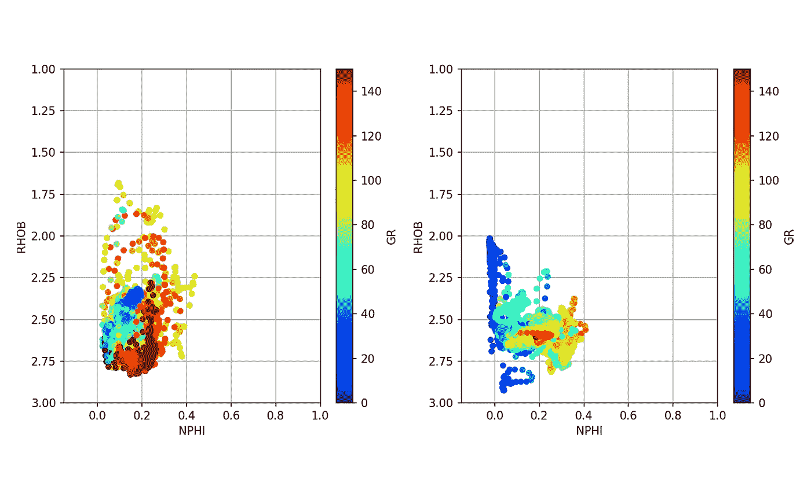
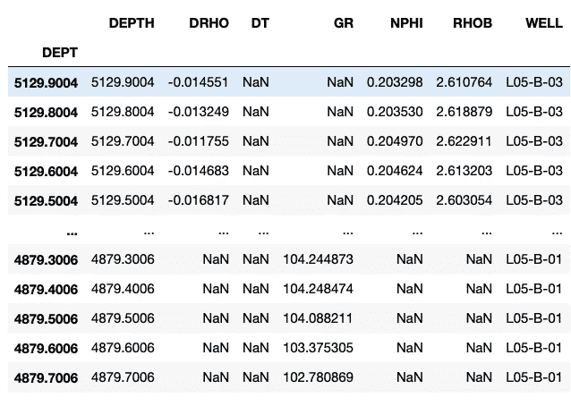
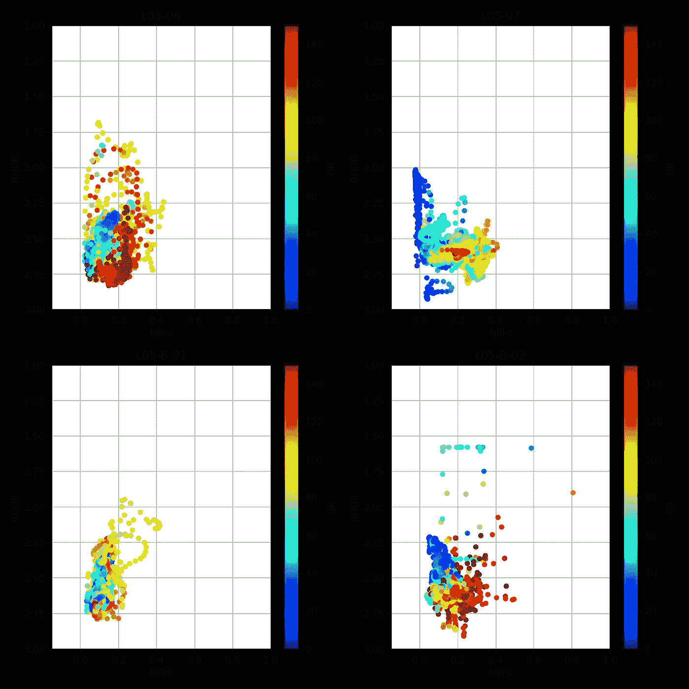
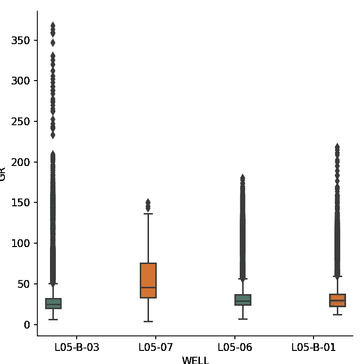
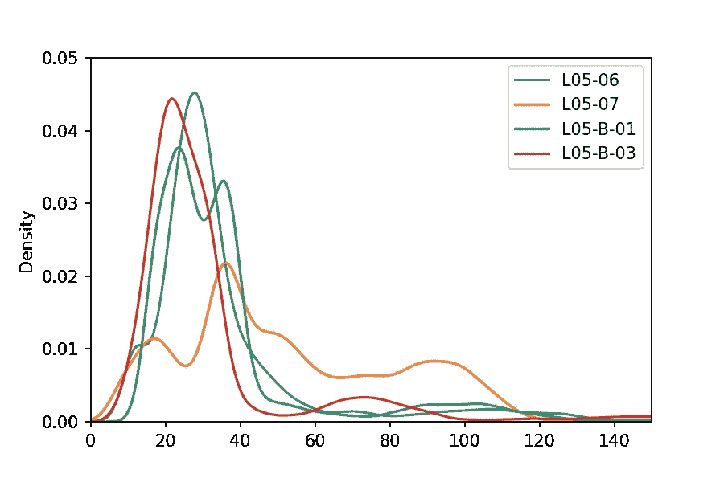

# 使用 Python 加载多个测井 LAS 文件

> 原文：<https://towardsdatascience.com/loading-multiple-well-log-las-files-using-python-39ac35de99dd?source=collection_archive---------8----------------------->

## 将多个 LAS 文件附加到 Pandas 数据帧



使用 Python 库 matplotlib 绘制多口井的密度与中子孔隙度的交会图。作者创造的意象。

测井 ASCII 标准(LAS)文件是一种常见的石油和天然气行业格式，用于存储和传输测井数据。其中包含的数据用于分析和了解地下情况，以及识别潜在的油气储量。在我的上一篇文章:[加载和显示测井数据](https://andymcdonaldgeo.medium.com/loading-and-displaying-well-log-data-b9568efd1d8)中，我介绍了如何使用 LASIO 库加载单个 LAS 文件。

在本文中，我将通过展示如何将多个 las 文件从子文件夹加载到单个 [pandas dataframe](https://pandas.pydata.org/pandas-docs/stable/reference/api/pandas.DataFrame.html) 中，对此进行扩展。这样做使我们能够处理来自多口井的数据，并使用 matplotlib 快速可视化数据。它还允许我们以适合通过机器学习算法运行的单一格式准备数据。

这篇文章是我的 Python &岩石物理学系列的一部分。完整系列的细节可以在[这里](http://andymcdonald.scot/python-and-petrophysics)找到。你也可以在我的 GitHub 知识库中找到我的 Jupyter 笔记本和数据集，链接如下。

[](https://github.com/andymcdgeo/Petrophysics-Python-Series) [## andymcdgeo/岩石物理学-Python-系列

### 本系列 Jupyter 笔记本将带您了解使用 Python 和岩石物理数据的各个方面。一个…

github.com](https://github.com/andymcdgeo/Petrophysics-Python-Series) 

要阅读本文，可以在上面的链接中找到 Jupyter 笔记本，本文的数据文件可以在 Python & Petrophysics 库的 [Data 子文件夹](https://github.com/andymcdgeo/Petrophysics-Python-Series/tree/master/Data)中找到。

本文使用的数据来自可公开访问的[荷兰 NLOG 荷兰石油和天然气门户网站](https://www.nlog.nl/en/welcome-nlog)。

# 设置库

第一步是引入我们将要使用的库。我们将使用五个库: [pandas](https://pandas.pydata.org/) ， [matplotlib](https://matplotlib.org/) ， [seaborn](https://seaborn.pydata.org) ， [os](https://docs.python.org/3/library/os.html) ，以及 [lasio](https://lasio.readthedocs.io) 。

Pandas、os 和 lasio 将用于加载和存储我们的数据，而 matplotlib 和 seaborn 将允许我们可视化井的内容。

接下来，我们将设置一个空列表来保存我们所有的 las 文件名。

其次，在本例中，我们将文件存储在名为 Data/15-LASFiles/的子文件夹中。这将根据您的文件存储位置而变化。

我们现在可以使用`os.listdir`方法并传入文件路径。当我们运行这段代码时，我们将能够看到数据文件夹中所有文件的列表。

从这段代码中，我们得到了文件夹内容的列表。

```
['L05B03_comp.las',
 'L0507_comp.las',
 'L0506_comp.las',
 'L0509_comp.las',
 'WLC_PETRO_COMPUTED_1_INF_1.ASC']
```

# 读取 LAS 文件

正如你在上面看到的，我们已经返回了 4 个 LAS 文件和 1 个 ASC 文件。因为我们只对 las 文件感兴趣，所以我们需要遍历每个文件并检查扩展名是否为. LAS。LAS 而不是。las)，我们需要调用`.lower()`将文件扩展名字符串转换成小写字符。

一旦我们确定了文件是否以。las，然后我们可以将路径(' Data/15-LASFiles/')添加到文件名中。这是 lasio 正确提取文件所必需的。如果我们只传递文件名，读者将会在与脚本或笔记本相同的目录中查找，结果会失败。

当我们调用`las_file_list`时，我们可以看到 4 个 LAS 文件的完整路径。

```
['Data/15-LASFiles/L05B03_comp.las',
 'Data/15-LASFiles/L0507_comp.las',
 'Data/15-LASFiles/L0506_comp.las',
 'Data/15-LASFiles/L0509_comp.las']
```

# 将单个 LAS 文件附加到 Pandas 数据帧

有多种不同的方式将数据连接和/或附加到数据帧。在本文中，我们将使用一个简单方法来创建一个数据帧列表，我们将把这些数据帧连接在一起。

首先，我们将使用`df_list=[]`创建一个空列表。其次，我们将遍历 las_file_list，读取文件并将其转换为数据帧。

了解数据的来源对我们来说是有用的。如果我们不保留这些信息，我们最终会得到一个充满数据的数据框架，而没有关于其来源的信息。为此，我们可以创建一个新列，并为井名赋值:`lasdf['WELL']=las.well.WELL.value`。这将使以后处理数据变得容易。

此外，当 lasio 将 dataframe 索引设置为文件的深度值时，我们可以创建一个名为`DEPTH`的附加列。

我们现在将通过连接列表对象来创建一个包含 LAS 文件中所有数据的工作数据帧。

当我们调用工作数据帧时，我们可以看到我们的数据来自同一个数据帧中的多个井。



从多个 las 文件编译的熊猫数据帧。

我们还可以通过检查孔栏中的唯一值来确认是否加载了所有孔:

它返回唯一的井名数组:

```
 array(['L05-B-03', 'L05-07', 'L05-06', 'L05-B-01'], dtype=object)
```

如果我们的 LAS 文件包含不同的曲线助记符(这是常见的情况),将为数据帧中尚未出现的每个新助记符创建新列。

# 创建快速数据可视化

现在我们已经将数据加载到 pandas dataframe 对象中，我们可以创建一些简单快速的多图来深入了解我们的数据。我们将使用交会图/散点图、箱线图和核密度估计(KDE)图来实现这一点。

为此，我们首先需要按照井名对数据帧进行分组，如下所示:

## 每口井的交会图/散点图

交会图(也称为散点图)用于绘制一个变量与另一个变量的关系。在这个例子中，我们将使用中子孔隙度与体积密度交会图，这是岩石物理学中非常常用的图。

使用之前在我的[测井数据的勘探数据分析](/exploratory-data-analysis-with-well-log-data-98ad084c4e7)文章中提到的类似代码，我们可以遍历数据框架中的每个组，并生成中子孔隙度(NPHI)与体积密度(RHOB)的交会图(散点图)。

这会生成以下带有 4 个支线剧情的图像:



使用 Python 库 matplotlib 绘制多口井的密度与中子孔隙度的交会图。作者创造的形象。

## 每口井伽马射线箱线图

接下来，我们将展示所有油井的伽马射线 cuvre 箱线图。箱线图将向我们显示数据的范围(最小到最大)、四分位数和数据的中值。

这可以通过使用 seaborn 库中的一行代码来实现。在参数中，我们可以为数据传入 workingdf 数据帧，为色调传入 WELL 列。后者会将数据分割成单独的盒子，每个盒子都有自己独特的颜色。



4 口独立井的伽马射线箱线图。作者创造的形象。

## 直方图(核密度估计)

最后，我们可以通过使用类似于直方图的核密度估计图来查看数据帧中曲线值的分布。

同样，此示例显示了应用 groupby 函数的另一种方式。我们可以通过调用 matplotlib 函数来设置 x 和 y 限制，从而整理绘图。



使用 Python 的 matplotlib 库生成的多口井伽马射线数据的 KDE 图。作者创造的形象。

# 摘要

在本文中，我们介绍了如何通过在目录中搜索所有扩展名为. las 的文件来加载多个 LAS 文件，并将它们连接成一个[熊猫数据帧](https://pandas.pydata.org/pandas-docs/stable/reference/api/pandas.DataFrame.html)。一旦我们在数据帧中有了这些数据，我们就可以很容易地调用 matplotlib 和 seaborn 来快速而容易地理解数据的可视化。

***感谢阅读！***

如果您觉得这篇文章很有用，请随时查看我的其他文章，这些文章从不同方面介绍了 Python 和测井数据。你也可以在[***GitHub***](https://github.com/andymcdgeo)***找到我和其他人在本文中使用的代码。***

*如果你想联系我，你可以在*[***LinkedIn***](https://www.linkedin.com/in/andymcdonaldgeo/)**或者在我的* [***网站***](http://andymcdonald.scot/) *上找到我。**

**有兴趣了解更多关于 python 和测井数据或岩石物理学的知识吗？跟我上* [***中***](https://andymcdonaldgeo.medium.com/) *。**