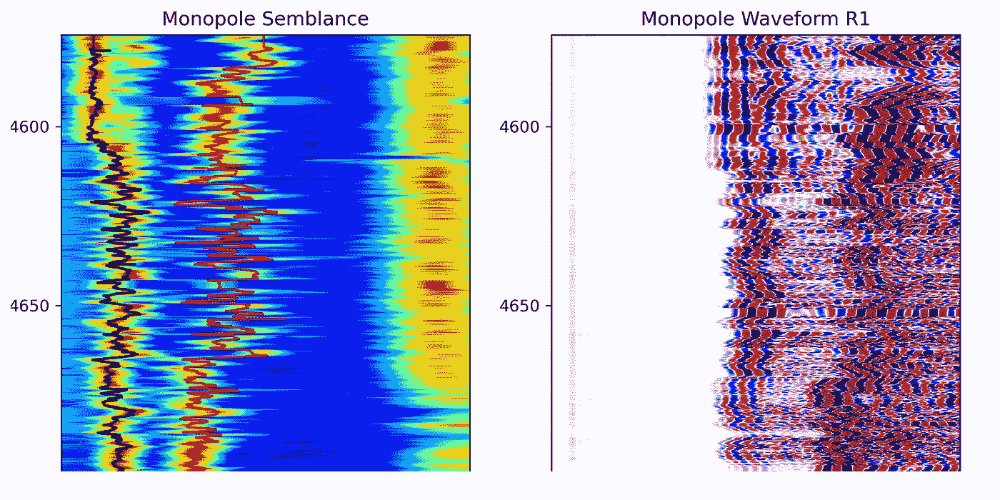
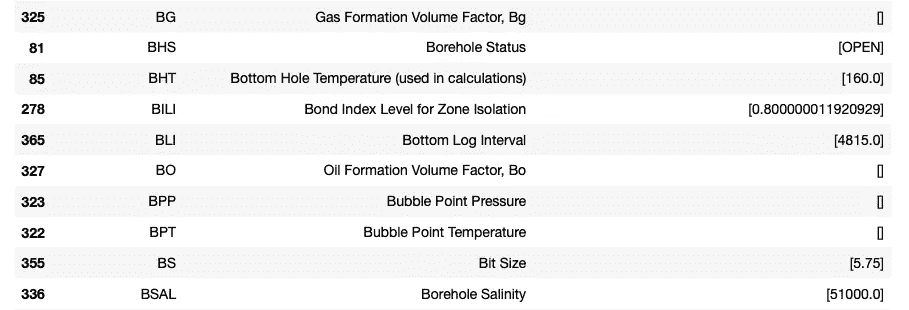
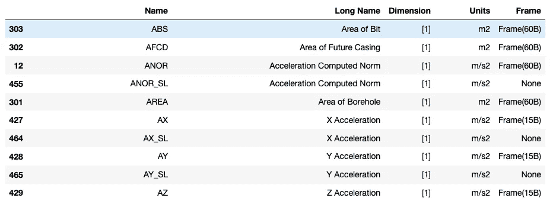
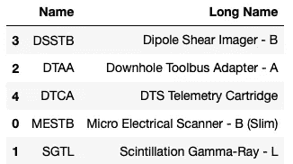
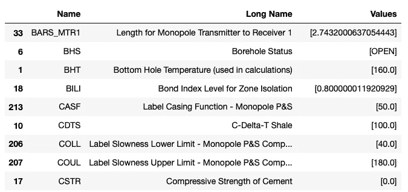
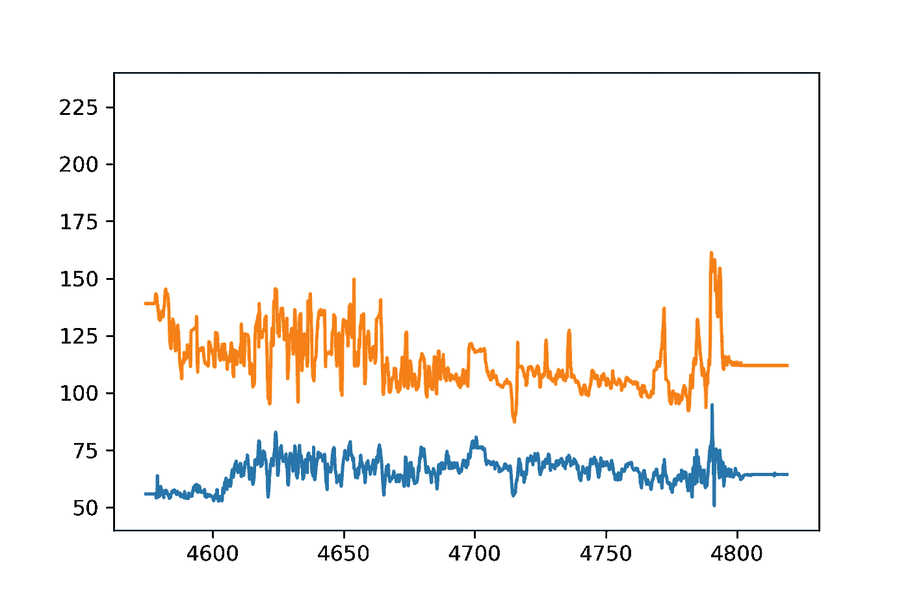
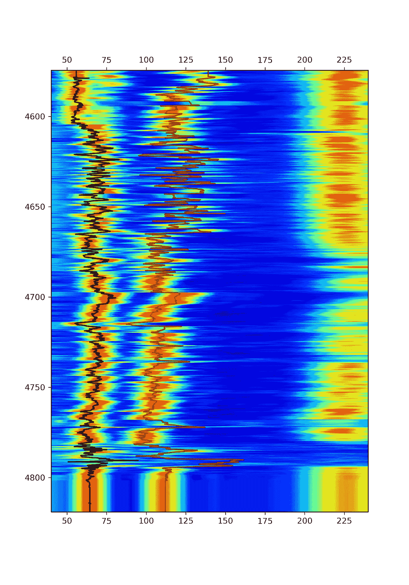
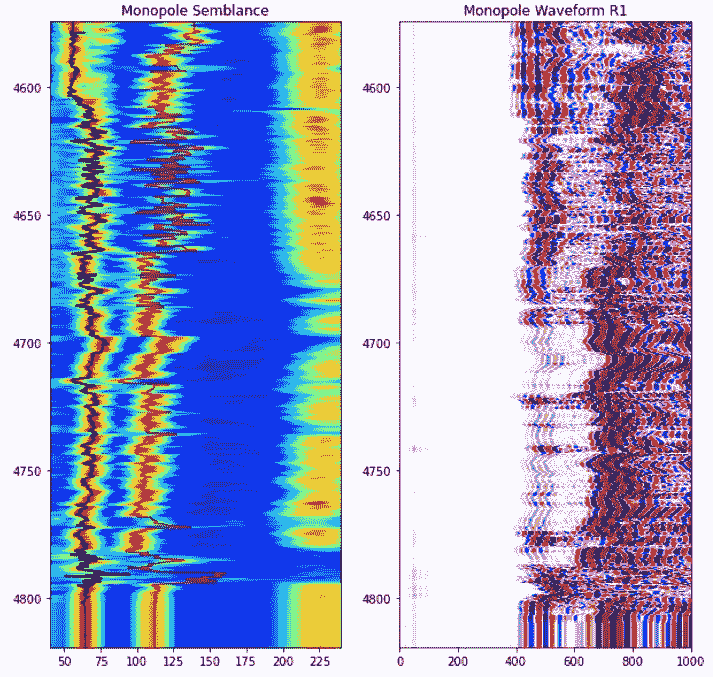
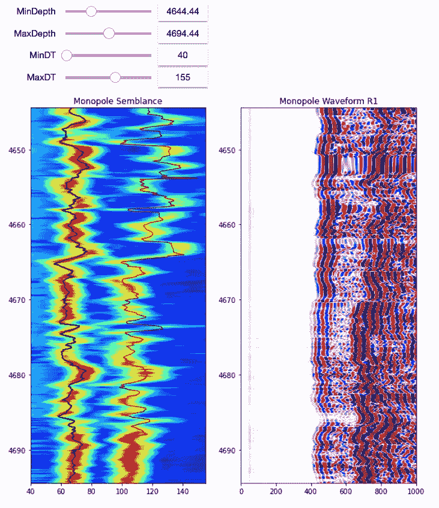

# 使用 Python 从 DLIS 加载测井数据

> 原文：<https://towardsdatascience.com/loading-well-log-data-from-dlis-using-python-9d48df9a23e2?source=collection_archive---------9----------------------->

## 使用 dlisio 和 matplotlib 加载和显示处理过的声波波形数据的简短教程



matplotlib 图左侧显示外观图，右侧显示波形数据。图片由作者提供。

# 介绍

测井记录和岩石物理数据可以以多种不同的格式存储。在本系列的早期文章和笔记本中，我们主要关注于从 CSV 文件([这里](https://github.com/andymcdgeo/Petrophysics-Python-Series/blob/master/01%20-%20Loading%20and%20Displaying%20Well%20Data%20From%20CSV.ipynb))和 LAS 文件([这里](/loading-multiple-well-log-las-files-using-python-39ac35de99dd)和[这里](https://andymcdonaldgeo.medium.com/loading-and-displaying-well-log-data-b9568efd1d8))加载数据。尽管 LAS 文件是一种常见的格式，但它们具有扁平的结构，标题部分包含关于油井和文件的元数据，后面是一系列包含每条测井曲线值的列。因为它们是平面的，所以不容易存储数组数据。这是可能的，但是阵列的单个元素被分割成 LAS 文件中的单个列/曲线，而不是单个阵列。这就是 DLIS 档案的用处。

在本文中，我们将涵盖:

*   加载 DLIS 文件的基础
*   探索 DLIS 文件中的内容和参数
*   显示经处理的声波波形数据

我们将不讨论声波波形处理。只显示以前处理过的数据。

这篇文章的灵感来自厄伦德·m·维根([https://erlend-viggen.no/dlis-files/](https://erlend-viggen.no/dlis-files/))的作品，他创作了一个优秀的 Jupyter 笔记本，里面有更多关于 DLIS 文件的细节。

## DLIS 档案

数字测井交换标准(DLIS)文件是结构化的二进制文件，包含油井信息和测井数据的数据表。该文件格式由 Schlumberger 在 20 世纪 80 年代后期开发，随后由美国石油协会在 1991 年发布，以创建标准化的测井数据格式。标准格式的全部细节可在此处找到[。](http://w3.energistics.org/rp66/v1/Toc/main.html)由于 DLIS 文件格式是近 30 年前开发的，因此使用起来有时会很困难和尴尬，不同的软件包和供应商可以通过添加新的结构和对象类型来创建自己的 DLIS 风格。

DLIS 文件包含大量与油井和数据相关的元数据。这些部分不包含井数据，这些数据存储在帧中，其中可能有许多代表不同的测井通道/运行或处理阶段(例如原始或解释)。框架是包含测井数据的表格对象，其中每一列代表一条测井曲线，数据按时间或深度进行索引。帧内的每条测井曲线被称为一个通道。通道可以是一维或多维的

## 德利西奥

dlsio 是一个 python 库，由 Equinor ASA 开发，用于读取 DLIS 文件和日志信息标准 79 (LIS79)文件。图书馆的细节可以在这里找到。

## 数据

本文中使用的数据来源于 [NLOG:荷兰石油和天然气门户](https://www.nlog.nl/en/welcome-nlog)。

***隐私声明:****【DLIS】文件可以包含能够识别参与登录操作的个人的信息。为了保护他们的身份不在未经他们明确同意的情况下出现在搜索引擎结果中，本文中隐藏了这些字段。*

这篇文章是我的 Python &岩石物理学系列的一部分。完整系列的详情可在[这里](http://andymcdonald.scot/python-and-petrophysics)找到。您也可以在我的 GitHub 存储库中找到我的 Jupyter 笔记本和数据集，链接如下

[](https://github.com/andymcdgeo/Petrophysics-Python-Series) [## andymcdgeo/岩石物理学-Python-系列

### 本系列 Jupyter 笔记本将带您了解使用 Python 和岩石物理数据的各个方面。一个…

github.com](https://github.com/andymcdgeo/Petrophysics-Python-Series) 

要阅读这篇文章，可以在上面的链接中找到 Jupyter 笔记本，这篇文章的数据文件可以在 Python & Petrophysics 库的 [Data 子文件夹](https://github.com/andymcdgeo/Petrophysics-Python-Series/tree/master/Data)中找到。

# 库导入

任何项目的第一步都是加载我们想要使用的库。对于这个笔记本，我们将使用 [NumPy](https://numpy.org/) 处理数组， [pandas](https://pandas.pydata.org/) 存储数据，以及 [matplotlib](https://matplotlib.org/) 显示数据。为了加载数据，我们将使用 dlisio 库。

此外，由于我们将使用数据帧来查看参数，这些参数可能很多，因此我们需要更改调用该数据帧时将显示的最大行数。这是通过`pd.set_option('display.max_rows', 500)`实现的。

# 加载 DLIS 文件

因为我们正在处理一个 DLIS 文件，所以我们可以使用下面的代码来加载这个文件。一个物理 DLIS 文件可以包含多个逻辑文件，因此使用这个语法允许第一个文件输出到`f`，任何后续的逻辑文件被放入`tail`。

我们可以通过呼唤它们的名字来看到每一个的内容。如果我们调用`f`，我们可以看到它返回一个`LogicalFile(00001_AC_WORK`，如果我们调用`tail`，我们得到一个空白列表，这让我们知道在 DLIS 中没有其他逻辑文件。

它返回:

```
LogicalFile(00001_AC_WORK)
[]
```

要查看文件的高级内容，我们可以使用`.describe()`方法。这将返回有关逻辑文件中的帧数、通道数和对象数的信息。当我们将其应用于`f`时，我们可以看到我们有一个包含 4 帧和 484 个通道(测井曲线)的文件，此外还有一些已知和未知的对象。

它返回:

```
------------
Logical File
------------
Description : LogicalFile(FMS_DSI_138PUP)
Frames      : 4
Channels    : 484

Known objects
--
FILE-HEADER             : 1
ORIGIN                  : 1
AXIS                    : 50
EQUIPMENT               : 27
TOOL                    : 5
PARAMETER               : 480
CALIBRATION-MEASUREMENT : 22
CALIBRATION-COEFFICIENT : 12
CALIBRATION             : 341
PROCESS                 : 3
CHANNEL                 : 484
FRAME                   : 4

Unknown objects
--
440-CHANNEL                  : 538
440-PRESENTATION-DESCRIPTION : 1
440-OP-CHANNEL               : 573
```

# 查看文件的元数据

## 数据来源

我们要看的第一组元数据是原点。这提供了关于文件中数据源的信息。有时，数据可能来自多个来源，因此我们需要通过将来源分解为两个变量来说明这一点。我们总是可以通过打印列表的长度来检查是否有其他来源信息。

当我们查看 origin_tail 的长度时，我们可以看到它的长度为 2。对于本文，我们将重点关注`origin`。我们可以通过调用`describe()`来查看它的细节。这提供了关于字段、井和其他文件信息的细节。

它返回:

```
------
Origin
------
name   : DLIS_DEFINING_ORIGIN
origin : 41
copy   : 0

Logical file ID          : FMS_DSI_138PUP
File set name and number : WINTERSHALL/L5-9 / 41
File number and type     : 170 / PLAYBACK

Field                   : L5
Well (id/name)          :  / L5-9
Produced by (code/name) : 440 / Schlumberger
Produced for            : Wintershall Noordzee B.V.
Run number              : -1
Descent number          : -1
Created                 : 2002-02-17 18:18:52

Created by              : OP, (version: 9C2-303)
Other programs/services : MESTB: Micro Electrical Scanner - B (Slim)  SGTL: Scintillation Gamma-Ray - L DTAA: Downhole Toolbus Adapter - A          DSSTB: Dipole Shear Imager - B DTCA: DTS Telemetry CartridgeACTS: Auxiliary Compression Tension Sub - B DIP: Dip Computation DIR: Directional Survey Computation HOLEV: Integrated Hole/Cement Volume
```

## 框架

DLIS 文件中的帧可以代表不同的测井通道或不同阶段的数据，如原始测井测量到岩石物理解释或处理后的数据。每一帧都有许多属性。下面的示例代码以易读的格式打印出属性。

这将返回以下摘要。这表明该文件中存在两个帧。第一帧包含钻头尺寸(BIT)、井径(CAL)、伽马射线(GR)和张力(TEN)的基本测井曲线。第二帧包含后处理的声波波形数据。

```
Frame Name: 		 60B
Index Type: 		 BOREHOLE-DEPTH
Depth Interval: 	 0 - 0 0.1 in
Depth Spacing: 		 -60 0.1 in
Direction: 		 DECREASING
Num of Channels: 	 77
Channel Names: 		 [Channel(TDEP), Channel(BS), Channel(CS), Channel(TENS), Channel(ETIM), Channel(DEVI), Channel(P1AZ_MEST), Channel(ANOR), Channel(FINC), Channel(HAZI), Channel(P1AZ), Channel(RB), Channel(SDEV), Channel(GAT), Channel(GMT), Channel(ECGR), Channel(ITT), Channel(SPHI), Channel(DCI2), Channel(DCI4), Channel(SOBS), Channel(DTCO), Channel(DTSM), Channel(PR), Channel(VPVS), Channel(CHR2), Channel(DT2R), Channel(DTRP), Channel(CHRP), Channel(DTRS), Channel(CHRS), Channel(DTTP), Channel(CHTP), Channel(DTTS), Channel(CHTS), Channel(DT2), Channel(DT4P), Channel(DT4S), Channel(SPCF), Channel(DPTR), Channel(DPAZ), Channel(QUAF), Channel(DDIP), Channel(DDA), Channel(FCD), Channel(HDAR), Channel(RGR), Channel(TIME), Channel(CVEL), Channel(MSW1), Channel(MSW2), Channel(FNOR), Channel(SAS2), Channel(SAS4), Channel(PWF2), Channel(PWN2), Channel(PWF4), Channel(PWN4), Channel(SVEL), Channel(SSVE), Channel(SPR2), Channel(SPR4), Channel(SPT4), Channel(DF), Channel(CDF), Channel(CLOS), Channel(ED), Channel(ND), Channel(TVDE), Channel(VSEC), Channel(CWEL), Channel(AREA), Channel(AFCD), Channel(ABS), Channel(IHV), Channel(ICV), Channel(GR)]

Frame Name: 		 10B
Index Type: 		 BOREHOLE-DEPTH
Depth Interval: 	 0 - 0 0.1 in
Depth Spacing: 		 -10 0.1 in
Direction: 		 DECREASING
Num of Channels: 	 4
Channel Names: 		 [Channel(TDEP), Channel(IDWD), Channel(TIME), Channel(SCD)]

Frame Name: 		 1B
Index Type: 		 BOREHOLE-DEPTH
Depth Interval: 	 0 - 0 0.1 in
Depth Spacing: 		 -1 0.1 in
Direction: 		 DECREASING
Num of Channels: 	 84
Channel Names: 		 [Channel(TDEP), Channel(TIME), Channel(EV), Channel(BA28), Channel(BA17), Channel(BB17), Channel(BC13), Channel(BD13), Channel(BB28), Channel(BA13), Channel(BB13), Channel(BC17), Channel(BD17), Channel(BA22), Channel(BA23), Channel(BA24), Channel(BC28), Channel(BA25), Channel(BA26), Channel(BA27), Channel(BA11), Channel(BA12), Channel(BA14), Channel(BA15), Channel(BA16), Channel(BA18), Channel(BA21), Channel(BC11), Channel(BC12), Channel(BC14), Channel(BC15), Channel(BC16), Channel(BC18), Channel(BC21), Channel(BC22), Channel(BC23), Channel(BC24), Channel(BC25), Channel(BC26), Channel(BC27), Channel(BB22), Channel(BB23), Channel(BB24), Channel(BD28), Channel(BB25), Channel(BB26), Channel(BB27), Channel(BB11), Channel(BB12), Channel(BB14), Channel(BB15), Channel(BB16), Channel(BB18), Channel(BB21), Channel(BD11), Channel(BD12), Channel(BD14), Channel(BD15), Channel(BD16), Channel(BD18), Channel(BD21), Channel(BD22), Channel(BD23), Channel(BD24), Channel(BD25), Channel(BD26), Channel(BD27), Channel(SB1), Channel(DB1), Channel(DB2), Channel(DB3A), Channel(DB4A), Channel(SB2), Channel(DB1A), Channel(DB2A), Channel(DB3), Channel(DB4), Channel(FCAX), Channel(FCAY), Channel(FCAZ), Channel(FTIM), Channel(AZSNG), Channel(AZS1G), Channel(AZS2G)]

Frame Name: 		 15B
Index Type: 		 BOREHOLE-DEPTH
Depth Interval: 	 0 - 0 0.1 in
Depth Spacing: 		 -15 0.1 in
Direction: 		 DECREASING
Num of Channels: 	 12
Channel Names: 		 [Channel(TDEP), Channel(TIME), Channel(C1), Channel(C2), Channel(U-MBAV), Channel(AX), Channel(AY), Channel(AZ), Channel(EI), Channel(FX), Channel(FY), Channel(FZ)]
```

## DLIS 文件中的参数

如前所述，我们有许多与 DLIS 文件相关的对象。为了使它们更容易阅读，我们可以创建一个简短的函数来创建包含参数的 pandas 数据帧。

通过调用`f.parameters`可以访问记录参数。要访问参数，我们可以使用属性`name`、`long_name`和`values`，并将它们传递给汇总函数。

这将返回每个参数的长表。下面例子是表格的一小部分。从中可以看到井底测井间隔、井眼矿化度、井底温度等参数。



存储在 DLIS 文件中的关键油井参数。图片作者。

## DLIS 文件中的频道

帧内的通道是单独的曲线或阵列。为了查看这些的快速总结，我们可以向`summary_dataframe()`方法传递一些属性。

这将返回另一个长表，其中包含文件中包含的所有曲线，以及数据所属的帧。



DLIS 文件中的通道代表单独的测井曲线。图片由作者提供。

## DLIS 文件中的工具

DLIS 文件中的工具对象包含与用于获取数据的工具相关的信息。通过调用`summary_dataframe`方法，我们可以获得可用工具的摘要。

这将返回一个包含 5 个工具的简短表格:



存储在 DLIS 文件中的工具列表。图片由作者提供。

当我们要绘制声波波形数据时，我们可以看看 DSSTB——偶极横波成像器工具的参数。首先，我们需要从 dlis 中获取对象，然后将其传递给`summary_dataframe`函数。

从返回的表中，我们可以查看与工具和数据处理相关的每个参数。



DSST 刀具的刀具加工参数。图片由作者提供。

# 绘图数据

既然已经研究了一些元数据，我们现在可以尝试访问存储在文件中的数据。

通过调用文件的`.object()`可以访问帧和数据。首先，我们可以将帧分配给变量，这将使访问其中的数据变得更容易，特别是如果帧包含同名的通道/曲线。`.object()`方法需要被访问对象的类型，即“帧”或“通道”及其名称。在这种情况下，我们可以参考包含通道和帧名的上一步。我们可以看到，基本测井曲线在一个框架中，而声学数据在另一个框架中。

我们也可以直接访问特定曲线的通道。但是，当处理包含同名通道/曲线的帧时，这可能会导致混淆。

以下示例显示了如何调用通道/曲线的关键属性。详情可在此处找到[。](https://dlisio.readthedocs.io/en/stable/dlis/api.html#dlisio.dlis.Channel)

它返回:

```
Name: 		DTCO
Long Name: 	Delta-T Compressional
Units: 		us/ft
Dimension: 	[1]
```

## 将通道分配给变量

现在我们知道了如何访问 DLIS 文件的框架和通道，我们现在可以为我们要绘制的曲线分配变量名。在本文中，我们将策划:

*   DTCO:德尔塔-T 压缩
*   DTSM:δ-T 切变
*   SPR4: STC 慢度投影，接收器阵列-单极 P&S
*   PWF4: DSST 打包波形数据—单极 P&S

我们还需要从帧中指定一条深度曲线(TDEP)。回头看框架的信息部分，`Depth Interval`是 0.1 英寸。这需要通过乘以 0.00254 来转换为米。

当深度最小值和最大值打印出来时，我们得到以下数据范围:

```
4574.4384765625 - 4819.04052734375
```

为了对数据进行初步检查，我们可以使用 matplotlib 创建 DTCO 和 DTSM 相对于深度的快速测井图。



简单绘制 DTCO 和 DTSM 曲线，以检查其内容。图片作者。

## 绘制处理后的外观图

我们将开始设置一个有两个轴的副情节，并使用`subplot2grid`。第一个轴将包含外观图，第二个轴将与第一个轴成对出现。这允许数据绘制在同一 y 轴上。

为了绘制外观数据，我们需要使用`imshow`。当我们这样做时，我们需要在深度范围(使用`depth.min() and depth.max()`)和数据范围(40 - 240 us/ft)方面传递数组的范围。

除此之外，还可以绘制 DTCO 和 DTSM 曲线。这让我们可以看到这些曲线是如何从外观图中挑选出来的。



使用 matplotlib 绘制声波波形相似图。声波压缩(声波)和剪切曲线绘制在外观图的顶部。图片由作者提供。

## 绘制处理后的波形

我们可以修改该图，以便为与外观图相关联的声波波形数据添加子图。如果我们看看`wf_mono`的形状，我们可以看到它返回`(1606, 8, 512)`。这表明数组是多维的。中间的数字表示我们有 8 个接收器的数据。

要访问第一个接收器，通常是距离发射器阵列最近的接收器，我们可以创建一个数据切片，如下所示:

这段代码返回数组的最小值和最大值，可以用来作为缩放颜色的指导。

从外观图部分获取情节代码，我们可以通过添加另一个子情节来增强它。在这个支线剧情中，我们将使用另一个`imshow()`剧情，并传入相关参数。`vmin`和`vmax`参数可用于调整图像以显示或减少波形中的细节。

这会生成以下图:



使用 Python 的 matplotlib 库绘制的声单极外观图(左)和接收器 1 的波形(右)。图片由作者提供。

## 添加交互式控件

我们可以添加一些交互式小部件来帮助完成这一任务，而不是每次需要改变深度和/或 DT 绘图比例时都重新运行单元。这可以通过进口`ipywidgets`和`IPython.display`来实现。

情节代码可以放在函数中，并用小部件代码装饰。在下面的例子中，我们传入了 MinDepth、MaxDepth、MinDT 和 MaxDT。这四个都可以在代码中调用。



交互式绘图允许您更改关键参数，而无需重新运行 Jupyter 笔记本中的单元。图片由作者提供。

# 摘要

在本文中，我们介绍了如何使用 dlisio Python 库加载 DLIS 文件。加载 DLIS 文件后，可以查看和提取不同的参数表和测井曲线。我们还看到了如何使用 matplotlib 获取经过处理的声波波形数据并绘制出来。在 Python 中处理 DLIS 文件并不令人畏惧。一旦理解了 dlisio 的基本结构和命令，事情就变得简单多了。

***感谢阅读！***

如果您觉得这篇文章很有用，请随时查看我的其他文章，这些文章介绍了 Python 和测井数据的各个方面。你也可以在 GitHub 的[](https://github.com/andymcdgeo)**找到我和其他人在本文中使用的代码。**

*如果你想联系我，你可以在[*LinkedIn*](https://www.linkedin.com/in/andymcdonaldgeo/)*或者我的* [*网站*](http://andymcdonald.scot/) *找到我。**

**有兴趣了解更多关于 python 和测井数据或岩石物理学的知识吗？跟我上* [*中*](https://medium.com/@andymcdonaldgeo) *。**

# *参考*

*[Viggen，E.M .](https://erlend-viggen.no/dlis-files/)
[从 DLIS 文件中提取数据 Viggen，E . M .，Harstad，E .和 Kvalsvik J. (2020)，在 Volve 数据村数据集上使用 dlisio Python 库开始使用声波测井数据](https://www.researchgate.net/publication/340645995_Getting_started_with_acoustic_well_log_data_using_the_dlisio_Python_library_on_the_Volve_Data_Village_dataset) [NLOG:荷兰石油和天然气门户网站](https://www.nlog.nl/en/welcome-nlog)*