# 利润最大化的贷款违约预测

> 原文：<https://towardsdatascience.com/loan-default-prediction-for-profit-maximization-45fcd461582b?source=collection_archive---------1----------------------->

## 一个具有真实贷款数据的面向客户的真实项目

威廉·艾文在 [Unsplash](https://unsplash.com/) 上的照片

[1。简介](#7e86)
[2。数据清理和探索性分析](#30be)
[3。建模](#2a76)
∘ [3.1 预处理](#7fe4)
∘ [3.2 模型选择](#a303)
∘ [3.3 模型优化](#33ab)
[4 .结论](#015a)
[参考文献](#5616)
[关于我的](#0d70)

**注**:本帖没有提供数据或代码。如果你想访问数据，跟随并从头开始建立一个贷款违约模型，请参见我的另一篇文章:[用 Berka 数据集进行贷款违约预测](/loan-default-prediction-an-end-to-end-ml-project-with-real-bank-data-part-1-1405f7aecb9e)。

# 1.介绍

这个项目是我为客户做的自由数据科学工作的一部分。不需要保密协议，该项目不包含任何敏感信息。因此，我决定展示该项目的数据分析和建模部分，作为我个人数据科学作品集的一部分。客户信息已被匿名化。

这个项目的目标是建立一个机器学习模型，可以根据提供的贷款和个人信息预测一个人是否会违约。该模型旨在用作客户及其金融机构的参考工具，以帮助他们做出发放贷款的决策，从而降低风险，实现利润最大化。

# 2.数据清理和探索性分析

客户提供的数据集由 2，981 条贷款记录组成，共有 33 列，包括贷款金额、利率、期限、出生日期、性别、信用卡信息、信用评分、贷款目的、婚姻状况、家庭信息、收入、工作信息等。status 列显示每个贷款记录的当前状态，有 3 个不同的值:Running、Settled 和过期。计数图如下图 1 所示，其中 1，210 笔贷款目前正在运行，无法从这些记录中得出任何结论，因此将它们从数据集中删除。另一方面，有 1，124 笔已结清贷款和 647 笔逾期贷款或违约。

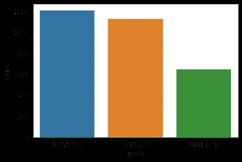

图 1:数据集的状态计数

数据集以 Excel 文件的形式出现，并以表格的形式很好地格式化。然而，数据集中确实存在各种问题，因此在进行任何分析之前，仍然需要进行大量的数据清理。不同类型的清洁方法举例如下:

(1)删除特征:一些列是重复的(例如，“状态 id”和“状态”)。有些列可能会导致信息泄漏(例如，“到期金额”为 0 或负数表示贷款已结清)。在这两种情况下，都需要删除这些功能。

(2)单位转换:在诸如“期限”和“建议的发薪日”等列中使用的单位不一致，因此转换在特征内应用。

(3)解决重叠:描述性列包含重叠值。如“5 万–9.9999 万”和“5 万–10 万”的收入本质上是一样的，需要结合起来才能一致。

(4)生成特征:像“出生日期”这样的特征对于可视化和建模来说太具体了，所以用它来生成一个新的更一般化的“年龄”特征。这一步也可以看作是特征工程工作的一部分。

(5)标注缺失值:部分分类特征存在缺失值。与数字变量不同，这些缺失值可能不需要估算。其中许多都是有原因的，可能会影响模型的性能，所以这里将它们作为一个特殊的类别来处理。

数据清理后，绘制各种图来检查每个特征并研究它们之间的关系。目标是在建模之前熟悉数据集并发现任何明显的模式。

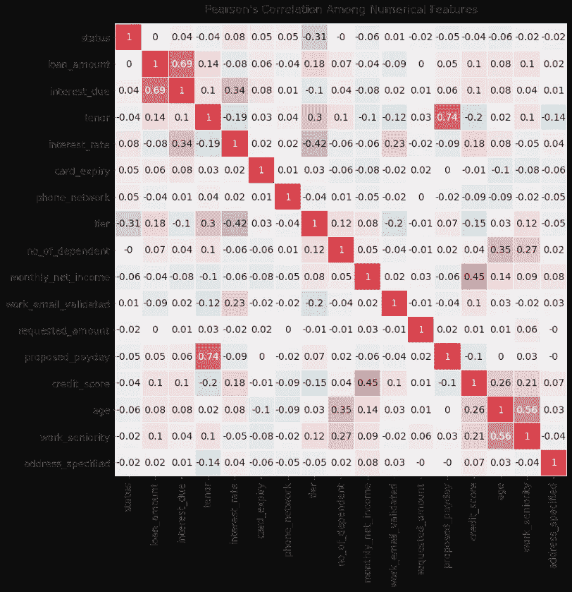

图 2:数值变量之间皮尔森相关系数的热图

对于数字和标签编码的变量，进行相关性分析。相关性是一种研究两个定量的连续变量之间关系的技术，以表示它们之间的相互依赖性。在不同的相关技术中，皮尔逊相关是最常用的一种，它测量两个变量之间的关联强度。其相关系数从-1 到 1，其中 1 代表最强的正相关，-1 代表最强的负相关，0 代表无相关。计算每对数据集之间的相关系数，并绘制成图 2 中的热图。

在热图中，借助颜色编码，很容易找到高度相关的特征:正相关关系用红色表示，负相关关系用红色表示。状态变量是标签编码的(0 =已结算，1 =过期)，因此它可以被视为数字。很容易发现，有一个突出的系数具有 status(第一行或第一列):-0.31 具有“tier”。Tier 是数据集中的一个变量，它定义了了解客户的程度(KYC)。数字越高，意味着对客户的了解越多，也就意味着客户越可靠。因此，有了更高的等级，客户拖欠贷款的可能性就更小了。从图 3 所示的计数图中可以得出相同的结论，其中第 2 级或第 3 级客户的数量在“逾期”状态下明显低于“已结清”状态下。

除了状态栏之外，其他一些变量也是相关的。等级与贷款金额、到期利息、期限和利率相关。等级较高的客户倾向于获得更高的贷款金额和更长的还款时间(期限),同时支付更少的利息。到期利息与利率和贷款额高度相关，与预期相同。较高的利率通常伴随着较低的贷款金额和期限。提议的发薪日与期限高度相关。在热图的另一边，信用评分与月净收入、年龄和工作资历正相关。受抚养人的数量也与年龄和工作年限相关。这些列出的变量之间的关系可能与状态(我们希望模型预测的标签)没有直接关系，但它们仍然是熟悉这些特征的良好实践，并且它们还可以用于指导模型规范化。

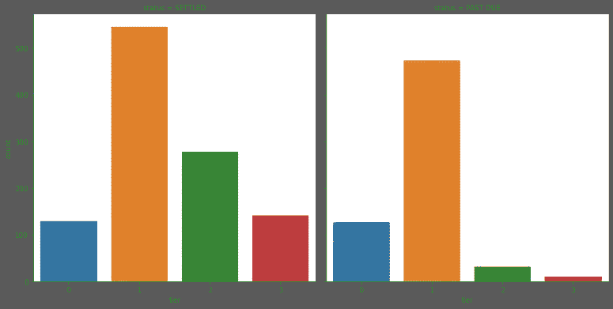

图 3:(非标准化)已结算(左)和过期(右)状态之间的层计数图。2 级或 3 级客户更有可能偿还贷款。

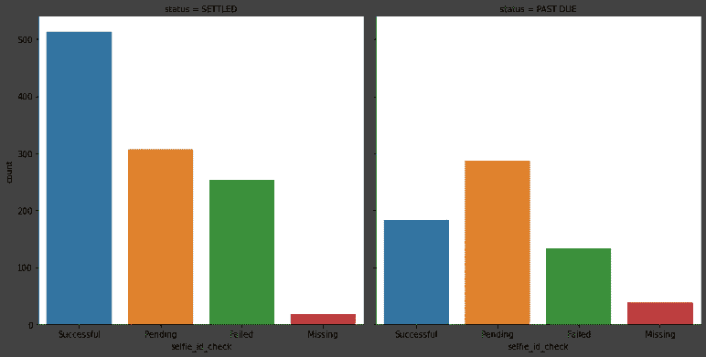

图 4:(非标准化)结算(左)和过期(右)之间的自拍 ID 检查计数图。成功检查自拍和身份证的客户更有可能偿还贷款。

分类变量不像数字特征那样便于研究，因为不是所有的分类变量都是有序的:Tier(图 3)是有序的，但是 Self ID Check(图 4)不是。因此，为每个分类变量制作了一对计数图，以研究它们与贷款状态的关系。一些关系非常明显:二级或三级客户，或者自拍和身份证被成功检查的客户更有可能偿还贷款。然而，还有许多其他分类特征不那么明显，因此，使用机器学习模型来挖掘内在模式并帮助我们进行预测将是一个很好的机会。

# 3.建模

由于模型的目标是进行二元分类(0 表示已结清，1 表示逾期)，并且数据集被标记，因此显然需要二元分类器。然而，在将数据输入机器学习模型之前，需要进行一些预处理工作(超出第 2 节中提到的数据清理工作),以概括数据格式并使其可被算法识别。

## 3.1 预处理

要素缩放是重新缩放数字要素的重要步骤，这样它们的值就可以落在相同的范围内。这是机器学习算法对速度和准确性的普遍要求。另一方面，分类特征通常不能被识别，所以它们必须被编码。标签编码用于将序数变量编码成数字等级，而一位热码编码用于将名义变量编码成一系列二进制标志，每个标志代表该值是否存在。

在对特征进行缩放和编码之后，特征的总数扩展到 165，并且有 1，735 条记录包括已结清和逾期贷款。然后，数据集被分成训练集(70%)和测试集(30%)。由于其不平衡，应用自适应合成采样(ADASYN)来对训练类中的少数类(过期)进行过采样，以达到与多数类(已解决)相同的数量，从而消除训练期间的偏差。

## 3.2 型号选择

有 6 种分类算法被选为模型的候选。k-最近邻(KNN)是一种非参数算法，它基于最接近的训练实例的标签进行预测。朴素贝叶斯是一种概率分类器，它应用贝叶斯定理，并假设特征之间具有很强的独立性。逻辑回归和线性支持向量机(SVM)都是参数算法，其中前者模拟落入任何一个二元类的概率，而后者寻找类之间的边界。Random Forest 和 XGBoost 都是基于树的集成算法，其中前者对记录和变量应用引导聚合(bagging)来构建多个决策树，这些决策树为预测投票，而后者使用 boosting 通过高效的并行算法纠正错误来不断加强自身。

所有这 6 种算法通常用于任何分类问题，并且它们是覆盖各种分类器家族的良好代表。然后，训练集通过 5 重交叉验证输入到每个模型中，这是一种在有限样本量下以无偏方式估计模型性能的技术。每个模型的平均精度如下表 1 所示:

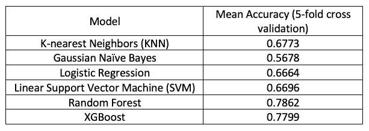

表 1:候选分类器的模型性能

很明显，所有 6 个模型在预测违约贷款方面都是有效的:它们都高于 0.5，这是基于随机猜测设定的基线。其中，Random Forest 和 XGBoost 的准确率得分最为突出。这个结果是意料之中的，因为 Random Forest 和 XGBoost 已经成为数据科学社区中最流行和最强大的机器学习算法有一段时间了。因此，其他 4 个候选被丢弃，然后仅使用网格搜索方法微调 Random Forest 和 XGBoost，以找到性能最佳的超参数。在微调之后，两个模型都用测试集进行了测试。精度分别为 0.7486 和 0.7313。这些值稍微低一点，因为模型以前从未见过测试集，并且事实上，精确度接近交叉验证给出的精确度，这表明两个模型都非常适合。

## 3.3 模型优化

即使找到了精度最好的模型，仍需要做更多的工作来优化我们应用的模型。模型的目标是帮助做出发放贷款的决策，以使利润最大化，那么利润与模型性能有什么关系呢？为了回答这个问题，在下面的图 5 中绘制了两个混淆矩阵。

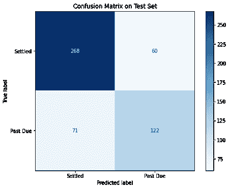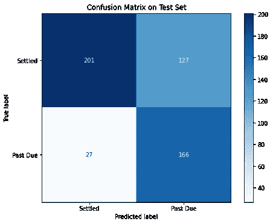

图 5:测试集上随机森林模型的混淆矩阵。顶部混淆矩阵使用阈值 0.5(默认)，底部混淆矩阵使用阈值 0.6。当提高阈值时，预计会有更多的过期欠款。

混淆矩阵是一种可视化分类结果的工具。在二进制分类问题中，它是一个 2 乘 2 的矩阵，其中列表示模型给出的预测标签，行表示真实标签。例如，在图 5(左)中，随机森林模型正确预测了 268 笔已结清贷款和 122 笔违约贷款。遗漏了 71 笔违约(第一类错误)和 60 笔良好贷款(第二类错误)。在我们的应用程序中，需要将错过的违约数量(左下角)最小化以避免损失，并且需要将正确预测的已结清贷款数量(左上角)最大化以最大化获得的利息。

一些机器学习模型，如 Random Forest 和 XGBoost，根据计算出的归入类别的概率对实例进行分类。在二进制分类问题中，如果概率高于某个阈值(默认为 0.5)，则将在实例上放置一个类别标签。阈值是可调的，它代表了进行预测的严格程度。阈值设置得越高，模型对实例的分类就越保守。如图 6 所示，当阈值从 0.5 增加到 0.6 时，模型预测的逾期总数从 182 增加到 293，因此模型允许发放更少的贷款。这在降低风险和节省成本方面是有效的，因为它大大减少了错过违约的数量，从 71 到 27，但另一方面，它也排除了更多的好贷款，从 60 到 127，所以我们失去了赚取利息的机会。

为了平衡收入减少和成本降低之间的权衡，必须通过调整阈值和寻求最优来解决优化问题。如果“已结清”被定义为正，而“逾期”被定义为负，那么通过使用图 6 中绘制的混淆矩阵的布局，四个区域被划分为真阳性(TN)、假阳性(FP)、假阴性(FN)和真阴性(TN)。与图 5 中绘制的混淆矩阵一致，TP 是优质贷款命中，FP 是违约错过。我们对这两个地区更感兴趣。为了标准化这些值，定义了两个常用的数学术语:真阳性率(TPR)和假阳性率(FPR)。它们的方程式如下所示:

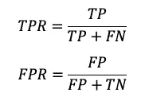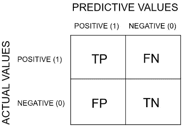

图 6:混淆矩阵布局[1]

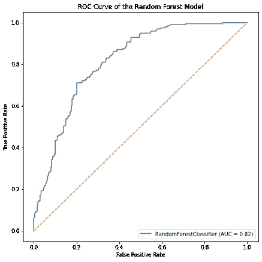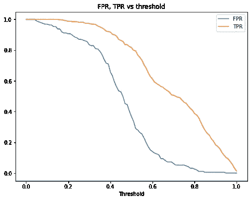

图 7:随机森林模型(上图)和 FPR 的接收机操作特性(ROC)曲线，TPR 对阈值图(下图)。TPR 和 FPR 之间的最大差距出现在大约 0.7 的阈值处。

在这个应用中，TPR 是好贷款的命中率，它代表从贷款利息中赚钱的能力；FPR 是缺失的违约率，它代表赔钱的几率。受试者操作特征(ROC)曲线是最常用的图表，用于显示分类模型在所有阈值下的性能。在左图 7 中，绘制了随机森林模型的 ROC 曲线。该图本质上显示了 TPR 和 FPR 之间的关系，其中一个总是与另一个方向相同，从 0 到 1。一个好的分类模型应该总是让 ROC 曲线高于红色基线，位于“随机分类器”旁边。除了准确性之外，曲线下面积(AUC)也是用于评估分类模型的度量。随机森林模型的 AUC 是 0.82，相当不错。

尽管 ROC 曲线清楚地显示了 TPR 和 FPR 之间的关系，但阈值是一个隐含变量。优化任务不能纯粹通过 ROC 曲线来完成。因此，引入了另一个维度来包含阈值变量，如图 7 右侧所示。既然橙色的 TPR 代表赚钱的能力，FPR 代表赔钱的几率，直觉就是找到尽可能扩大曲线间差距的阈值。在这种情况下，最佳点在 0.7 左右。

这种方法有局限性:FPR 和 TPR 是比率。即使他们擅长可视化分类阈值对进行预测的影响，我们仍然无法推断不同阈值导致的利润的准确值。另一方面，FPR TPR vs 阈值方法假设贷款相等(贷款金额、到期利息等)。)，但其实不是。拖欠贷款的人可能需要偿还更高的贷款金额和利息，这给建模结果增加了不确定性。

幸运的是，详细的贷款金额和到期利息可以从数据集本身获得。剩下的唯一事情就是找到一种方法将它们与阈值和模型预测联系起来。为利润定义一个表达式并不困难。假设收入完全来自已结清贷款的利息，成本完全来自客户拖欠的贷款总额，这两项可以使用 5 个已知变量计算，如下表 2 所示:

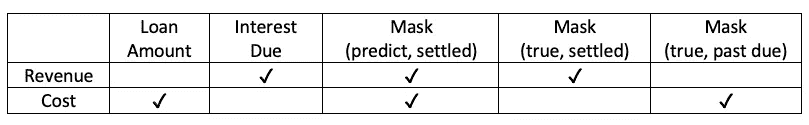

表 2:使用屏蔽技术计算收入和成本的向量

贷款金额和到期利息是数据集中的两个向量。其他三个掩码是二进制标志(向量)，它们使用 0 和 1 来表示特定记录是否满足特定条件。Mask (predict，settled)由模型预测结果制成:如果模型预测到待结算的贷款，则值为 1，否则为 0。因为预测结果不同，所以掩码是阈值的函数。另一方面，Mask(真，已结清)和 Mask(真，逾期)是两个相反的向量:如果贷款的真标签是已结清，那么 Mask(真，已结清)中的值是 1，反之亦然。

那么收益就是三个向量的点积:到期利息、掩码(预测，已结算)和掩码(真实，已结算)。成本是三个向量的点积:贷款金额、掩码(预测、已结算)和掩码(真实、逾期)。数学公式可以表示如下:

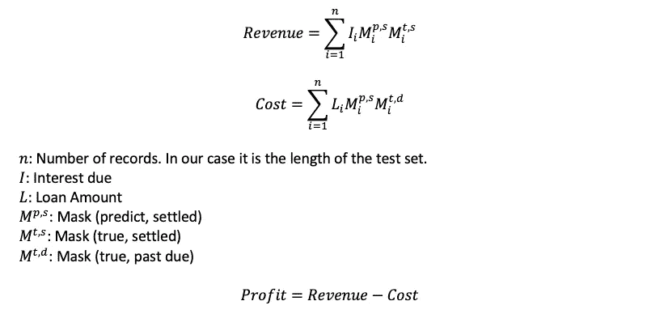

利润定义为收入和成本之间的差额，它是跨所有分类阈值计算的。随机森林模型和 XGBoost 模型的结果绘制在图 8 中。利润已经根据贷款数量进行了调整，因此它的值代表每个客户获得的利润。

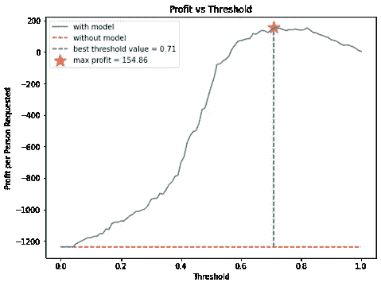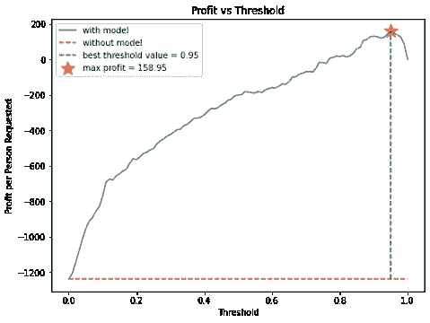

图 8:使用随机森林模型(上图)和 XGBoost 模型(下图)的利润与阈值。

当阈值为 0 时，模型达到最激进的设置，在该设置下，所有贷款都将被结算。它本质上是客户的业务在没有模型的情况下如何执行的:数据集只包含已经发放的贷款。很明显，利润低于-1，200，这意味着企业每笔贷款的损失超过 1，200 美元。

如果阈值设置为 1，该模型将成为最保守的模型，所有贷款都将违约。在这种情况下，不会发放贷款。既不会赔钱，也不会有任何收益，这导致利润为 0。

为了找到模型的优化阈值，需要定位最大利润。在这两个模型中，甜蜜点都可以找到:随机森林模型在阈值为 0.71 时达到最大利润 154.86，XGBoost 模型在阈值为 0.95 时达到最大利润 158.95。这两种模式都能够扭亏为盈，人均收入增加近 1400 美元。尽管 XGBoost 模型比 Random Forest 模型多增加了约 4 美元的利润，但它的利润曲线在峰值附近更陡峭。在随机森林模型中，阈值可以在 0.55 到 1 之间调整，以确保利润，但 XGBoost 模型只有 0.8 到 1 之间的范围。此外，随机森林模型中的展平形状提供了对数据中任何波动的鲁棒性，并将在需要任何模型更新之前延长模型的预期寿命。因此，建议将随机森林模型部署在 0.71 的阈值，以相对稳定的性能实现利润最大化。

# 4.结论

这个项目是一个典型的二元分类问题，利用贷款和个人信息来预测客户是否会拖欠贷款。目标是使用该模型作为工具，帮助做出发放贷款的决策。使用随机森林和 XGBoost 构建了两个分类器。这两种模式都有能力使每笔贷款扭亏为盈超过 1400 美元。由于随机森林模型具有稳定的性能和对错误的鲁棒性，因此更适合部署。

为了更好的特征工程，已经研究了特征之间的关系。诸如 Tier 和 Selfie ID Check 之类的特征被发现是确定贷款状态的可能预测因素，并且它们都在分类模型中得到了稍后的确认，因为它们都出现在特征重要性的顶部列表中。许多其他特征在影响贷款状态的角色上并不明显，因此建立了机器学习模型以发现这种内在模式。

有 6 种常用的分类模型可供选择，包括 KNN、高斯朴素贝叶斯、逻辑回归、线性 SVM、随机森林和 XGBoost。它们涵盖了各种各样的算法家族，从非参数到概率，到参数，到基于树的集成方法。其中，随机森林模型和 XGBoost 模型的性能最好:前者在测试集上的准确率为 0.7486，后者在微调后的准确率为 0.7313。

这个项目最重要的部分是优化训练好的模型，使利润最大化。分类阈值是可调整的，以改变预测结果的“严格性”:阈值越低，模型越激进，允许发放更多的贷款；随着门槛的提高，它变得更加保守，除非贷款有很高的偿还概率，否则不会发放贷款。通过使用利润公式作为损失函数，确定了利润和阈值水平之间的关系。对于这两种模式来说，都存在可以帮助企业扭亏为盈的最佳时机。如果没有该模型，每笔贷款的损失将超过 1，200 美元，但在实施分类模型后，企业能够利用 Random Forest 和 XGBoost 模型为每个客户分别创造 154.86 美元和 158.95 美元的利润。尽管使用 XGBoost 模型获得了更高的利润，但仍然建议在生产中部署随机森林模型，因为利润曲线在峰值附近更平坦，这带来了对误差的稳健性和对波动的稳定性。由于这个原因，如果选择随机森林模型，预计维护和更新会更少。

项目的下一步是部署模型，并在观察到更新的记录时监控其性能。无论是季节性的，还是性能下降到基线标准以下的任何时候，都需要进行调整，以适应外部因素带来的变化。对于这个应用程序的模型维护的频率并不高，但是如果模型需要以一种准确和及时的方式使用，那么将这个项目转换成一个在线学习管道并不困难，它可以确保模型总是最新的。

感谢您的阅读！如果你喜欢这篇文章，请**关注我的频道**和/或 [**成为我今天的推荐会员**](https://zhouxu-ds.medium.com/membership) (非常感谢🙏).我会继续写下去，分享我关于数据科学的想法和项目。如果你有任何问题，请随时联系我。

<https://zhouxu-ds.medium.com/membership>  

# 关于我

我是赛诺菲的数据科学家。我拥抱技术，每天都在学习新技能。欢迎您通过[媒体博客](https://zhouxu-ds.medium.com/)、 [LinkedIn](https://www.linkedin.com/in/zhouxu-ds/) 或 [GitHub](https://github.com/zhouxu-ds) 联系我。我的观点是我自己的，而不是我雇主的观点。

请看我的其他文章:

*   [使用 Berka 数据集进行贷款违约预测](/loan-default-prediction-an-end-to-end-ml-project-with-real-bank-data-part-1-1405f7aecb9e)
*   [利用空气质量传感器数据进行时间序列模式识别](/time-series-pattern-recognition-with-air-quality-sensor-data-4b94710bb290)
*   [使用 Python 和 Flask-RESTful 为机器学习模型构建 REST API](/build-rest-api-for-machine-learning-models-using-python-and-flask-restful-7b2cd8d87aa0)
*   [理解分类问题中的 Sigmoid、Logistic、Softmax 函数和交叉熵损失(对数损失)](https://medium.com/@zhouxu-ds/understanding-sigmoid-logistic-softmax-functions-and-cross-entropy-loss-log-loss-dbbbe0a17efb)
*   [使用 Elasticsearch (AWS OpenSearch)进行实时类型预测搜索](/real-time-typeahead-search-with-elasticsearch-aws-opensearch-88410d5b31a1)

# 参考

[1]:解码混淆矩阵，走向数据科学，2019:[https://towardsdatascience . com/Decoding-the-focus-Matrix-bb 4801 decbb](/decoding-the-confusion-matrix-bb4801decbb)