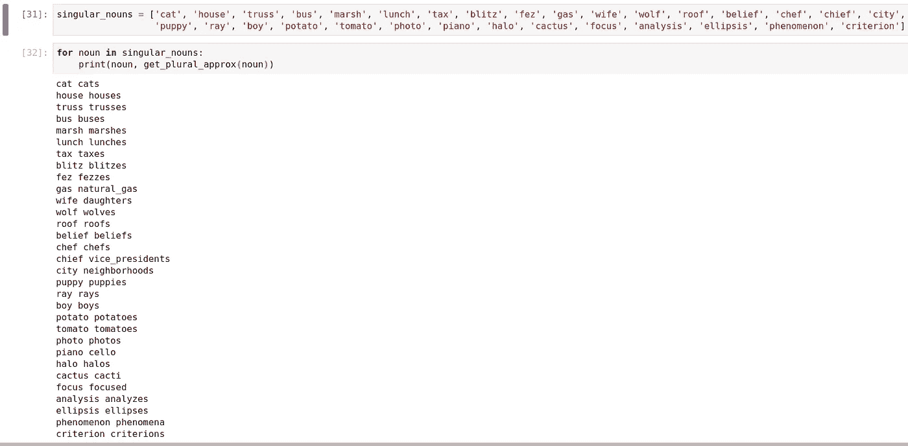

# 区分位置的散列和单数到复数名词的转换

> 原文：<https://towardsdatascience.com/locality-sensitive-hashing-and-singular-to-plural-noun-conversion-470a885d1331?source=collection_archive---------13----------------------->

## 使用在 Google 新闻数据集上训练的预训练向量从单个单词中找到多个单词

# 单数到复数的转换

## 小学记忆

在我的小学期间，我遇到了单数名词向复数名词的转换。我的教科书提供了一些转换的规则。例如，向常规名词添加“s”以转换为复数名词，如果单数名词以-s、-ss、-sh、-ch、-x 或-z 结尾，则添加“es”。记住规则并稍加练习会使规则变得自然——写作时，复数形式会自然出现。

在 [Unsplash](https://unsplash.com?utm_source=medium&utm_medium=referral) 上[摄影师 ende](https://unsplash.com/@fotografierende?utm_source=medium&utm_medium=referral) 拍摄的照片

## Word2Vec

现在，世界淹没在机器学习和数据中。新技术和突破总是不断出现，学习它们是如此有趣，尤其是为算法和算法本身提供动力的数学。机器学习领域的一个好玩的东西是 Word2Vec，用向量的形式表达单词。如果我们听到“书籍”这个词，首先想到的是一个实物。第二个概念可能是它的多元化。第三个概念可能是“教育”或“学习”。诸如此类。这种不同的概念或想法可以用不同维度的向量来表示，这个词的向量形式能够捕捉我们人类对这个词的理解。

我们这里要用 Word2Vec 把单数名词转换成复数名词。单数/复数是一个词的重要概念。因此，希望 Word2Vec 模型抓住了这个想法，我们可以将其用于转换。我们使用的是在谷歌新闻数据集(约 1000 亿字)上训练的预训练向量。该模型包含 300 维向量，包含 300 万个单词和短语。关于我们正在使用的预训练模型的更多细节可以在[这里](https://code.google.com/archive/p/word2vec/)找到。

## 带单词的向量代数

因为单词被表示为向量，所以我们可以在单词中进行向量代数运算来导出新单词。单词“man”变成了复数*产生了单词“men”。*

所以，“男人”+ *复数=* “男人”

那意味着:*多数* =“人”——“人”

现在，让我们把“书”变成复数。

“书”的复数形式=“书”+ *复数=* “书”+“人”-“人”… (I)

我们可以查找单词“book”、“men”和“man”的向量形式，并将它们插入(I)中，以找到“book”的复数形式的向量形式。得到的向量可能在向量列表中找不到，所以我们可以寻找最相似的向量并返回相应的单词。那个单词是基于 Word2Vec 模型的“book”的复数形式。很有趣，不是吗？

我们用一个**的例子**来试着理解一下。

假设我们在嵌入中有六个单词，它们是详尽的。这些词是:“书”、“书”、“人”、“人”、“根”和“树”

我们找到复数形式“book”的向量形式，并将其与单词“books”、“root”和“tree”的向量形式进行比较。最有可能的是,“书籍”向量形式具有最高的相似性。我们可以使用这样一种贪婪的方法来寻找最相似的单词，从而得到复数形式。但是，如果详尽的列表包含数百万个单词，就像谷歌新闻数据集嵌入的情况一样，该怎么办呢？谷歌新闻数据集模型包含 300 万个单词和短语的嵌入。手术将会很昂贵。

## 局部敏感散列法

这就是为什么我们要使用“局部敏感散列法”。位置敏感哈希是一种数据独立的算法技术，以很高的概率在同一个桶中哈希类似的项目。所以，我们很有可能将相似的单词分组到同一个桶中。例如，像男孩、人、女孩、人这样的词可能被分组在同一个桶中。在这里，桶的数量比项目的数量(在我们的例子中是单词和短语)小得多。该技术用于数据聚类和最近邻搜索。在我们的例子中，我们使用这种技术进行最近邻搜索。在将相似的项目分组到同一个桶中之后，我们可以在桶内搜索以获得近似的最近邻居，而不是在整个元素宇宙中搜索。这将节省我们大量的计算。该技术与数据无关，因为我们随机进行分区，而不考虑数据分布。

*与传统哈希技术中冲突最小化不同，这种哈希技术中冲突最大化。*

因此，在我们的情况下，我们使用随机超平面将 300 维向量空间划分成许多分区。创建多个分区后，我们给每个分区一个索引。然后，在对一个向量进行最近邻搜索时，我们首先找到该向量所在的分区，然后只在该分区中进行搜索。这种方法将为我们节省大量的计算时间，而只需牺牲一点点精度。让我们看看我们的计算时间会减少多少。

假设有 *n* 个元素，我们使用 *h* 个超平面。

因此，这将产生大约*个 2^h* 个分区。

现在，一个分区中元素的数量大约是 n / (2^h).如果我们只有五个超平面，计算将减少 32 倍！

然而，这可能会使我们冒着选择不是最相似项目的风险——因为我们的点可能在边界附近，而最相似的项目在另一个分区中。因此，我们独立地进行多次散列，并在分区列表中进行搜索。这意味着搜索空间将是所有独立分区的组合。那会产生更好的结果。即使我们做了 5 次哈希运算，我们的算法仍然快了 5/6 倍！

让我们看看代码中的操作。

# 密码

## 类似

可以使用不同类型的度量来定义两个向量之间的相似性。我们将在这里使用的度量是*余弦相似度*。余弦相似性源于两个向量之间的角度。如果两个向量共线或平行且方向相同，则余弦相似度最大(值为 1)。这意味着向量非常相似。所以，我们先定义一下*余弦 _ 相似度*函数。

## 超平面

现在，让我们创建一个平面矩阵列表。列表中的每个元素都是由空间划分超平面组成的矩阵。这里，超平面由法向量表示，所以我们只在超平面中创建随机向量。要注意的是，所有的超平面都经过原点。在我们的例子中，由于字向量的维数是 *300* ，我们创建随机法向量如下:

## 相对于超平面的位置

现在，我们可以通过在点和平面的法向量之间做点积来知道点位于超平面的哪一侧。如果为零，则该点位于超平面上，正/负值意味着它们落在超平面的任一侧。我们找到该点位于超平面的哪一侧，并以二进制格式对信息进行编码。然后，我们将其转换成十进制数字格式来创建索引。所有分区方案的索引列表放在一个列表中，并由*get _ indexes*函数返回。

## 分割

现在，我们使用下面的代码创建分区。我们使用 *defaultdict* 数据结构将数据存储在分区中。这可能需要一些时间，但这是一次性的计算步骤。

## 复数词/名词的近似值

当我们试图找到单词的复数形式时，我们创建了*get _ plural _ approximate*函数来获得单词的近似复数形式。在该函数中，计算出的多个单词向量的位置相对于分区被找到。然后，将该向量与分区中的所有其他向量进行比较。对以上定义的多个划分方案进行该过程，并且从所有划分方案中选择最相似的向量。这是近似最相似的向量，从而产生相应的复数单词。

## 测试

现在，我们使用 Grammarly 的单复数转换[博客](https://www.grammarly.com/blog/plural-nouns/#:~:text=Plural%20Noun%20Rules,-There%20are%20many&text=The%20correct%20spelling%20of%20plurals,the%20singular%20noun%20ends%20in.&text=1%20To%20make%20regular%20nouns,add%20%E2%80%91s%20to%20the%20end.&text=2%20If%20the%20singular%20noun,end%20to%20make%20it%20plural.)中给出的单词来测试单复数转换，并查看我们的模型的准确性。请注意，我们没有采用像 sheep 这样的单词，因为它们具有相同的单/复数形式。这是因为，在我们的实现中，我们跳过了这种类型的公式。

正如我们所见，我们的算法使 *74%* 的转换正确。令人印象深刻，不是吗？

# 学习更多知识的动力

也许一个小学生在测试例子中找到复数形式时击败了我的模型。无论学生是否记住或知道单数到复数的模式，失败就是失败。这个学生提醒我继续改进我的单复数模型，并学习其他可以使模型更好的技术。所以，这是探索机器学习技术的又一个理由，并对其中发生的数学游戏感到有趣；)

如果你知道任何其他技术来改善这个模型或任何其他东西，我很乐意看到你的评论。保持快乐，保持健康！:)