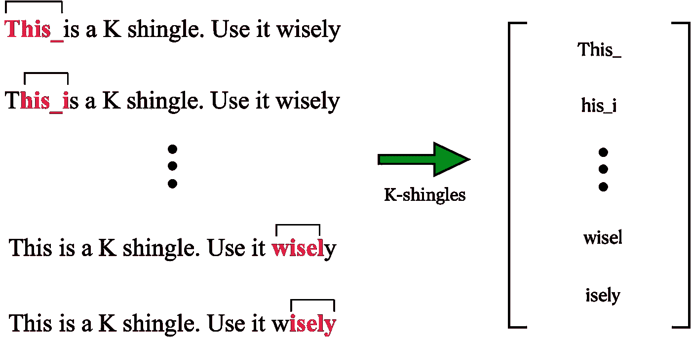
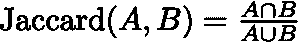
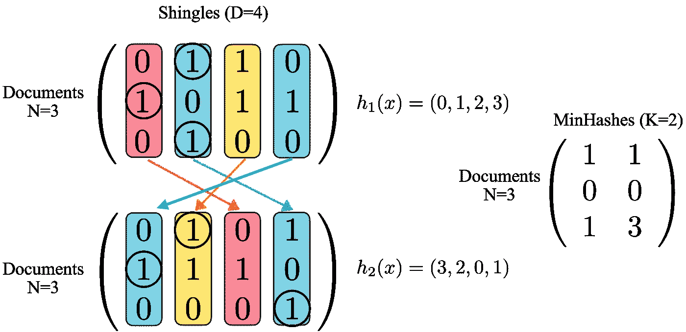
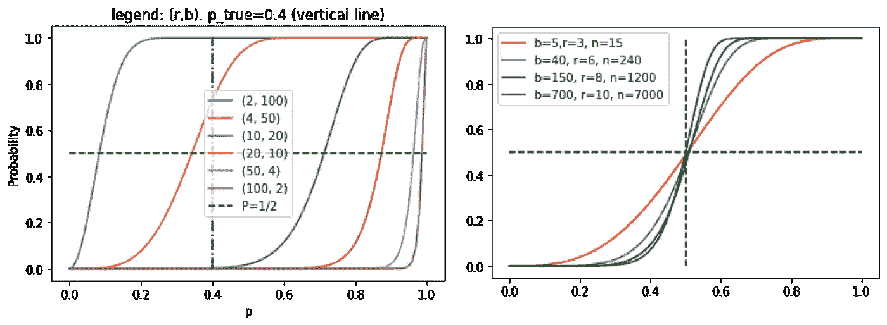
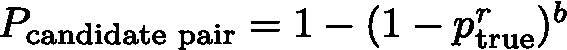
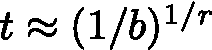
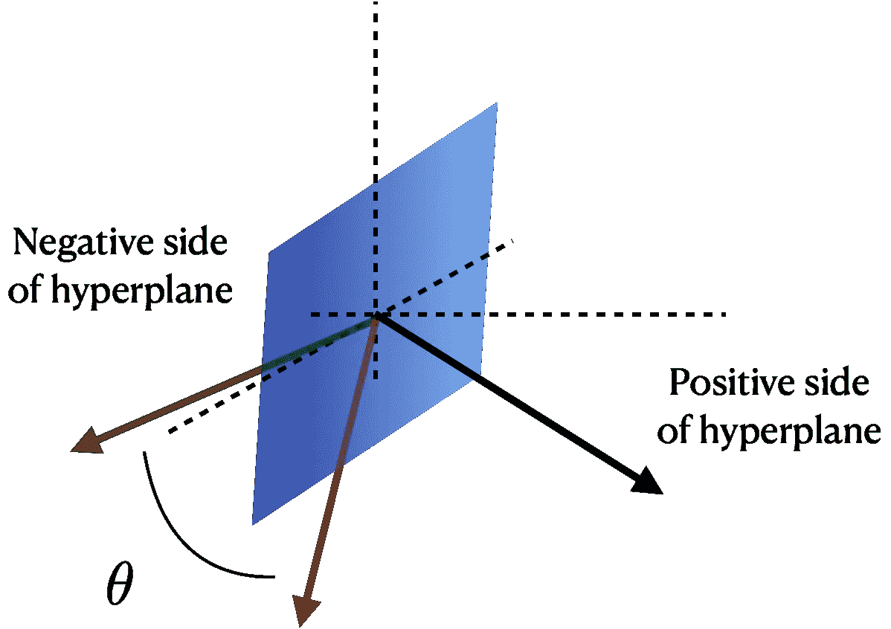

# 位置敏感散列法:如何在一个大集合中精确地找到相似的项目

> 原文：<https://towardsdatascience.com/locality-sensitive-hashing-how-to-find-similar-items-in-a-large-set-with-precision-d907c52b05fc?source=collection_archive---------2----------------------->

## [实践教程](https://towardsdatascience.com/tagged/hands-on-tutorials)

## 我们提供了一个实践指南，介绍了将局部敏感散列技术应用于文档比较和向量相似性任务的方法。

在 [Unsplash](https://unsplash.com?utm_source=medium&utm_medium=referral) 上 [Miikka Luotio](https://unsplash.com/@mluotio83?utm_source=medium&utm_medium=referral) 的照片

*关于附带的 guided jupyter 笔记本，以及解释和准备运行的代码，请参见以下资源库:*[https://github . com/Jmkernes/Locality-sensitive-hashing-tutorial](https://github.com/Jmkernes/Locality-sensitive-hashing-tutorial)

*这篇文章的灵感来自于杰夫·厄尔曼、朱尔·莱斯科维克和阿南德·拉贾拉曼的优秀著作《挖掘海量数据集》，该书可在网上免费获得:*[http://www.mmds.org/](http://www.mmds.org/)

> *在阅读之前激励你，到这一步结束时，你将能够执行快速的文档相似性搜索，在庞大的语料库中找到相似的单词嵌入，甚至有足够的勇气去尝试理解* [*改革者，一个基于 LSH 的注意力模型*](https://arxiv.org/pdf/2001.04451.pdf) *来处理非常大的序列。*

任何上过学的人都记得“团体项目”。当老师意识到他/她可以只给报告的一小部分评分而不受惩罚的时候，所有这些都是为了促进团队合作。不管你喜欢还是讨厌这个团队项目，总会有一个时候你必须做出一个非常重要的决定(或者这个决定是为你而做的)。

你和谁搭档？

谢天谢地，这是一个很容易解决的问题(从逻辑上来说，不能保证你不会有一个噩梦般的队友)。除非你的学校是一个真正的鱼群，否则你的班级可能不超过 50 名学生，也就是说最多有 1250 对可能的组合。了解一点你的学生的个性，有理由认为你可以在一堂课上把每个人配对。

但是当你的班级规模变成 100，1000，10000，*100 万*学生时会发生什么？相似的同学怎么配对？好吧，你读了一个博客，转到了本地敏感哈希*警告:虽然这是关于寻找匹配，但它与改善一个人的爱情生活无关…

位置敏感哈希(LSH)是在大型数据集中查找相似对的过程。对于大小为 *N* 的数据集，比较每一个可能对的强力方法将花费 *N！/(2!(N-2)！)~ N /2 = O(N )* 时间。LSH 方法旨在将这一时间缩短到 ***O(N)*** 时间。

假设我们有一个由*文档组成的数据集。在第一部分，这些实际上是文档:新闻文章、网页等。在后半部分，一个*文档*将只是一个 *D* 维向量。*

你可能会遇到两个问题。

1.  你有合理数量的文档，但是那些文档真的很长(第一部分重点讲这个)。
2.  你有合理长度的文档，但是你有太多的文档，以至于你一手造成了文档市场的膨胀。

我们将首先关注场景一。为了量化文档，我们需要对其进行矢量化。一种方法是枚举其所有的 k 瓦片区**。一个 **k 字母组**就是文档中出现的任何 *k 个*连续字符。实际上，选择 5–7 可能就足够了。一个文档由它的一组 k-瓦片区定义(因此我们丢失了所有 k-瓦片区的频率信息)，可以通过运行如图所示的滑动窗口找到它:**

来源:当前作者

为了向量化我们的文档，我们首先为我们所有的文档找到 K-瓦片区。然后，我们创建一个由 K 个瓦片区组成的大集合，并为每个瓦片区分配一个唯一的索引。给定的文档现在通过将它表示为二进制向量 ***、*** 来进行矢量化，二进制向量是 0 和 1 的高维向量，每出现一个 K 瓦片区就有一个 1。

很好，现在我们有了一个高维的矩阵 *(N，D)**，*，其中 *N* 表示文档的数量，而 *D* 是一个巨大的数字，等于唯一 K-带状疱疹的总数。我们绝对不想使用矩阵的密集表示！

**Jaccard 相似性(交集超过并集)**

在移动之前，我们需要实际定义一个相似性度量。我们可以使用 Jaccard 相似性(也称为交集超过并集)，这是一种比较任意两个集合的相似性的度量。这个定义非常简单，几乎不值得一写:

所以集合 A = {1，2，3}和 B = {2，3，4}的相似度将是 2/4 = 0.5。1 分是满分，0 分是完全不及格。有了这些，我们现在可以陈述我们的目标:

> 给定 N 个文档的列表，每个文档由一个 D 维二进制向量表示，找出 Jaccard 相似度高于某个阈值 t 的所有文档对

那么，我们怎样才能做到这一点，而不需要明确地写下那个 *(N，D)* 矩阵呢？MinHashing，就是这样。

**敏哈希**

最小化的想法看似简单。为了比较两个向量，我们取以下过程的期望值:将 A 和 B 的索引随机混洗在一起，如果第一个非零对是(1，1)，则返回+1，否则返回 0。

示例—假设我们有 A = {1，0，0，1}和 B = {0，0，0，1}。如果这些已经被打乱，第一个索引将是 A[0]=1，B[0]=0。其中至少有一个非零，所以我们可以使用它。一个[0]！=B[0]这意味着两者不相似，我们返回 0。也许第二次洗牌给出 A={0，0，1，1}，B={0，0，1，0}，那么我们得到 A[2]=B[2]！=0，这是一个+1。最终，如果你洗牌的次数足够多，你会发现相似性接近 0.25 的真实值。

这样做的原因很简单:如果你在集合 A 中找到一个 1，那么有可能 B 也有一个 1，反之亦然( *p* 是真正的 Jaccard 相似度)。真的，就是这样。

这是一个*近似*方法，因为它只产生一个预期的相似性值。当然，更多的数据意味着更准确的相似度得分。哈希的数量是一个常数，因此不包括在本文开头的计算成本中。

通用哈希:

*   一种简单有效的生成 hash 的手段是:在区间*【0，D】*生成两个随机数 *a* 和 *b* ，返回 *hash(x) = (a*x+b) mod D，*其中 *x* 是我们要置换的索引*。*我们通过随机选择 *a，b 来生成新的哈希。*

**签名矩阵:**

我们现在到了问题的关键。我们计算一个 *(N，K)* **签名矩阵**，其中 *K* 是随机散列函数的数量，这将允许我们对 *K* 维向量与 *D 维*向量进行比较，这是一个重大的胜利！签名矩阵的每一列对应于一个随机散列函数。对于该列中的每一行，该值由该行的第一个非零元素的索引给出(即最小散列)。

来源:现作者。我们执行两种置换，由 h 函数给出。这些数字表示原始索引，它们的位置表示它们被置换到的位置。h_1 是一个恒等式(不做任何事情)。黑色圆圈表示第一个非零条目，从左到右移动(最小散列)，以及该索引如何映射到签名矩阵。

详见上图。为了编写一个有效的算法，我们实际上不需要置换所有的行。相反，只需要查看(N，D)密集矩阵的每个元素，看看它是否有 1，如果有，条目的任何排列是否导致新的最小散列。通过计算(N，D/chunk_size)个块的签名矩阵，然后取每个条目的全局最小值，这可以进一步针对真正大的 D 进行并行化。下面是算法(非分块版本):

HashManager 是一个可调用的类，它将生成随机散列函数，然后应用它们来创建签名矩阵。核心在 __call__ 方法中。

我们现在可以像使用完整的(N，D)矩阵一样执行比较，但是现在使用更紧凑的(N，K)签名矩阵！可惜这还是一个 *O(N )* 的成本。一个简单的解决方案可能是说“好吧，我们就说任何两行有相同的条目是相似的怎么样？”当然，这保证能让你得到*精确的*匹配，但是我们无法知道真正接近但不精确的东西会发生什么。为了做到这一点，我们使用了大枪:位置敏感散列法

**区分位置的哈希算法。波段结构程序。**

任何听到“能带结构”这个术语的人，都会回想起一堂充满对称群和 1500 页 Ashcroft 和 Mermin 的老式固态物理课；我向你保证，这不是那个。不要害怕。对于那些不知道我在说什么的人，要为此而感激。

直觉是这样的:与其比较每一对元素，不如我们将它们散列到桶中，希望映射到相同桶的元素将是彼此“接近”的正确级别。“接近”的程度正是我们前面介绍的期望的相似性阈值。现在，我们只需要一种方法来找到这样一个神奇的哈希函数。

> * *半技术性定义——位置敏感哈希是指一系列函数，我们可以通过调整这些函数，使彼此靠近的点变得更近(根据某种距离度量),而不靠近的点变得更远，概率接近 1

我们不会证明 Jaccard 相似性是合适的度量，也不会证明 MinHashing 是 LSH 家族；我们将只描述这种技术。我们用下面的**波段法**。

**警告:符号略有变化* *

我们现在将说 *n* 是散列函数的数目，即签名矩阵的维数 *K* 。还要定义:

*b* 为*波段的数量*

*r* 为每个条带的*行数*

很明显 *n=b*r.*

现在我们做出以下明智的决定。

> 如果两行具有**至少** **一个**带，其中所有行都相同，则这两行被认为是**候选对**(意味着它们有可能具有高于期望阈值的相似性得分)

换句话说，我们之前做了一些幼稚的事情，寻找行之间的*精确的*相似性(一种简单的散列方法)，但是现在我们给每一行 *b* 可能的机会。所以我们将每一行散列到 *b* 桶中，看看它与谁匹配。

希望 *b* 和 *r* 背后的直觉在这里有意义；增加 *b* 给了行更多匹配的机会，所以它让具有较低相似性分数的候选对进入。增加 *r* 使得匹配标准更严格，限制到更高的相似性分数。 *r* 和 *b* 做相反的事情！

就像一个蹒跚学步的孩子在做实验，或者你的公司办公室试图平衡暖气和空调，如果我们同时调高 r 和 b 会发生什么？精准。事情就是这样。这比现代工业空调要好得多，对环境也更好。

来源:现作者。x 轴是任意两行之间的**真实相似度 p** 。y 轴是相似度为 p 的行成为**候选对**的概率。左图:在保持 n 不变的情况下，增加/减少 b 和 r 的效果。右，在 b 和 r 的固定比例下增加 n 的效果；它趋向于阶跃函数。

那不是很美吗？我们发现，我们可以精确地调整参数 *b* 和 *r* ，这样我们就可以将候选对的可能性(y 轴)转化为围绕我们期望的阈值(x 轴)的阶跃函数。这意味着几乎 100%的机会找到相似度高于阈值的行，100%的机会丢弃相似度低于阈值的行。

那是 LSH。

那么为什么会出现这种阶梯函数呢？可以通过考虑给定 *b* 桶和 *r* 行的匹配概率来推断。我们找到了公式(详见笔记本)

这是我们将两行标记为候选对的概率，假设它们的真实相似性得分为 p_true。解决了这个问题之后，是时候给出这篇文章中最重要的实用公式了。

## *给定一组参数 b 和 r，转变点 t 将近似为*

如果我们想调整我们的 LSH 程序，只选择相似性得分≥ t 的候选人，那么我们应该:

*   选择 *b* 和 *r* 以便上面的等式满足我们想要的 *t*
*   在不增加太多计算时间的情况下，使 *b* 和 *r* 尽可能高。

为了总结这一节，这里有一个代码实现

**第二部分:欧几里德域中的 LSH(即寻找相似的实值向量)**

现在我们已经有了主要的理论，这一部分将会很快。可以看出，余弦相似性得分在欧几里得空间中引入了度量。度量就是两个向量之间的角度(下图中的θ)。

通过考虑一族随机超平面，我们可以产生一族与余弦相似相容的 LSH 函数。超平面被定义为垂直于其法向量的所有点的集合(蓝色平面垂直于其法向量，黑色箭头)，因此只需定义一组随机的*向量*就足够了。LSH 函数现在如下

> 通过它的法向量定义一个随机超平面。如果两个向量位于超平面的同一侧，则称它们相似，这意味着法线与向量的点积具有相同的符号。在这种情况下，返回值 1，否则为 0。相似性是随机超平面上的期望

来源:现作者。绿色和红色箭头表示我们想要比较其相似性的两个向量。黑色箭头是诱导随机超平面(蓝色平行四边形)的随机向量。在这种情况下，蓝色和红色箭头位于平面的相对两侧，因此被认为是不同的(值为零)。

还是那句话，一切都和以前一样。我们可以定义波段和行，并调整我们的 LSH 函数，使我们正好达到我们想要的阈值。

向量的情况实际上要简单得多，因为我们可以通过创建一个随机(N，D)矩阵，在一行中自己生成数据。在从绑定签名矩阵到计算哈希桶数的步骤中，我们还可以做一个额外的简化。

由于随机超平面过程的结果产生了二进制签名矩阵，我们可以使用下面的技巧容易地散列这些箱。对于给定的行，我们希望散列一些二进制向量，如(1，1，0，0，0，1，1，0，1)。我们可以不创建一个 *r-* 维元组来散列，而是将这个二进制向量转换成一个整数，将它视为二进制数 110001101。这种转换可以用矩阵乘法来完成，注意到数字每左移一次，我们就得到 2 的另一次幂。

向量(1，0，1，1)等于 1*2 + 0*2 + 1*2 + 1*2⁰，相当于点积(1，0，1，1)。(2 , 2 , 2 , 2⁰).因此，我们可以通过矩阵乘法 Band@2^(range(b)).很容易地将带放入散列桶中简单！LSH 实现如下:

# 结论

在这篇文章中，我们介绍了本地敏感哈希(LSH)的基础知识。你需要知道的主要事情是，LSH 是一个在非常大的数据集中寻找相似项目的过程，它可以在 O(N)时间内运行。相似是故意含糊的，有很多方法可以使用 LSH

这里，我们举例说明两个常见的问题:找到相似的文档和找到相似的向量。文档相似性使用 Jaccard 相似性和 k-瓦片区的组合来构建文档的稀疏二进制表示，JAC card 相似性度量两个集合的重叠。对于向量相似性，我们使用余弦相似性度量和随机超平面的方法来快速找到相似向量。

只要你有一个相似性度量和一族 LSH 函数，你就可以执行 LSH。调优时要记住的关键事项是:

1.  增加波段数以降低相似性阈值
2.  增加每个波段的行数以提高相似性阈值
3.  提高 n=rows*bands 以获得更精确的查询。越多越开心。
4.  你总是可以手动检查 LSH 候选对，以消除误报，但对于误报没有等效的技巧。

借助 LSH 的力量，你现在可以做很多事情，比如在网上搜索文档，在大型语料库中寻找相似的嵌入向量，甚至查看 LSH 改革者 https://arxiv.org/pdf/2001.04451.pdf 的内部工作方式，这是一种可以处理 huuuge 序列的高效注意力模型。

这就结束了。

同样，请访问我的 github 链接中的笔记本:

<https://github.com/Jmkernes/Locality-sensitive-hashing-tutorial>  

在那里，您将找到完整的代码，以及额外的测试示例和比较。您还可以试验一下 b 和 r 参数，看看它变化了多少。我们发现 LSH 在 N=1000 和 D=50 的随机欧几里得向量问题上获得了 25 倍的加速。不算太坏。

感谢阅读！