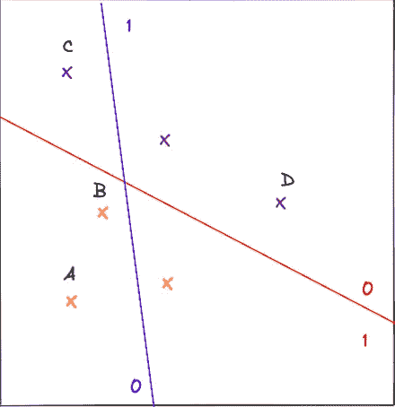
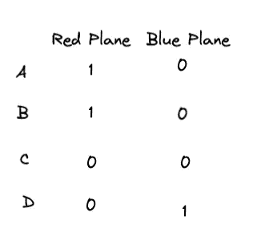
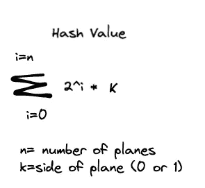
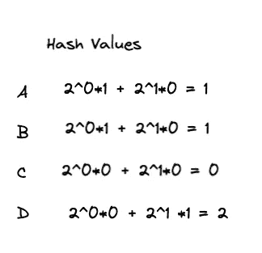
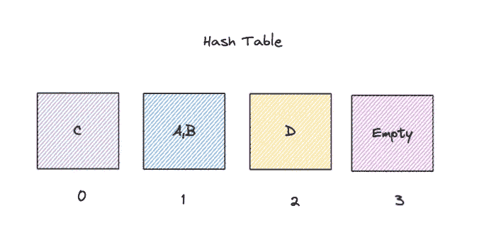
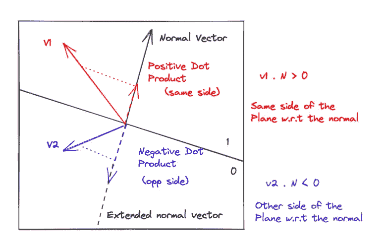
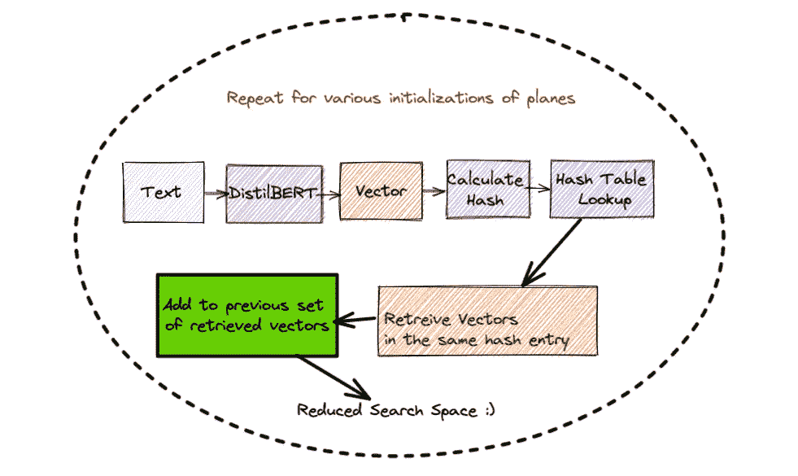

# 自然语言处理中的位置敏感哈希算法

> 原文：<https://towardsdatascience.com/locality-sensitive-hashing-in-nlp-1fb3d4a7ba9f?source=collection_archive---------12----------------------->

## 这是一个实践教程，介绍如何通过区域敏感散列法(LSH)减少搜索空间来加速文档检索


马库斯·温克勒在 [Unsplash](https://unsplash.com?utm_source=medium&utm_medium=referral) 上的照片

# 眼前的问题

在我最近的一个[项目](https://github.com/rajlm10/Pharmacat)中，我需要分析类似于病人投诉的医疗问题是否在早期得到了诊断和记录，以及这些投诉表明了什么疾病。为了将当前患者的症状和问题与过去的其他记录进行比较，我需要将当前的问题文本与数据集中的所有其他文档进行比较，并找出最相似的文档。对于 n 个项目，这将涉及与当前文档的 n 次比较。而且，我用 **DistilBERT** 对这些句子进行了编码；因此，比较(余弦相似性)也与这些文档的嵌入维度(768)成比例。*我使用过的医学数据集在这里* *可用* [***。*这是数据的样子。**](https://archive.ics.uci.edu/ml/datasets/Drug+Review+Dataset+%28Drugs.com%29)

# 我们能改进传统搜索吗？

如果我们能够以某种方式减少搜索空间，而不是将向量与所有文档进行比较，这不是很好吗？这正是位置敏感哈希(LSH)帮助我们做的。下面是我们如何使用 LSH 来减少搜索空间。

# LSH 使用超平面背后的直觉



使用线条分割搜索空间(图片由作者提供)

在上图中，我们有用“X”表示的各种数据点。假设我们想要找到与点 A 最相似的点**。首先，我们 ***随机*** 画两条线**(红蓝线)。现在我们可以看到一个数据点相对于每条线的位置。数据点可以在线的 0 侧，也可以在线的另一侧(1 侧)。首先，我们找出所有数据点相对于两条线的位置。请注意，为了减少混乱，我在下表中只显示了 4 点。更重要的是，由于我们的设置是二维的，我用了一条 ***线*。在更高维度中，这些线类似于超平面。** *更正式地说，在 n 维设置中，超平面由(n-1)维组成。*****

这是我们当前设置在表格中的样子



点相对于平面的位置(图片由作者提供)

从表中，我们可以看到 A 点和 B 点位于两个平面的同一侧。我们需要量化这个表，并给每个点分配一个哈希值。下面是散列值的计算方法。



哈希值(作者图片)

下面是我们将这个公式应用到我们的环境中得到的结果。



哈希值(作者图片)

我们可以看到，点 A 和 B 具有相同的哈希值，因此如果我们要构建哈希表，它们将位于相同的条目(哈希桶)中。**简单来说，哈希表是允许即时查找的数据结构**。它们大多是通过 Python 中的字典实现的，其中键是哈希值，字典值是我们的向量(数据点)。让我们用上面的 4 点构建一个散列表。



哈希表(作者图片)

现在我们可以清楚地看到，A 点和 B 点在哈希表的同一个条目中。这表明这些点是相似的。**如果我们想要找到与点 A 相似的点，我们需要做的就是查看与点 A 具有相同哈希值的点。**这种简单的直觉在实践中非常有效，但是在继续实施之前，我们必须讨论一些技术细节。

# 我如何确定飞机的数量？

在上面的简单设置中，我们随机画了两条线，但是当我们有更多的数据时，我们该怎么办呢？在飞机数量和速度之间有一个折衷。我们的飞机越多，处决 LSH 的时间就越长。下面是如何计算出要使用的飞机数量。

**当我们有 n 个文档(或 n 个向量)时，我们希望每个散列条目(桶)不超过 16 个向量。在这种情况下，我们需要 n/16 个桶。现在每个平面将搜索空间分成两部分(同侧和相对侧)。因此，如果我们有 p 个平面，我们希望 2^p 等于 n/16。求解 p，我们可以找到飞机的数量。**注意，可以根据问题和搜索空间的大小而改变，理想情况下，应该尝试不同的值，看看什么能给我们最好的结果。

# 用数学方法确定向量位于平面的哪一侧

上面我已经手动指示了两边。在更高维度中，**点积帮助我们确定一个向量相对于平面位于哪一侧。每个平面都有一个法向量，一个垂直于平面上所有点的向量。我们必须取一个矢量，计算它与法向量的点积，看它在平面的哪一边。非负的点积表示它位于法线的同一侧，负的点积表示它位于法线的相反侧。**一般情况下，表示为 Ax+By+Cz=D 的平面具有法线< A，B，C >。****

这里有一个简单的图表来帮助你形象化这个过程。



确定向量相对于超平面的位置(作者图片)

在上图中，我们可以看到向量 V1 位于平面的一侧，而向量 v2 位于平面的另一侧。

# 通过创建多个哈希表来提高准确性

因为我们随机生成平面，所以可能将一些相似的向量分配给不同的桶。为了最小化这种随机性的影响，我们可以用不同的平面创建多个哈希表。在搜索向量时，我们可以在所有这些哈希表中寻找具有相同哈希值的向量。这将相对增加搜索空间，但大大提高准确性。 **( *注*:搜索空间仍然比原来的搜索空间小很多)。**在代码中，我创建了 25 个哈希表。

# 让我们开始吧！

在我们开始之前，这是我们的代码将要表示的。另外，请注意，我没有展示完整的代码，因为它很冗长。**随意查看全部代码** [***这里***](https://jovian.ai/rajbsangani/nlp-pharmacat) **。**



代码的可视化概述(图片由作者提供)

## 1.使用 [**DistilBERT**](https://medium.com/huggingface/distilbert-8cf3380435b5) 将整个文本数据集编码成矢量(768 维)。

## 2.确定要使用的飞机数量。同样，设置哈希表的数量(用 n_repeats 表示)

## 3.现在，随机生成平面并创建一个函数来查找向量的散列。

```
*#Generate 11 planes randomly. This gives us a 768 X 11 dimensional matrix*
planes_l = [np.random.normal(size=(embedding_dims, n_planes)) for i in range(n_repeats)]
print(len(planes_l))
planes_l[0].shape
```

## 4.现在，创建多个哈希表以提高准确性

## 5.创建一个函数，将问题文本作为输入，并使用 LSH 找到与之相似的向量

***注意我们是如何针对所有 25 个哈希表*** 添加具有相同哈希值的潜在候选项作为我们的查询向量的

## 6.从这个简化的向量集中，使用余弦相似度找到三个最相似的向量

## 7.在 LSH 之后，比较使用整个搜索空间和使用缩小的搜索空间的结果

*这是我们的查询向量，我们希望找到包含类似投诉和情况的历史文档。*

**这里是使用整个空间的搜索**

**这是 LSH 之后使用缩减空间的搜索**

哇，我们得到了完全相同的结果，但是用的时间却少得多！我们将墙壁时间从 576 毫秒减少到 53 毫秒！

# 结论

使用 LSH，我们将搜索空间从 25971 个文档减少到 2042 个文档，将搜索时间从 576 毫秒减少到 53 毫秒，但仍然得到相同的结果！**注意，这些结果可能不总是相同的，因为我们正在逼近缩小的搜索空间，但是仍然被认为与我们的查询向量相当相似。**

如果你喜欢这篇文章，这里有更多！

</overfitting-is-not-the-only-problem-regularisation-can-help-with-6fcdbfdb9384>  </dealing-with-features-that-have-high-cardinality-1c9212d7ff1b>  </regex-essential-for-nlp-ee0336ef988d>  </powerful-text-augmentation-using-nlpaug-5851099b4e97>  </scatter-plots-on-maps-using-plotly-79f16aee17d0>  

查看我的 [**GitHub**](https://github.com/rajlm10) 其他一些项目。可以联系我 [***这里***](https://rajsangani.me/) ***。*** 感谢您的宝贵时间！